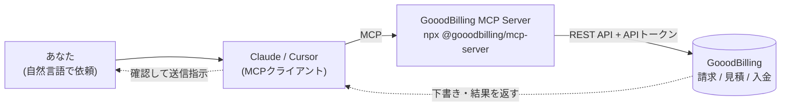

> 本記事はZennに公開した記事のクロスポストです。原文 → https://zenn.dev/muratatsu/articles/5c5afd29479630

エディタで手を動かしている最中に「そういえば今月の請求書」を思い出すと、地味に萎えませんか。

やることは決まっています。請求ソフトを開く → 取引先を選ぶ → 品目と金額を入れる → 税率を確認 → PDF化 → 送信。一つひとつは数分です。でもいま書いているコードから一度離れるコストのほうが、実際の作業時間よりずっと重い。コードもドキュメントも調べ物もAIに投げられるようになったのに、請求業務だけはなぜか専用UIに戻される——その違和感がずっとありました。

そこで、Claude / Cursor などMCP対応クライアントから請求業務を直接実行できるMCP Serverを書いて公開しました。@gooodbilling/mcp-server をクライアントに繋ぐと、たとえばこう話しかけるだけで済みます。

▎ 「A社向けのWeb制作費として30万円の請求書を作って」

Claudeが GooodBilling MCP を呼び、請求書の下書きを作成。続けて「保守費10万円も追加して」「確認したので送信して」と会話するだけで、請求が完結します。請求ソフトのUIを開く必要はありません。


*1. 指示に基づき請求書の下書きを作成*


*2. チャット上で項目の追加指示も可能*


*3. 最終確認を経て送信を実行*

## なぜ作ったのか

私たちは日常的に Claude / Cursor を使っています。コードを書く、仕様を書く、議事録をまとめる——多くの作業が AI の中で完結するようになりました。

しかし**見積・請求書作成の事務作業は未だに毎回別の UI を開いて操作する**必要があります。AI に頼める作業が増えているのに、請求業務だけ取り残されている感覚がありました。

そこで「請求ソフトそのものを AI から操作できるようにしよう」という発想で、GooodBilling MCP を実装しました。

## 仕組み（どうつながるか）

あなたの自然言語の依頼を Claude / Cursor が解釈し、MCP 経由で GooodBilling のツールを呼び出します。MCP Server は npm パッケージとして配布され、`npx` で起動します。



## MCP で実現したこと

提供している MCP ツールは 16 個。主なものは次のとおりです。

| カテゴリ | できること |
|---|---|
| 取引先 | `search_customers`（名前・カナ・メール・登録番号で検索） |
| 請求書 | 一覧 / 未入金一覧 / 詳細 / 下書き作成・更新・破棄 / 送信 |
| 見積 | 一覧 / 詳細 / 下書き作成・更新・破棄 / 送信 |
| レポート | `get_sales_summary`（請求額・入金額・未入金額の期間集計） |
| 設定 | 送信 ON/OFF・BCC・既定税率の確認（read-only） |

単なる API 公開ではなく、**AI エージェントが安全に扱えること**を重視しています。

### AIが勝手に送信しない（作成 → 確認 → 送信）

請求書・見積は必ず `draft`（下書き）状態で作られ、**送信は別ツール（`send_invoice` / `send_quote`）の明示実行**が必要です。AI が作成と同時に確定送信することはありません。下書きは人間が確認してから送ります。

### 二重送信を防ぐ

送信系ツールは **idempotency-key を自動付与**し、同じ操作が繰り返されても二重送信が起きないよう設計しています。

### 実在の取引先を解決する

AI が架空の顧客 ID を作るのではなく、`search_customers` で**既存の取引先から検索して解決**します。税率も指定しなければ既定値で自動補完されます。

### 適格請求書（インボイス制度）対応

登録番号での取引先検索を含め、インボイス制度に対応した請求書・見積を発行できます。

## 設計で悩んだこと（業務システムをMCPで繋ぐ難しさ）

「請求書を作るツール」を AI に渡すのは簡単です。難しいのは、**請求が"対外的で取り返しのつかない業務"**だという点でした。間違った金額の請求書を実在の取引先に送ってしまうのは、コードのバグとは比べものにならない事故です。MCP 化で一番考えたのは、ここをどう守るかでした。

### なぜ作成と送信を分けたのか（draft → send）

最初は「請求書を作って送って」を1ツールで完結させることも検討しましたが、やめました。AI が金額や宛先を取り違えたまま**確定送信してしまうリスク**が許容できないからです。

そこで、`create_invoice_draft` は必ず `draft`（下書き）状態でしか作れず、送信は**別ツール `send_invoice` の明示実行**を必要とする二段階にしました。AI には「作る」権限と「送る」権限を**別々に**与え、送信は人間が内容を確認してからの一言で初めて走ります。"AI が気を利かせて勝手に送る"を構造的に不可能にしています。

### AIはリトライする前提で冪等性を入れた

AI クライアントはタイムアウトやエラーで**同じ操作を黙って再試行する**ことがあります。素朴に実装すると、同じ請求書が二重に送られかねません。送信系ツールは内部で **idempotency-key を自動付与**し、同一操作が繰り返されても二重送信・二重作成が起きないようにしています。

### AIは平気で「架空の顧客ID」を作る

これは MCP で業務システムを繋ぐ人全員にお伝えしたい落とし穴です。AI に取引先を指定させると、**それらしい UUID をそのまま捏造**してくることがあります。対策として、取引先は必ず `search_customers` で**実在レコードから検索して解決**させ、見つからなければ AI に勝手に作らせず人間に戻す設計にしました。税率や案件（Case）も、指定がなければ既定値・既存案件から補完し、AI が誤った値を入れる余地を減らしています。

### 複数MCP併用時の「指名の曖昧さ」

意外な伏兵がこれでした。ユーザーが Gmail / Stripe など他の MCP も繋いでいると、「未払いある？」のような語は **AI がどのサービスを指すか迷い**、Stripe の請求を見に行ったり確認質問が増えたりします（"未払い""請求書"は決済系のドメインにも存在するため）。

完全な解決はクライアント側の仕様次第ですが、実務的な落とし所として、**セッションの最初の1発目だけ「GooodBillingで」等のヒント語を添える**運用を README で案内しています。"プロトコルで繋がる"ことと"意図どおり呼ばれる"ことは別問題、というのが MCP を業務に持ち込んでの実感でした。

## 使い方

> AI からの操作（API / MCP 連携）は **Pro プランの機能**です。**14 日間の無料トライアル**中は全機能が使えますので、トークン発行を直ぐに試せます。

1. GooodBilling にログインし、`設定 > AI 連携 > API トークン` で新しいトークンを発行（`gb_live_...` は発行時に 1 度だけ表示）
2. Claude Desktop の設定ファイル（macOS: `~/Library/Application Support/Claude/claude_desktop_config.json`）に追加:

```json
{
  "mcpServers": {
    "gooodbilling": {
      "command": "npx",
      "args": ["-y", "@gooodbilling/mcp-server"],
      "env": {
        "GOOODBILLING_API_TOKEN": "gb_live_xxxxxxxxxxxxxxxxxxxxxxxxxxxxxxxx"
      }
    }
  }
}
```

3. Claude Desktop を再起動。ツール一覧に `gooodbilling` が出れば成功です。


あとは自然言語で:

> 「未入金の請求書を教えて」
> 「請求システムの今月の売上を集計して」
> 「A社向けに請求書を作って」


*実際に作成された請求書のサンプル*

### ヒント: 1発目だけ文脈を添える

Gmail や Stripe など他の MCP を併用していると、「未払いある？」のような語は AI がどのサービスを指すか迷うことがあります。セッションの**最初の1発目だけ**「GooodBillingで」「請求システムの」などを添えると確実に呼べます（`請求書`『見積』など GooodBilling 固有語はそのままで OK）。

## まとめ

MCP の登場で、AI は単なるチャットではなく**業務実行のインターフェース**になり始めています。コードもドキュメントも AI の中で進むようになった今、**請求のような定型業務こそ「ツールを開く」から「AI に依頼する」へ**移っていくはずです。

GooodBilling は、業務アプリの操作性を意識させない業務アプリ——**AIからも操作できる請求クラウド**——として日々機能をブラッシュアップしています。

まずは **無料トライアル**で、Claude Desktop から請求書クラウドを操作する体験をお試し頂いて、ご意見・ご要望などお聞かせ頂けると嬉しいです。

- GitHub: https://github.com/gooodbilling/mcp-server
- npm: https://www.npmjs.com/package/@gooodbilling/mcp-server
- 公式 MCP Registry: `io.github.gooodbilling/mcp-server`
- GooodBilling（14日間無料トライアル）: https://gooodbilling.com

これからは請求ソフトを開くのではなく、AI に依頼する。その体験を、ぜひ一度試してみてください。
