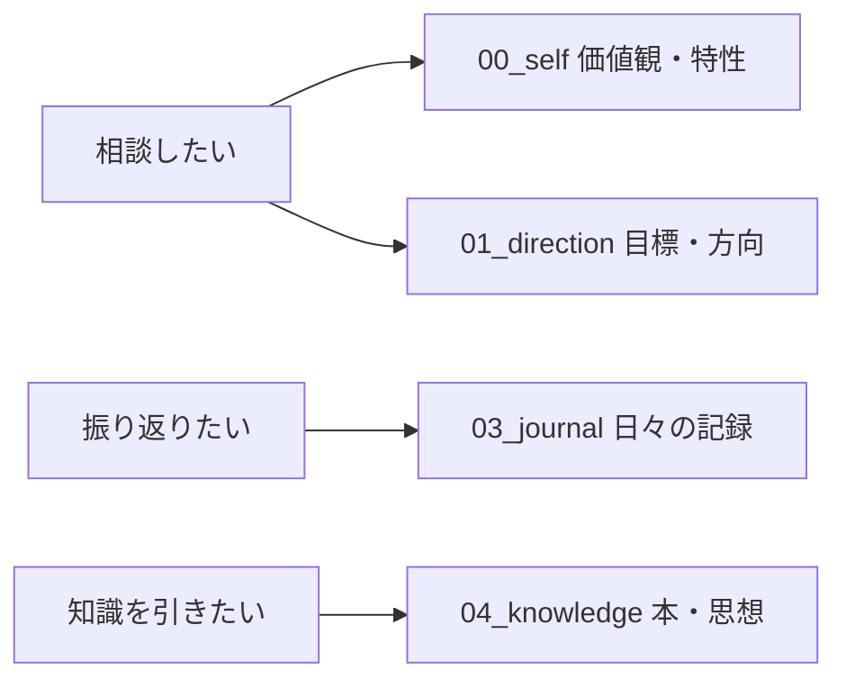

## はじめに

:::note info
**この記事のまとめ*
- Claude Code × GitHubで「自分の取扱説明書」を作り、AIに丸ごと渡す運用を3ヶ月続けた
- スキルやMCPで自動化もした。でも一番効いたのは、自動化ではなく「自分を言語化する強制力」だった
- メモアプリ1つで始められる。エンジニアでなくてもOK
:::

> 対象読者
> - AIへの相談がなんとなく浅い、と感じている人
> - 目標を立てては忘れる、を繰り返している人
> - Claude CodeのSkillsやMCPを実用的に使ってみたい人

突然ですが、ChatGPTやClaudeに真剣な相談——「キャリアどうしよう」「この決断、客観的にどう思う?」——をするとき、毎回こんな前置きをしていませんか?

> 「まず私の状況を説明すると、20代で、職種は〇〇で……」

僕は完全にこれでした。毎回、自分という前提を一から喋っている。そして相手は昨日の会話を覚えていない。**世界一物知りな相談相手が、毎回こちらのことだけは初対面**なんです。

この春、僕はこの「初対面問題」を潰すことにしました。やったことを一言でいうと、自分という人間の“取扱説明書”を書いて、AIに丸ごと渡せる形にしたこと。

……と書くとカッコいいんですが、始めた動機はもっと不純で、「人生のことまでAIに自動でやらせたらラクできそう」という横着でした。で、結論から言うと、その目論見は半分外れます。一番効いたのは、自動化じゃなかった。その話を書きます。

## きっかけ：頭の中の“自分”は、驚くほど言語化されていない

発端は、ある記事と動画でした。

https://zenn.dev/hand_dot/articles/85c9640b7dcc66

https://www.youtube.com/watch?v=wNLE7rQDLN0

hand_dotさんの「githubで人生を管理する」と、Kyoheiさんの動画。「人生のタスクや目標をGitHubのIssueで管理する」というアイデアに、頭を殴られました。やってみたら、見事に沼った。

ただ正直に書いておくと、同じことを考えている人はすでにたくさんいました。

https://zenn.dev/syuya2036/articles/openclaw-github-life-management

「GitHub × 人生管理 × AI」はもはや一大ジャンルです。じゃあ、なぜ今さら僕が書くのか。3ヶ月本気で運用してみて、**「作ってみた」と「回り続ける」の間には深い谷がある**と分かったからです。そして谷を越える鍵は、ツールではなく設計思想にありました。

もう少し掘ると、運用の前にひとつ気づいたことがあります。自分の価値観・目標・経験は、頭の中に「ある」つもりで、実は一度も言語化されていない。「あなたが一番大事にしているものは?」と聞かれて即答できる人、どれくらいいるでしょうか。AIに相談しても答えがぼんやりするのは、AIのせいじゃなく、入力する“自分”が曖昧だからでした。

ならば、ちゃんと書き出すしかない。

## やったこと：自分を5つの軸で書き出した

最初にぶつかる壁が「何を、どう分類するか」です。ここを適当にやって、僕は一度盛大に破綻させました。最初は思いつきでフォルダを10個くらい作り、3日で「どこに何を書いたっけ」状態になったんです（恥ずかしい話ですが）。

試行錯誤の末にたどり着いたのが、情報を「時制」で分けるという整理でした。

| 軸 | 中身 | 時制 |
|---|---|---|
| `00_self` | 自分という人間（価値観・性格・健康・お金・経歴） | 静的 |
| `01_direction` | 目指す方向（人生目標・年間目標・マイルストーン） | 未来 |
| `02_work` | 進行中の仕事 | 進行中 |
| `03_journal` | 日々の記録・振り返り | 過去〜現在 |
| `04_knowledge` | 外から取り込んだ知識（本・思想） | 蓄積 |

ポイントは、「変わらないもの(self)」「目指すもの(direction)」「流れていくもの(journal)」を混ぜないこと。

なぜ時制で分けるのか。AIに相談させるとき読むべきは静的な自分(self)と方向(direction)、振り返りさせるとき読むべきは時系列(journal)、と目的ごとに参照先が変わるからです。図にするとこんなイメージ。

ごちゃ混ぜのメモ帳だと、AIは何を重視していいか分からない。フォルダ設計は、AIに渡す「ここを見ろ」という地図なんです。

:::note info
ここは別にGitじゃなくて大丈夫です。Notionのページでも、フォルダ分けしたテキストでもいい。大事なのは“分類の軸”を持つこと。僕はたまたまエンジニアなのでGitにしただけです。
:::

運用ルールは `CLAUDE.md` という1ファイルに書いて、AIに毎回読ませています。「お金や健康の機微な情報は勝手に編集しない」「新しい目標はまず年間目標から作る」——人間が約束を守るのは苦手ですが、ルールを明文化するとAIは驚くほど忠実に守ってくれます。

:::note warn
中身は財務も健康も人間関係も入っているので、このリポジトリは非公開にしています。元ネタの方々はリポジトリを公開していて本当に偉いと思うんですが、僕は怖くて無理でした。なのでこの記事では構成と仕組みだけ共有します。
:::

## 人生に“コマンド”と“記憶”を持たせる（技術パート）

ここからはClaude Codeで自動化した部分です。技術に興味がなければ、次の章まで飛ばしてください。

### 自作スキル ＝ 人生の“スラッシュコマンド”

Claude CodeのSkills機能で、よく使う操作をコマンド化しました。

- `/life-advice` — 価値観・目標・現状の全MDを読み込んで、僕の文脈に沿って相談に乗る
- `/new-task` — 年間目標を起点に、新しいIssueを切る
- `/monthly-review` — その月の記録を振り返り、結果をまとめる
- `/daily-sync` — 日々の雑な記録を、月1で各カテゴリのメタ情報に反映する

`/monthly-review` のおかげで、「立てた目標を月末に振り返る」という人類が最も苦手とする行為が、半自動で回るようになりました。

### MCPで外部サービスとつなぐ

MCP（Model Context Protocol）で、カレンダーやタスク管理ツールをClaudeに接続しています。「来週の予定を見て、今月の目標と照らして、空き時間の使い方を提案して」——こういう相談が、アプリを行き来せず1か所で完結します。

### メモリで“自分を覚える”AIにする

極めつけがメモリ機能です。会話の中で僕が示した好みやフィードバックを、AIが自分でファイルに書き留めて永続化する。次のセッションでもそれを読むので、使うほど「僕という人間」の解像度が上がっていく。冒頭の「初対面問題」が、ここで一定消えました。

## 一番効いたのは、「自動化」じゃなかった

さて、ここがこの記事で一番言いたいところです。

スキルもMCPもメモリも、確かに便利でした。でも3ヶ月使って振り返ると、人生に一番効いたのは、これらの自動化じゃなかったんです。本質的な気づきが、3つありました。

### 1. 最大の効果は「言語化の強制力」だった

自動化より何より効いたのは、書くために自分を言葉にせざるを得なかったことでした。「自由が一番大事」と思っていたのに、いざ書こうとすると「自由って、何からの自由?」と詰まる。この“詰まり”こそが自己理解だったんです。AIに渡すために書いているうちに、自分が一番、自分のことを理解していなかったと気づきました。

ラクしようと思って始めたのに、結局いちばんアナログな「書く」が効いた。正直、拍子抜けしました。

### 2. ゴールは人間が握り、AIには実行を任せる

便利だからといって「どう生きるべき?」までAIに丸投げするのは違う、と運用して強く思います。進む方向を決めるのは自分、その実行を高速化するのがAI。地図を読むのはAIに任せても、どこへ行くかは自分で決める。ここを混同すると、自分の人生を最適化しているつもりで、いつのまにか“誰かの平均値”に最適化されてしまいます。

### 3. “見えないルール”は、自分自身にも隠れている

僕はもともと、世の中の見えないルールを解読して戦略で攻略するのが好きなタイプです。今回やってみて、一番ルールが見えていなかったゲームは「自分」だったと気づきました。自分の価値観・クセ・判断基準という“仕様”を書き出して初めて、自分を攻略対象として扱えるようになります。

## 今日から試せる4ステップ

「面白そうだけどハードル高そう」と思った人へ。段階を用意しました。Lv1なら今日5分でできます。

1. **Lv1：書く（誰でも）** メモアプリに「価値観」「今年やりたいこと」「最近の悩み」を箇条書きして、AIにコピペして相談するだけ。これだけで解像度が上がります。
2. **Lv2：分ける** ファイルを「自分・目標・記録」くらいに分類する。AIに「どこを見て答えてほしいか」を指定できるようになります。
3. **Lv3：Gitに乗せる（エンジニア）** リポジトリ化して変更履歴を残す。「半年前の自分」と今を `diff` で比較できるのは、地味ですが効きます。
4. **Lv4：自動化（上級）** Claude Code Skills や MCP で、相談・振り返り・記録をコマンド化する。

大事なのは、Lv1だけでも十分に効果があること。いきなりLv4を目指して挫折するのが、一番もったいないです。

## おわりに

この春始めたのは、「自分の取扱説明書を書く」という、地味だけど確実に効く習慣でした。横着で始めたわりに、結局いちばんアナログな「言語化」に救われた、というオチつきで。

きっかけをくれた hand_dot さん、Kyohei さんに改めて感謝します。先人のアイデアに、自分なりの設計思想と3ヶ月の運用を少しでも上乗せできていたら嬉しいです。

最後にひとつ、問いを置いて終わります。

> あなたの人生の `main` ブランチは、いまどこへ向かっていますか?

まずはメモアプリに3行、書くところから。もし試したら、どんな軸で分類したか教えてもらえると嬉しいです。
