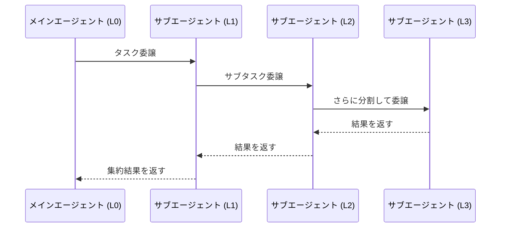
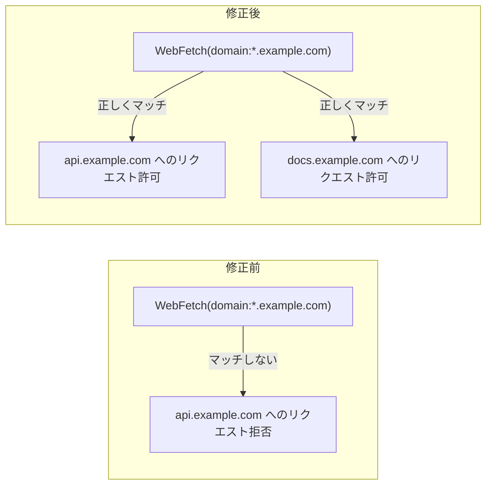

## はじめに

Anthropic が Claude Code の2つのリリース（v2.1.172 / v2.1.173）を立て続けに公開しました。

v2.1.172 は**サブエージェントの最大5階層スポーン対応**という大きな機能追加に加え、1Mコンテキストまわりのフリーズ問題・`availableModels` 制約漏れ・Amazon Bedrock のリージョン解決など、エージェント開発者が実際に踏みやすかった多数の不具合を一括修正した大型リリースです。v2.1.173 はそれに続く小規模なホットフィックスで、Fable 5 モデル名の正規化とWindows起動警告を修正しています。

**こんな人に影響があります：**

- Claude Code 上でマルチエージェントシステムを構築している開発者
- Amazon Bedrock 経由で Claude Code を利用している開発者
- `availableModels` でモデルを制限しているチーム
- 1Mコンテキスト（Opus 4.8 / Sonnet）を使っているユーザー
- Claude Code を Windows 環境で利用している開発者

---

## 変更の全体像

```mermaid
graph TD
    subgraph v2.1.172 ["v2.1.172 (大型アップデート)"]
        A[サブエージェント多階層化<br/>最大5階層スポーン] --> A1[複雑なエージェントパイプライン実現]
        B[1Mコンテキスト修正] --> B1[セッションフリーズ解消]
        B --> B2[opusplan 1M対応修正]
        B --> B3[二重[1M]サフィックス除去]
        C[availableModels 制約修正] --> C1[サブエージェントに制約適用]
        C --> C2[advisorモデルに制約適用]
        D[Bedrock 修正] --> D1[~/.aws からリージョン自動解決]
        D --> D2[/model ピッカー修正]
        E[セキュリティ修正] --> E1[バックグラウンドエージェントの<br/>設定ファイル分離]
        F[パフォーマンス改善] --> F1[アイドル時CPU使用率削減]
        F --> F2[長い会話の正規化最適化]
    end
    subgraph v2.1.173 ["v2.1.173 (ホットフィックス)"]
        G[Fable 5 モデル名正規化]
        H[Windows sandbox 警告修正]
    end
```

---

## 変更内容

### v2.1.172 — 変更一覧

| カテゴリ | 変更内容 | 重要度 |
|---|---|---|
| 新機能 | サブエージェントが自身のサブエージェントを**最大5階層**までスポーン可能に | ★★★ |
| 新機能 | `/plugin` マーケットプレイスに検索バーを追加 | ★☆☆ |
| 新機能 | OTEL メトリクス `claude_code.lines_of_code.count` に `model` 属性を追加 | ★☆☆ |
| バグ修正 | 1Mコンテキストを使うセッションが永久にフリーズする問題を修正（自動コンパクト） | ★★★ |
| バグ修正 | 複数画像を含む会話で「画像処理失敗」エラーが繰り返される問題を修正 | ★★☆ |
| バグ修正 | `availableModels` 制約がサブエージェント・advisorモデルに適用されない問題を修正 | ★★★ |
| バグ修正 | `opusplan` がプランモードで1Mコンテキストを伴わない問題を修正 | ★★☆ |
| バグ修正 | `ANTHROPIC_DEFAULT_OPUS_MODEL` に `[1m]` が二重付与される問題を修正 | ★★☆ |
| バグ修正 | Amazon Bedrock で `AWS_REGION` 未設定時に `~/.aws` からリージョンを読み取るよう修正 | ★★★ |
| バグ修正 | Bedrock の `/model` ピッカーが提供されないモデルを表示しサイレントに切り替える問題を修正 | ★★☆ |
| バグ修正 | バックグラウンドエージェントが他ディレクトリのプロジェクト設定を読む問題を修正（セキュリティ） | ★★★ |
| バグ修正 | `WebFetch(domain:*.example.com)` のワイルドカードがサブドメインに一致しない問題を修正 | ★★☆ |
| バグ修正 | ネストしたエージェント停止後にサブエージェントが `active` のまま固まる問題を修正 | ★★☆ |
| バグ修正 | 古いバージョンで開始したバックグラウンドセッションへの attach が `EAUTH` で失敗する問題を修正 | ★★☆ |
| バグ修正 | ワークフロー内で `Date.now()` / `Math.random()` を文字列・コメントで言及するだけで検証拒否される問題を修正 | ★★☆ |
| バグ修正 | リモートセッションで `CLAUDE_MEMORY_STORES` が見つからない問題を修正 | ★★☆ |
| パフォーマンス | 長い会話での冗長な正規化処理を除去 | ★★☆ |
| パフォーマンス | `/goal` チップの5Hz再描画を停止してアイドル時CPU使用率を削減 | ★★☆ |
| パフォーマンス | Claude in Chrome のツールを単一バッチ呼び出しで読み込むよう改善 | ★☆☆ |
| VSCode | PowerShell ツール呼び出しが生JSONで表示される問題を修正 | ★☆☆ |
| VSCode | ANSIエスケープコードの除去を修正 | ★☆☆ |

### v2.1.173 — 変更一覧

| カテゴリ | 変更内容 | 重要度 |
|---|---|---|
| バグ修正 | `[1m]` サフィックス付きの Fable 5 モデル名が正規化されない問題を修正 | ★★☆ |
| バグ修正 | Windows でサンドボックス設定有効時に表示される誤った「sandbox dependencies missing」警告を修正 | ★★☆ |

---

## 影響と対応

### サブエージェント多階層化（最大5階層）

> **📌 影響を受ける人**
> Claude Code 上でマルチエージェントシステムを組んでいる開発者全員。特にエージェントにエージェントを呼ばせる複雑なパイプラインを設計している場合。

これまでサブエージェントは単一階層でしか動作しませんでしたが、今後は最大5階層のネストが可能です。エージェントがタスクを分解し、子エージェントがさらに孫エージェントへ委譲する構成が公式にサポートされます。



**対応不要** — 自動的に有効化されます。既存の単一階層構成には影響ありません。

---

### availableModels 制約がサブエージェントに適用されない問題の修正

> **⚠️ Breaking Change（修正により挙動が変わる可能性あり）**
> `availableModels` で使用可能モデルを制限しているチームは、修正後にサブエージェントが想定外のモデルを呼ばなくなります。意図した動作が変わっていないか確認してください。

これまでサブエージェント・advisor モデル・ディスパッチ用ピッカーに `availableModels` 制約が適用されておらず、制限を迂回できていました。修正後は**全階層に制約が適用**されます。

---

### Amazon Bedrock リージョン自動解決

> **📌 影響を受ける人**
> 環境変数 `AWS_REGION` を設定せずに `~/.aws/config` でリージョンを管理している Bedrock ユーザー。

修正前は `AWS_REGION` が未設定の場合にリージョン解決が失敗することがありました。修正後は AWS SDK の優先順位に従い `~/.aws/config` から自動的にリージョンを読み取ります。`/status` コマンドでリージョンの取得元も確認できるようになりました。

**対応不要** — `~/.aws/config` が正しく設定されていれば自動で動作します。

---

### バックグラウンドエージェントのプロジェクト設定分離（セキュリティ修正）

> **⚠️ 重要なセキュリティ修正**
> pre-warmed ワーカー上のバックグラウンドエージェントが、他ディレクトリの `.mcp.json` 承認や trust 設定を誤って引き継ぐ可能性がありました。

意図せず別プロジェクトの MCP サーバーへのアクセス権限が付与される恐れがあったため、修正は重要です。共有環境・CI 環境で Claude Code を動かしているチームは特に注目してください。

**対応不要** — v2.1.172 以降は自動的に修正されます。

---

### 1Mコンテキストセッションのフリーズ修正

> **📌 影響を受ける人**
> Opus 4.8 や Sonnet の 1M コンテキストウィンドウを利用しており、セッションが突然固まる経験をしたユーザー。

使用クレジットなしで 1M コンテキストを利用するセッションが永久にフリーズする問題がありました。修正後は自動的に標準コンテキスト上限までコンパクトされ、セッションが継続されます。

---

## コード例

### WebFetch ワイルドカード修正 — Before / After



パーミッション設定でサブドメインへのワイルドカードを指定していた場合、修正前は意図どおりに機能していませんでした。修正後は `*.example.com` が `api.example.com` や `docs.example.com` に正しくマッチします。

---

### ワークフロースクリプトでの Date.now() / Math.random() 修正

**修正前（検証エラーが発生していたケース）:**

```javascript
export const meta = {
  name: 'my-workflow',
  description: 'タスクを処理するワークフロー',
}

// Date.now() でタイムスタンプを取得して処理する
// Math.random() で乱数を生成してIDを作る
const result = await agent('データを処理してください')
```

上記のように `Date.now()` や `Math.random()` をコメントや文字列内に**書くだけ**で、ワークフローの検証が拒否されていました。修正後はコメント・文字列内の言及は検証対象外となります。

> **💡 Tips**
> 実際にスクリプト本体で `Date.now()` や `Math.random()` を**呼び出す**のは引き続き禁止です（ワークフロー再開時の再現性が壊れるため）。タイムスタンプが必要な場合は `args` 経由で渡してください。

---

### Fable 5 の [1m] サフィックス正規化（v2.1.173）

**修正前の挙動:**

```
claude-fable-5[1m]  →  そのまま使用（正規化されない）
```

**修正後の挙動:**

```
claude-fable-5[1m]  →  claude-fable-5 に正規化（Fable 5 はデフォルトで 1M コンテキスト）
```

Fable 5 はデフォルトで 1M コンテキストウィンドウを持つため、`[1m]` サフィックスは不要であり自動除去されます。

---

## まとめ

| リリース | 主な変更 | アクション |
|---|---|---|
| v2.1.172 | サブエージェント5階層化、1Mフリーズ修正、availableModels制約修正、Bedrock自動リージョン解決、セキュリティ修正（バックグラウンドエージェント設定分離）、パフォーマンス改善 | 特別な対応不要。availableModels を使っているチームは挙動確認を推奨 |
| v2.1.173 | Fable 5 モデル名正規化、Windows sandbox 警告修正 | 特別な対応不要 |

v2.1.172 はエージェント開発者にとって特に重要なリリースです。多階層エージェントの公式サポートにより、より複雑な自律エージェントパイプラインが構築しやすくなりました。同時に `availableModels` やバックグラウンドエージェントのセキュリティ修正も含まれているため、**最新バージョンへのアップデートを強くお勧めします**。
