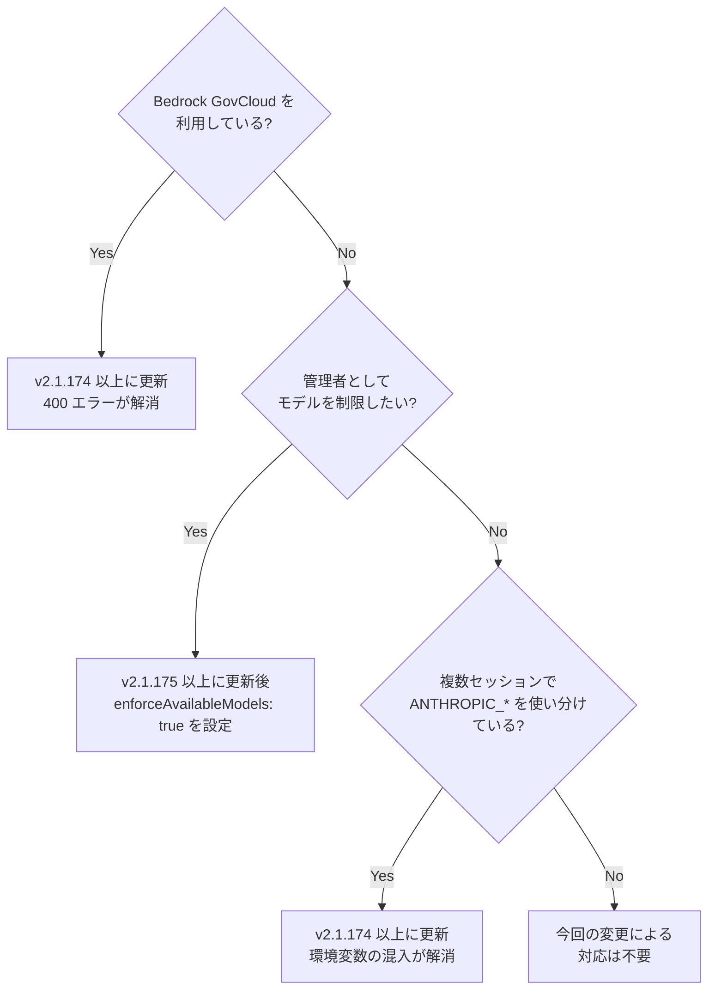

## はじめに

Claude Code が v2.1.174 および v2.1.175 をリリースしました。今回のリリースは、企業・チーム管理者向けの新しいモデル制御設定の追加と、AWS Bedrock GovCloud 環境での致命的なエラー修正を含む、13 件以上の変更が盛り込まれています。

特に注目すべき点は以下の 3 つです。

- **`enforceAvailableModels`** により管理者が Default モデルを含めてモデル使用を厳格に制限可能に
- **Bedrock GovCloud** で発生していた 400 エラー（推論プロファイルプレフィックス誤り）の修正
- **バックグラウンドセッション**が他セッションの `ANTHROPIC_*` 環境変数を誤って継承する問題の解消

> **📌 影響を受ける人**
> - AWS Bedrock GovCloud リージョン（`us-gov-*`）で Claude Code を利用している方
> - Claude Code の管理者設定（マネージド設定）を運用している企業・チーム管理者
> - 複数の API セッションを並行して使い分けている開発者
> - VSCode 拡張でトークン使用量を詳細に確認したい方

---

## 変更の全体像

今回の 2 リリースにまたがる変更を関係性で整理すると以下のようになります。

```mermaid
graph TD
    subgraph v2.1.175
        A[enforceAvailableModels 追加]
        A --> A1[Default モデルも許可リストに拘束]
        A --> A2[ユーザー/プロジェクト設定での\n許可リスト拡大を禁止]
    end

    subgraph v2.1.174["v2.1.174 (新機能)"]
        B[wheelScrollAccelerationEnabled]
        C[VSCode /usage 利用内訳表示]
    end

    subgraph v2.1.174b["v2.1.174 (バグ修正)"]
        D[Bedrock GovCloud\n推論プロファイル修正]
        E[/model ピッカー\nDefault解決先表示修正]
        F[バックグラウンドセッション\nANTHROPIC_* 継承問題修正]
        G[事前ウォームワーカー\n認証エラー修正]
        H[Fable 5 利用クレジット\nバナー誤表示修正]
        I[/advisor ブロック済み\nモデル事前選択修正]
        J[git co-author\n誤モデル名修正]
    end
```

---

## 変更内容

### 新機能

#### `enforceAvailableModels`（v2.1.175）

管理者が `availableModels` 許可リストを設定しても、これまでは「Default」モデルは制約を受けませんでした。新設された `enforceAvailableModels` を有効にすることで、Default モデルにも許可リストを適用できるようになります。

| 設定 | `enforceAvailableModels: false`（従来） | `enforceAvailableModels: true`（新規） |
|------|--------------------------------------|--------------------------------------|
| Default モデルへの制約 | なし（許可リスト外も利用可） | あり（許可リスト先頭にフォールバック） |
| ユーザー側の許可リスト拡大 | 可能 | 不可 |
| 管理者によるモデル統制 | 部分的 | 完全 |

#### VSCode `/usage` 利用内訳表示（v2.1.174）

VSCode 拡張の「Account & usage」ダイアログ（`/usage`）に、トークン利用の詳細な内訳が追加されました。直近 24 時間または 7 日間で、以下の項目別に確認できます。

- キャッシュミス
- ロングコンテキスト
- サブエージェント
- スキル / エージェント / プラグイン / MCP ごとの内訳

MCP や Workflow ツールを多用している場合、どのコンポーネントがトークンを消費しているかが一目でわかるようになりました。

---

### バグ修正

#### Bedrock GovCloud 推論プロファイルプレフィックス誤り（v2.1.174）

> **⚠️ Breaking Change（実質）**
> Bedrock GovCloud リージョン（`us-gov-east-1`, `us-gov-west-1`）を利用している場合、v2.1.174 以前では **400 エラーが発生して Claude Code が動作しない**状態でした。このバージョンへの更新で解消されます。

GovCloud リージョンでは推論プロファイルのプレフィックスとして `us-gov` を使う必要がありますが、誤って `global` が設定されていました。

| | 修正前 | 修正後 |
|--|--------|--------|
| 推論プロファイルプレフィックス | `global` | `us-gov` |
| API リクエスト結果 | 400 エラー | 正常 |

#### バックグラウンドセッションの `ANTHROPIC_*` 環境変数継承問題（v2.1.174）

バックグラウンドデーモンを起動したシェルに設定されていた `ANTHROPIC_*` 環境変数（ゲートウェイ URL、カスタムヘッダー、`/model` エイリアス等）が、別セッションのバックグラウンド処理に誤って引き継がれていました。

たとえばターミナル A でカスタムゲートウェイを使うセッションを起動したまま、ターミナル B でバックグラウンドタスクを走らせると、ターミナル B のタスクがターミナル A の設定で動いてしまうケースがあります。

#### `/model` ピッカーの表示修正（v2.1.174）

プランに応じて、`Default` が解決するモデルファミリーがピッカーに正しく表示されるようになりました。

| プラン | Default の解決先 |
|--------|-----------------|
| Max / Team Premium / Enterprise | Opus |
| Pro / Team | Sonnet |
| 従量課金（pay-as-you-go）API | Opus |

また、`ANTHROPIC_DEFAULT_SONNET_MODEL` で別バージョンの Sonnet をピン留めしている場合も、ピッカーがハードコードされたバージョンラベルではなく、実際に解決されるバージョンを表示するようになりました。

---

## 影響と対応



---

## コード例

### `enforceAvailableModels` の設定例

**Before（v2.1.174 以前）**: Default モデルは制約されない

```json
{
  "managedSettings": {
    "availableModels": ["claude-sonnet-4-6"]
  }
}
```

この設定では `availableModels` に `claude-sonnet-4-6` しか指定していなくても、ユーザーが `Default` を選べば許可リスト外のモデルが使われる可能性がありました。

**After（v2.1.175 以降）**: Default を含めて完全に制約

```json
{
  "managedSettings": {
    "enforceAvailableModels": true,
    "availableModels": ["claude-sonnet-4-6", "claude-haiku-4-5-20251001"]
  }
}
```

`enforceAvailableModels: true` により：
- `Default` は `availableModels` の先頭（この例では `claude-sonnet-4-6`）にフォールバック
- ユーザーやプロジェクト設定で `availableModels` を拡張することが不可能になる

---

### Bedrock GovCloud の推論プロファイルプレフィックス（参考）

**Before（修正前）**: プレフィックスが誤っていた

```
// 内部で生成されていたモデル ID（誤り）
global.anthropic.claude-sonnet-4-6-20251001-v1:0
```

**After（修正後）**: GovCloud に対応した正しいプレフィックス

```
// 修正後のモデル ID
us-gov.anthropic.claude-sonnet-4-6-20251001-v1:0
```

GovCloud 環境を利用中の方はアップデートするだけで対応完了です。コードや設定の変更は不要です。

---

## まとめ

| 変更 | 重要度 | 対応の必要性 |
|------|--------|--------------|
| `enforceAvailableModels` 追加 | Medium | 管理者のみ: ポリシーに応じて設定 |
| Bedrock GovCloud 400 エラー修正 | **High** | GovCloud 利用者: 即時アップデート推奨 |
| バックグラウンドセッション環境変数継承修正 | Medium | 複数セッション並行利用者: アップデート推奨 |
| VSCode `/usage` 利用内訳追加 | Medium | VSCode ユーザー: アップデートで自動有効化 |
| `/model` ピッカー表示修正 | Medium | 対応不要（アップデートで自動修正） |
| その他バグ修正（8件） | Low | 対応不要（アップデートで自動修正） |

今回のリリースで最も重要なのは **Bedrock GovCloud ユーザーへの影響**です。`us-gov-*` リージョンを使っている方は v2.1.174 以上への更新を優先してください。管理者として Claude Code のモデル使用をより厳格に制御したい方は、v2.1.175 で追加された `enforceAvailableModels` の活用を検討してみてください。
