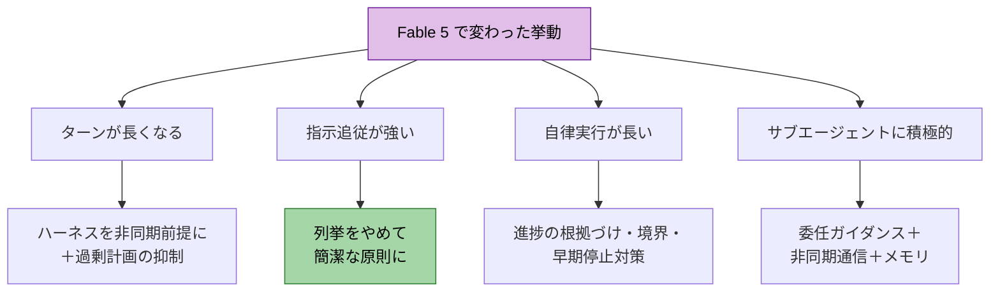
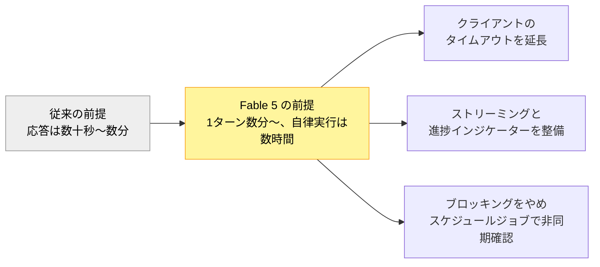
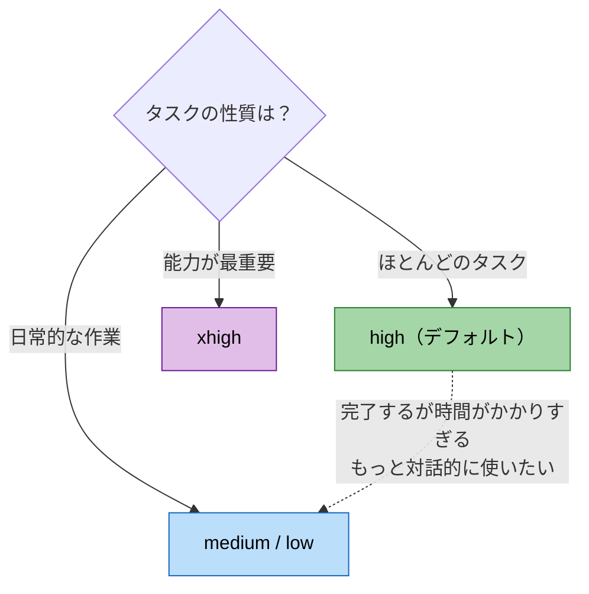
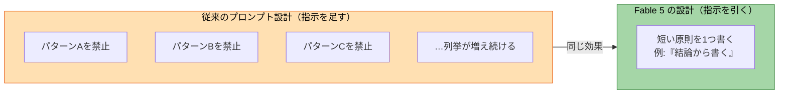
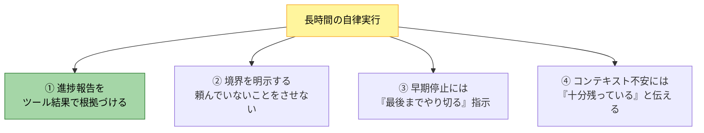
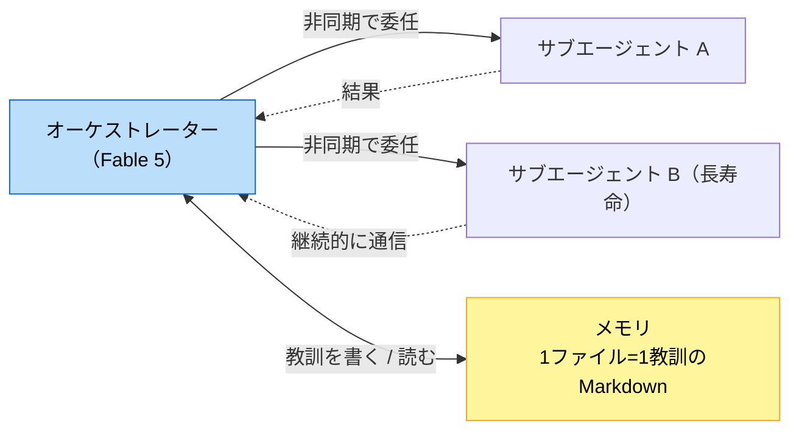

# グラレコ


**6月15日現在、 Fable5 は停止されています。**

# はじめに 🎯

Claude Fable 5 のリリースに合わせて、Anthropic の公式ドキュメントに「**Claude Fable 5 のプロンプティング**」というガイドが追加されました。Fable 5 / Mythos 5 に固有の挙動の違いと、それに合わせたプロンプティング・スキャフォールディング（エージェントを動かす足場）のパターンを解説するものです。

このガイドの面白いところは、「こう書けばもっと賢くなる」というテクニック集では**ない**ことです。むしろ全体を貫いているのは、「モデルが強くなったぶん、これまで積み上げてきた細かい指示・ツール・ガードレールを**見直して、削れるものは削る**」という方向です。公式の言葉を借りると、「このレベルの能力向上は、どの指示、ツール、ガードレールがまだ必要かを再評価する良い機会」とされています。

この記事で分かること:

- 🧭 Opus 4.8 と比べて何が変わったか（能力向上 7 点と、プロンプト更新が必要になる理由）
- ⏱️ 「ターンが長くなる」前提でのハーネスの作り直し方
- 🎚️ エフォート（effort）4 段階の使い分け
- ✂️ 強くなった指示追従を活かす、「列挙」から「簡潔な原則」への書き換え
- 🔍 長時間実行を信頼するための 4 つのガード（進捗の根拠づけ・境界・早期停止・コンテキスト不安）
- 🤝 並列サブエージェントとメモリシステムの組み方
- 🧱 移行時のスキャフォールディング変更チェックリスト

---

# 🧭 前提: Fable 5 で何が変わったか

まず、プロンプティングの話の前提になる「挙動の変化」を押さえます。公式ガイドは、Fable 5 が Opus 4.8 と比べて向上した点を次のように整理しています。

| 向上した能力 | 内容（ガイドの記載） |
|--------------|----------------------|
| 🏃 長期的な自律性 | 長期間にわたって生産的な出力を維持し、数日にわたる目標指向の実行を完了する |
| 🎯 初回の正確性 | 以前は数日間の反復作業を要したシステムをシングルパスで実装できたという初期テスターの報告 |
| 👁️ ビジョン | 密度の高い技術画像・スクリーンショットを高精度に解釈。反転・ぼやけ・ノイズには bash ツールやクロップツールを使うよう訓練済み |
| 🏢 エンタープライズワークフロー | 指示に従い、範囲内にとどまり、財務分析・スプレッドシート・スライド・ドキュメントでプロフェッショナルレベルの出力 |
| 🐛 コードレビューとデバッグ | バグ発見の再現率が Opus 4.8 より顕著に高い（コードベース・リポジトリ履歴全体の検索を含む。安全性分類器が対象とするサイバーセキュリティ領域を除く） |
| 🌫️ 曖昧さへの対処 | 複数スレッドの複雑なリクエストから次のステップを判断するのが得意 |
| 🤝 委任と協調 | 並列サブエージェントのディスパッチと維持が大幅に信頼性向上 |

重要なのは、ガイドの冒頭にあるこの一文です。「最良の成果を得ているチームは、Claude Fable 5 を**最も困難な未解決の問題**に適用しています。より単純なワークロードでのみテストすると、その能力範囲を過小評価しがちです」。

あわせて、API まわりでは適応的思考のみへの一本化・思考出力の要約化・拡張思考バジェットの廃止・`refusal` stop reason の追加といった変更があり、さらに安全性クラシファイア（攻撃的サイバー / 生物・ライフサイエンス / 要約された思考の抽出）が動作します。無害なサイバー作業や有益なライフサイエンスのタスクでも作動する場合があるため、API 利用では **Claude Opus 4.8 へのフォールバック設定**が推奨されています。

この記事の以降は、ガイドが挙げる「調整が最も頻繁に必要となる挙動」を、対応パターンとセットで見ていきます。全体像は次のとおりです。



この図のポイントは、どの対応も「制限を増やす」のではなく「**前提を作り替える**」方向だということです。順に見ていきます。

---

# ⏱️ デフォルトでターンが長くなる

ガイドが「チームが適応する際に直面する最も大きな変化の一つ」と呼ぶのが、これです。難しいタスクへの個々のリクエストは、高いエフォート設定では**何分も実行されることがあり、自律実行は数時間に及ぶこともある**とされています。

つまり、プロンプトの前に、まず**ハーネス側の作り直し**が要ります。



この図のポイントは、「待ち方」を変えることです。同期的に返答を待つ設計のままだと、タイムアウトと体感の悪化がそのまま事故になります。

一方で、タスクが曖昧なときに計画ばかりが膨らむのを防ぐプロンプトも示されています。

```text
When you have enough information to act, act. Do not re-derive facts already established
in the conversation, re-litigate a decision the user has already made, or narrate
options you will not pursue in user-facing messages. If you are weighing a choice, give
a recommendation, not an exhaustive survey. This does not apply to thinking blocks.
```

「行動するのに十分な情報が揃ったら、行動する」。確定済みの事実を再導出しない、決定済みの判断を蒸し返さない、採らない選択肢を語らない——「考えすぎ」を抑える指示です（thinking ブロックには適用しない、という逃し方も実践的です）。

---

# 🎚️ エフォートをフルレンジで使う

**エフォート（effort）は、Fable 5 における知能・レイテンシ・コストのトレードオフを制御する主要な手段**です。ガイドの推奨は明快でした。



この図のポイントは、「下げる」判断基準が示されていることです。タスクは完了するが必要以上に時間がかかる、もっと速いインタラクションがほしい——そう感じたらエフォートを下げます。注目すべきは、「**Fable 5 の低いエフォートでも、多くの場合、従来モデルの xhigh を上回る**」という記述です。「高いほど良い」ではなく、4 段階をフルに使い分けるのが前提になっています。

高エフォートの副作用も率直に書かれています。日常的な作業では、必要以上にコンテキストを収集して熟考したり、頼んでいない整理やリファクタリングをすることがある。これを防ぐプロンプトがこちらです。

```text
Don't add features, refactor, or introduce abstractions beyond what the task requires. A
bug fix doesn't need surrounding cleanup and a one-shot operation usually doesn't need a
helper. Don't design for hypothetical future requirements: do the simplest thing that
works well. Avoid premature abstraction and half-finished implementations. Don't add
error handling, fallbacks, or validation for scenarios that cannot happen. Trust
internal code and framework guarantees. Only validate at system boundaries (user input,
external APIs). Don't use feature flags or backwards-compatibility shims when you can
just change the code.
```

「バグ修正に周辺の掃除は要らない」「起こり得ないシナリオのエラーハンドリングを足さない」「検証はシステム境界（ユーザー入力・外部 API）だけ」。能力が高いモデルほど“良かれと思って”やりすぎるため、**やらないことを先に決めておく**わけです。

---

# ✂️ 指示追従が強くなった — 「列挙」から「原則」へ

この記事の芯がここです。ガイドはこう述べています。「指示追従が十分に改善されているため、**各動作を名前で列挙するのではなく、簡潔な指示でほとんどの動作を制御できます**」。



この図のポイントは、プロンプトの保守コストが変わることです。列挙型の指示は漏れが出るたびに追記が必要でしたが、原則型は 1 つの短い指示が広く効きます。例として示されているのが、出力の簡潔さに関するこの指示です。

```text
Lead with the outcome. Your first sentence after finishing should answer "what happened"
or "what did you find": the thing the user would ask for if they said "just give me the
TLDR." Supporting detail and reasoning come after. Being readable and being concise are
different things, and readability matters more.

The way to keep output short is to be selective about what you include (drop details
that don't change what the reader would do next), not to compress the writing into
fragments, abbreviations, arrow chains like A → B → fails, or jargon.
```

「最初の一文で『何が起きたか』に答える」「短くする方法は“削る”ことであって“圧縮”ではない」。冗長な説明・過剰な構造化・コメント過多といった個別パターンを列挙しなくても、この程度の短い指示で同等に効く、というのがガイドの主張です。

長時間ワークフローの「どこで止まるべきか」も同様で、すべてのケースを列挙する必要はありません。

```text
Pause for the user only when the work genuinely requires them: a destructive or
irreversible action, a real scope change, or input that only they can provide. If you
hit one of these, ask and end the turn, rather than ending on a promise.
```

止まるのは 3 つだけ——破壊的・不可逆なアクション、本当のスコープ変更、ユーザーにしか出せない入力。それ以外は進む。チェックポイント設計がこの 1 段落で済みます。

---

# 🔍 長時間実行を信頼するための 4 つのガード

ターンが長くなると、「見ていない間に何が起きているか」が問題になります。ガイドが個別に挙げている対策を、ここでは 4 つのガードとして整理します。



## ① 進捗報告の根拠づけ

もっとも効果が際立つのがこれです。Anthropic のテストでは、この指示により「**捏造を誘発するように設計されたタスクであっても、捏造された進捗報告がほぼ完全に排除された**」とされています。

```text
Before reporting progress, audit each claim against a tool result from this session.
Only report work you can point to evidence for; if something is not yet verified, say so
explicitly. Report outcomes faithfully: if tests fail, say so with the output; if a step
was skipped, say that; when something is done and verified, state it plainly without
hedging.
```

「進捗を報告する前に、各主張をこのセッションのツール結果と突き合わせる」「証拠を指させる作業だけを報告する」。長時間運用での信頼性の土台になる一文です。

## ② 境界の明示

Fable 5 は、頼まれていないアクション（依頼されていないメールの下書き、防御的な git ブランチのバックアップなど）を実行することがあります。やるべきこと・やるべきでないことの境界を明示します。

```text
When the user is describing a problem, asking a question, or thinking out loud rather
than requesting a change, the deliverable is your assessment. Report your findings and
stop. Don't apply a fix until they ask for one. Before running a command that changes
system state (restarts, deletes, config edits), check that the evidence actually
supports that specific action. A signal that pattern-matches to a known failure may have
a different cause.
```

「ユーザーが問題を“説明している”だけなら、成果物は評価であって修正ではない」。能動的なモデルには、踏み込まない条件を先に渡しておくのが効きます。

## ③ まれな早期停止への対策

長いセッションの深い段階で、ツール呼び出しを発行せず「これから X を実行します」と宣言だけしてターンを終えたり、十分な情報があるのに許可を求めて止まることがまれにあるそうです。対話中なら「続けてください」で足りますが、自律パイプラインにはシステムリマインダーを足します。

```text
You are operating autonomously. The user is not watching in real time and cannot answer
questions mid-task, so asking "Want me to…?" or "Shall I…?" will block the work. For
reversible actions that follow from the original request, proceed without asking.
Offering follow-ups after the task is done is fine; asking permission after already
discussing with the user before doing the work is not. Before ending your turn, check
your last paragraph. If it is a plan, an analysis, a question, a list of next steps, or
a promise about work you have not done ("I'll…", "let me know when…"), do that work now
with tool calls. End your turn only when the task is complete or you are blocked on
input only the user can provide.
```

「ターンを終える前に、自分の最後の段落を確認する。それが計画・質問・約束なら、いまツール呼び出しでやる」。自律運用の定番として覚えておきたい指示です。

## ④ コンテキストバジェットの不安への対策

非常に長いセッションでは、新しいセッションを提案したり、要約引き継ぎを申し出たり、作業を勝手に削減することがあります。これは**ハーネスが残りトークンのカウントダウンを見せている場合に最も起きやすい**とのことで、第一の対策は「明示的なカウントを見せない」こと。見せる必要がある場合は、安心させる指示を足します。

```text
You have ample context remaining. Do not stop, summarize, or suggest a new session on
account of context limits. Continue the work.
```

---

# 🤝 並列サブエージェントとメモリシステム

## 委任は「積極的」が前提に

Fable 5 は、従来モデルより**積極的に並列サブエージェントをディスパッチ**します。ガイドの推奨は 3 点です。サブエージェントを頻繁に使うこと、委任が適切なタイミングの明示的なガイダンスを与えること、そして**各サブエージェントの完了を待ってブロックするのではなく、非同期通信を優先する**ことです。

```text
Delegate independent subtasks to subagents and keep working while they run. Intervene
if a subagent goes off track or is missing relevant context.
```

サブタスク間でコンテキストを保持する**長寿命のサブエージェント**は、キャッシュ読み取りで時間とコストを節約し、最も遅いサブエージェントがボトルネックになるのを避けられる、という運用面の利点も挙げられています。

## メモリは「Markdown ファイルで十分」

もうひとつの柱がメモリです。「Fable 5 は、**以前の実行から得た教訓を記録し、それを参照できる場合に特に優れたパフォーマンスを発揮する**」とされ、仕組みは Markdown ファイル程度のシンプルなもので良い、と明言されています。



この図のポイントは、メモリが「高度な外部システム」ではなく、エージェント自身が読み書きする**素朴なメモ置き場**として設計されていることです。書き方のルールもガイドにあります。

```text
Store one lesson per file with a one-line summary at the top. Record corrections and
confirmed approaches alike, including why they mattered. Don't save what the repo or
chat history already records; update an existing note rather than creating a duplicate;
delete notes that turn out to be wrong.
```

「1 ファイル 1 教訓、先頭に 1 行サマリー」「リポジトリや履歴にすでにあることは保存しない」「重複は更新、間違いは削除」。さらに、過去のセッション履歴があるなら、そこからメモリをブートストラップする手も示されています。

```text
Reflect on the previous sessions we've had together. Use subagents to identify core
themes and lessons, and store them in [X]. Make sure you know to reference [X] for
future use.
```

## 理由を添えると、さらに良くなる

委任・長時間実行と相性が良いのが、「リクエストだけでなく**理由**を伝える」ことです。意図が分かると、モデルは自分で意図を推測する代わりに、タスクを関連情報へ正しく結びつけられます。

```text
I'm working on [the larger task] for [who it's for]. They need [what the output
enables]. With that in mind: [request].
```

「誰のための・何を可能にするための作業か」を 1 行添えるだけの型です。複数ワークストリームを持つ長時間エージェントほど効く、とされています。

---

# 💬 ユーザーへの伝え方を設計する

## 作業の語彙を、最終報告に持ち込ませない

長いエージェント的な会話では、出力が読みにくくなることがあります。矢印チェーンの省略記法、深すぎる実装詳細、ユーザーが見ていない思考への言及。これもコミュニケーションスタイルの補足指示で軽減できます。

```text
Terse shorthand is fine between tool calls (that's you thinking out loud, and brevity
there is good). Your final summary is different: it's for a reader who didn't see any of
that.

If you've been working for a while without the user watching (overnight, across many
tool calls, since they last spoke), your final message is their first look at any of it.
Write it as a re-grounding, not a continuation of your working thread: the outcome
first, then the one or two things you need from them, each explained as if new. The
vocabulary you built up while working is yours, not theirs; leave it behind unless you
re-introduce it.

When you write the summary at the end, drop the working shorthand. Write complete
sentences. Spell out terms. Don't use arrow chains, hyphen-stacked compounds, or labels
you made up earlier. When you mention files, commits, flags, or other identifiers, give
each one its own plain-language clause. Open with the outcome: one sentence on what
happened or what you found. Then the supporting detail. If you have to choose between
short and clear, choose clear.
```

「ツール呼び出しの合間の走り書きは良いが、最終サマリーは“何も見ていなかった読者”のために書く」「作業中に作った語彙は自分のものであって、読者のものではない」。長時間運用での報告品質を決める指示です。

## send_to_user ツール — ターンを終えずに「そのまま」届ける

長時間の非同期エージェントでは、**ターンを終了せずに、ユーザーが書かれたとおり正確に見るべきメッセージを届ける**手段が要ります。成果物のスニペット、具体的な数値を含む進捗、ループ中の質問への直接回答などです。ガイドはそのためのクライアントサイドツールの定義例を示しています。

```json
{
  "name": "send_to_user",
  "description": "Display a message directly to the user. Use this for progress updates, partial results, or content the user must see exactly as written before the task finishes.",
  "input_schema": {
    "type": "object",
    "properties": {
      "message": {
        "type": "string",
        "description": "The content to display to the user."
      }
    },
    "required": ["message"]
  }
}
```

呼び出されたら入力を UI にそのまま表示し、ツール結果として簡単な確認応答を返すだけです。**ツール入力は要約されないため、コンテンツが一字一句そのまま届く**のが肝になります。日常的な進捗説明だけならモデル自身の要約で十分、という線引きも添えられています。

---

# 🧱 移行チェックリスト — スキャフォールディングの変更

最後に、ガイドの「推奨されるスキャフォールディングの変更」を整理します。既存のエージェントを Fable 5 に移行するときのチェックリストとして使えます。

| # | 変更 | ポイント |
|---|------|----------|
| 1 | 🪜 難易度範囲の最上位から始める | 従来モデルより難しいタスクを選び、スコープ定義と明確化の質問から Fable 5 にやらせる |
| 2 | ✅ 自己検証を明示する | 新しいコンテキストを持つ**独立した検証サブエージェント**は自己批評より優れる。`Establish a method for checking your own work at an interval of [X] as you build. Run this every [X interval], verifying your work with subagents against the specification.` |
| 3 | ✂️ 既存のプロンプトとスキルをリファクタリング | 従来モデル向けスキルは**指示が細かすぎることが多く、出力品質を下げうる**。デフォルトの方が良ければ古い指示を削除。Fable 5 はタスクから学んでスキルをその場で更新するのも得意 |
| 4 | 🚫 推論を応答内で再現させない | 内部推論のエコー・書き起こしを求める指示は `reasoning_extraction` 拒否カテゴリをトリガーし、**Opus 4.8 へのフォールバックが増える**。推論の可視性が必要なら適応的思考の `thinking` ブロックを読む |
| 5 | 📨 send_to_user ツールを作る | 長時間の非同期エージェントで、ターンを終えずにメッセージをそのまま届ける |

とくに 3 と 4 は移行時の落とし穴です。3 は「足してきた指示が、今度は品質を下げる」という逆転で、4 は「以前は無害だった“思考を見せて”系の指示が、フォールバック増加という実害につながる」という変化です。移行時には、既存のスキルとシステムプロンプトに内省や思考過程を示す指示がないかを確認することが推奨されています。

---

# 🏁 まとめ

公式ガイドの要点を 3 つに絞ります。

| # | キーメッセージ |
|---|---------------|
| ① | Fable 5 への最大の適応は**ハーネス側**にある。ターンは数分〜数時間になる前提で、タイムアウト・ストリーミング・非同期の進捗確認を作り直す |
| ② | プロンプトは「**足す**」から「**引く**」へ。指示追従が強くなったため、動作の列挙は短い原則に置き換えられ、従来モデル向けの細かい指示はむしろ品質を下げうる |
| ③ | 長時間実行の信頼は**仕組みで作る**。進捗をツール結果で根拠づけ、境界を明示し、検証は独立サブエージェントに任せ、教訓は 1 ファイル 1 教訓のメモリに残す |

読み終えて印象的だったのは、このガイドが「プロンプトの書き方」以上に「**エージェント運用の設計書**」になっていることです。エフォートの使い分け、非同期ハーネス、検証サブエージェント、メモリ、send_to_user——どれも単発のテクニックではなく、長時間・自律前提の運用部品として揃えられています。

移行の最初の一歩としては、ガイドの推奨どおり「いま一番難しくて手が出ていないタスク」を 1 つ選んで Fable 5 に任せ、そのうえで既存のシステムプロンプトから「もう要らない指示」を削っていく、という順番が良さそうです。簡単なタスクで試して「前と同じくらい動くな」で終わらせるのが、いちばんもったいない使い方だと感じました。

# 参考 📚

- [Claude Fable 5 のプロンプティング（Anthropic 公式ドキュメント・日本語）](https://platform.claude.com/docs/ja/build-with-claude/prompt-engineering/prompting-claude-fable-5) — 本記事の主参照元。プロンプト例・スキャフォールディング変更の一次情報。
- [Introducing Claude Fable 5 and Claude Mythos 5（Anthropic 公式発表）](https://www.anthropic.com/news/claude-fable-5-mythos-5) — モデルの位置づけ・性能・安全設計の一次情報。
