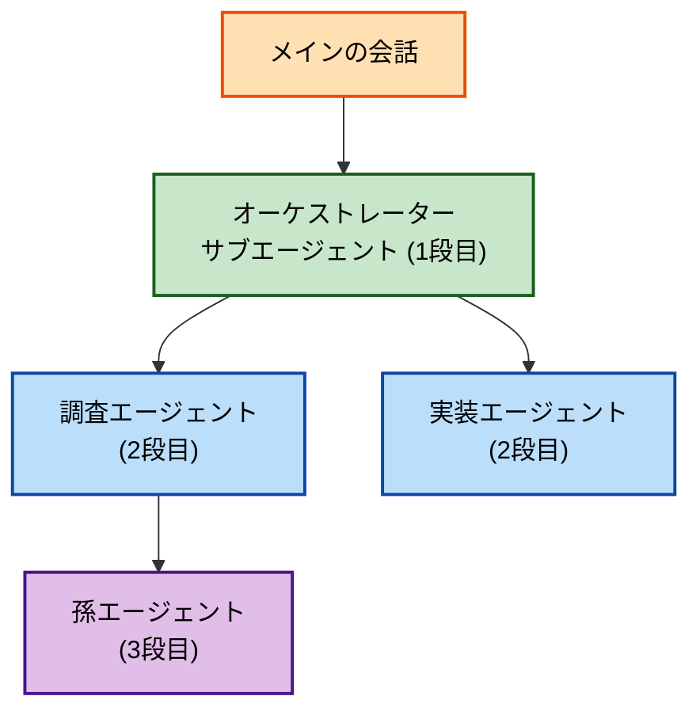

## 忙しいあなたのための要約

- Claude Code v2.1.172 で、サブエージェントがさらにサブエージェント（いわば「孫エージェント」）を生成できるようになった
- これまでは「メイン → サブエージェント」の1段まで。複雑なタスクの再分割がやりやすくなった
- 中間のやり取りはメインに返らず、最上位のサブエージェントの要約だけが返ってくる
- 深さの上限はフォアグラウンドなら制限なし、バックグラウンドはメイン直下から5段まで

## そもそもサブエージェントとは

Claude Code の[サブエージェント](https://code.claude.com/docs/en/sub-agents)は、`.claude/agents/`（プロジェクト単位）または `~/.claude/agents/`（ユーザー単位）に Markdown で定義します。自分専用のコンテキストでタスクをこなし、結果だけをメインに返すので、重い調査でメインの文脈を汚さずに済みます。

```markdown
---
name: explorer
description: コードベースを横断的に検索して、関連箇所を洗い出す調査専門エージェント
tools: Read, Grep, Glob
model: sonnet
---

与えられたキーワードから関連するファイル・定義・命名規則を洗い出し、結論だけを報告してください。
```

これまではサブエージェントに他のエージェントを起動するツールが渡されておらず、階層は1段までに限られていました。

## 何が変わったのか

v2.1.172 から、サブエージェント自身がさらにサブエージェントを生成できます。公式ドキュメントの[Spawn nested subagents](https://code.claude.com/docs/en/sub-agents#spawn-nested-subagents)では、次のように説明されています。

> As of Claude Code v2.1.172, a subagent can spawn its own subagents. (中略) Only the top-level subagent's summary returns to you.
>
> （v2.1.172 から、サブエージェントは自身のサブエージェントを生成できる。最上位のサブエージェントの要約だけがあなたに返る）

オーケストレーター役のサブエージェントが調査担当・実装担当の子へ仕事を振り分け、さらにその子が孫を使う、といった構成が組めます。



## 使い方

子（実作業）と親（取りまとめ役）を用意し、親に `Agent` ツールを渡すだけです。

子側（実際の作業を担当）:

```markdown
---
name: file-reviewer
description: 単一ファイルを読んで、改善点を3つだけ簡潔に報告するレビュー担当
tools: Read
model: sonnet
---

渡された1ファイルだけを読み、改善点を最大3つに絞って簡潔に報告してください。
```

親側（取りまとめ役。`tools` に `Agent` を含める）:

```markdown
---
name: review-orchestrator
description: 複数ファイルのレビューを取りまとめる。各ファイルを file-reviewer に割り振り、結果を統合する
tools: Read, Glob, Agent
model: sonnet
---

対象ディレクトリのファイルを列挙し、それぞれを file-reviewer サブエージェントに
割り振ってレビューさせてください。返ってきた指摘を統合し、優先度順にまとめて報告します。
```

メインの会話から `review-orchestrator` サブエージェントを呼ぶと、内部で `file-reviewer` サブエージェントが起動され、結果が統合されて返ってきます。
ここで `file-reviewer` サブエージェントを起動しているのはメインではなく、 `review-orchestrator` サブエージェントです。
サブエージェントがさらにサブエージェントを呼んでいる（メイン → `review-orchestrator`（1段目） → `file-reviewer`（2段目））ので、これがネストにあたります。

なお、[`tools`](https://code.claude.com/docs/en/sub-agents#supported-frontmatter-fields) を書かなければ全ツールを継承するので、`Agent` も自動的に含まれます。上の例のように `tools` を許可リストとして書く場合は、`Agent` を明示的に入れておく必要があります。

> Tools the subagent can use. Inherits all tools if omitted.
>
> If `Agent` is omitted from the `tools` list entirely, the agent cannot spawn any subagents.

- 逆に子のネストを止めたいときは、そのエージェントの `tools` から `Agent` を外すか、`disallowedTools` に `Agent` を加えます（doc: "To prevent a specific subagent from spawning others, omit `Agent` from its `tools` list or add it to `disallowedTools`."）
- 階層はプロンプト入力欄の下のサブエージェントパネル（ツリー表示。各行に子孫の数を `(+N)` で表示）や、[`/agents`](https://code.claude.com/docs/en/sub-agents#use-the-%2Fagents-command) の Running タブで確認できます

> `Agent` ツールは v2.1.63 で `Task` から改名されたものです（"In version 2.1.63, the Task tool was renamed to Agent. Existing `Task(...)` references ... still work as aliases."）。

## 深さの上限

[ドキュメント](https://code.claude.com/docs/en/sub-agents#spawn-nested-subagents)では、深さを「メインの会話の下に連なるサブエージェントの段数」で数えます（メイン直下が1段目）。上限の扱いは実行モードで異なります。

> Depth is counted as the number of subagent levels below the main conversation (中略):
>
> - **Foreground subagents**: can spawn at any depth. Each level blocks its parent until it returns, so the chain is self-limiting (中略).
> - **Background subagents**: a background subagent at depth five does not receive the Agent tool and cannot spawn further. The limit is fixed and not configurable, and exists to prevent runaway concurrent trees.

- **フォアグラウンド**：何段でもネストできます。各段が親をブロックし、メインは連鎖全体の完了を待つため、連鎖そのものが自己抑制的に働きます
- **バックグラウンド**：5段目に達したサブエージェントには `Agent` ツールが渡されず、それ以上は生成できません。設定で変更できない固定の上限で、暴走的な並行ツリーを防ぐためのものです

## 注意点

- **コスト**：階層が深いほど起動されるエージェント数とトークン消費は増えます。必要な深さに絞るのが大事です
- **ツールの付与忘れ**：親に `Agent` を渡していないと子は生成できません。`tools` 指定を確認しましょう
- **デバッグ**：深くなると追いにくくなります。サブエージェントパネルや `/agents` で階層を確認しながら進めるのがおすすめです

## まとめ

Claude Code v2.1.172 で、サブエージェントが孫エージェントを生成できるようになりました。親が状況に応じて子へ仕事を振り分けられるので、複雑なワークフローを動的に組みやすくなっています。手元のサブエージェント定義に取りまとめ役を一枚足してみると、効果を実感しやすいはずです。

## 参考リンク

- [Claude Code Changelog（公式）](https://code.claude.com/docs/en/changelog)
- [Claude Code Releases（GitHub）](https://github.com/anthropics/claude-code/releases)
- [Subagents — Claude Docs](https://code.claude.com/docs/en/sub-agents)
