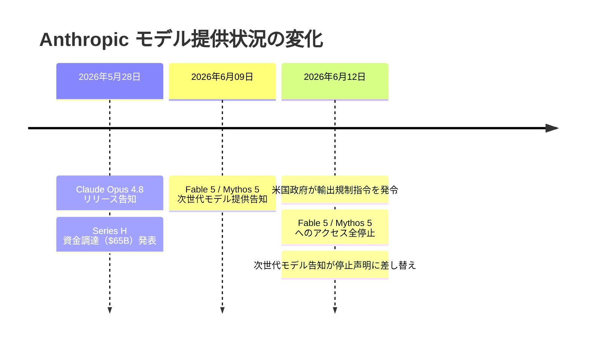
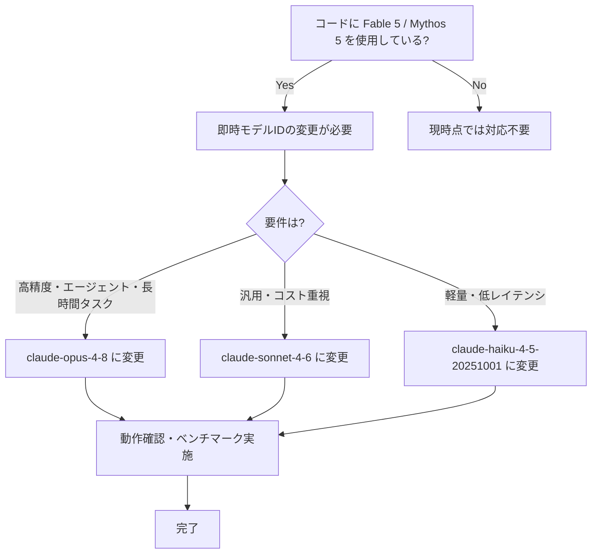

## はじめに

2026年6月12日、米国政府が **Claude Fable 5** および **Claude Mythos 5** に対する輸出規制（export control）指令を発令しました。Anthropicはこれを受けて両モデルへの全アクセスを停止し、6月9日に公開されていた次世代モデルの提供告知を停止声明に差し替えました。

これらのモデルを本番環境やプロダクトに組み込んでいる開発者にとっては **即座の対応が必要** な破壊的変更です。一方で、同時期にリリースされた **Claude Opus 4.8** が現実的な代替候補として浮上しています。

> **📌 影響を受ける人**
> - Fable 5 または Mythos 5 の API を呼び出しているアプリケーション・ワークフローの開発者
> - `claude-fable-5` / `claude-mythos-5` のモデルIDをコードにハードコードしている全員

---

## 変更の全体像



```mermaid
graph LR
    subgraph 停止中
        F5["❌ Claude Fable 5<br/>（輸出規制）"]
        M5["❌ Claude Mythos 5<br/>（輸出規制）"]
    end

    subgraph 稼働中・移行先候補
        O48["✅ Claude Opus 4.8<br/>（最新 Opus クラス）"]
        S46["✅ Claude Sonnet 4.6<br/>（汎用）"]
        H45["✅ Claude Haiku 4.5<br/>（軽量・高速）"]
    end

    F5 -->|移行| O48
    M5 -->|移行| O48
    O48 --> C1["コーディング"]
    O48 --> C2["エージェントタスク"]
    O48 --> C3["専門業務・長時間タスク"]
```

---

## 変更内容

### change-001: Fable 5 / Mythos 5 アクセス全停止（Critical）

> **⚠️ Breaking Change**
> 米国政府の輸出規制指令により、2026年6月12日をもって Claude Fable 5 および Claude Mythos 5 への全アクセスが停止されました。これらのモデルIDを使用しているコードは **即座に動作しなくなります**。

| 項目 | 内容 |
|------|------|
| 発令日 | 2026年6月12日 |
| 対象モデル | Claude Fable 5、Claude Mythos 5 |
| 理由 | 米国政府による輸出規制（Export Control）指令 |
| 影響 | 全アクセス停止・API 呼び出しエラー |
| 対応要否 | **即時対応必須** |

当初 Fable 5 / Mythos 5 は「最難関の知識労働・コーディング課題向け次世代インテリジェンス」として6月9日に告知されていましたが、わずか3日後に提供停止となりました。

---

### change-002: Claude Opus 4.8 リリース（High）

5月28日にリリースされた **Claude Opus 4.8** は、Fable 5 / Mythos 5 の代替として最有力候補です。

| 特性 | 内容 |
|------|------|
| モデルクラス | Opus（最高性能クラス） |
| モデル ID | `claude-opus-4-8` |
| 強化ポイント | コーディング、エージェント的タスク、専門業務 |
| 新機能 | 長時間タスクにおける一貫性（consistency）の向上 |
| 利用可否 | **利用可能** |

> **💡 Tips**
> Fable 5 / Mythos 5 は高難度タスク向けに設計されたモデルでした。同様の要件であれば Claude Opus 4.8 が現時点で最も近い性能を提供します。

---

## 影響と対応



### 対応チェックリスト

- [ ] コードベースで `fable-5` または `mythos-5` を含む文字列を検索する
- [ ] 環境変数・設定ファイルに記載されたモデルIDを確認する
- [ ] 代替モデルに変更後、プロンプトの動作を検証する
- [ ] システムプロンプトやパラメータ（temperature等）の再調整を検討する
- [ ] `CLAUDE.md` やドキュメントの推奨モデル記載を更新する

---

## コード例

### Before（動作停止）

```python
import anthropic

client = anthropic.Anthropic()

# ❌ これらのモデルIDはアクセス停止中
response = client.messages.create(
    model="claude-fable-5",          # 輸出規制により停止
    # model="claude-mythos-5",       # 同様に停止
    max_tokens=1024,
    messages=[
        {"role": "user", "content": "複雑なコーディング課題を解いてください"}
    ]
)
```

### After（推奨移行先）

```python
import anthropic

client = anthropic.Anthropic()

# ✅ Claude Opus 4.8 への移行
response = client.messages.create(
    model="claude-opus-4-8",         # 最新 Opus クラス・利用可能
    max_tokens=1024,
    messages=[
        {"role": "user", "content": "複雑なコーディング課題を解いてください"}
    ]
)

print(response.content)
```

### 環境変数による設定（推奨パターン）

モデルIDをハードコードせず環境変数で管理することで、今後の規制・モデル変更にも柔軟に対応できます。

```python
import os
import anthropic

client = anthropic.Anthropic()

# モデルIDを環境変数で管理 → 変更時にコード修正不要
MODEL = os.environ.get("CLAUDE_MODEL", "claude-opus-4-8")

response = client.messages.create(
    model=MODEL,
    max_tokens=1024,
    messages=[
        {"role": "user", "content": "タスクをここに記述"}
    ]
)
```

```bash
# .env ファイル
CLAUDE_MODEL=claude-opus-4-8
```

---

## モデル比較

現在利用可能なモデルと用途別の選択ガイド：

| モデル | 利用可否 | 主な用途 | 特徴 |
|--------|----------|----------|------|
| Claude Fable 5 | ❌ 停止中 | 超高難度タスク | 輸出規制により全停止 |
| Claude Mythos 5 | ❌ 停止中 | 超高難度タスク | 輸出規制により全停止 |
| **Claude Opus 4.8** | ✅ 利用可 | コーディング・エージェント・専門業務 | 最新 Opus、長時間タスクの一貫性向上 |
| Claude Sonnet 4.6 | ✅ 利用可 | 汎用・バランス型 | コスト・性能バランスが良い |
| Claude Haiku 4.5 | ✅ 利用可 | 軽量・高速・低コスト | レイテンシ重視のユースケース向け |

---

## まとめ

| 変更 | 重要度 | 対応 |
|------|--------|------|
| Fable 5 / Mythos 5 輸出規制による全停止 | 🔴 Critical | **即時対応必須** |
| Claude Opus 4.8 リリース | 🟡 High | 移行先として採用を検討 |
| Series H 告知の一覧削除 | 🟢 Low | 対応不要 |

今回の変更で最も重要なのは **Fable 5 / Mythos 5 の即時停止** です。これらのモデルIDを使用しているシステムは現在エラー状態にある可能性が高く、早急な代替モデルへの移行が求められます。

代替先として **Claude Opus 4.8** はコーディング・エージェントタスク・長時間処理の一貫性において強化されており、Fable 5 / Mythos 5 が想定していた高難度ユースケースをカバーできる最有力候補です。

今後、輸出規制や外部要因によるモデルアクセス停止リスクに備えるため、**モデルIDを環境変数で管理し、切り替えを容易にする設計** を採用しておくことを強く推奨します。
