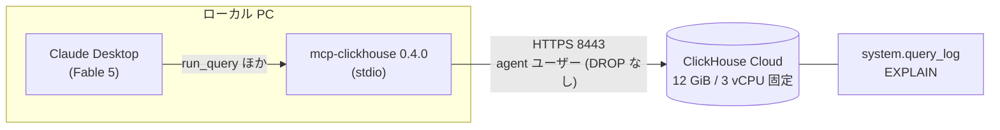
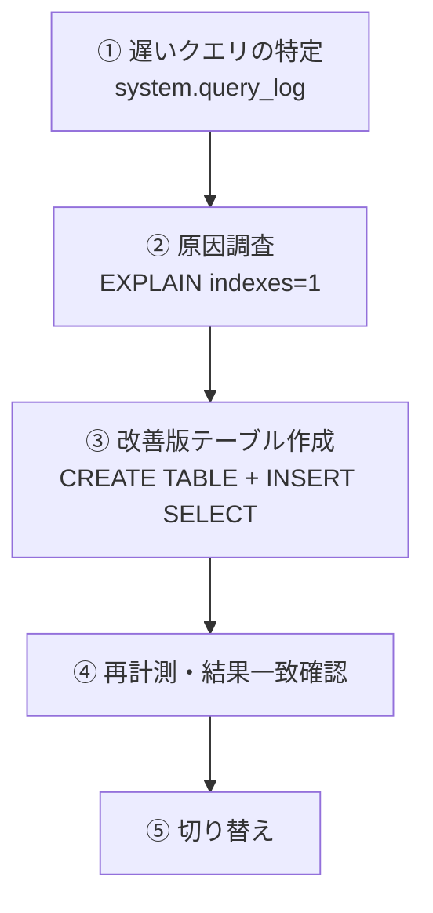

# 1. はじめに

ClickHouse は公式 MCP サーバー（[mcp-clickhouse](https://github.com/ClickHouse/mcp-clickhouse)）や[AI 支援スキーマ管理や Agent Skills（Open House 2026）](https://clickhouse.com/blog/open-house-2026-day-1) が発表されています。一方で公式ブログには、AI が生成するスキーマの問題点を整理した記事もあり、こんな一文があります。

> Run your actual workload. Measure. Then add complexity where the data tells you it's needed.
>
> — [AI doesn't always generate perfect ClickHouse schemas (yet)](https://clickhouse.com/blog/ai-generated-clickhouse-schemas-mistakes-and-advice)

「実際のワークロードを動かして、測って、データが必要だと示した所にだけ複雑さを足せ」。これはパフォーマンスエンジニアへの助言ですが、ClickHouse には `system.query_log`（実行された全クエリの履歴テーブル）や `EXPLAIN`（実行計画の表示）といった診断情報が、最初から SQL で取れる形で揃っています。つまり「遅いクエリを見つける → 実行計画を読む → スキーマの変更案を出す → 検証する」というループを、**LLM エージェント自身に MCP 経由で回すことができるのではないか**という仮説が立ちます。

これまで [Claude Code × SQLcl MCP で Oracle を自律診断させる検証](https://qiita.com/asahide/items/93aa79a02b45fe58f1ba) などをやってきました。今回は `CREATE TABLE` + `INSERT SELECT` で改善版テーブルを作れるため、ループが「提案」で止まらず **「適用 → 再計測」まで閉じられる** と想定しています。

## 1.1. 今回の検証ゴール

| # | 検証項目 | 確認できれば OK の条件 |
|---|---|---|
| 1 | 公式 MCP 経由で「遅いクエリ特定 → 実行計画 → 改善 → 再計測」のループが人手なしで完結するか | 一言プロンプトから、改善版テーブルの適用・再計測まで自律で到達する |
| 2 | エージェントの改善が実測で効果を出すか | 同一クエリセットで read_rows（読んだ行数）と所要時間が大幅に下がる |
| 3 | 提案の正確性（実在しない設定・構文を出さないか） | 提案・発行 SQL を全件、公式ドキュメントと突き合わせて確認できる |

## 1.2. 結論の先出し

- ループは**完結しました**。エージェントは system.query_log に自力で辿り着き、ワークロードを特定し、`PARTITION BY` + `ORDER BY` を設計し直した新テーブルに 5 億行をバックフィルして、再計測・結果一致確認まで自走しました
- 効果は**独立計測で最大約 118 倍**（4,709ms → 40ms）。read_rows は 5 億行 → 155 万行まで減りました
- 発行された 161 のクエリや修正提案に、**実在しない構文・設定はゼロ**でした
- 一番興味深かったのは最後で、仕上げのテーブル入れ替え（`EXCHANGE TABLES`）が **DROP 権限なしの設計に阻まれて実行できず**、エージェントは管理者向けの引き継ぎ手順を残して終了しました。安全のために絞った権限が、そのまま「本番切り替えは人間が承認する」ゲートとして機能した形です

# 2. 検証環境

| 項目 | 内容 |
|---|---|
| 対象 DB | ClickHouse Cloud 25.12.1.1618（ap-northeast-1・レプリカ 1） |
| スケーリング | 12 GiB / 3 vCPU に固定（pinned）・自動アイドル無効 |
| MCP サーバー | ClickHouse/mcp-clickhouse 0.4.0（stdio・uvx 経由） |
| エージェント | Claude Desktop（モデル: Fable 5） |
| 知識注入 | なし（[公式 Agent Skills](https://github.com/ClickHouse/agent-skills) 等は未導入。素の状態で実施） |
| 独立計測クライアント | WSL (Ubuntu) の clickhouse client 26.6.1.609 |
| データ | 合成アクセスログ 5 億行（約 29 日分・ユーザー 50 万人・圧縮後 4.55 GiB） |

計測中にスペックが変わらないよう、スペック固定、自動アイドルも無効にしてあります。


# 3. 検証の設計

## 3.1. わざと遅いテーブルを用意する

チューニング対象として、ORDER BY キー（ClickHouse の主キー。データの並び順を決め、granule = 8,192 行単位の読み飛ばしの効きを左右します）を**意図的に無効化**したテーブルを用意しました。

```sql
-- わざと悪い設計: ORDER BY tuple()（並び順なし）、圧縮コーデックも未指定（全列デフォルト LZ4）
CREATE TABLE workload.access_logs
(
    event_time       DateTime,
    user_id          UInt64,
    url              String,
    status           UInt16,
    response_time_ms UInt32,
    bytes_sent       UInt64
)
ENGINE = MergeTree
ORDER BY tuple();
```

データは `numbers()` でサーバーサイド生成した 5 億行の合成アクセスログです（約 29 日分・毎秒 200 イベント相当・ユーザー 50 万人。投入は約 2 分半）。最初は 5,000 万行で試したのですが、3 vCPU でもフルスキャンが 40〜80ms で完走してしまい「遅いクエリ」になりませんでした。5 億行にすると秒単位の遅さになり、チューニング対象として成立します。

## 3.2. ワークロード

アプリを想定した 4 本のクエリを用意しました。絞り込み軸は「user_id」と「event_time」の 2 系統です。

| クエリ | 内容 | 絞り込み軸 |
|---|---|---|
| Q1 | 特定ユーザーの行動履歴（件数・最終アクセス） | user_id |
| Q2 | 特定日の時間帯別リクエスト数 | event_time（1 日範囲） |
| Q3 | 特定日のエラー率推移 | event_time（1 日範囲） |
| Q4 | 特定ユーザーの URL 別アクセス数 | user_id + event_time |

```sql
-- Q1 の例。log_comment タグを付けて query_log から確実に拾えるようにする
SELECT count(), max(event_time)
FROM workload.access_logs
WHERE user_id = 11111
SETTINGS log_comment = 'workload-q1';
```

これをエージェント実施前に複数周実行し、system.query_log に「アプリの履歴」を記録しておきます。

## 3.3. ベンチ設計の罠: パラメータは毎回変える

ここで 1 つ、設計段階でつまずいた点を共有します。当初は固定パラメータ（`user_id = 42` など）のクエリを繰り返していたのですが、**2 周目以降 read_rows が勝手に減っていく**現象が起きました（5,000 万行のフルスキャンのはずが 600 万行に）。

原因は [query condition cache](https://clickhouse.com/docs/operations/query-condition-cache)（フィルタ条件の評価結果を granule 単位のビットで持つキャッシュ）でした。今回のサービス（25.12）では `use_query_condition_cache = 1` が既定で、同一述語のクエリを繰り返すと、`ORDER BY tuple()` のテーブルでも 2 回目以降は granule の読み飛ばしが効きます。system.query_log の `ProfileEvents['QueryConditionCacheHits']` が 2 回目以降に増えることでも確認できました。

:::note warn
ClickHouse 25.x 系でベンチマークを取るとき、同一パラメータのクエリ連打では「スキーマ起因の遅さ」を測れません。実アプリ同様、実行のたびにパラメータ（user_id・日付など）を変える設計にする必要があります。本検証のワークロードも、周回ごとに別の値へ置換して実行しています（改善前後の比較は同じパラメータ系列を再生して公平にします）。
:::

## 3.4. 権限設計: 「作る・入れる」は自律、「消す」は人間

エージェントに DB を触らせるので、権限は二重に絞りました。

| レイヤー | 設定 | 効果 |
|---|---|---|
| mcp-clickhouse | `CLICKHOUSE_ALLOW_WRITE_ACCESS=true` / `CLICKHOUSE_ALLOW_DROP` は未設定 | DDL・INSERT は許可、DROP / TRUNCATE は MCP レイヤーで拒否 |
| DB ユーザー `agent` | `GRANT SELECT, INSERT, CREATE TABLE, ALTER ON workload.*`（DROP なし） | 仮に MCP を素通りしても DB 側で DROP 不可 |
| 同上 | `GRANT CURRENT GRANTS(SELECT ON system.*)` | 診断用に system テーブルを参照可 |
| 同上 | `READ ON REMOTE` は付与しない | `clusterAllReplicas()` や `remote()` を不許可 |

mcp-clickhouse はデフォルトでは読み取り専用（readonly）で、`CLICKHOUSE_ALLOW_WRITE_ACCESS=true` を付けると DDL / DML が通るようになります。今回のループは「改善版テーブルを作って検証する」まで自律でやらせたいので write は許可し、破壊系だけ残す構成です。

`READ ON REMOTE` を外したのには理由があります。Cloud で system.query_log をレプリカ横断で読む公式の書き方は `clusterAllReplicas()` なのですが、この権限は[任意のリモートサーバーへアドホック接続できる `remote()` テーブル関数](https://clickhouse.com/docs/sql-reference/table-functions/remote)にも使われるため、自律エージェントに渡すとデータ持ち出しの経路になり得ます。今回はレプリカ 1 のサービスなので、単一ノードの query_log 直読みで十分と判断しました。

Claude Desktop 側の設定は `claude_desktop_config.json` に以下を追記するだけです（実施時は clickhouse 以外の MCP コネクタをオフにしています）。

```json
{
  "mcpServers": {
    "clickhouse": {
      "command": "C:\\Users\\xxxx\\.local\\bin\\uvx.exe",
      "args": ["mcp-clickhouse==0.4.0"],
      "env": {
        "CLICKHOUSE_HOST": "xxxxxxxxxx.ap-northeast-1.aws.clickhouse.cloud",
        "CLICKHOUSE_PORT": "8443",
        "CLICKHOUSE_USER": "agent",
        "CLICKHOUSE_PASSWORD": "xxxxxxxxxx",
        "CLICKHOUSE_SECURE": "true",
        "CLICKHOUSE_ALLOW_WRITE_ACCESS": "true"
      }
    }
  }
}
```


エージェントの全操作が `run_query` 経由＝query_log に `user = 'agent'` で残るので、あとから監査と突き合わせられます（6 章）。

## 3.5. 全体構成



エージェントに期待するループはこうです。



# 4. エージェントループの実走

## 4.1. 渡したのは一言だけ

Claude Desktop の新しいチャットに、次のプロンプトを 1 行だけ貼りました。`system.query_log` や `ORDER BY` という単語は意図的に入れていません。どの診断情報に自力で辿り着くかも検証対象だからです。

> ClickHouse の workload データベースを使っているアプリのクエリが遅いです。原因を調べて、改善して、効果を実測で示してください。

以降、人間は一切介入していません（ツール実行の承認のみ）。また、[公式の Agent Skills](https://github.com/ClickHouse/agent-skills)（スキーマ設計・クエリ最適化の知識集）のような知識注入も入れていません。モデルの素の能力と MCP だけでどこまで行けるか、のベースラインとして見てください。


## 4.2. エージェントが実際にやったこと（時系列）

query_log の監査記録と突き合わせた実際の流れです。DB 操作は最初のクエリから最後のクエリまで約 10 分でした。

**① 調査フェーズ**。`list_tables` でスキーマを把握したあと、system.query_log に自力で到達し、`log_comment` タグからアプリのワークロードが 4 クエリであることを特定しました。`normalized_query_hash` でクエリパターンを集約する、過去 12 回分の平均・最大値を出すなど、人間の DBA がやる手順をそのまま踏んでいます。途中、Cloud の推奨形である `clusterAllReplicas(default, system.query_log)` も試しましたが、`READ ON REMOTE` がないため権限エラーになり、単一ノードの直読みに即座にフォールバックしました（3.4 章の権限設計が想定どおり効いた場面です）。

**② 自己ベースライン計測**。改善前の 4 クエリを各 3 回実行して計測しました。気が利いていたのは、自分の計測クエリに `log_comment = 'bench-...'` という独自タグを付けて、アプリのタグ（workload-*）を汚さなかった点です。

**③ 改善の適用**。データ分布（29 日分・ユーザー約 50 万人）を確認した上で、次の設計の新テーブルを作りました。

```sql
CREATE TABLE workload.access_logs_v2 (...)  -- 列定義は元テーブルと同一
ENGINE = MergeTree
PARTITION BY toYYYYMMDD(event_time)   -- Q2/Q3 の日次範囲をパーティションプルーニングで絞る
ORDER BY (user_id, event_time)        -- Q1/Q4 の user_id 検索を主キーで絞る
```

そして `INSERT SELECT` で 5 億行をバックフィルしました。所要は約 3 分で、MCP の `run_query` 経由でもタイムアウトせず完走しています。完了待ちには「150 秒後に通知」というバックグラウンドタスクを自発的に仕掛けて、待ち時間に別の確認を進めていました。

**④ 検証フェーズ**。改善後の 4 クエリを各 3 回再計測し、**改善前後で結果セットが完全一致することも確認**した上で、`EXPLAIN indexes = 1` で主キーが効いていること（61,093 granule 中 188 granule だけ読む）まで裏取りしていました。


**⑤ 切り替え——ここで止まった**。最後にエージェントはテーブル名のアトミックな入れ替え `EXCHANGE TABLES workload.access_logs AND workload.access_logs_v2` を実行しようとして、権限エラーで拒否されました。

```
Code: 497. DB::Exception: agent: Not enough privileges. To execute this query,
it's necessary to have the grant SELECT, DROP TABLE ON workload.access_logs.
(Missing permissions: DROP TABLE ON workload.access_logs). (ACCESS_DENIED)
```

`EXCHANGE TABLES` には DROP TABLE 権限が必要でした（[公式の EXCHANGE 文ページ](https://clickhouse.com/docs/sql-reference/statements/exchange)に必要権限の記載はなく、実測で確認した形です）。エージェントはここで無理をせず、「管理者がこの 1 文を実行すればアプリ無変更で切り替わる」「切り替え前にバックフィル時点以降の差分を `INSERT INTO ... SELECT ... WHERE event_time > ...` で取り込むのが安全」という引き継ぎ事項を整理して終了しました。

## 4.3. 発行された SQL の監査

Desktop にはシェルが無いため、エージェントの DB 操作はすべて MCP 経由＝query_log に残ります。セッション中に `user = 'agent'` で記録されたのは **161 クエリ＋失敗 3 件**でした。

| 種別 | 件数 |
|---|---|
| Select | 156 |
| Create | 2 |
| Insert | 1 |
| Explain | 1 |
| Show | 1 |
| 失敗（構文エラー 1・権限拒否 2） | 3 |

書き込み系は実質 2 操作（v2 テーブルの作成とバックフィルの INSERT SELECT）だけで、残りはすべて読み取りです。なお Create が 2 件あるのは同一 DDL が 2 レコード残るためで、発行した `ENGINE = MergeTree` の形と、Cloud が `SharedMergeTree` へ正規化した実行形が同時刻に記録されていました。[SQLcl MCP のときは Oracle の統合監査でエージェントの SQL を追いました](https://qiita.com/asahide/items/4b6ace1e169c18ef829a)が、ClickHouse では query_log がそのまま監査証跡になります。

# 5. 独立計測 ― エージェントの自己申告を鵜呑みにしない

エージェント自身も before/after を計測していますが、本記事ではそれとは別に、**同一パラメータ系列のワークロードを改善前後のテーブルに再生する独立計測**を行いました（各 3 周・query_log のサーバー側計測値を使用。クライアントやネットワークの影響を受けにくい値です）。

## 5.1. 結果

| クエリ | 改善前 平均 | 改善後 平均 | 相対所要時間（改善前 = 1.00） | read_rows（前 → 後） |
|---|---|---|---|---|
| Q1: ユーザー履歴 | 4,709 ms | 40 ms | **0.008（約 118 倍）** | 5.0 億 → 155 万（1/323） |
| Q2: 時間帯別件数 | 812 ms | 78 ms | 0.096（約 10 倍） | 5.0 億 → 1,728 万（1/29） |
| Q3: エラー率推移 | 438 ms | 95 ms | 0.217（約 4.6 倍） | 2.6 億 → 1,728 万（1/15） |
| Q4: URL 別集計 | 3,294 ms | 38 ms | **0.012（約 87 倍）** | 5.0 億 → 79 万（1/632） |

効果の切り分け指標として read_rows を見ると、改善の中身がきれいに読めます。

- Q1/Q4（user_id 絞り込み）は `ORDER BY (user_id, event_time)` の主キーが効いた結果です。Q1 の read_rows 1,548,288 行は **189 granule × 8,192 行と完全に一致**し、EXPLAIN の表示とも符合します
- Q2/Q3（日次範囲）の 1,728 万行は **ちょうど 1 日分**（86,400 秒 × 200 行/秒）で、`PARTITION BY toYYYYMMDD` のパーティションプルーニングが過不足なく効いています

EXPLAIN の前後差分はこうです。改善前はインデックスのセクション自体がありません。

```text
-- 改善前（ORDER BY tuple()）: 索引情報なし＝全 granule を読む
Expression ((Project names + Projection))
  Aggregating
    Expression ((WHERE + Change column names to column identifiers))
      ReadFromMergeTree (workload.access_logs)

-- 改善後: 主キーの binary search で 61,093 granule → 189 granule
      ReadFromMergeTree (workload.access_logs_v2)
      Indexes:
        PrimaryKey
          Keys:
            user_id
          Condition: (user_id in [44444, 44444])
          Parts: 189/189
          Granules: 189/61093
          Search Algorithm: binary search
```

一方ストレージは少し増えました。

| テーブル | パーツ数 | 圧縮後サイズ | 非圧縮サイズ |
|---|---|---|---|
| access_logs（改善前） | 6 個 | 4.55 GiB | 25.67 GiB |
| access_logs_v2（改善後） | 189 個 | 5.89 GiB（+29%） | 25.54 GiB |

ソート順とパーティション分割が変わったことで圧縮率が下がった形で、エージェント自身もこの増加を把握した上で「許容範囲」と整理していました。

## 5.2. 自己申告との差: 改善幅はむしろ控えめに出ていた

興味深いのは、エージェントの自己申告（最大約 30 倍）と独立計測（最大約 118 倍）の差です。

| | エージェント自己計測 | 独立計測 |
|---|---|---|
| Q1 改善前 | 1,106 ms | 4,709 ms |
| Q1 改善後 | 36.7 ms | 40 ms |
| 改善幅 | 約 30 倍 | 約 118 倍 |

改善後の値はほぼ同じなのに、**改善前の値が 4 倍以上違います**。原因は 3.3 章の query condition cache です。エージェントは固定パラメータでベースラインを再計測したため、繰り返しのうちにキャッシュが効いて「改善前」が実際より速く出ていました。結果として改善幅は控えめ（過小側）に申告されたことになります。盛る方向ではなかったのは幸いですが、エージェントの自己ベンチをそのまま記事や報告に使うのは危ない、という実例です。

# 6. 提案のファクトチェック ― 実在しない設定を出さなかったか

検証ゴール 3 の「実在しない設定・構文を出さないか」を、発行 SQL 全件と提案内容について公式ドキュメントと突き合わせました。

| 提案・操作 | 実在 | 公式との整合 |
|---|---|---|
| `ORDER BY (user_id, event_time)` | ○ | [主キー選択のベストプラクティス](https://clickhouse.com/docs/best-practices/choosing-a-primary-key)どおり（フィルタ頻度の高い列を優先・カーディナリティ昇順） |
| `PARTITION BY toYYYYMMDD(event_time)` | ○ | [パーティショニングキーの選び方](https://clickhouse.com/docs/best-practices/choosing-a-partitioning-key)の推奨範囲内（distinct 値 100〜1,000 未満。今回は 29）。ただし公式は「パーティションは本来データ管理の道具」とも述べており、これは 7 章で触れます |
| 新テーブル + `INSERT SELECT` バックフィル | ○ | 公式に "Ordering keys must be defined on table creation and can't be added" とあり、作り直しが正攻法 |
| `EXCHANGE TABLES A AND B` | ○ | [公式 EXCHANGE 文](https://clickhouse.com/docs/sql-reference/statements/exchange)（アトミックな入れ替え）。必要権限は公式に記載がなく、DROP TABLE 要求は実測で確認 |
| 切り替え前の差分取り込み提案 | ○ | 一般的な SQL。運用助言として妥当 |
| `clusterAllReplicas(default, system.query_log)` | ○ | [Cloud のシステムテーブル横断の推奨形](https://clickhouse.com/docs/operations/system-tables/overview)そのもの |

**実在しない構文・設定の提案はゼロ**でした。公式ブログが挙げる「AI がやりがちなスキーマのミス」（クエリ高速化目的の過剰なパーティション分割、OPTIMIZE TABLE FINAL の乱用、マテリアライズドビューの乱立など）にも該当しませんでした。

失敗した 3 クエリも、いずれも実在構文での失敗です。

| 失敗 | 原因 | エージェントの回復行動 |
|---|---|---|
| 構文エラー（Code 62） | 自前の `FORMAT` 句付き SQL に mcp-clickhouse が `FORMAT Native` を追記し、FORMAT が二重になった（`SELECT 1 FORMAT JSON` で同型エラーを再現確認済み） | FORMAT 句を外して再試行 |
| 権限拒否（Code 497） | `clusterAllReplicas` に `READ ON REMOTE` が必要 | 単一ノード直読みへフォールバック |
| 権限拒否（Code 497） | `EXCHANGE TABLES` に `DROP TABLE` が必要 | 管理者向け引き継ぎ手順を提示 |

1 件目は小ネタですが実用上は重要で、**mcp-clickhouse 0.4.0 経由の SQL には FORMAT 句を書いてはいけません**（結果は MCP 側で JSON 化されるので不要です）。

# 7. 考察

## 7.1. ループは閉じた ― ただし「最後の一歩」は人間に残った

「遅いクエリ特定 → EXPLAIN → スキーマ改善 → 再計測」のループは、一言プロンプトから人手ゼロで完結しました。Oracle での自律診断（V$SQL → 実行計画 → ASH）と比べると、違いは「適用と再計測まで自走できた」ことです。

| 観点 | Oracle 版（SQLcl MCP） | 今回（mcp-clickhouse） |
|---|---|---|
| 遅いクエリの特定 | V$SQL | system.query_log |
| 実行計画 | DBMS_XPLAN | EXPLAIN indexes=1 |
| 改善の適用 | 提案まで（人間が実施） | 新テーブル + 5 億行バックフィルまで自走 |
| 効果の検証 | — | 再計測・結果一致確認まで自走 |
| 本番切り替え | 人間 | 人間（権限で強制） |

そして「本番切り替え」だけは権限設計によって強制的に人間に残りました。`EXCHANGE TABLES` が DROP TABLE 権限を要求したのは想定外でしたが、結果として「検証済みの改善案＋切り替え手順＋差分取り込みの注意」が引き継ぎ事項として揃った状態で人間にバトンが渡る、という理想的な分担になりました。DROP を渡さない設計は、事故防止だけでなく**承認ゲートとしても機能する**と言えます。

## 7.2. エージェントの自己ベンチには独立計測を添える

5.2 章のとおり、エージェントの自己申告は condition cache の影響で改善前の値が実際より速く、改善幅が 30 倍 vs 118 倍と大きくずれました。今回はたまたま控えめ方向でしたが、キャッシュの効き方しだいでは逆（実際より大きく見える）も起こり得ます。エージェントにベンチまで任せる場合は「パラメータを毎回変える」「自己申告とは別に同一条件の独立計測を取る」運用が要ると考えられます。

## 7.3. パーティション分割は「正解」だったのか

`PARTITION BY toYYYYMMDD` は Q2/Q3 をちょうど 1 日分の読み取りに絞っており、効果は明確でした。一方で公式ベストプラクティスは、パーティショニングを「データ管理の道具であり、クエリ最適化の道具ではない」と位置づけています（[Choosing a partitioning key](https://clickhouse.com/docs/best-practices/choosing-a-partitioning-key)）。ORDER BY 側に時刻系の列を組み込む設計（たとえばパーティションなしで複合キーを工夫する）でも近い効果が得られた可能性はあり、どちらが筋の良い設計かはデータ量の伸び方と保持期間の運用しだいと考えられます（未検証）。

## 7.4. 出なかった提案: 圧縮コーデック

当初想定したループには「圧縮コーデック（Delta・ZSTD など列ごとの圧縮方式）の変更案」も含めていましたが、エージェントの提案は ORDER BY とパーティションに集中し、コーデックには触れませんでした。サイズが +29% 増えたことは自分で把握し「許容範囲」と整理しています。挿入順に増え続ける event_time に Delta 系、値域の狭い整数列に T64 などを足せばサイズ増は相殺できた可能性がありますが、これは未検証で、今回のプロンプトが「遅い」という性能起点だったため優先度が下がったのは妥当な判断とも言えます。

## 7.5. この検証の前提と、一般化するときの注意

今回の検証は、エージェントにとってかなり都合のよい前提で組まれています。一般化するときは次の点に注意が必要です。

- **犯人が分かりやすい**: `ORDER BY tuple()` という明確な設計ミスを仕込んだので、診断は一本道でした。実務でよくある「微妙に悪い ORDER BY」「複合的な原因」で同じ精度が出るかは未検証です
- **専用データベース・単一アプリ**: workload データベースはこの検証専用で、書き込み競合も他アプリへの影響もありません。共有環境では「5 億行のバックフィルを営業時間中に走らせてよいか」のような判断が必要で、これはエージェントに任せられません
- **シングルレプリカ**: 複数レプリカ構成では query_log の横断参照（`clusterAllReplicas`）が必要になり、`READ ON REMOTE` を渡すかどうかのトレードオフ（3.4 章で触れた `remote()` の持ち出しリスク）に直面します

# 8. まとめ

| # | 検証項目 | 結論 |
|---|---|---|
| 1 | MCP 経由でチューニングループが人手なしで完結するか | **完結した**。query_log 特定 → EXPLAIN → 新テーブル + 5 億行バックフィル → 再計測・結果一致確認まで自走。本番切り替えのみ権限で人間に残った |
| 2 | 改善が実測で効果を出すか | **出た**。独立計測で最大約 118 倍（4,709ms → 40ms）、read_rows 最大 1/632 |
| 3 | 実在しない設定・構文を出さないか | **出さなかった**。161 クエリ＋提案すべて実在構文・公式と整合。失敗 3 件も原因はツール仕様と権限 |

「ClickHouse のチューニングは LLM エージェント向き」という仮説は、少なくとも今回の範囲では実測で裏付けられました。診断情報（system.query_log・EXPLAIN）が SQL で取れる形で揃っていることに加え、「新テーブルを作って検証する」という ClickHouse 流の改善手順が、破壊的操作なしで完結する＝エージェントに渡しやすい、というのが大きいと感じます。

次は、公式の [Agent Skills](https://github.com/ClickHouse/agent-skills)（スキーマ設計・クエリ最適化の知識集）を入れた場合に提案の質がどう変わるか、そして「微妙に悪いスキーマ」でも診断精度が保てるかを試したいと思います。

# 参考

- [mcp-clickhouse（公式 MCP サーバー）](https://github.com/ClickHouse/mcp-clickhouse)
- [MCP guides | ClickHouse Docs](https://clickhouse.com/docs/use-cases/AI/MCP)
- [system.query_log | ClickHouse Docs](https://clickhouse.com/docs/operations/system-tables/query_log)
- [EXPLAIN | ClickHouse Docs](https://clickhouse.com/docs/sql-reference/statements/explain)
- [Choosing a primary key | ClickHouse Docs](https://clickhouse.com/docs/best-practices/choosing-a-primary-key)
- [Choosing a partitioning key | ClickHouse Docs](https://clickhouse.com/docs/best-practices/choosing-a-partitioning-key)
- [EXCHANGE Statement | ClickHouse Docs](https://clickhouse.com/docs/sql-reference/statements/exchange)
- [Query condition cache | ClickHouse Docs](https://clickhouse.com/docs/operations/query-condition-cache)
- [remote, remoteSecure | ClickHouse Docs](https://clickhouse.com/docs/sql-reference/table-functions/remote)
- [System table overview（Cloud でのシステムテーブル）| ClickHouse Docs](https://clickhouse.com/docs/operations/system-tables/overview)
- [AI doesn't always generate perfect ClickHouse schemas (yet) | ClickHouse Blog](https://clickhouse.com/blog/ai-generated-clickhouse-schemas-mistakes-and-advice)
- [Open House 2026 Day 1 | ClickHouse Blog](https://clickhouse.com/blog/open-house-2026-day-1)
- [ClickHouse/agent-skills（公式 Agent Skills）](https://github.com/ClickHouse/agent-skills)
- [Claude Code が DBA になる ― oracle/skills × SQLcl MCP で Oracle 26ai を自律診断してみた（過去記事）](https://qiita.com/asahide/items/93aa79a02b45fe58f1ba)
- [MCP経由でDBを触るエージェントを“端から端まで”追う ― SQLcl MCP の監査証跡と Langfuse のトレースを突き合わせてみた（過去記事）](https://qiita.com/asahide/items/4b6ace1e169c18ef829a)
