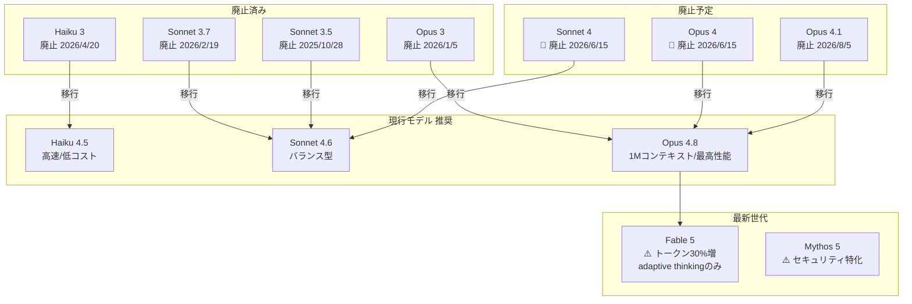
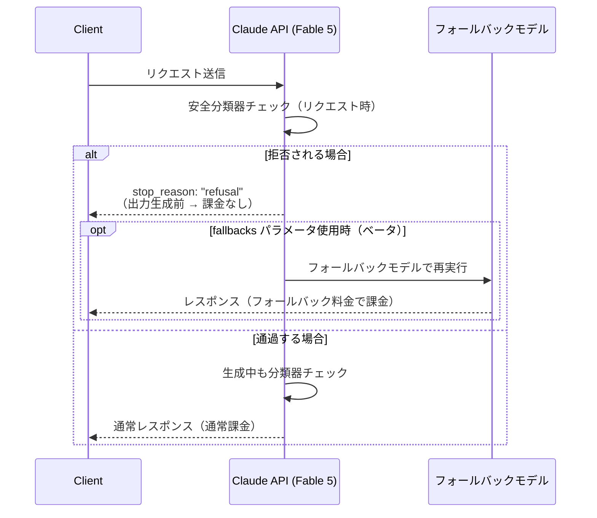
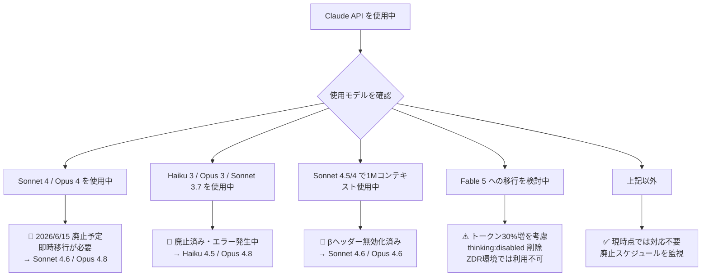

## はじめに

2025年5月から2026年6月にかけて、Anthropic は Claude API に大規模な変更を加えました。最新モデル **Claude Fable 5 / Mythos 5** の登場、**Claude Opus 4.8** のリリース、そして複数の旧モデル廃止が同時進行しています。

特に Fable 5 では**同じテキストでトークン数が約30%増加**という破壊的な変更があり、コスト計算やコンテキスト管理に直接影響します。また **Claude Sonnet 4 / Opus 4 が2026年6月15日廃止予定**と、移行期限が迫っているものもあります。この記事では severity が critical/high の変更を中心に、開発者が今すぐ取るべき行動を整理します。

---

## 変更の全体像



---

## 変更内容

### 🔴 【最重要】Claude Fable 5 / Mythos 5：トークン数が約30%増加

> **⚠️ Breaking Change**
> Fable 5 と Mythos 5 では、同じテキストでも従来モデルと比較して**約30%多いトークン**が生成されます。コスト計算とコンテキストウィンドウの見積もりを必ず見直してください。

> **📌 影響を受ける人**
> - Fable 5 / Mythos 5 への移行を検討している開発者
> - コスト上限やコンテキスト長を厳密に管理しているシステムの運用者

このトークナイザーは Claude Opus 4.7 から導入されたものを採用しています。Token counting API（`model: "claude-fable-5"`）で事前に新トークナイザー下のトークン数を確認できます。

---

### 🔴 【Breaking Change】Fable 5 / Mythos 5：adaptive thinking のみ対応

> **⚠️ Breaking Change**
> `thinking: {"type": "disabled"}` を指定すると **400エラー** が返ります。手動 extended thinking 予算と assistant prefill も非対応です。

| 設定 | Fable 5 / Mythos 5 | Opus 4.6 等の旧モデル |
|------|---------------------|----------------------|
| adaptive thinking | ✅ 対応（唯一の選択肢） | ✅ 対応 |
| `thinking: {"type": "disabled"}` | ❌ 400エラー | ✅ 対応 |
| 手動 `budget_tokens` | ❌ 400エラー | ✅ 対応 |
| assistant prefill | ❌ 400エラー | ✅ 対応 |
| `display: "summarized"` | ✅ 要約思考を取得可 | — |

マルチターン対話では、thinking ブロックを**同じモデルでそのまま渡す**必要があります。`thinking.display` のデフォルトは `"omitted"` で、raw な chain of thought は返りません。

---

### 🔴 Fable 5：安全分類器と refusal / fallbacks の挙動



**重要ポイント：**
- `stop_reason: "refusal"` が返った場合、出力生成前なら**課金されない**
- `fallbacks` パラメータ（Claude API / Claude Platform on AWS でベータ）で別モデルへの自動再試行が可能
- **Message Batches API は `fallbacks` 非対応**
- `stop_details.category` に新たに `reasoning_extraction` が追加（リバースエンジニアリング等 ToS 違反による拒否を示す）

---

### 🔴 Fable 5：30日データ保持必須（ZDR 不可）

> **⚠️ Breaking Change**
> Fable 5 は Claude API で **30日間のデータ保持が必須**です。Zero Data Retention（ZDR）環境では利用できません。

コンプライアンスや規制要件で ZDR が必要なユースケースでは、Fable 5 は選択肢から外れます。設計段階で確認が必要です。

---

### 🟡 Claude Opus 4.8 リリース（新しい推奨モデル）

Opus 4.8 は現在の一般提供モデルの中で最高性能です。主なスペックと注意点：

| 項目 | Opus 4.8 | Opus 4.7 |
|------|----------|----------|
| コンテキスト長 | 1M トークン（標準） | 1M トークン |
| 最大出力 | 128k トークン | — |
| `effort` デフォルト | `high` | — |
| 最小キャッシュ可能長 | **1,024 トークン** | 2,048 トークン |
| temperature/top_p 非デフォルト指定 | ❌ 400エラー | ❌ 400エラー |
| mid-conversation system messages | ✅ 対応 | — |

> **💡 Tips**
> プロンプトキャッシュの最小キャッシュ可能長が **1,024 トークンに低下**しました。短いシステムプロンプトにもキャッシュが効くようになり、コスト削減の機会が広がっています。

---

### 🔴 モデル廃止・非推奨スケジュール一覧

| モデル | 状態 | 廃止日 | 移行先 |
|--------|------|--------|--------|
| `claude-sonnet-4-20250514` | 🚨 非推奨 | **2026/6/15** | Sonnet 4.6 |
| `claude-opus-4-20250514` | 🚨 非推奨 | **2026/6/15** | Opus 4.8 |
| `claude-opus-4-1-20250805` | ⚠️ 非推奨 | 2026/8/5 | Opus 4.8 |
| `claude-3-haiku-20240307` | ❌ 廃止済み | 2026/4/20 | Haiku 4.5 |
| `claude-3-opus-20240229` | ❌ 廃止済み | 2026/1/5 | Opus 4.8 |
| `claude-3-7-sonnet-20250219` | ❌ 廃止済み | 2026/2/19 | Sonnet 4.6 |
| `claude-3-5-haiku-20241022` | ❌ 廃止済み | 2026/2/19 | Haiku 4.5 |

---

### 🟡 Sonnet 4.5 / Sonnet 4 の1Mコンテキストβ廃止

> **⚠️ Breaking Change**
> `context-1m-2025-08-07` ベータヘッダーは無効化されました。200k トークン超のリクエストはエラーになります。
> 移行先：**Sonnet 4.6** または **Opus 4.6**（標準料金・ヘッダー不要で1M利用可）

---

## 影響と対応



### 対応チェックリスト

- [ ] `claude-sonnet-4-20250514` / `claude-opus-4-20250514` を使用中 → **Sonnet 4.6 / Opus 4.8 に移行**（期限: 2026/6/15）
- [ ] `claude-opus-4-1-20250805` を使用中 → **Opus 4.8 に移行**（期限: 2026/8/5）
- [ ] Haiku 3 / Opus 3 / Sonnet 3.7 / Sonnet 3.5 / Haiku 3.5 を使用中 → **即時移行**（廃止済み）
- [ ] `context-1m-2025-08-07` ヘッダーを使用中 → **Sonnet 4.6 / Opus 4.6 に移行**
- [ ] Fable 5 を使用予定 → **コスト計算を×1.3倍で見積もり直す**
- [ ] Fable 5 で `thinking: {"type": "disabled"}` を使用中 → **削除する（400エラー回避）**
- [ ] ZDR 環境で Fable 5 を使用予定 → **代替モデルを選択する**

---

## コード例

### Before/After：thinking 設定の変更（Fable 5 移行時）

**Before（旧モデル向けの設定）:**

```python
import anthropic

client = anthropic.Anthropic()

response = client.messages.create(
    model="claude-opus-4-6",
    max_tokens=1024,
    thinking={"type": "disabled"},  # 旧モデルでは有効だった設定
    messages=[{"role": "user", "content": "複雑な問題を解いてください"}]
)
```

**After（Fable 5 向けの設定）:**

```python
import anthropic

client = anthropic.Anthropic()

response = client.messages.create(
    model="claude-fable-5",
    max_tokens=1024,
    # thinking: {"type": "disabled"} は 400 エラーになるため削除
    # adaptive thinking はデフォルトで有効
    messages=[{"role": "user", "content": "複雑な問題を解いてください"}]
)

# stop_reason: "refusal" のハンドリングが必須
if response.stop_reason == "refusal":
    print("リクエストが安全分類器により拒否されました（課金なし）")
else:
    print(response.content[0].text)
```

---

### Before/After：トークンカウントの見積もり

**Before（旧モデルでのカウントをそのまま流用）:**

```python
# Opus 4.6 のトークン数をそのまま Fable 5 の見積もりに使うのは誤り
count = client.messages.count_tokens(
    model="claude-opus-4-6",
    messages=[{"role": "user", "content": prompt}]
)
budget = count.input_tokens  # Fable 5 では実際にはこれより多くなる
```

**After（Fable 5 のトークナイザーで正確にカウント）:**

```python
import anthropic

client = anthropic.Anthropic()
prompt = "長いシステムプロンプトとユーザーメッセージ..."

# Fable 5 の新トークナイザーで正確にカウント
count = client.messages.count_tokens(
    model="claude-fable-5",
    messages=[{"role": "user", "content": prompt}]
)

print(f"Fable 5 でのトークン数: {count.input_tokens}")
print(f"旧モデル比較の参考値（÷1.3）: {count.input_tokens / 1.3:.0f}")

# コンテキスト上限チェック
MAX_CONTEXT = 1_000_000
if count.input_tokens > MAX_CONTEXT * 0.9:
    print("⚠️ コンテキスト上限に近づいています")
```

---

## まとめ

| 変更 | 重要度 | 対応期限 |
|------|--------|---------|
| Sonnet 4 / Opus 4 廃止 | 🔴 緊急 | **2026/6/15** |
| Haiku 3 / Opus 3 等廃止済み | 🔴 即時対応 | 廃止済み |
| Fable 5 トークン30%増 | 🔴 コスト影響 | Fable 5 利用時 |
| Fable 5 adaptive thinking のみ | 🔴 400エラー | Fable 5 利用時 |
| Fable 5 ZDR 非対応 | 🟡 設計影響 | Fable 5 利用時 |
| Sonnet 4.5/4 の1Mコンテキストβ廃止 | 🔴 エラー発生 | 廃止済み |
| Opus 4.1 廃止予告 | 🟡 要移行 | 2026/8/5 |
| Opus 4.8 の新機能 | 🟢 任意 | いつでも |

直近で最も影響が大きいのは **Sonnet 4 / Opus 4 の廃止（2026年6月15日）** です。まず使用中のモデルを確認し、廃止対象であれば Sonnet 4.6 または Opus 4.8 への移行を優先してください。

Fable 5 を新たに採用する場合は、**①トークン数の増加（コスト見積もり）**・**②thinking パラメータの制約（400エラー回避）**・**③30日データ保持要件（ZDR 非対応）** の3点を設計段階で必ず確認することを強くお勧めします。
