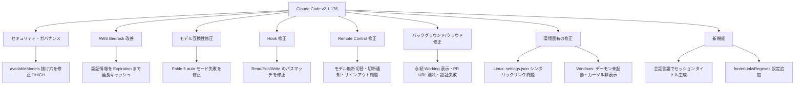
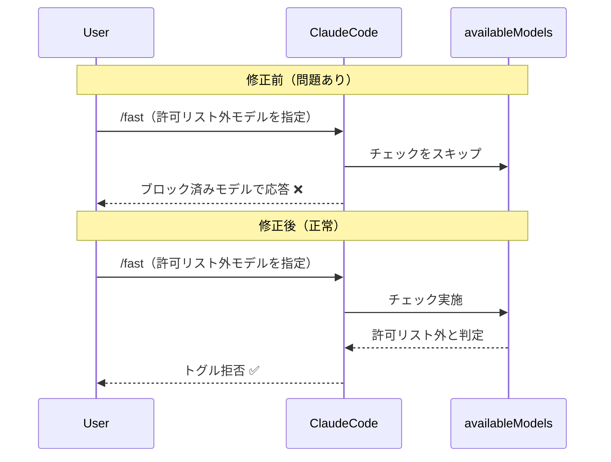
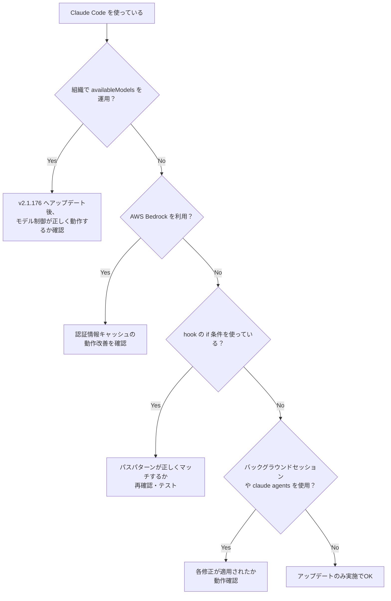

## はじめに

2026年6月13日にリリースされた **Claude Code v2.1.176** は、セキュリティ・ガバナンス上の重要な修正を含む多数のバグフィックスが盛り込まれたリリースです。

特に注目すべきは、**`availableModels` の強制を回避できる抜け穴の修正**です。エンタープライズ環境でモデルの使用制限を運用している組織には直接影響する変更であり、ガバナンス担当者・プラットフォームエンジニアは内容を把握しておく必要があります。

加えて、バックグラウンド/クラウドセッションやRemote Control、Windows/Linux固有の環境問題なども複数修正されており、Claude Code を日常的に使っている開発者にとっても重要なアップデートです。

> **📌 影響を受ける人**
> - 組織でモデル許可リスト（`availableModels`）を運用している管理者
> - AWS Bedrock 経由で Claude Code を利用している開発者
> - `claude agents` やバックグラウンドセッションを活用しているチーム
> - Linux / Windows 環境で Claude Code を使用している開発者

---

## 変更の全体像



---

## 変更内容

### 重要度別まとめ

| 重要度 | 変更内容 | カテゴリ |
|--------|----------|----------|
| 🔴 High | `availableModels` 強制回避の抜け穴修正 | セキュリティ |
| 🟡 Medium | Bedrock 認証情報キャッシュを Expiration まで延長 | AWS Bedrock |
| 🟡 Medium | Fable 5 の auto モード失敗を修正 | モデル互換性 |
| 🟡 Medium | Hook の `if` 条件パスマッチを修正 | Hook |
| 🟡 Medium | Remote Control 複数不具合修正 | リモート操作 |
| 🟡 Medium | バックグラウンド/クラウドセッション複数修正 | セッション管理 |
| 🟢 Low | Linux サンドボックス起動失敗（symlink）修正 | Linux |
| 🟢 Low | tmux/SSH 環境でのコピー&ペースト修正 | 端末操作 |
| 🟢 Low | `/cd`・worktree 移動後の git ブランチ誤表示修正 | Git |
| 🟢 Low | Windows 固有不具合修正（2件） | Windows |
| 🟢 Low | `claude agents` の back 操作で他ウィンドウ切断問題修正 | agents |
| 🟢 Low | セッションタイトルを会話言語で自動生成（新機能） | UX |
| 🟢 Low | `footerLinksRegexes` 設定追加（新機能） | カスタマイズ |

---

## 変更詳細

### 1. `availableModels` 強制の抜け穴修正（High）

> **⚠️ 重要な修正**
> エンタープライズ環境でモデルの使用を制限している組織は必ず確認してください。

これまで、モデルエイリアスを使った選択が `ANTHROPIC_DEFAULT_*_MODEL` 環境変数経由でブロック済みモデルにリダイレクトされるというセキュリティ上の抜け穴が存在していました。

また `/fast` コマンドが許可リスト外のモデルに切り替えようとする場合、以前はそのまま切り替わってしまっていましたが、今後はトグルが**拒否される**ようになりました。

**修正の内容:**
- `ANTHROPIC_DEFAULT_*_MODEL` 経由でブロック済みモデルへリダイレクトされる経路を遮断
- `/fast` が許可リスト外モデルへの切替えを試みた場合、トグルを拒否



---

### 2. Bedrock 認証情報キャッシュの改善（Medium）

`awsCredentialExport` から取得した認証情報を、従来の**固定1時間**ではなく**各認証情報の `Expiration` フィールドの値まで**キャッシュするように変更されました。

これにより、短命な認証情報（例: 15分トークン）での誤った長期キャッシュや、有効期限前の不必要な再取得が解消されます。

---

### 3. Fable 5 の auto モード失敗修正（Medium）

Opus 4.8 が有効化されていない組織で Fable 5 を使用した際に auto モードが失敗する問題を修正。分類器（classifier）が利用可能な最良の Opus モデルへ**フォールバック**するようになりました。

| 状況 | 修正前 | 修正後 |
|------|--------|--------|
| Opus 4.8 有効 | auto モード正常 | auto モード正常 |
| Opus 4.8 無効 + Fable 5 | auto モード失敗 ❌ | 最良の Opus へフォールバック ✅ |

---

### 4. Hook の `if` 条件パスマッチを修正（Medium）

`Read`・`Edit`・`Write` ツールのパスに対する hook の `if` 条件で、ドキュメントに記載されているパターンが正しくマッチしない問題を修正しました。

**修正前に動作しなかったパターン（例）:**

```yaml
# .claude/settings.json
hooks:
  - event: PreToolUse
    if: "Edit(src/**)"       # 動作しなかった
    command: "run-linter.sh"

  - event: PreToolUse
    if: "Read(~/.ssh/**)"    # 動作しなかった
    command: "warn-sensitive.sh"

  - event: PreToolUse
    if: "Read(.env)"         # 動作しなかった
    command: "block-dotenv.sh"
```

> **💡 Tips**
> v2.1.176 へのアップデート後、既存の hook 設定を見直し、期待通りに動作しているか改めて確認することをお勧めします。

---

### 5. Remote Control の複数不具合修正（Medium）

Web・モバイルからのリモート接続時に発生していた以下の問題が修正されました:

1. **モデルの無断切替**: Web/モバイルから接続するとセッションのモデルが変わってしまう問題
2. **切断通知の表示不備**: 人間が読める理由ではなく数値コードのみ表示される問題
3. **接続失敗時の重複行**: 会話トランスクリプトに重複行が追加される問題
4. **サインアウト後もセッション継続**: 別アカウントにサインインしてもセッションが切断されない問題

---

### 6. バックグラウンド/クラウドセッションの複数修正（Medium）

`claude agents` やバックグラウンドセッションを使っているチームに影響する修正が多数含まれています:

| 問題 | 説明 |
|------|------|
| 永続 "Working" 表示 | `/bg` 後に継続処理がないと永遠に "Working" 状態になる |
| PR URL 検索漏れ | スケジュール起動中・ジョブブロック中に開かれた PR が `claude agents` に出ない |
| セッション名シード失敗 | `claude --bg -cn <name>` がセッション名をシードしない |
| クラウド認証失敗 | アイドル過多で "Could not resolve authentication method" エラー |
| 不正な resume ID | 破損した状態ファイルからの不正な resume ID を拒否 |

---

### 7. 環境固有の修正

**Linux:**
- `.claude/settings.json` が絶対パスを指すシンボリックリンクの場合にサンドボックスが起動しない問題を修正

**Windows:**
- `claude agents` ビューの入力欄にテキストカーソルが表示されない問題を修正
- `~/.claude/daemon` に ReadOnly 属性が設定されているとデーモンが起動しない問題を修正

**tmux/SSH:**
- SSH 越しの tmux 内で `/copy` やマウス選択コピーがシステムクリップボードに届かない問題を修正
- tmux 3.2 未満でペーストバッファが読み込まれない問題を修正

---

## 影響と対応

### あなたに必要なアクション



### アップデート方法

```bash
# Claude Code CLI の場合
npm update -g @anthropic-ai/claude-code

# バージョン確認
claude --version
```

---

## コード例

### Hook 設定のパスマッチ（修正後の正常動作）

v2.1.176 以降では、以下のようなパターンが期待通りに動作します:

```json
{
  "hooks": [
    {
      "event": "PreToolUse",
      "matcher": "Edit",
      "if": "Edit(src/**)",
      "command": "npm run lint"
    },
    {
      "event": "PreToolUse",
      "matcher": "Read",
      "if": "Read(.env)",
      "command": "echo '警告: .env ファイルにアクセスしました'"
    },
    {
      "event": "PreToolUse",
      "matcher": "Read",
      "if": "Read(~/.ssh/**)",
      "command": "echo '警告: SSH キーディレクトリにアクセスしました'"
    }
  ]
}
```

### `availableModels` の正しい構成例（管理者向け）

```json
{
  "availableModels": [
    "claude-sonnet-4-6",
    "claude-haiku-4-5-20251001"
  ]
}
```

> **💡 Tips**
> v2.1.176 以降、`ANTHROPIC_DEFAULT_*_MODEL` 環境変数や `/fast` コマンドによる抜け穴経由で許可リスト外のモデルが使われることはなくなります。設定が想定通りに機能しているか、アップデート後に一度テストを実施してください。

---

## まとめ

Claude Code v2.1.176 のポイントを整理します:

| 区分 | 要点 |
|------|------|
| **最重要** | `availableModels` の抜け穴修正 — エンタープライズのモデルガバナンスが確実に機能するようになった |
| **Bedrock ユーザー** | 認証情報キャッシュが実際の Expiration まで延長され、不必要な再取得が減少 |
| **Hook ユーザー** | パスパターン（`src/**`、`.env` 等）が正しくマッチするように。既存設定の動作確認を推奨 |
| **agents/バックグラウンド** | 永続 "Working" 問題や PR URL 漏れなど多数修正。安定性が向上 |
| **Windows/Linux** | 環境固有の起動・UI 不具合が解消 |

v2.1.177 も同日にリリースされていますが、現時点ではリリースノートの内容が公開されていないため、詳細は公式リリースページでご確認ください。

---

*本記事は Claude Code v2.1.176 のリリースデータをもとに作成しています。*
