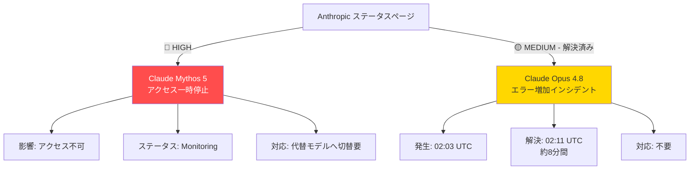
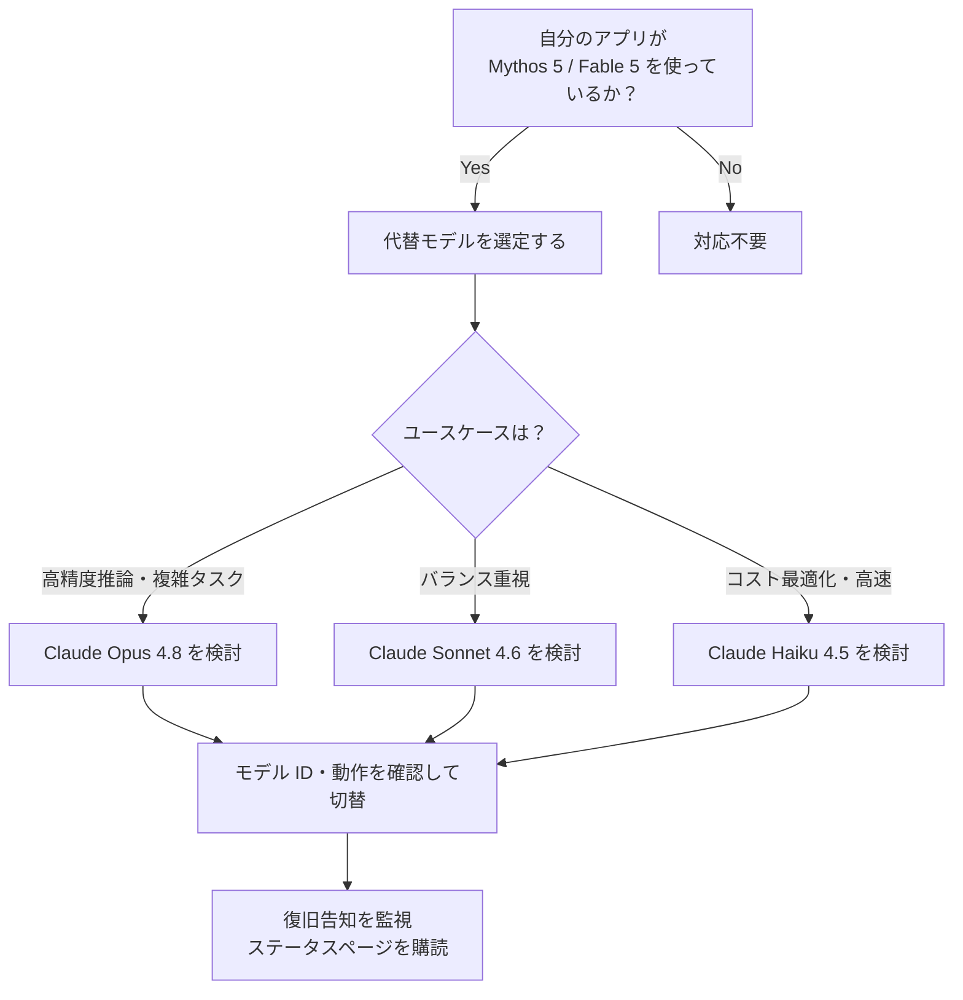

## はじめに

2026年6月13日、Anthropic は **Claude Mythos 5** および **Claude Fable 5** へのアクセスを一時停止したと発表しました。現在、両モデルはステータスページ上で「Monitoring（監視中）」状態にあります。

これらのモデルをプロダクションで利用しているアプリケーションや開発者は、**即座に影響を受ける可能性があります**。本記事では、今回のインシデント概要・影響範囲・代替モデルへの対応方針を整理します。

> **📌 影響を受ける人**
> - Claude Mythos 5 または Claude Fable 5 を API 経由で呼び出しているアプリケーションの開発者・運用者
> - これらのモデルを前提として CLAUDE.md や設定ファイルに記述している開発チーム

---

## 変更の全体像

今回の変更・インシデントは2件あります。重要度の高い順に整理します。



| インシデント | 重要度 | 状態 | 対応要否 |
|---|---|---|---|
| Claude Mythos 5・Fable 5 アクセス停止 | 🔴 HIGH | Monitoring | **要対応** |
| Claude Opus 4.8 エラー増加 | 🟡 MEDIUM | 解決済み | 不要 |

---

## 変更内容

### 1. Claude Mythos 5・Fable 5 アクセス一時停止（要対応）

> **⚠️ Breaking Change**
> Claude Mythos 5・Claude Fable 5 へのアクセスが停止中です。これらのモデル ID を直接指定している実装は現在動作しません。

**タイムライン：**

```mermaid
timeline
    title Claude Mythos 5 / Fable 5 停止インシデント
    2026-06-13 00:50 UTC : アクセス停止を告知
                         : ステータス Monitoring 移行
    現在               : Monitoring 継続中
                       : 復旧時期は未発表
```

**確認されていること：**
- 対象モデル：`Claude Mythos 5`、`Claude Fable 5`
- 告知時刻：2026-06-13 00:50 UTC
- 公式ステータス：Monitoring（復旧見込みは未発表）
- 停止理由：Anthropic の告知ページに記載あり（本分析時点では外部アクセス未実施のため詳細不明）

---

### 2. Claude Opus 4.8 エラー増加インシデント（解決済み）

**タイムライン：**

| 時刻 (UTC) | イベント |
|---|---|
| 2026-06-13 02:03 | エラー増加を検知、調査開始（Investigating） |
| 2026-06-13 02:11 | 解決（Resolved） |

インシデント発生から解決まで約 **8分間**。すでに復旧済みのため、現時点での利用者対応は不要です。ただし、この時間帯（02:03〜02:11 UTC）に Claude Opus 4.8 でエラーを観測していた場合、本インシデントが原因と考えられます。

---

## 影響と対応

### Claude Mythos 5・Fable 5 停止への対応フロー



> **💡 Tips**
> Anthropic のステータスページで「Subscribe to updates」を設定しておくと、復旧時に通知を受け取れます。モデルが復旧した後に戻すかどうかは、代替モデルとの性能・コスト比較を踏まえて判断してください。

### 現在利用可能な代替モデル（参考）

| モデル | 用途 | 補足 |
|---|---|---|
| Claude Opus 4.8 | 高精度・複雑なタスク | 最上位モデル |
| Claude Sonnet 4.6 | 汎用・バランス重視 | 本記事執筆時点の実行モデル |
| Claude Haiku 4.5 | 軽量・高速・低コスト | 大量処理向け |

> **📌 注意**
> 上記モデル ID・スペックは記事執筆時点のものです。最新情報は Anthropic の公式ドキュメントで確認してください。

---

## コード例

### Before: Mythos 5 / Fable 5 を直接指定

```python
import anthropic

client = anthropic.Anthropic()

# ❌ 現在アクセス停止中 — 使用不可
response = client.messages.create(
    model="claude-mythos-5",   # アクセス停止中
    max_tokens=1024,
    messages=[{"role": "user", "content": "Hello"}]
)
```

```python
# ❌ こちらも停止中
response = client.messages.create(
    model="claude-fable-5",   # アクセス停止中
    max_tokens=1024,
    messages=[{"role": "user", "content": "Hello"}]
)
```

### After: 利用可能なモデルへ切り替え

```python
import anthropic

client = anthropic.Anthropic()

# ✅ 代替モデルを指定（ユースケースに応じて選択）
response = client.messages.create(
    model="claude-opus-4-8",    # 高精度が必要な場合
    # model="claude-sonnet-4-6",  # バランス重視の場合
    # model="claude-haiku-4-5-20251001",  # 軽量・高速が必要な場合
    max_tokens=1024,
    messages=[{"role": "user", "content": "Hello"}]
)

print(response.content)
```

### 環境変数でモデルを管理する（推奨）

モデル ID をハードコードせず、環境変数や設定ファイルで管理しておくと、今回のような停止時に切り替えが容易になります。

```python
import os
import anthropic

client = anthropic.Anthropic()

MODEL = os.environ.get("CLAUDE_MODEL", "claude-sonnet-4-6")

response = client.messages.create(
    model=MODEL,
    max_tokens=1024,
    messages=[{"role": "user", "content": "Hello"}]
)
```

```bash
# .env または環境変数で切り替え
CLAUDE_MODEL=claude-opus-4-8
```

> **💡 Tips**
> モデル ID を定数や設定ファイルに集約しておくと、停止・廃止時の対応コストを大幅に削減できます。特に複数の API 呼び出し箇所がある場合は、一元管理が有効です。

---

## まとめ

| 項目 | 内容 |
|---|---|
| 重要インシデント | Claude Mythos 5・Fable 5 アクセス一時停止 |
| 現在の状態 | Monitoring（復旧未定） |
| 即時対応 | 代替モデル（Opus 4.8 / Sonnet 4.6 / Haiku 4.5）へ切り替え |
| 解決済みインシデント | Opus 4.8 エラー（8分で復旧）|
| 今後のアクション | ステータスページの更新を継続監視 |

今回の停止は **高重要度（HIGH）** のインシデントであり、対象モデルを使っているプロダクションシステムは即時対応が必要です。モデル ID を環境変数や設定ファイルで管理する習慣をつけておくと、今後の類似インシデントへの対応が格段に楽になります。

Anthropic のステータスページを定期的に確認し、復旧アナウンスをいち早くキャッチしてください。
