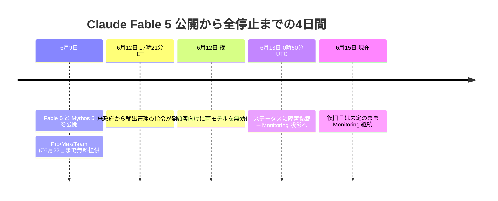
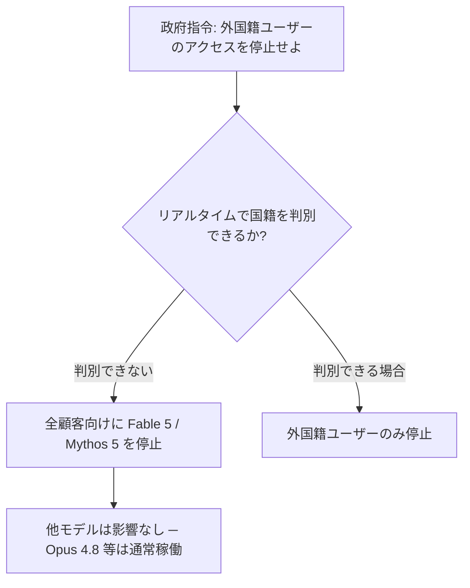
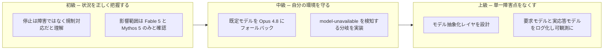

納車してわずか4日のフラッグシップが、ディーラーから一斉にリコール回収された。しかも整備不良が見つかったからではない。お上（政府）からの一片の指令で、だ。

2026年6月、Anthropicの最上位公開モデル [Claude Fable 5](https://qiita.com/GeneLab_999/items/a7a491035d0177c5512c) が、突然すべてのユーザーの手元から消えた。「自分のアカウントが垢BANされた？」「課金が切れた？」と青ざめた人も多いはず。違う。あなたのせいでも、モデルが壊れたせいでもない。これは**規制が引き起こした、史上類を見ないモデルのリコール**だ。

この記事では、この記事を書いている6月15日時点でわかっている一次情報だけを根拠に、「何が起きたのか」「なぜ全員巻き添えなのか」「二度と戻ってこないのか」、そして開発者にとって一番大事な「**今すぐ何をすべきか**」を、車のリコールと代車のたとえで一気に整理する。

---

## この記事の対象読者

<font color="#00A1B3">

- Claude Fable 5 / Mythos 5 が急に使えなくなって戸惑っている人
- APIやClaude Codeで Fable を本番ワークフローに組み込んでいた開発者
- 「結局いつ戻るの？二度と戻らないの？」の事実ベースの答えが欲しい人
- 特定のAIモデルへの依存リスクを設計面から見直したいエンジニア

</font>

## この記事で得られること

- 何が・いつ・なぜ起きたかの正確なタイムライン（一次情報リンク付き）
- 「外国籍ユーザー停止」の指令が、なぜ全顧客停止につながったのかの論理
- 「二度と戻らない？」への、憶測ではなく公式声明に基づいた回答
- 今日から実装できるフォールバック設計（コード付き）

## この記事で扱わないこと

- ジェイルブレイク手法そのものの具体的な再現手順（安全上、一切扱わない）
- 政治的な是非の評価（事実と公式見解の整理に徹する）
- 復旧日の予言（誰にもできない。やらない）

---

## TL;DR ─ 30秒で全体像

:::note info
- 6月9日に公開された Claude Fable 5 と、その上位の Claude Mythos 5 が、6月12日に**全世界・全ユーザー向けで停止**された。
- 原因は**性能や障害ではなく、米政府の輸出管理指令**。「外国籍ユーザーのアクセスを止めよ」という命令に対し、Anthropicは国籍をリアルタイム判別できないため、やむなく全員停止にした。
- Anthropic自身は指令に**異議を唱えつつ法令には従う**という立場で、「誤解だと考えており、復旧に取り組む」と明言。**「二度と戻らない」とは言っていない**。ただし**復旧の時期は未定**。
- <font color="#12B278">Opus 4.8 / Sonnet 4.6 / Haiku 4.5 など他のモデルは通常どおり稼働中。</font>当面の代車は Opus 4.8 が定番。
:::

---

## 1. 何が起きたのか ─ 納車4日でリコールまでの全記録

まずは時系列。新車が納車されてから、ディーラーが全車回収するまで、たった4日だった。



[Claude](https://qiita.com/GeneLab_999/items/2d1948b5f6d424798960) の系譜でいうと、Fable 5 は4月に Project Glasswing 限定で公開された [ClaudeMythos](https://qiita.com/GeneLab_999/items/2d1948b5f6d424798960) Preview から派生した「Mythosクラス」の一般公開版にあたる。[LLM](https://qiita.com/GeneLab_999/items/7f1bd2de313bdd7ca423) としては、Anthropicが一般提供したなかで最も高性能とされ、ソフトウェアエンジニアリングや知識労働で頭一つ抜けた性能を謳っていた。**そのフラッグシップが、納車直後にリコールされた**わけだ (;ﾟдﾟ)ﾎﾟｶｰﾝ

公式の一次情報はこちら。まずはAnthropicの声明を直接読むのが早い。

https://www.anthropic.com/news/fable-mythos-access

ライブのステータスはこちら。今この瞬間、復旧したかどうかはここで確認できる。

https://status.claude.com/

---

## 2. なぜ「全員」巻き添えなのか ─ 一台のリコールが全車回収になる理屈

ここが今回いちばん誤解されやすいポイント。指令の文面は「外国籍ユーザーは使うな」であって、「全員使うな」ではない。にもかかわらず、結果として全顧客が止まった。なぜか。

理屈はシンプルだ。**ディーラーは、来店した客の国籍をその場で正確に見分けられない**。見分けられない以上、「特定の客にだけ売らない」を厳密に守る唯一の方法は、**そのモデルを店頭から完全に下げること**になる。



指令は<font color="#0383ED">米国内外を問わず、すべての外国籍ユーザー（Anthropicの外国籍従業員すら含む）</font>を対象としていた。対象範囲が広すぎて、選択的な遮断が現実的でなかった。だから全車回収になった。これがリコールが「全員」に及んだ唯一の理由で、**あなたのアカウントや使い方には一切非がない**。

### リコールの理由は「欠陥」ではない、という異例さ

通常のリコールは、メーカー自身が欠陥を認めて回収する。だが今回はそこが決定的に違う。**メーカー（Anthropic）は「欠陥ではない」と主張しているのに回収させられている**。

政府が問題視したのは、[Fable 5](https://qiita.com/GeneLab_999/items/a7a491035d0177c5512c) の安全機構を回避する「ジェイルブレイク」の手口とされる。Anthropicはその報告を確認したうえで、要点を次のように反論している（いずれも公式声明の要旨を筆者が整理したもの）。

- 問題とされた手口は、モデルに特定のコードベースを読ませて欠陥を直させる、という**狭く・非汎用的なもの**。
- 見つかったのは**既知で軽微な脆弱性**で、回避策を使わずとも他の公開モデルでも発見できる水準。
- Anthropicは公開前に米政府・英AISI・第三者機関などと**数千時間のレッドチーミング**を実施済み。
- 「あらゆる安全機構を広く突破する**汎用ジェイルブレイク**」は誰も発見できていない。

公式声明の該当箇所と和訳を一つだけ引いておく。復旧見通しに関わる、最も重要な一文だ。

> 原文（抜粋）: working to restore access as soon as possible
> 和訳: できるだけ早くアクセスを復旧させるべく取り組んでいる

出典: [Statement on the US government directive to suspend access to Fable 5 and Mythos 5（Anthropic, 2026-06-12）](https://www.anthropic.com/news/fable-mythos-access)

:::note warn
公開直後、X上で「Fable 5 を破った」とするジェイルブレイクの主張が出回ったとも報じられている（VentureBeat報道）。本記事ではその手口の中身には一切立ち入らない。再現につながる情報は、解説の体裁であっても扱わない方針だ。ここで重要なのは手口の詳細ではなく、「**外部からの一手で公開モデルが消えうる**」という構造的な事実のほうだ。
:::

[RCE](https://qiita.com/GeneLab_999/items/9096f4da7ac2436747da) や [Fuzzing](https://qiita.com/GeneLab_999/items/8bdffaa00565a741603e) のようなセキュリティ文脈に関心がある人ほど、「狭いジェイルブレイク」と「汎用ジェイルブレイク」の線引きが今回の争点の核心だと理解できるはずだ。

---

## 3. 「二度と戻ってこない」のか？ ─ 事実だけで答える

いちばん知りたいのはここだろう。結論から言う。**公式は「戻す」と言っている。ただし入庫日は未定。** 整理すると以下になる。

| 問い | 事実ベースの答え |
|------|----------------|
| 永久に廃止されたのか？ | <font color="#12B278">いいえ。</font>Anthropicは「誤解」と捉え、復旧に取り組むと明言している |
| いつ戻る？ | **未定。** 公式は期日を一切コミットしていない |
| 他のモデルも危ない？ | 指令の対象は Fable 5 と Mythos 5 のみ。Opus 4.8 等は影響なし |
| 戻るかどうかは何次第？ | 政府との折衝・コンプライアンス対応の進展次第 |

二次的な観測筋では「数日で戻る可能性」から「規制対応が長引けば数週間」「指令が維持されれば不透明」まで幅がある、と報じられている。が、これはあくまで外部の推測だ。**Anthropicが公式に約束しているのは「できるだけ早く」だけ**で、日付は出ていない。

:::note alert
だから、復旧日について断定する情報源には注意してほしい。「◯月◯日に復活」と日付を明言しているものは、現時点ではすべて憶測だ。一次情報はステータスページの Monitoring と公式声明の二つだけ。それ以外は「予想」と割り切ること。
:::

ちなみに公開時のアナウンスでは、Fable 5 は6月22日まで Pro/Max/Team などに無料提供され、6月23日に外す予定だった。その無料提供期間のさなかでの停止だったため、「無料枠が早めに終わっただけ」と勘違いされやすいが、それも違う。**枠の話ではなく、規制による全停止**だ。

---

## 4. 開発者は今どうすべきか ─ 代車に乗り換え、一台依存をやめる

ここからが本題。速報を眺めて終わるエンジニアと、ここで手を動かすエンジニアの差が出る。やることは地味だが急ぎだ。**Fable を本番の既定ルートから外し、代車（Opus 4.8）に振り替える。**

### 4-1. まずやってはいけないこと ─ 無限リトライの罠

今回いちばん効かない対処が「リトライ」だ。リコール中の車は、エンジンを何度かけ直しても動かない。規制停止は一時的なネットワーク障害ではないので、リトライはただ処理を遅くするだけで、永遠に復活しない。

<font color="#ED6300">model-unavailable を一時障害と誤認した指数バックオフは、今回は完全に逆効果になる。</font>

<details>
<summary>クリックで「効かないアンチパターン」を展開</summary>

```python
import time

# アンチパターン: 規制停止に無限リトライしても永久に戻らない
def call_broken(prompt):
    for attempt in range(5):
        try:
            return call_model("claude-fable-5", prompt)
        except ModelUnavailable:
            time.sleep(2 ** attempt)  # 待っても戻らない。ただ遅くなるだけ orz
    raise RuntimeError("リトライ尽きた（が、原因はそこじゃない）")
```

</details>

### 4-2. 正しい対処 ─ フォールバックを設計に組み込む

リトライではなく、**即座に代車へ切り替える分岐**を入れる。ポイントは「どのモデルへ流すか」というポリシーと、「実際に呼ぶ」処理を分離すること（関心の分離）。これで将来モデルが増減しても、ポリシーのタプルを変えるだけで済む（DRY）。

<details>
<summary>クリックでフォールバック実装例を展開（Python）</summary>

```python
from dataclasses import dataclass

# 関心の分離: ルーティングのポリシーと、呼び出し処理を分ける
PRIMARY = "claude-fable-5"
FALLBACK = "claude-opus-4-8"


@dataclass
class ModelResult:
    model: str   # 実際に応答したモデル
    text: str


def call_with_fallback(prompt: str) -> ModelResult:
    """Fable 5 が使えない間は Opus 4.8 へ自動で迂回する。

    規制停止はリトライ対象ではないため、即フォールバックする。
    要求モデルと実応答モデルを必ず記録し、観測可能にしておく。
    """
    for model in (PRIMARY, FALLBACK):
        try:
            text = call_model(model, prompt)
        except ModelUnavailable:
            continue  # リトライせず、次の候補へ
        return ModelResult(model=model, text=text)
    raise RuntimeError("利用可能なモデルがありません")
```

</details>

これだけで「Fable が落ちた瞬間に本番が沈黙する」事態は避けられる。さらに、**要求したモデルと実際に応答したモデルを必ずログに残す**こと。これがないと「いつのまにか全部 Opus で動いていた」ことに気づけない。

### 4-3. もう一歩 ─ ベンダー依存を減らすローカルという保険

今回の本質的な教訓は「**公開モデルは、技術的な障害がなくても外部要因で消えうる**」という点だ。クラウドの単一ベンダーに本番を全賭けするのは、一台のリコールで全業務が止まる構造そのもの。

ここで効いてくるのが、自前で握れる推論基盤だ。[vLLM](https://qiita.com/GeneLab_999/items/bdb9b1aa4a47bdecbfdf) でセルフホスト推論を立てる、[Ollama](https://qiita.com/GeneLab_999/items/0e8001fb329e7ca32aa2) でローカルにオープンモデルを置く、といった選択肢を「代車置き場」として用意しておくと、ベンダー側の都合に振り回されにくくなる。

筆者は普段 [RTX5090](https://qiita.com/GeneLab_999/items/ab544a30c2d43eeb00bb) を積んだWindows機で [CUDA](https://qiita.com/GeneLab_999/items/dfedb349f4971a1c7786) 環境を回しているが、今回の件で「クラウド最上位モデル一本足打法は危うい」という持論をいよいよ確信した。フロンティアモデルの瞬発力と、ローカルの可用性。この二台持ちが効くという話だ。[MCP](https://qiita.com/GeneLab_999/items/d1299630fc2c0325003b) でエージェント連携を組んでいる人なら、バックエンドモデルを差し替え可能にしておく設計のありがたみが、今回いっそう身に染みたんじゃないだろうか。

---

## 5. よくある症状と対処（トラブルシューティング）

| 症状 | 原因 | 対処 |
|------|------|------|
| APIで model-not-found が返る | claude-fable-5 を指定している | 規制停止中。Opus 4.8 等へ切替 |
| Claude Code/アプリで Fable が選べない | モデルピッカーから削除済み | 最新版に更新しつつ他モデルを使用 |
| 会話が勝手に別モデルに切り替わった | 自動フォールバック仕様 | 想定動作。サポート記事で挙動を確認 |
| リトライしても一向に復活しない | 規制停止を一時障害と誤認 | リトライ廃止、フォールバック設計へ |
| 自分のアカBAN？と不安になる | アカウント無関係の全体停止 | ステータスページで全体障害を確認 |
| 復旧日が知りたい | 公式は期日未定 | ステータスの Monitoring を購読して待つ |
| Mythos 5 も消えている | 同じ指令の対象 | Glasswing関連も停止中。仕様 |
| 本番が完全に止まった | Fable を単一障害点にしていた | モデル抽象化レイヤで多重化 |

<font color="#FF4056">最重要: 本番ワークフローで特定モデルを単一障害点にしないこと。これは今回固有の話ではなく、今後どのベンダーでも起こりうる普遍的なリスクだ。</font>

---

## 6. 学習ロードマップ ─ 今回を「次に活かす」三段階



初級では「慌てない・誤解しない」、中級では「自分のコードを守る」、上級では「そもそも一台に依存しない設計にする」。この順で登れば、次にどのモデルが消えても、あなたの本番は静かに代車へ乗り換えるだけで済む。

---

## まとめ ─ 代車は、晴れの日に用意しておくもの

最後に所感を。今回の件で痛感したのは、**AIの可用性は、もはや技術指標だけでは語れない**ということだ。レイテンシでもエラーレートでもなく、規制という外部要因が、納車4日のフラッグシップを一夜で店頭から消した。これは個々のエンジニアにはどうにもできない領域の話だ。

だが、どうにもできないからこそ、こちら側でできる備えの価値が上がる。代車（フォールバック先）は、車が壊れてから探すものじゃない。晴れている今のうちに鍵を渡しておくものだ。Fable 5 が戻るかどうかは Anthropic と政府の折衝次第で、こちらは祈ることしかできない。けれど「Fable が消えても本番は止まらない」状態は、今日のあなたのコミット一つで作れる。

そして「二度と戻らないの？」への答えを改めて。**公式は戻すと言っている。期日は未定。** それ以上でも以下でもない。日付を断言する情報には眉に唾を、ステータスページの Monitoring には購読を。続報が出たら、また追いかけよう。

---

## 関連記事

- [ClaudeMythos ってなんだ？ ─ Mythosクラスとは何者か](https://qiita.com/GeneLab_999/items/2d1948b5f6d424798960)
- [LLM の基礎](https://qiita.com/GeneLab_999/items/7f1bd2de313bdd7ca423)
- [vLLM ─ 高速推論エンジンでセルフホスト](https://qiita.com/GeneLab_999/items/bdb9b1aa4a47bdecbfdf)
- [Ollama ─ ローカルでLLMを動かす](https://qiita.com/GeneLab_999/items/0e8001fb329e7ca32aa2)
- [MCP ─ エージェント連携の基盤](https://qiita.com/GeneLab_999/items/d1299630fc2c0325003b)
- [RCE ─ リモートコード実行とは](https://qiita.com/GeneLab_999/items/9096f4da7ac2436747da)
- [Fuzzing ─ 脆弱性発見の自動化](https://qiita.com/GeneLab_999/items/8bdffaa00565a741603e)

## 参考（一次情報）

- Anthropic公式声明: [Statement on the US government directive to suspend access to Fable 5 and Mythos 5](https://www.anthropic.com/news/fable-mythos-access)
- Claudeステータス（ライブ）: [Claude Status](https://status.claude.com/)
- 公開時のアナウンス: [Claude Fable 5 and Claude Mythos 5](https://www.anthropic.com/news/claude-fable-5-mythos-5)
- 報道（参考）: CNBC / Fortune / NBC News による6月12〜13日の各報道

---

最新の続報や、ローカルLLMでベンダー依存を減らす検証ログはXで発信しています。

https://x.com/geneLab_999
