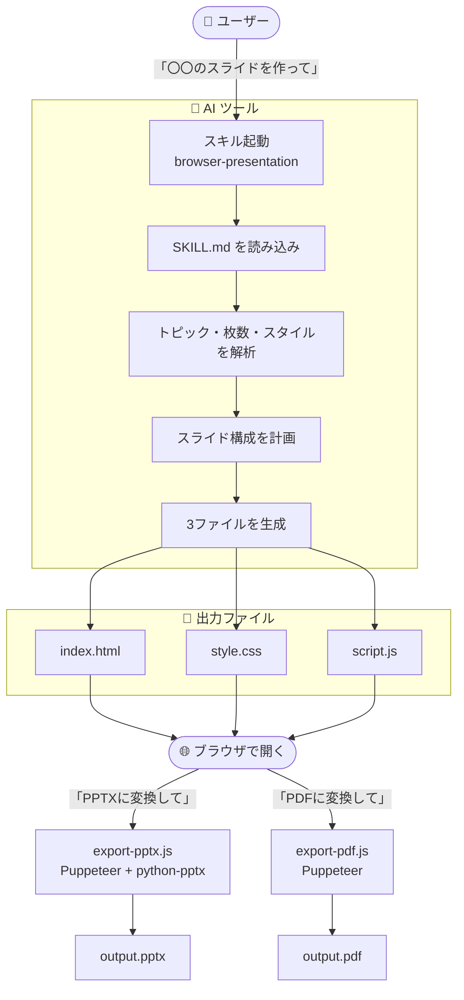

## はじめに

「スライド作り、AI に簡単にお任せできたらいいな」と色々な手法を試す中で、
**Claude Code** と **IBM Bob** で動くスキル **browser-presentation** を作りました。トピックやアウトラインを渡すだけで、ブラウザで動くスライドショーを **3ファイル**（`index.html` / `style.css` / `script.js`）で自動生成します。さらに **PPTX (画像) / PDF へのエクスポート**にも対応しています。

- リポジトリ: https://github.com/cu0001/browser-presentation


---

### 動画

ご説明動画を作成しています。理解の一助にご参照ください。

<iframe width="711" height="400" src="https://www.youtube.com/embed/ZEPLxOnUgyY?si=Mm4Fq_341XL9kWdk" title="YouTube video player" frameborder="0" allow="accelerometer; autoplay; clipboard-write; encrypted-media; gyroscope; picture-in-picture; web-share" referrerpolicy="strict-origin-when-cross-origin" allowfullscreen></iframe>


---

## このスキルでできること

- 「〇〇のスライドを作って」と指示するだけで、HTML/CSS/JS のスライドショーを生成
- ブラウザでそのままプレゼン可能（ボタン・キーボード操作・スライド番号表示・スムーズなトランジション）
- 生成後に「PPTX に変換して」「PDF に変換して」と言えばファイル出力


---

## 前作「pptx-generator」との違い

以前、PowerPoint を直接生成するスキル「pptx-generator」を公開しました。

https://qiita.com/c_u/items/3725a6df720664ebdca2

今回の browser-presentation は、その続編にあたるスキルです。両者の違いは次の通りです。

| | pptx-generator（前作） | browser-presentation（本作） |
|---|---|---|
| 生成物 | PPTX ファイルを直接生成 | HTML / CSS / JS の3ファイル |
| プレゼン方法 | PowerPoint で開く | ブラウザでそのまま発表 |
| PPTX の編集性 | テキスト・図形を**個別に編集可能** | 画像貼り付けのため編集不可（HTML 側で修正） |
| デザイン表現 | PowerPoint の表現範囲 | CSS によるグラデーション・アニメーション等、自由度が高い |
| 追加モジュール | 少ない（シンプル・低コスト） | エクスポート時に Puppeteer + python-pptx が必要 |

**最終成果物として編集可能な PPTX が欲しいなら pptx-generator**、**ブラウザでそのまま発表したい・リッチなデザインで作りたいなら browser-presentation**、という使い分けがおすすめです。


---

### なぜ HTML スライドなのか

PPTX を直接生成する方式と比べて、HTML/CSS/JS で出力するメリットは次の通りです。

1. **デザインの自由度が高い** — グラデーション、シャドウ、ホバーエフェクト、アニメーションを CSS でそのまま表現できる
2. **修正が AI との対話で完結する** — 「3枚目の色を変えて」のような微調整がテキスト編集で済む
3. **配布形式は後から選べる** — ブラウザでそのまま発表してもいいし、PPTX / PDF に変換してもいい


---

## 動作環境

| ツール | 提供元 | 動作確認済みバージョン |
|---|---|---|
| Claude Code | Anthropic | Claude Sonnet / Opus 系 |
| IBM Bob | IBM | Bob（スキル対応版） |

「スキル」とは、AI コーディングツールに手順書（`SKILL.md`）を読み込ませて特定タスクを定型化する仕組みです。スキルフォルダを所定のディレクトリに置くだけで使えるようになります。


---

## インストール

リポジトリをクローンし、`skills/` フォルダの中身をスキルディレクトリへ配置します。

```bash
git clone https://github.com/cu0001/browser-presentation.git
```

:::note warn
`SKILL.md` はリポジトリの `skills/` サブフォルダ内にあります。リポジトリ直下をそのまま置くと認識されないので、必ず `skills/` フォルダをコピーしてください。
:::


---

### Claude Code の場合

```bash
# グローバル（全プロジェクトで使用）
cp -r browser-presentation/skills ~/.claude/skills/browser-presentation

# プロジェクトローカル（現在のプロジェクトのみ）
cp -r browser-presentation/skills ./.claude/skills/browser-presentation
```


---

### IBM Bob の場合

```bash
# グローバル（全プロジェクトで使用）
cp -r browser-presentation/skills ~/.bob/skills/browser-presentation

# プロジェクトローカル（現在のプロジェクトのみ）
cp -r browser-presentation/skills ./.bob/skills/browser-presentation
```


---

## 使い方

以下のような指示でスキルが起動します。スキル名を明示すると確実です。

```text
# Claude Code
browser-presentation スキルを使って 生成AIの最新動向 のスライドを作って
/browser-presentation 自社製品紹介のプレゼンを作って

# IBM Bob
「browser-presentation」を使用して 新人研修 のスライドを作って
```

実行すると、カレントディレクトリに 3 ファイルが生成されます。

| ファイル | 役割 |
|---|---|
| `index.html` | スライドのマークアップとレイアウト |
| `style.css` | ビジュアルデザインとアニメーション |
| `script.js` | ナビゲーション・キーボード操作・トランジション制御 |

`index.html` をブラウザで開けば、すぐプレゼンできます。


---

### プレゼン機能


生成されたスライドはブラウザ上でそのまま**スライド送り**ができます。画面下部のボタンやキーボードで前後のスライドへ移動できます。

- 前へ / 次へボタンによるナビゲーション
- キーボード操作（← → ↑ ↓ Space）
- スライド番号表示（例: `3 / 8`）
- CSS `opacity + transform` によるスムーズなトランジション
- 最初・最後のスライドでボタンを自動無効化
- ブラウザの「印刷 → PDF 保存」で 1 スライド 1 ページ出力できる `@media print` 対応


---

### スタイルバリエーション

指示にスタイルを添えると、デザインを切り替えられます。

| スタイル指定 | 適用内容 |
|---|---|
| ダーク / dark mode | 濃色背景・白テキスト・カラーアクセント |
| コーポレート / formal | ブルーグレー系・セリフ見出し・アニメーション控えめ |
| ボールド / colorful | グラデーション背景・大きな文字・鮮やかなアクセント |
| ミニマル / minimal | 白背景・細いボーダー・アニメーション最小限 |
| 日本語コンテンツ | `lang="ja"` + Noto Sans JP |


---

## 処理フロー



* ブラウザで開くは index.html をダブルクリックしてファイルとして開く or "open index.html" というコマンドで開くことを意味しています。

---

## PPTX / PDF エクスポート

### 仕組み

- **PPTX**: Puppeteer で各スライドをスクリーンショットし、`python-pptx` で `.pptx` に組み立てます。HTML/CSS のデザインがそのまま画像として保存されます。

:::note info
生成される PPTX は、各スライドを**画像として貼り付けたもの**です。デザインは崩れず忠実に再現されますが、PowerPoint 上でテキストや図形を個別に編集することはできません。内容を修正したい場合は、HTML を編集して再エクスポートしてください。
:::
- **PDF**: Puppeteer の `page.pdf()` でヘッダー・フッターなしの PDF を生成します。


---

### 必要なモジュール

```bash
# Node.js 側（Puppeteer は mermaid-cli 同梱のものを参照）
npm install -g @mermaid-js/mermaid-cli

# Python 側
pip install python-pptx
```

動作確認済み環境は Node.js v18 以上、Python 3.8 以上、`@mermaid-js/mermaid-cli` 11.15.0、`python-pptx` 0.6 以上です。


---

### 実行コマンド

```bash
# PPTX（Claude Code の場合）
node ~/.claude/skills/browser-presentation/export-pptx.js index.html output.pptx

# PDF（Claude Code の場合）
node ~/.claude/skills/browser-presentation/export-pdf.js index.html output.pdf
```

IBM Bob の場合は `~/.claude` を `~/.bob` に読み替えてください。


---

## ハマりどころ: Puppeteer のパスは環境依存

`export-pptx.js` と `export-pdf.js` の先頭にある `require(...)` のパスは、Node.js のバージョンマネージャーによって異なります。実行前に自環境のパスを確認し、必要に応じて書き換えてください。

確認コマンド:

```bash
find $(npm root -g) -path '*/mermaid-cli/node_modules/puppeteer' -maxdepth 6 -type d 2>/dev/null | head -1
```

バージョンマネージャー別のパス例:

| Node.js 管理方法 | Puppeteer の `require()` パス |
|---|---|
| Homebrew (macOS) | `/opt/homebrew/lib/node_modules/@mermaid-js/mermaid-cli/node_modules/puppeteer` |
| Volta (macOS) | `/Users/<username>/.volta/tools/image/packages/@mermaid-js/mermaid-cli/lib/node_modules/@mermaid-js/mermaid-cli/node_modules/puppeteer` |
| nvm (macOS/Linux) | `/Users/<username>/.nvm/versions/node/<version>/lib/node_modules/@mermaid-js/mermaid-cli/node_modules/puppeteer` |
| Windows (グローバル npm) | `C:\Users\<username>\AppData\Roaming\npm\node_modules\@mermaid-js\mermaid-cli\node_modules\puppeteer` |

修正例:

```js
// 修正前（Volta 環境用）
const puppeteer = require(`${process.env.HOME}/.volta/tools/image/packages/@mermaid-js/mermaid-cli/lib/node_modules/@mermaid-js/mermaid-cli/node_modules/puppeteer`);

// 修正後（Homebrew 環境の例）
const puppeteer = require('/opt/homebrew/lib/node_modules/@mermaid-js/mermaid-cli/node_modules/puppeteer');
```

---

### モジュール導入が不安な場合

ローカル環境を汚したくない場合は、Claude / IBM Bob の**サンドボックス環境**での実行がおすすめです。モジュールのインストールが隔離されるため、手元の環境に影響しません（セッション終了後はモジュールが破棄されるので、次回は再インストールが必要になる場合があります）。


---

## ファイル構成

```
browser-presentation/
├── README.md
├── img/                  # README 用画像
├── docs/                 # サンプルスライド（index.html / style.css / script.js）
└── skills/               # ← この中身をスキルディレクトリに配置する
    ├── SKILL.md          # スキル定義（AI ツールが読む指示書）
    ├── export-pptx.js    # PPTX エクスポートスクリプト
    └── export-pdf.js     # PDF エクスポートスクリプト
```

---

## おわりに

「AI にプレゼンを作らせる → ブラウザで確認 → 対話で微調整 → 必要なら PPTX / PDF で配布」というワークフローが、スキルひとつで実現できます。Claude Code や IBM Bob を使っている方は、ぜひお試しください。


<br>

- リポジトリ: https://github.com/cu0001/browser-presentation
- デモ動画: https://youtu.be/c-ujQ83K3hw

現状はデザインを AI にお任せする部分が多く、テンプレートの利用にはまだ十分対応できていません。今後は、プレゼンテーション・スライドのスタイルテンプレートに対応できるよう改善を考えています。
また、画像の pptx を編集できる pptx に変換できるようなればとも考えています。

<br>

ご興味をお持ちいただけましたらお試しいただければ幸いです。

<br>


以上です。
