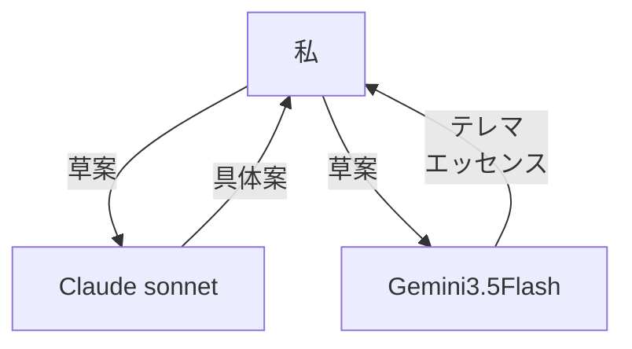
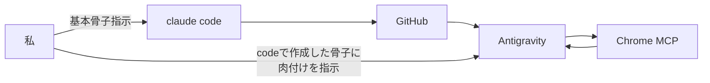

## Claude × Gemini × ChromeMCPによるマルチLLM開発戦略


## TL;DR

- GCP ACE試験のドメイン知識不足を解消するため、**Wikiの穴落ち体験を再現した学習アプリ**を作った
- コンセプト設計は **Claude Opus**、実装は **Claude系→設計、Gemini→アイディア出し実装**に役割分担
- Claude（高品質・高コスト）→ 設計に集中投入 / Gemini（高速・低コスト）→ 実装量産に投入
- 自分がやったのは「何を作るか」「どう振るか」「これじゃない」の3つだけ
- 着想から動作確認まで **72時間以内**
- 技術知識より**プロンプト設計力が律速になる**という確信を得た

---

## 動機

GCP ACE試験が7月初旬に迫っている。問題を解いていて気づいたのは、**スコアが伸びない原因が暗記不足ではなくドメイン知識の薄さ**だということだった。

VPCを理解しようとすると、CIDRが気になる。CIDRを調べるとルートテーブルが出てくる。ルートテーブルを追うとCloud NATに繋がる——この**連鎖する興味**に乗っていくのが一番頭に入る。

Wikipediaでリンクを踏み続ける「穴落ち体験」がそれに近い。でも軸がブレて気づいたら全然関係ない記事を読んでいる、あれは困る。

「**初期の学習目標（意志）を固定したまま、Wikipedia的なリンク連鎖探索ができるツール**」があれば解決する。ならば作る。

### 遊び心
勉強を楽しい体験にしたい
↓
アレイスター・クロウリーの法の書のテレマ思想を知識探求に取り込んだ。

---

## 作ったもの：Aiwass-Magick


**Aiwass-Magick**は、学習目標（「意志」）を軸として知識を芋づる式に探索できるローカルWebアプリ。

>アイワス (Aiwass) は、声によってアレイスター・クロウリーに『法の書』を伝えた知性体である。クロウリーは後にこの霊的存在を自分の聖守護天使とみなした。
>[Wikipedia記事](https://ja.wikipedia.org/wiki/%E3%82%A2%E3%82%A4%E3%83%AF%E3%82%B9)

:::note info
「Magick」は、舞台手品（Magic）と区別し、アレイスター・クロウリーが提唱したセレマ思想（Thelema）における「真の魔術」を指すスペルです。
:::

**ボタンを押すだけで動く**

1. 学習目標を入力（「GCP ACEのネットワーキングを理解する」）
2. AIが説明を生成
3. 説明の中のキーワードがチップとして表示 → 踏むと詳細が出る
4. 関連トピックカードが2〜4件サジェスト → 踏むと次の説明へ
5. 1に戻る、永遠に


履歴は積み上がって過去のノードにいつでも戻れる。「さっきのところから別ルート行きたい」という感覚でタイムトラベルできる。

技術スタックはFastAPI + React + Docker Composeで、`docker-compose up` 一発で動く。


---

## マルチLLM戦略の全体像

今回の開発で自分が意識したのは「**どのLLMに何を任せるか**」という役割設計だった。
### アイディアループ

### 実装ループ


LLMは「使うもの」ではなく「**役割を与えて動かすもの**」として扱った。

---

## 各LLMに何をやらせたか
### Claude Sonnet:着想の言語化
最初に会話でコンセプトを具体案にした。

- Json駆動
- DeepSeek採用
- 技術スタック選定
### Gemini3.5FLASH:テレマ思想との知識探求の融合
Sonnetで起こした具体案にテレマ思想との融合を行った。

- 各フェーズをnuit、Haditといった概念との紐づけ
- アプリ名のブレスト

### Claude Opus：設計の言語化
ClaudeCodeで一気に基本骨子の作成をした。

- アーキテクチャの骨格設計
- **APIレスポンスのJSONスキーマ定義**（これが全体の仕様になる）
- システムプロンプトのたたき台

特にJSONスキーマが重要だった。フロントとバック間のデータ規格をここで固めると、実装フェーズでの手戻りがほぼゼロになる。

```json
{
  "breadcrumb": ["GCP基礎", "ネットワーク", "VPC"],
  "explanation": "...",
  "term_suggestions": [
    { "term": "CIDR", "hint": "IPアドレス範囲の表記法" }
  ],
  "related_topics": [
    { "topic": "Cloud NAT", "reason": "外部通信の制御に必要" }
  ]
}
```

この規格を最初に決めたことで、「フロントはこれを受け取って描画するだけ」「バックはこれを返すだけ」という分業が完全に機能した。

### Gemini（Antigravity）：実装マシン

設計書とJSONスキーマを渡して「実装して」とだけ言った。

- FastAPI エンドポイント（`/api/dive`）
- Pydantic v2 によるバリデーション
- React コンポーネント群
- Tailwind スタイリング
- Docker Compose 定義
- Nginx リバースプロキシ設定

実装のほぼ全てをAGが書いた。自分はコードを読んで「方向が合ってるか」を判断するだけ。

面白かったのは、LLMが英語で返してくる問題への対処で**自己修正ループ**を組み込んでいた点。「日本語じゃなければもう一回生成させる」という会話ターンを最大2回挟む処理をAGが自律的に設計した。

```python
if _contains_japanese(explanation):
    return validated_response
# 英語だったら修正プロンプトを追加して再生成
messages.append({"role": "user", "content": "日本語で再生成してください"})
```

### ChromeMCP：デバッグの自動化

ここが一番の時短だった。

ブラウザ操作MCPをAGに持たせると：

```
UIのスクリーンショットを撮る
→ レイアウト崩れ・エラーを読む
→ コードを修正する
→ また撮る
→ 繰り返す
```

このループを**人間なしで回せる**。

通常のデバッグで地味に時間を食うのが「コード修正→ブラウザ確認→また修正」の往復。ChromeMCPはその往復から人間を外す。特にReactのUI確認（スタイル崩れ、状態管理の見た目）はブラウザで見ないと分からないことが多く、ここが全自動になる効果は大きかった。

---

## 自分がやったこと

正直に言うと：

- 「Wikipediaの穴落ち体験を再現したい」という**課題の言語化**
- 「Will Anchorで軸固定」という**コンセプトの方向づけ**
- 「JSONスキーマはこういう構造にする」という**規格の判断**
- 「この実装の方向は違う」という**修正の判断**
- 各LLMへの**役割の割り当て**

コードは一行も書いていない。でもこれは「楽をした」ではなく、**ディレクターとしての仕事に集中した**と理解している。

建築で言えば、設計士が現場で電動ドリルを握らないのと同じかもしれない。

---

## 気づいたこと

### プロンプト設計力が律速になる

「LLMに実装させる」というとき、ボトルネックはコーディング力ではなく**「何をどう伝えるか」の設計力**になる。

曖昧な指示を出すと曖昧な実装が返ってくる。JSONスキーマを先に固めたことが今回うまくいった最大の理由だと思っている。

### 役割の境界を意識する

今回の役割分担で感じたのは、設計と実装で求められる能力が違うということ。

- 設計フェーズ：「これが本当に欲しいものか」の概念的な検証が得意なLLM
- 実装フェーズ：大量のコードを高速に生成できるLLM
- デバッグフェーズ：ブラウザ操作などツールと組み合わせられるLLM

得意不得意を見極めて振り分けることが、マルチLLM開発の核心だと思う。

### 72時間の内訳(おおよそ)

| フェーズ | 時間 | 担当 |
|---|---|---|
| 課題の言語化・コンセプト設計 | 〜3時間 | 自分 + Claude Sonnet |
| アーキテクチャ・JSON規格の確定 | 〜2時間 | Claude Opus |
| バックエンド実装 | 〜8時間 | Gemini (AG) |
| フロントエンド実装 | 〜12時間 | Gemini (AG) |
| UIデバッグ・調整 | 〜6時間 | Gemini (AG) + ChromeMCP |
| Docker化・動作確認 | 〜3時間 | Gemini (AG) |

自分が実際に作業していた時間はその一部で、残りはLLMが動いている間に別のことをしていた。

---

## まとめ

マルチLLM開発で実感したのは、**LLMは道具の集合ではなくチームのメンバーとして設計できる**ということ。

得意なことをやらせて、判断は人間が持つ。これが現時点での正解に近い気がしている。

作ったツールはGitHubで公開している。GCP ACEの勉強中なのでそのまま使いながら育てていく予定。

→ [Aiwass-Magick](https://github.com/Tagomori0211/Aiwass-Magick)

次のフェーズはハルシネーション抑制をどう実装するか

## おわりに
GCP ACE試験の勉強をしていたはずが、気づいたらフルスタックアプリを作っていた。
これが寄り道かというと、たぶん違う。道具を自分で作れる人間は、その道具を使い続ける動機を持てる。既製品のツールはいつか飽きるか消える。自分で作ったものは育てられる。
今回学んだのは技術よりも「どうAIを使うか」という設計の話だった。LLMはシバき方を間違えると無限にゴミを吐くが、役割を明確にして正しく振ると本当に動いてくれる。
自分のスタイルとして今後も使っていくつもりの発見だった。

最後に、このツールが誰かのドメイン知識収集の体験を少し楽しくできれば、作った意味がある。

:::note warn
注意
LLMは時にハルシネーションを起こし時に不正確な情報を吐き出します。
知識として自力で確認することを忘れないでください。
:::
