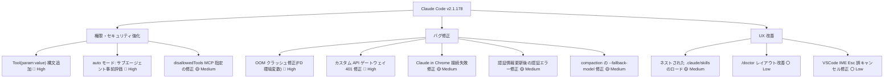
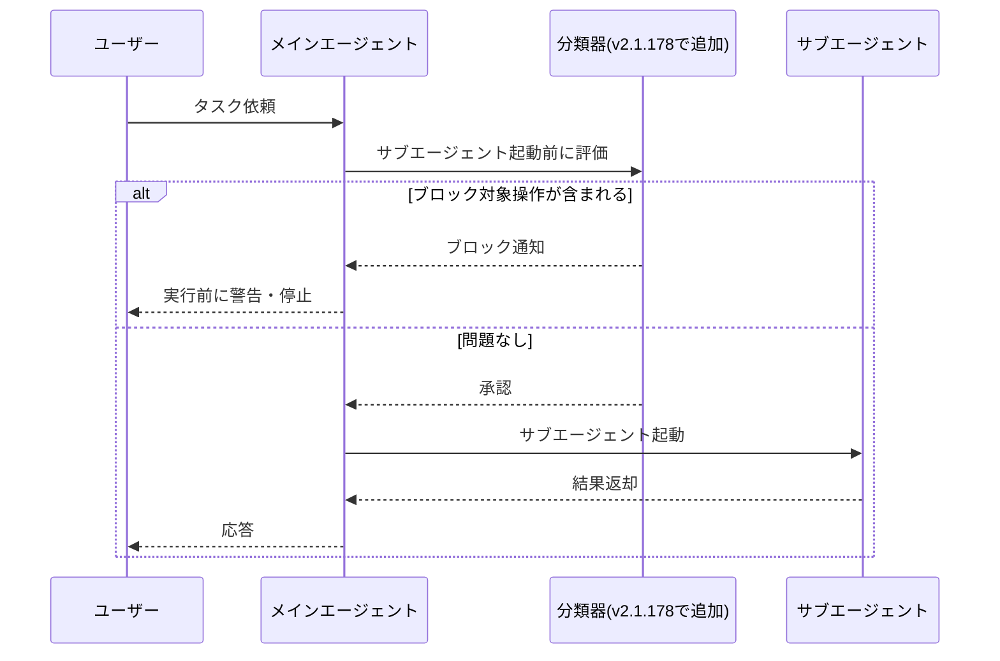

## はじめに

2026年6月16日、Anthropic は Claude Code v2.1.178 をリリースしました。今回のアップデートで最も注目すべき変更は、**権限ルールにツール引数レベルのマッチング構文 `Tool(param:value)` が追加された**点です。これまでツール名単位でしか権限を制御できなかったものが、引数の値レベルで細かく制御できるようになりました。

加えて、auto モードのサブエージェント事前評価によるセキュリティ強化、カスタム API ゲートウェイ使用時の認証エラー修正、OOM クラッシュの修正など、実運用に影響する重要な改善が多数含まれています。

> **📌 影響を受ける人**
> - Claude Code を CI/CD や自動化パイプラインで使っている開発者
> - `ANTHROPIC_BASE_URL` でカスタム API ゲートウェイを使っている開発者
> - サブエージェントの権限・コストを細かく制御したい開発者
> - Claude in Chrome を使っている開発者

---

## 変更の全体像

今回のリリースは「権限・セキュリティ強化」「バグ修正」「UX 改善」の3軸で構成されています。



---

## 変更内容

### 1. 権限ルールに `Tool(param:value)` 構文を追加（severity: high）

これまでの権限ルールはツール名単位（例: `Agent`）での制御のみでした。今回の更新で、**ツールの入力パラメータの値に基づいて権限を制御できる**ようになりました。

| 項目 | 変更前 | 変更後 |
|------|--------|--------|
| 制御粒度 | ツール名単位 | ツール名 + 引数値単位 |
| ワイルドカード | なし | `*` 対応 |
| 例 | `Agent` のみ制御 | `Agent(model:opus)` で Opus のみブロック可 |

構文は以下のとおりです:

```
Tool(param:value)     # 完全一致
Tool(param:prefix*)   # ワイルドカード前方一致
```

---

### 2. auto モード改善: サブエージェント起動を事前評価（severity: high）

サブエージェントが**起動される前に**分類器で評価されるようになり、ブロック対象の操作がレビューなしに実行されていた隙間を解消しました。



---

### 3. カスタム API ゲートウェイ使用時の 401 認証エラーを修正（impact: 🔴 直接影響）

> **⚠️ Breaking Change 相当**
> `ANTHROPIC_BASE_URL` + `ANTHROPIC_AUTH_TOKEN` でカスタム API ゲートウェイを使っている環境で、`claude agents` ワーカーが `401 Invalid bearer token` で失敗していました。v2.1.178 へのアップデートで自動的に解消されます。

---

### 4. ネストされた `.claude/skills` がファイルに応じてロード（severity: medium）

モノレポや複数プロジェクトを持つリポジトリで、**作業しているファイルのディレクトリに応じて `.claude/skills` が自動ロード**されるようになりました。

```
my-monorepo/
├── .claude/skills/
│   └── deploy.md          # グローバルスキル → /deploy
├── packages/
│   ├── frontend/
│   │   └── .claude/skills/
│   │       └── deploy.md  # フロントエンド用 → /frontend:deploy
│   └── backend/
│       └── .claude/skills/
│           └── deploy.md  # バックエンド用 → /backend:deploy
```

名前が衝突する場合は `<dir>:<name>` 形式で区別され、両方が利用可能な状態に保たれます。

---

### 主要バグ修正まとめ

| 修正内容 | 影響度 | 対象 |
|---------|--------|------|
| OOM クラッシュ（古い FD 環境変数） | 🔴 High | CLI |
| カスタム API ゲートウェイで 401 エラー | 🔴 直接影響 | claude agents |
| Claude in Chrome のアカウント不一致による無言の失敗 | 🔴 直接影響 | Claude in Chrome |
| 認証情報更新後も認証エラーが続く | 🟡 Medium | 全体 |
| compaction が `--fallback-model` を無視 | 🟡 Medium | compaction |
| サブエージェント `disallowedTools` の MCP 指定が無視される | 🟡 要チェック | MCP |
| ネストスキルが非対話実行でブロックされる | 🟡 要チェック | skills |
| VSCode CJK IME の Esc でタスクがキャンセルされる | 🟡 要チェック | VSCode |

---

## 影響と対応

### すぐに対応が必要な変更

#### `Tool(param:value)` 構文を活用した権限設定（任意・推奨）

Opus サブエージェントのコスト制御や、特定のパラメータを持つツール呼び出しのブロックに活用できます。`.claude/settings.json` に以下のように記述します:

```json
{
  "permissions": {
    "deny": [
      "Agent(model:claude-opus-4-8)"
    ],
    "allow": [
      "Agent(model:claude-sonnet-4-6)",
      "Agent(model:claude-haiku-4-5-20251001)"
    ]
  }
}
```

### アップデートするだけで解消される問題

バージョンアップで以下が自動的に解消されます:

- カスタム API ゲートウェイでの `claude agents` 401 エラー
- OOM クラッシュ（古い FD 環境変数継承）
- Claude in Chrome のアカウント不一致による無言の接続失敗
- 認証情報更新後の認証エラー継続

---

## コード例

### Before/After: 権限ルールの細粒度化

**Before（v2.1.177 以前）**

```json
// settings.json — ツール名でしか制御できなかった
{
  "permissions": {
    "deny": [
      "Agent"
    ]
  }
}
```

**After（v2.1.178 以降）**

```json
// settings.json — 引数の値レベルで制御可能になった
{
  "permissions": {
    "deny": [
      "Agent(model:claude-opus-4-8)"
    ],
    "allow": [
      "Agent(model:claude-sonnet-4-6)",
      "Agent(model:claude-haiku-4-5-20251001)"
    ]
  }
}
```

> **💡 Tips**
> `Agent(model:*)` と指定するとすべてのモデル指定サブエージェントをブロックできます。ワイルドカードはパラメータ値の前方一致にも使えるため、`Agent(model:claude-opus*)` のような指定も可能です。

---

### Before/After: `disallowedTools` の MCP サーバーレベル指定

**Before（v2.1.177 以前）**

```javascript
// MCP サーバー単位で制限しようとしても無言で無視されていた
const result = await agent("タスクを実行", {
  disallowedTools: [
    "mcp__dangerous_server",    // 無言で無視されていた
    "mcp__dangerous_server__*"  // 無言で無視されていた
  ]
})
```

**After（v2.1.178 以降）**

```javascript
// MCP サーバー単位の禁止が正しく適用される
const result = await agent("タスクを実行", {
  disallowedTools: [
    "mcp__dangerous_server",    // 正しく適用される
    "mcp__dangerous_server__*", // 正しく適用される
    "mcp__*"                    // MCP ツール全体をブロック
  ]
})
```

---

## まとめ

Claude Code v2.1.178 の主なポイントは3つです。

1. **`Tool(param:value)` 構文による細粒度の権限制御** — ツール名だけでなく引数の値レベルで権限を設定できるようになりました。コスト管理（Opus のみブロック等）やセキュリティ強化に活用できます。

2. **auto モードのセキュリティ強化** — サブエージェント起動前の分類器評価により、権限チェックの抜け穴を解消しました。

3. **実運用に影響する複数のバグ修正** — カスタム API ゲートウェイでの 401 エラー、OOM クラッシュ、Claude in Chrome の接続失敗、MCP `disallowedTools` の無視など、実際の使用環境で問題になっていたバグが多数修正されました。

アップデートは `claude update` または `npm update -g @anthropic-ai/claude-code` で行えます。特にカスタム API ゲートウェイを使っている環境では早めのアップデートを推奨します。
