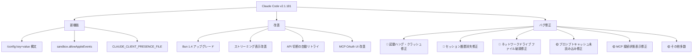
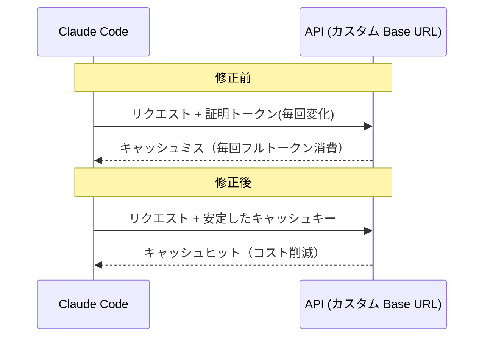

## はじめに

Claude Code v2.1.181 がリリースされました。本バージョンは単なるマイナーアップデートではなく、**日常的な開発作業に直結する重大バグを複数修正**した重要リリースです。

特に注目すべき点は次の3つです。

1. プロンプトから設定を直接変更できる `/config key=value` 構文の追加
2. ネットワークドライブや OneDrive 環境でファイルが壊れる問題の修正
3. 起動時フリーズ・セッション履歴消失などの安定性向上

> **📌 影響を受ける人**
> - Claude Code を日常的に使用している開発者全員
> - ネットワークドライブ・クラウド同期フォルダ（OneDrive・Dropbox 等）でファイルを編集している人
> - カスタム `ANTHROPIC_BASE_URL` や AWS Bedrock / Foundry を使っている人
> - MCP サーバーを導入・運用している人

---

## 変更の全体像

今回のリリースは「新機能」「改善」「バグ修正」の3カテゴリに分かれます。



---

## 変更内容

### 新機能

#### `/config key=value` 構文の追加（severity: high）

プロンプトから任意の設定値を直接変更できるようになりました。

```bash
# 例: thinking モードをオフにする
/config thinking=false

# 例: モデルを切り替える（既存の /model と同等）
/config model=claude-opus-4-8
```

インタラクティブモード・`-p` モード・リモートコントロールのいずれでも動作します。設定ファイルを手動で編集する手間が省け、会話の流れの中でその場で設定を調整できるのが大きな利点です。

#### `CLAUDE_CLIENT_PRESENCE_FILE` 環境変数の追加

マーカーファイルを指定することで、ユーザーがマシンの前にいる間はモバイルへのプッシュ通知を抑制できます。

```bash
# .bashrc / .zshrc に追記する例
export CLAUDE_CLIENT_PRESENCE_FILE="$HOME/.claude_presence"

# セッション開始時にマーカーを作成
touch ~/.claude_presence

# 離席時にマーカーを削除 → 通知が再開される
rm ~/.claude_presence
```

PC の前にいるのにスマートフォンへ通知が飛んでくる問題を自分でコントロールできます。

#### `sandbox.allowAppleEvents`（macOS）

macOS 環境でサンドボックス内のコマンドが Apple Events を送信できるようになるオプトイン設定です。`settings.json` で有効化します。

---

### 改善

| 項目 | 概要 |
|------|------|
| Bun 1.4 へのアップグレード | 同梱ランタイムを最新版に更新。パフォーマンス・安定性が向上 |
| ストリーミング表示の改善 | 長い段落でも最初の改行を待たず行単位で逐次表示されるように |
| API 切断の自動リトライ | 思考中に接続が切れた場合、エラー表示の代わりに自動でリトライ |
| MCP OAuth UI の改善 | 認証ページが Claude Code のデザインに統一され、成功時に自動でブラウザタブが閉じるように |
| サブエージェントパネル | アイドル状態のサブエージェントを30秒で自動非表示、リストを最大5行に制限 |

---

### バグ修正（重要度高）

#### 起動時のハング・クラッシュ・遅延（severity: high）

複数の起動問題が同時に修正されました。

- **120ms リグレッション**: v2.1.169 で混入した新規環境での起動リグレッション（毎起動で約120ms の余分な遅延）を修正
- **ブランク画面フリーズ**: 劣化ネットワーク環境でアカウント設定取得が遅い場合、起動が最大15秒間ブロックされていた問題を修正
- **起動クラッシュ**: `.claude.json` に破損した null エントリがある場合の `TypeError: Cannot read properties of null` クラッシュを修正
- **macOS TUI フリーズ**: Spotlight 再インデックス中にセッション開始時フリーズ（Ctrl+C 無反応）する問題を修正

#### セッション履歴の消失（severity: high）

長時間アイドルのセッションで、別プロセスが30日分のトランスクリプトクリーンアップを実行したタイミングに会話履歴が消えてしまう問題が修正されました。複数の Claude Code ウィンドウを並行して使っている方は特に恩恵を受けます。

#### ネットワークドライブでのファイル破損（severity: high）

> **⚠️ Breaking Change に準じる重大バグ**
> OneDrive・Dropbox・NAS などのクラウド同期フォルダやネットワークドライブ上で Write/Edit を実行すると、**0バイトまたは切り詰められたファイル**が生成されることがありました。このバージョンで修正されています。

対象環境を使っていて過去にファイルが壊れた経験がある場合は、影響を受けたファイルを git や既存バックアップから確認することをお勧めします。

---

### バグ修正（中程度）

#### プロンプトキャッシュ未読み込みの修正（severity: medium）

カスタム `ANTHROPIC_BASE_URL` や Foundry 環境で、リクエストごとに変わる証明トークンが原因でプロンプトキャッシュが機能していなかった問題が修正されました。



AWS Bedrock の `awsCredentialExport` で残存有効期間が短い認証情報が毎分リフレッシュを引き起こす問題も合わせて修正されました。

#### MCP 接続状態表示の修正（severity: medium）

`claude mcp get` / `claude mcp list` で tools/list の取得に失敗しても `✓ Connected` と表示していた誤表示が修正されました。

**修正前:**
```
✓ Connected
```

**修正後:**
```
! Connected · tools fetch failed: <エラー詳細>
```

MCP サーバーの問題を見逃していた方には重要な改善です。

---

### 破壊的変更

> **⚠️ Breaking Change**
> フルスクリーンモードでの URL オープンが **Cmd+クリック（macOS）/ Ctrl+クリック（Windows・Linux）必須**に変更されました。従来のシングルクリックでは URL が開かなくなります。

ネイティブターミナルと同じ挙動への統一が目的です。慣れが必要ですが、意図しない URL 遷移を防ぐ効果もあります。

---

## 影響と対応

### すぐに対応が必要なこと

| 状況 | 対応 |
|------|------|
| ネットワークドライブ・クラウド同期フォルダを使用している | **v2.1.181 以降へ更新を強く推奨**。過去に生成されたファイルの内容を確認する |
| フルスクリーンモードで URL クリックを多用している | **Cmd/Ctrl+クリック**に操作を切り替える |
| カスタム `ANTHROPIC_BASE_URL` や Foundry を使用している | 更新後にキャッシュヒット率を確認し、コスト削減効果を確認する |
| MCP サーバーを運用している | 接続状態の表示が変わることを把握し、エラー詳細の監視フローを更新する |

### アップデート方法

```bash
# npm でインストールしている場合
npm update -g @anthropic-ai/claude-code

# バージョン確認
claude --version
```

---

## コード例

### `/config key=value` の活用例

```bash
# 思考モードをセッション中だけオフにする
/config thinking=false

# verbose モードをオンにしてデバッグ情報を確認する
/config verbose=true

# 設定を元に戻す
/config verbose=false
```

### `CLAUDE_CLIENT_PRESENCE_FILE` のシェルスクリプト活用例

```bash
#!/bin/bash
# claude_session.sh - プレゼンスファイルを自動管理してセッションを開始

PRESENCE_FILE="$HOME/.claude_presence"

# セッション開始時にマーカーを作成
touch "$PRESENCE_FILE"

# Claude Code を起動
claude "$@"

# 終了時にマーカーを削除（通知が再開される）
rm -f "$PRESENCE_FILE"
```

---

## まとめ

Claude Code v2.1.181 の主なポイントをまとめます。

- **新機能**: `/config key=value` でプロンプトから設定を動的変更できるようになった
- **重大バグ修正**: ネットワークドライブでのファイル破損・起動ハング・セッション履歴消失の3大問題が解決
- **安定性向上**: プロンプトキャッシュ、API 自動リトライ、MCP 状態表示など、日常的に使う機能の信頼性が全体的に改善
- **破壊的変更**: フルスクリーンモードの URL オープンが Cmd/Ctrl+クリック必須に変更

特にネットワークドライブ・クラウド同期環境を使っている方は早急なアップデートを推奨します。それ以外のユーザーも、起動安定性やセッション履歴の信頼性向上の恩恵を受けられる重要なアップデートです。

> **💡 Tips**
> `claude --version` でバージョンを確認し、v2.1.181 未満の場合は `npm update -g @anthropic-ai/claude-code` でアップデートしましょう。
