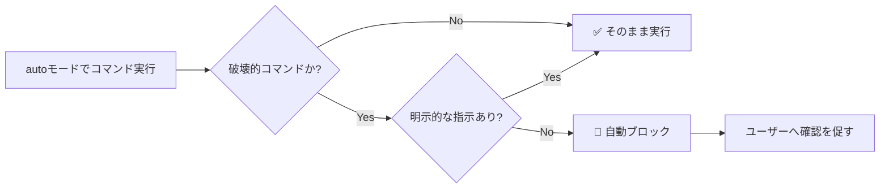

## はじめに

Claude Code v2.1.183 がリリースされました。本リリースの最大のトピックは **auto モードにおける破壊的コマンドの自動ブロック機能**の追加です。これにより、明示的な指示なしに `git reset --hard` や `terraform destroy` といったコマンドが自動実行されるリスクが大幅に低減されます。

また、認証付き MCP サーバーで auth-stub ツールがモデルに露出してしまうセキュリティ修正、非推奨モデルへの警告表示など、エージェント運用の安定性と安全性に直結する変更が複数含まれています。

> **📌 影響を受ける人**
> - Claude Code を auto モード（無人・CI 環境）で運用しているチーム
> - headless/SDK モードで認証付き MCP サーバーを利用している開発者
> - 非推奨モデルを明示的に指定してエージェントを動かしているユーザー

---

## 変更の全体像

```mermaid
graph TD
    A[Claude Code v2.1.183] --> B[🔒 安全性強化]
    A --> C[🐛 バグ修正]
    A --> D[✨ 新機能・改善]

    B --> B1[autoモード: 破壊的コマンドの自動ブロック]
    B --> B2[MCP: auth-stub ツール露出の修正]

    C --> C1[thinkingブロックのみ返した際の無出力ターン修正]
    C --> C2[サブエージェントでの WebSearch 空結果修正]
    C --> C3[thinking.disabled 400エラー修正]
    C --> C4[チームメイト・スケジュールタスク関連修正]

    D --> D1[非推奨モデルの警告表示]
    D --> D2[attribution.sessionUrl 設定の追加]
    D --> D3[/config --help の追加]
```

---

## 変更内容

### 1. auto モードの安全性強化：破壊的コマンドの自動ブロック（severity: high）

auto モードで以下のコマンドが**明示的な指示なしに実行されようとした場合、自動的にブロック**されるようになりました。

#### ブロック対象コマンド一覧

| カテゴリ | コマンド | ブロック条件 |
|---|---|---|
| Git | `git reset --hard` | ローカル作業の破棄を依頼していない場合 |
| Git | `git checkout -- .` | ローカル作業の破棄を依頼していない場合 |
| Git | `git clean -fd` | ローカル作業の破棄を依頼していない場合 |
| Git | `git stash drop` | ローカル作業の破棄を依頼していない場合 |
| Git | `git commit --amend` | セッション中にエージェント自身が作成したコミットでない場合 |
| IaC | `terraform destroy` | 特定スタックを明示して依頼した場合を除く |
| IaC | `pulumi destroy` | 特定スタックを明示して依頼した場合を除く |
| IaC | `cdk destroy` | 特定スタックを明示して依頼した場合を除く |

> **⚠️ Breaking Change**
> CI/CD パイプラインで Claude Code を auto モードで使用している場合、意図的に上記コマンドを実行させているワークフローは動作が変わる可能性があります。必要であれば、コマンド実行の意図を明示するプロンプト設計の見直しをご検討ください。



### 2. 認証付き MCP サーバーの auth-stub ツール露出を修正（severity: high）

headless/SDK モードで、認証が必要な MCP サーバーが **auth-stub ツールをモデルに露出してしまうバグ**が修正されました。

このバグにより、認証を完了していない MCP サーバーのスタブツールがモデルから見えてしまい、意図しないツール呼び出しが発生するリスクがありました。headless モードや SDK 経由で認証付き MCP サーバーを利用している場合は、v2.1.183 へのアップデートを推奨します。

> **⚠️ Breaking Change**
> セキュリティに関わる修正です。headless/SDK モードで認証付き MCP サーバーを使用している場合は早急な更新を推奨します。

### 3. 非推奨・自動更新モデルへの警告表示（severity: medium）

指定したモデルが非推奨、または新しいモデルへ自動更新された場合に、**print モード（`-p`）の stderr へ警告が表示**されるようになりました。エージェントの frontmatter で指定されたモデルも警告対象に含まれます。

```bash
# 例: 非推奨モデル指定時の警告
$ claude -p "タスクを実行してください" --model claude-old-model-id

# stderr に以下のような警告が表示される
Warning: The model 'claude-old-model-id' is deprecated and has been automatically
updated to 'claude-new-model-id'. Please update your configuration.
```

> **💡 Tips**
> エージェントの `.md` ファイルや設定ファイルで古いモデル ID を指定している場合は、この機会に最新モデル ID へ更新しておきましょう。

### 4. attribution.sessionUrl 設定の追加（severity: medium）

Web および Remote Control セッションで生成されるコミットや PR に含まれる **claude.ai セッションリンクを省略できる** `attribution.sessionUrl` 設定が追加されました。

```json
// .claude/settings.json
{
  "attribution": {
    "sessionUrl": false
  }
}
```

企業利用などでセッション URL を外部リポジトリに含めたくない場合に有用です。

### 5. その他のバグ修正

| ID | 内容 | 重要度 |
|---|---|---|
| thinking ブロックのみ返した際の無出力ターン | モデルが thinking ブロックだけを返した場合にターンが静かに完了してしまう問題を修正。現在は Claude が一度再プロンプトする | medium |
| サブエージェントでの WebSearch 空結果 | サブエージェント内で WebSearch が空の結果を返す問題を修正 | medium |
| thinking.disabled 400 エラー | サブエージェント生成・セッションタイトル生成での 400 エラーを修正 | medium |
| チームメイト終了時のバックグラウンドタスク強制終了 | チームメイトのターン終了時にバックグラウンドタスクが kill される問題を修正 | medium |
| スケジュールタスク・Webhook 配信の誤認 | スケジュールタスクや Webhook がキーボード入力として扱われていた問題を修正 | medium |

---

## 影響と対応

### auto モードを使っているチームへ

CI/CD や定期実行スクリプトで Claude Code を auto モードで利用している場合は、以下を確認してください。

1. **破壊的コマンドを意図的に実行しているワークフローがないか確認する**
   - `git reset --hard`、`git clean -fd`、IaC の destroy コマンドなどが含まれる場合は、プロンプトに明示的な意図を含めるよう修正する
2. **スケジュールタスク・Webhook トリガーの動作確認**
   - これらがタスク通知として分類されるようになったため、auto モードで保留中のアクション承認やセッションタイトル設定に使っていた場合は挙動が変わる

### headless/SDK モードで MCP を使っているチームへ

認証付き MCP サーバーを headless モードで使用している場合は、v2.1.183 へのアップデートにより auth-stub ツール露出の問題が解消されます。依存するワークフローのテストをアップデート後に実施してください。

### モデルバージョンを固定指定しているチームへ

非推奨モデルを指定している場合、stderr に警告が出るようになります。パイプライン上でエラーとして扱っている場合は注意が必要です。また、エージェントの frontmatter でモデルを指定している `.md` ファイルも警告対象です。

---

## コード例

### Before/After: 破壊的コマンドのプロンプト例

**Before（ブロックされる可能性がある）**

```
古いブランチの変更を整理してください
```

Claude が文脈から `git reset --hard` や `git clean -fd` を選択する可能性があり、auto モードでブロックされる。

**After（明示的に意図を示す）**

```
古いブランチの変更を整理してください。
作業中の未コミットの変更はすべて破棄して構いません。
git clean -fd と git reset --hard を使用してください。
```

明示的な指示があるためブロックされずに実行される。

### attribution.sessionUrl の設定例

**コミットメッセージから claude.ai URL を除去したい場合**

```json
// .claude/settings.json
{
  "attribution": {
    "sessionUrl": false
  }
}
```

設定後、生成されるコミットメッセージや PR 本文に claude.ai のセッションリンクが含まれなくなります。

---

## まとめ

Claude Code v2.1.183 は、**安全性とエージェント運用の安定性向上**に焦点を当てたメンテナンスリリースです。

- **auto モードの安全性強化**により、破壊的な git・IaC コマンドが明示的な指示なしに自動実行されるリスクが排除された
- **認証付き MCP サーバーの auth-stub 露出バグ**が修正され、headless/SDK 環境のセキュリティが向上した
- **非推奨モデルへの警告**追加により、モデルバージョン管理がしやすくなった
- サブエージェント・チームメイト・スケジュールタスクに関する複数のバグが修正され、エージェント運用全体の安定性が向上した

特に auto モードや headless モードで Claude Code を本番運用しているチームは、早急なアップデートと動作確認を推奨します。
