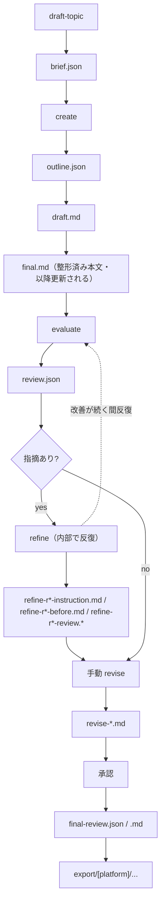
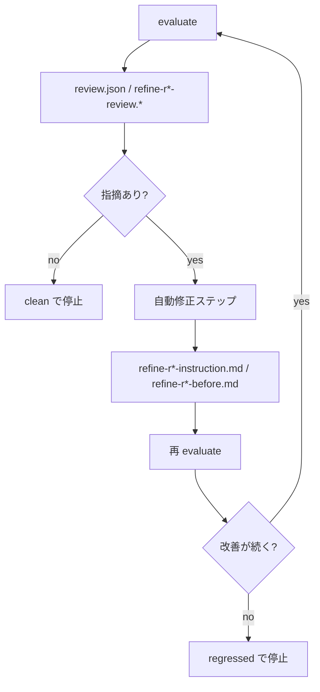
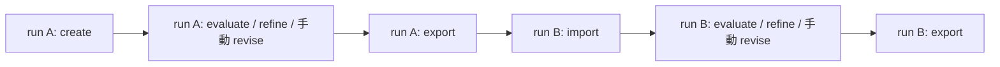

llm-task-router の面白さは、完成した記事だけでなく、その記事ができるまでの生成・評価・修正の過程が `runs/[runId]/` に一次資料として残ることです。本文を手書きしない代わりに、どの段階で何が起きたかをファイルで追える。これが、やり直し・差分確認・説明可能性の土台になります。

この記事で主役にするのは、次の 2 つの run です。

- run A: `2026-06-18-llm-task-router-with-claude-code`
- run B: `2026-06-19-llm-task-router-with-claude-code-v028`

`v028` は run ID 上の表記で、機能バージョンとしては `v0.2.8` を指します。以後、run 名は `v028`、機能バージョンは `v0.2.8` と書き分けます。また、この 2 run はどちらも **llm-task-router 自体を題材にした記事を生成・改稿した作業記録**であり、本記事はその作業記録をさらにメタに振り返るものです。

位置づけはこうです。

- **run A**: brief から新規生成し、`refine` と多数の手動 `revise` で仕上げた記録
- **run B**: run A の export 済み記事を import 起点で取り込み直し、v0.2.8 の import 機能ぶんを追記した改稿の記録

:::note info
本記事が題材にしている 2 つの run が実際に生成・改稿した完成記事は、Qiita で公開されています。`runs/` の工程が最終的にどんな記事になったかは、こちらで実物を確認できます。
[Claude Code を編集長に、llm-task-router を本文エンジンにして Qiita 記事を作る](https://qiita.com/rex0220/items/8ab1a9082ea9c09da0a4)
:::

ここでやりたいのは、コマンドの使い方の再説明ではありません。実際に残ったファイル名と中身をたどって、「この run では何が起きたのか」という**工程の地図**を描くことです。`meta.json` を入口に成果物を順に読んでいくと、「なぜこの記事になったか」「どこで戻せるか」「次に何を直すべきか」を実ファイルから追跡できます。

:::note warn
run ID の日付は、執筆環境の記録名をそのまま使っています。読者の環境で同名 run が存在することを意味するものではありません。
:::

## 導入: なぜ `runs/` の作業ログを読むのか

完成品の `final.md` だけ見れば、記事の出来上がりは把握できます。ですが、それだけでは「なぜこの構成になったのか」「途中でどんな評価を受けたのか」「どこで自動修正が止まり、人手が入ったのか」は見えません。

llm-task-router はその空白を `runs/[runId]/` の成果物で埋めます。

- 生成した企画は `brief.json`
- 構成は `outline.json`
- 下書きは `draft.md`
- 整形後の本文は `final.md`
- 評価は `review.json` や `final-review.*`
- 修正指示や修正前スナップショットは `refine-r*-instruction.md` や `*-before.md`
- 手動の編集判断は `revise-*.md`
- 全体の台帳は `meta.json`

この「完成品に至るまでの一次資料」があるので、あとからでも工程を再読できます。記事を書くというより、記事生成パイプラインの履歴を読む感覚に近いです。

今回の 2 run を並べると、それがよく見えます。

- **run A** は、まっさらな brief から始まって、`refine` と 13 本の手動 `revise` で磨いていった run
- **run B** は、run A の export 済み記事を再取り込みして、import 機能の説明だけを足した改稿 run

つまり run A は「新規生成の履歴」、run B は「公開後に戻って改稿する履歴」です。両方を見ると、単発生成ではなく、**記事を往復可能な作業単位として管理している**ことがわかります。

## 全体マップ: 工程と成果物の対応を先に掴む

先に全体像を掴んでおくと、個別ファイルを読むときに迷いません。ざっくり言うと、流れは次の通りです。

1. `draft-topic` で brief を起案
2. `write-article` が create → evaluate → refine → 手動 revise を駆動
3. 編集長 GO とユーザー承認後に export
4. 必要なら import で戻して再改稿

対応する成果物を工程に重ねると、次のように読めます。



全体図では `refine` を 1 ノードに畳んでおり、内部の反復は後続の refine 図で示します。

要するに、`brief.json` から `final.md` までは生成の流れ、`review.json` 以降は評価と修正の流れです。なお `final.md` は `draft.md` を profile 向けに整形した初期完成形で、以降の evaluate / refine / revise はこの `final.md` を更新していきます。

成果物は、次の 4 分類で見ると整理しやすいです。

| 分類 | 主なファイル | 役割 |
| --- | --- | --- |
| 生成系 | `brief.json` / `outline.json` / `draft.md` / `final.md` | 企画から本文完成までの中間成果物 |
| 評価系 | `review.json` / `refine-r*-review.*` / `final-review.*` | 採点・指摘・要約 |
| 修正系 | `refine-r*-instruction.md` / `refine-r*-before.md` / `revise-*.md` / `final.bak.md` | 自動修正・手動修正・戻し用スナップショット |
| 台帳 | `meta.json` | run 全体の状態・進行・コスト・停止理由 |

最低限の用語だけ復習すると、次の通りです。

- **run**: 1 回分の作業単位
- **brief**: `topics/[slug].txt` などを入力に `draft-topic` が起案する企画書
- **refine**: evaluate → 自動修正ステップ → 再 evaluate の自動ループ
- **platform**: `qiita` などの公開先プラットフォーム
- **profile**: `qiita` など、出力先向けの作法を反映する設定
- **imported**: その run が import 起点で作られた run かを示すフラグ

:::note info
本記事では、`refine` 内で回るものは **自動修正ステップ**、`revise-*.md` は **手動 revise** と呼び分けます。同じ「revise」という語で両方を読むと混線しやすいためです。
:::

:::note warn
ファイル名・スキル名・サブエージェント名・CLI 仕様は、`llm-task-router init` の生成物やバージョン差分で揺れることがあります。この記事では**実在 run の成果物を読む方法**に主眼を置き、CLI 記法は断定しません。
:::

## 本論A: 生成系ファイルの見方

最初に開くべきファイルは `meta.json` です。ここが run の台帳で、`topic`、`platform`、`profile`、`steps` の状態から、その run が今どこにいるかを把握できます。

たとえば見るポイントはこうです。

- 何のテーマか: `topic`
- どこ向けか: `platform` / `profile`
- `brief` / `outline` / `draft` / `review` / `final` などの生成段階がどこまで進んだか: `steps.*.status`
- import 起点なのか: `imported`
- 自動 refine が何ラウンド回ったか: `refine.rounds`

そのうえで、生成系は次の順に読むと流れが見えます。

1. `brief.json`
2. `outline.json`
3. `draft.md`
4. `final.md`

run A では、これがそのまま「企画 → 構成 → 下書き → 完成形」の連鎖になっていました。

- **`brief.json`**  
  企画の構造化結果です。記事の狙い、対象読者、伝えたいポイントが整理されています。
- **`outline.json`**  
  構成を JSON で持っています。見出しや節の骨格はここにあります。
- **`draft.md`**  
  本文の初稿です。まだ profile 向けの整形が甘いことがあります。
- **`final.md`**  
  `qiita` profile の作法に合わせて整形済みの本文です。完成品を見るならまずここです。

`outline.json` が JSON である点は、実ファイルを見ると意識しやすいポイントです。Markdown の文章よりも壊れにくそうに見えても、**スキーマ違反やパース失敗で後段スキルの入力前提が崩れやすい**。構成でおかしなところがあれば、`final.md` だけ直感で読むより、`outline.json` に戻る方が原因を特定しやすいです。

探索順としては、まず `final.md` で完成物を把握し、違和感があれば `outline.json` と `brief.json` に戻る、が実用的です。

主要ファイルツリーをざっくり抜粋すると、イメージはこんな形です。

```text
runs/
├── 2026-06-18-llm-task-router-with-claude-code/
│   ├── meta.json
│   ├── brief.json
│   ├── outline.json
│   ├── draft.md
│   ├── final.md
│   ├── review.json
│   ├── final-review.json
│   ├── final-review.md
│   ├── refine-summary.md
│   ├── refine-r1-instruction.md
│   ├── refine-r1-before.md
│   ├── refine-r1-review.json
│   ├── refine-r1-review.md
│   ├── refine-r2-instruction.md
│   ├── refine-r2-before.md
│   ├── refine-r2-review.json
│   ├── refine-r2-review.md
│   ├── revise-01-reframe.md
│   ├── revise-02-verify.md
│   ├── revise-03-clarity.md
│   ├── ...（revise-04〜12 が連番で続く）
│   ├── revise-13-external-review.md
│   └── final.bak.md
└── 2026-06-19-llm-task-router-with-claude-code-v028/
    ├── meta.json
    ├── final.md
    ├── final.bak.md
    ├── revise-instruction.md
    ├── import-feature.md
    ├── import-feature-fixups.md
    ├── final-review.json
    └── final-review.md
```

run A の手動 revise は、実際には次の 13 本が連続して存在します。

- `revise-01-reframe.md`
- `revise-02-verify.md`
- `revise-03-clarity.md`
- `revise-04-slash-command-clarity.md`
- `revise-05-reorder-quickstart-first.md`
- `revise-06-gemini-feedback.md`
- `revise-07-chatgpt-feedback.md`
- `revise-08-chatgpt-r2.md`
- `revise-09-lead-in.md`
- `revise-10-dedupe-intro.md`
- `revise-11-heading-and-inittree.md`
- `revise-12-install.md`
- `revise-13-external-review.md`

今回の run B では `brief.json` / `outline.json` / `draft.md` が見当たりません。これは `imported: true` な run であることと整合します。少なくともこの run B では、取り込み元の別スナップショットはなく、**import 起点本文を `final.md` が兼ねている**と読めます。

:::note info
4 分類は便利ですが、すべての run が全ファイルを持つわけではありません。特に import 起点 run では、生成系の前半が存在しない場合があります。
:::

## 本論B: 評価系ファイルの見方

評価系ファイルは、「この記事はどこが良くて、どこが問題なのか」を機械にも人間にも読める形で残します。

主な役割分担は次の通りです。

- **`review.json`**: evaluate または refine ループ中の評価結果
- **`final-review.json`**: 手動 revise を含む最終本文に対する最終評価
- **`final-review.md`**: 最終評価の人間向け要約

つまり `review.json` は**途中経過を見るための評価**、`final-review.*` は**締めの評価**として読むとわかりやすいです。

評価では、指摘がたとえば次のような severity で整理されます。

- `critical`
- `major`
- `minor`
- `suggestion`

ここで大事なのは、**本文の良し悪しを 1 つの数値だけで見ない**ことです。スコア、件数、承認可否はそれぞれ別軸です。

まず、run A の `meta.json` から確認できる**実値**を見ます。以下は説明に必要な部分だけを抜き出した断片です。

```json
{
  "runId": "2026-06-18-llm-task-router-with-claude-code",
  "steps": {
    "brief":   { "status": "done", "file": "brief.json" },
    "outline": { "status": "done", "file": "outline.json" },
    "draft":   { "status": "done", "file": "draft.md" },
    "review":  { "status": "done", "file": "review.json" },
    "final":   { "status": "done", "file": "final.md" }
  },
  "refine": {
    "rounds": [
      { "round": 1, "evaluation": { "score": 23, "approved": true } },
      { "round": 2, "evaluation": { "score": 17, "approved": true } },
      { "round": 3, "evaluation": { "score": 25, "approved": true } }
    ],
    "stoppedReason": "regressed",
    "finalApproved": true,
    "costUsdTotal": 0.608355
  }
}
```

実ファイルには他フィールドもありますが、ここでは説明に必要な部分だけを抜き出しています。

この断片から確実に言えるのは、run A では自動 refine が 3 ラウンド回り、`score` が `23 → 17 → 25` と記録され、各ラウンドの `approved` はすべて `true`、`finalApproved` も `true`、停止理由は `regressed` だったことまでです。`approved` は承認可否、`stoppedReason` はループ停止理由なので別軸であり、この実値からも、通過判定が出ていても refine 自体は別条件で止まりうることが読み取れます。`0.608355` という値は JSON 上 `refine` オブジェクト直下の `costUsdTotal` であり、run 全体ではなく refine ステップ内の概算合計です。

:::note warn
`score` が高い方が良いか低い方が良いかは `meta.json` の値だけからは確定できません。よって以降の `regressed` 解釈は方向性に依存する暫定的な読みです。あり得る説明としては、`approved` と `stoppedReason` は別軸で、`approved` が通っていても改善の持続やベスト更新の有無など別条件で refine が止まる可能性があります。
:::

自動ループの役割を図にするとこうです。



要するに、refine は `evaluate → 指摘判定 → 自動修正ステップ → 再 evaluate → 改善判定` の **1 本の反復ループ（停止条件で分岐）** です。ここでの自動修正ステップは、本論C の `revise-*.md` による手動 revise とは別概念です。

この節で確実に言えることをまとめると、run A には評価結果と停止理由が構造化されて残っており、`approved` と `stoppedReason` は別軸で記録されている、という点です。評価系は「通ったか」だけでなく、「何を根拠に止まったか」を追う入口になります。

### 評価フィールドは 3 軸で読む

`review.json` や `final-review.json` は、単に「点数がいくつだったか」だけを見るファイルではありません。評価フィールドを分解して読むと、何を問題視されたのかがわかります。

:::note warn
以下は**読み方を示すためのダミー**で、実 run の値とは無関係です。直前の実値 JSON と対応づけて読まないでください。
:::

```json
{
  "score": 12,
  "approved": false,
  "issueCount": 3,
  "issues": [
    {
      "severity": "major",
      "title": "導入で前提の説明が不足している"
    },
    {
      "severity": "minor",
      "title": "見出し間のつながりが弱い"
    },
    {
      "severity": "suggestion",
      "title": "実例を先に置くと読みやすい"
    }
  ]
}
```

見るべき軸は 3 つあります。

- **`severity`**: 問題の重さ
- **`issueCount`**: 指摘の総数
- **`approved`**: この状態で通せるか

そして、これとは別に**総合スコア**があります。

たとえば、

- スコアは良さそうでも `major` が残っていて `approved: false`
- issue 数は少ないが 1 件が重い
- issue 数は多いが全部 `suggestion`

のように、数値だけでは判断しづらいケースが普通にあります。だから「点数だけ」を追わず、`issues` の中身まで読むのが実用的です。

### 生成時評価と最終評価の違い

`review.json` と `final-review.json` は似ていますが、読む目的が違います。

- **`review.json`**  
  create 後や refine 中に出る、途中評価
- **`final-review.json`**  
  手動 revise を含めた最終本文に対する締めの評価
- **`final-review.md`**  
  その締め評価を人間向けに要約したもの

この区別があるので、たとえば「自動 refine ではここまでしか良くならなかったが、手動 revise 後にはどうなったか」を追えます。run A では、自動 refine が止まったあとを 13 本の手動 `revise` が引き受けています。

:::note info
本文生成と審査を別系統モデルに置くと自己採点バイアスを避けやすい、という考え方はあります。ただし、これは成果物から直接読める事実ではなく、設計や運用に関する外側の前提です。今回の run の一次資料だけから、その構成を断定はしません。
:::

## 本論C: 修正系ファイルの見方

修正系ファイルは、「何を直そうとしたか」と「直す前はどうだったか」を残します。ここがあるので、単なる上書きではなく、編集履歴として読めます。

まず自動 refine 側です。run A では、たとえば次の対応関係で読めます。

- `refine-r1-instruction.md`
- `refine-r1-before.md`
- `refine-r1-review.json`
- `refine-r1-review.md`

このセットを見ると、

1. **どんな指示で**
2. **どの本文に対して**
3. **どんな再評価結果になったか**

をラウンド番号で追えます。`r1`, `r2`, `r3` のように連番になっているので、どの修正がどの評価に結びつくか迷いません。

さらに `refine-summary.md` があると、各ラウンドの修正と評価の流れを一覧できます。いきなり個別ファイルに潜る前の見取り図として便利です。

手動 revise 側では、run A がとてもわかりやすい例でした。`revise-01-reframe.md` から `revise-13-external-review.md` まで、1 つの修正意図を 1 ファイルで積んでいます。

命名を見ると、実ファイル名とほぼ 1 対 1 で修正意図が読めます。たとえば次のように対応します。

- `revise-01-reframe` → `reframe`
- `revise-02-verify` → `verify`
- `revise-03-clarity` → `clarity`
- `revise-05-reorder-quickstart-first` → `reorder-quickstart-first`
- `revise-06-gemini-feedback` → `gemini-feedback`
- `revise-07-chatgpt-feedback` → `chatgpt-feedback`
- `revise-13-external-review` → `external-review`

この運用の良いところは、「あとで見返したときに、何のための修正だったかがファイル名だけでわかる」ことです。本文 diff だけでは読み取りづらい意図が、命名に残ります。

修正指示ファイルの雰囲気は、たとえばこうです。

```markdown
# refine-r1-instruction.md

- 導入で runs/ を読む価値を先に明示する
- 生成系・評価系・修正系・台帳の4分類を早めに提示する
- コマンド説明に寄りすぎず、実ファイルの読み方を中心に再構成する
```

```markdown
# revise-01-reframe.md

記事全体の主題を「使い方説明」から「工程の地図を読む」に切り替える。
導入で run A / run B の位置づけを先に示す。
```

上の 2 つは**実ファイルの読み方を説明するための要約例**です。実際の run を読むときは、要約ではなく元ファイルをそのまま開くのがいちばん確実です。

### `*-before.md` と `final.bak.md` は「戻しどころ」を示す

修正系で見逃しにくいのが、修正前スナップショットです。

- `refine-r*-before.md`
- `final.bak.md`

これらがあると、どの時点の本文に対して修正が入ったのかを比較できます。

ただし、**`final.bak.md` が必ずどのコマンドで生成されるかは、バージョンや運用で確認が必要です**。少なくとも run A には `final.bak.md` が存在しており、戻し用スナップショットとして読めます。ここで言えるのは「この run ではバックアップが残っていた」という事実までです。

run A で手動 revise が 13 本積まれている事実は、自動 refine が終わっても最終品質は人間の編集判断で詰める、という実例そのものです。自動で全部終わらせるのではなく、**自動で止まる地点を見極めて、そこから編集者が引き継ぐ**構造になっています。

### 外部レビューを `revise` 化する運用

`gemini-feedback` や `chatgpt-feedback` のような revise 名があると、「外部 LLM の指摘をどう取り込んだのか」が気になります。

運用としてはシンプルで、外部レビュー内容をそのまま自由文で 1 ファイルに落とし、それを**1 回の修正意図**として保存しておく、という形です。

たとえば次のようなイメージです。

```markdown
# revise-07-chatgpt-feedback.md

- まとめが抽象的なので、runs/ を読む順番をチェックリスト化する
- review.json と final-review.json の違いを本文で明示する
- import 起点 run では brief/outline/draft が無い場合があることを補足する
```

`revise-07-chatgpt-feedback.md` は実在する実ファイル名ですが、**07 という番号はその run の積み順**を表すものです。別の run で同じ種類の指示が入っても、番号は変わり得ます。

これなら、

- 外部レビューの入力内容が残る
- どのレビューを採用したかが追える
- 後から「この修正は誰の指摘に由来するか」を辿れる

という利点があります。再現性というより、**編集判断の出典を残す**ための運用として効きます。

## 本論D: 改稿の往復ループを run B で読む

run B は、新規生成ではなく改稿 run です。この判別には `meta.json` の `imported: true` が効きます。

つまり run B は、「brief から作った run」ではなく、「一度 export された記事を取り込み直した run」です。

CLI の具体的な記法はここでは断定せず、確認方針だけを 1 箇所に集約しておきます。コロン記法を含むサブコマンド名や呼び出し方は、環境やバージョン差分の影響を受けやすいため、まずはその環境のヘルプを一次情報として見るのが安全です。

:::note warn
以下は「こういう確認をする」という一般例であり、そのまま動くとは限りません。お使いの CLI のヘルプや各サブコマンドの `--help` で、実体と正確な記法を確認してください。
:::

```sh
llm-task-router --help
llm-task-router --version
```

この import によって、export 済み記事の本文を起点に run が再構成されます。今回の run B では、その起点本文に対応するファイルは `final.md` です。取り込み元の別スナップショットが別ファイルで残っているわけではありません。そこから先は、必要に応じて評価と修正を重ねていけます。

run B では、流れとして次のように読めました。

1. `meta.json` で `imported: true` を確認
2. `final.md` で取り込まれた起点本文を確認
3. `revise-instruction.md` で何を根拠に直したいのか確認
4. `import-feature.md` で import 機能ぶんを追記
5. `import-feature-fixups.md` で細部を整える
6. `final-review.*` で締める

run A と run B の関係を図にすると、こうなります。



要するに、新規生成 run と改稿 run は分断されず、export と import を介して往復できます。公開後の追記や修正も、run 単位の履歴として残せます。

この往復ループがあるので、

- まず作る
- いったん出す
- 後日、一次情報を追加して戻す
- また評価して出し直す

という改稿サイクルを、単なる手修正ではなく run 単位で管理できます。

## まとめ: `runs/` を読む順番のチェックリスト

最後に、実際に `runs/` を読むときの順番をチェックリストとしてまとめます。

1. **`meta.json` を開く**  
   run の現在地、`steps`、`imported`、`refine.rounds`、停止理由を確認する
2. **`final.md` を読む**  
   まず完成物、または import 起点本文を把握する
3. **`final-review.md` を読む**  
   現状の評価と残課題を人間向け要約で掴む
4. **必要に応じて `review.json` / `final-review.json` を見る**  
   `severity`、`issueCount`、`approved`、スコアを構造で確認する
5. **新規生成 run なら `brief.json` と `outline.json` に戻る**  
   意図や構成判断を追う
6. **`refine.rounds` と `refine-r*-*` を追う**  
   自動修正の流れと停止理由を確認する
7. **`revise-*.md` を読む**  
   人間がどんな編集判断を積んだかを見る
8. **`*-before.md` と `final.bak.md` を見る**  
   どこで戻せるかを確認する

改稿 run なら、さらに次を優先すると読みやすいです。

- `imported: true` の有無
- `final.md` が起点本文を兼ねているか
- `revise-instruction.md`
- import 後に追加された修正ファイル

最後に 4 分類を再掲します。

| 分類 | 主なファイル | 何を見るか |
| --- | --- | --- |
| 生成系 | `brief.json` / `outline.json` / `draft.md` / `final.md` | 何をどう作ったか |
| 評価系 | `review.json` / `refine-r*-review.*` / `final-review.*` | 何が問題視されたか |
| 修正系 | `refine-r*-instruction.md` / `refine-r*-before.md` / `revise-*.md` / `final.bak.md` | どう直し、どこに戻れるか |
| 台帳 | `meta.json` | run 全体の進行と履歴 |

llm-task-router の価値は、生成結果そのものだけではありません。`runs/` に履歴が集約されているからこそ、「なぜこの記事になったか」「どこで戻せるか」「次に何を直すべきか」を、完成品の外側から説明できます。完成物ではなく**工程そのものが保存される**ことが、やり直し・差分・説明可能性を支える本質です。
