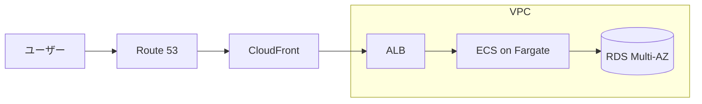
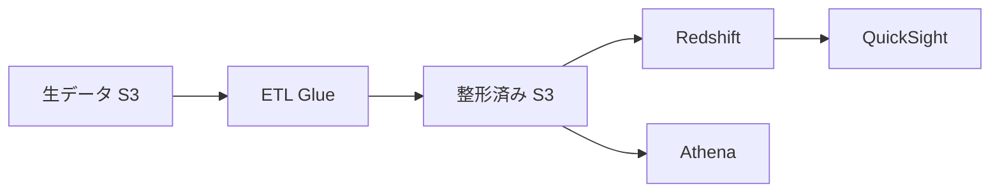
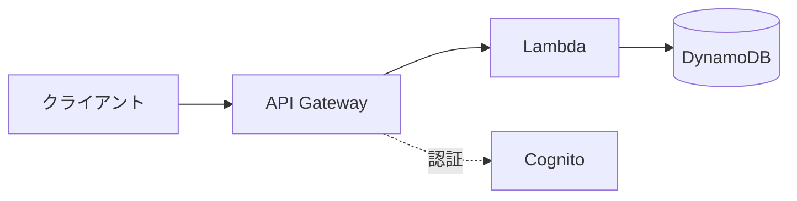

## はじめに

この記事の対象読者はこんな人です。

> - 構成図やフロー図を生成AIに清書させているが、「画像だと後から直せない」と感じている人（前回の記事は未読でも大丈夫です）
> - 説明するための図を全部AIで作りたい人
> - AWSの構成図をAIに描かせたいけど、アイコンや体裁が崩れるのが気になる人

この記事は前回の続編ですが、前回を読んでいなくても分かるように書きます。まず30秒だけ、前回の話を要約させてください。
今回はその続きです。清書先を画像（ナノバナナ）からdraw.ioに変えたら、その面倒がまるごと消えました。前回の記事はこちらですが、読まなくても以降は追えます。

https://qiita.com/ktdatascience/items/4b35eb4e157becfac073

:::note info
前回やったこと（要約）
エンジニアが普段サッと書く構造記述に Mermaid というテキスト記法があります。ただMermaidの図はそっけないので、ビジネス側に見せる資料には向きません。そこで前回は、Mermaidで構造を固定したうえで、それをGeminiの画像生成（通称ナノバナナ）に通して「白背景・日本語ゴシック体の見やすいインフォグラフィック」に清書させる、という方法を紹介しました。要は **構造はMermaid、見た目はAI** という役割分担です。
:::

この方法、あれはあれで便利だったんです。でも自分の仕事（ID-POSの分析基盤）で使い込むほど、一つだけ引っかかってきた。「これ、画像で返ってくるから後から直せないな」と。打ち合わせで「ここにWAF足しといて」と言われるたびに、また一から投げ直していました。


## 画像で清書する方式の限界：「もう直せない」

AIに画像で清書させる方式は、使ってみると地味な弱点が出てきます。前回の記事でも、ハマったポイントを3つ挙げていました。公式アイコンが正確に出ない、日本語が崩れる、複雑な図だと要素が間引かれる——の3つです。あらためて振り返ると、根っこは全部同じところにあったと気づきます。**返ってくるのが「画像」だから** です。

画像は完成品としては綺麗なんですが、編集の取っ手がどこにもない。矢印を1本ずらしたいだけでも、プロンプトを直して丸ごと生成し直す。しかもガチャなので、直したかった矢印以外のレイアウトまで変わる。「あれ、さっきの方が良かったな」が頻発しました。

あなたも、レビューで「ここだけ直して」と言われて、図ぜんぶを作り直した経験はありませんか？ 自分はこれを何度かやって、「清書をAIに出すこと自体は正解だったけど、出力フォーマットが画像なのが間違いだったのでは」と思い始めたんです。

## 解決策：清書じゃなく「.drawioのXML」をClaudeに書かせる

考え方はシンプルです。前回はナノバナナに「画像」を作らせていました。今回はClaudeに **draw.ioのソースファイル（.drawio）そのもの** を作らせます。

役割で並べるとこうなります。


Mermaidが「構造を固定する中間言語」なのは前回と同じ。違うのは清書担当です。ナノバナナは「見た目を焼き付けた画像」を返す。Claudeは「draw.ioで開いて編集できるXML」を返す。後者は完成品ではなく **編集可能な素材** が手に入る、というのが今回の肝なんです。

## 仕組み：.drawioはただのXMLだからLLMと相性がいい

なぜClaudeにこれができるのか。答えは拍子抜けするくらい単純で、**.drawioファイルの中身がただのXMLだから** です。

draw.ioのファイルは `mxGraphModel` という形式のXMLで、ノード（図形）とエッジ（矢印）を1行ずつテキストで書いただけのものです。バイナリでも独自フォーマットでもない。つまりLLMがいちばん得意な「テキスト生成」と「差分編集」の土俵に、図づくりが乗ってくるわけです。

AWSアイコンも、専用のスタイル文字列を指定するだけで出ます。たとえばRDSのアイコンはこう書きます。

```xml:rds-icon.drawio
<mxCell id="rds" value="RDS (Multi-AZ)"
  style="sketch=0;outlineConnect=0;fontColor=#232F3E;fillColor=#2E27AD;
  strokeColor=#ffffff;verticalLabelPosition=bottom;verticalAlign=top;
  align=center;html=1;fontSize=12;aspect=fixed;
  shape=mxgraph.aws4.resourceIcon;resIcon=mxgraph.aws4.rds;"
  vertex="1" parent="1">
  <mxGeometry x="600" y="280" width="48" height="48" as="geometry" />
</mxCell>
```

`shape=mxgraph.aws4.resourceIcon` と `resIcon=mxgraph.aws4.rds` の組み合わせで、draw.io内蔵の公式AWSアイコンが呼び出されます。`fillColor` はサービスのカテゴリ色（データベースは紺、コンピュートはオレンジ）。これをサービスの数だけ並べて、最後に矢印（エッジ）でつなげば構成図になる。Claudeはこのパターンを知っているので、日本語で頼むだけでこのXMLを書いてくれます。

:::note info
`strokeColor=#ffffff` はAWSアイコンでは必須です。ここを `none` にするとアイコンの白い縁取りが消えて、ベタ塗りの四角に見えてしまいます。最初これに気づかず「アイコンが出ない」と悩みました。
:::

## 実際にやってみる（AWS3層構成）

百聞は一見にしかずなので、定番の3層Webアプリで試します。まず、普段どおりMermaidで構造だけ書きます。これがビフォーです。



このMermaidをそのまま貼って、Claudeにこう頼みました。

> このMermaidをAWS構成図にして、draw.io形式（.drawioのXML）で出して。
> AWS公式アイコンを使って、ALB・ECS・RDSはVPCの枠で囲んで。

返ってきた.drawioをdraw.ioで開いたのがこれ（アフター）です。


VPCの枠、公式アイコン、矢印の向きまで、そのまま資料に貼れる状態で出てきました。前回のナノバナナと違って、これは画像ではありません。draw.ioのキャンバス上で各アイコンをドラッグできるし、矢印もつなぎ直せる。生成された.drawioのXMLは長いので折りたたんでおきます。

<details><summary>生成された aws-3tier.drawio の中身（抜粋）</summary>

```xml:aws-3tier.drawio
<mxfile host="app.diagrams.net">
  <diagram name="AWS-3tier">
    <mxGraphModel dx="900" dy="600" pageWidth="850" pageHeight="600">
      <root>
        <mxCell id="0" /><mxCell id="1" parent="0" />
        <!-- VPCの枠 -->
        <mxCell id="vpc" value="VPC"
          style="shape=mxgraph.aws4.group;grIcon=mxgraph.aws4.group_vpc;
          strokeColor=#8C4FFF;fillColor=none;verticalAlign=top;container=1;"
          vertex="1" parent="1">
          <mxGeometry x="140" y="180" width="600" height="320" as="geometry" />
        </mxCell>
        <!-- ALB / ECS / RDS のアイコンと、それらをつなぐエッジが続く -->
      </root>
    </mxGraphModel>
  </diagram>
</mxfile>
```

</details>

## 一番の価値は「会話で図を直せる」

ここが今回いちばん伝えたいところです。図ができたあと、Claudeにこう続けました。

> CloudFrontとALBの間にWAFを足して。

返ってきたのがこれです。


WAFが1つ増えて、矢印のつなぎ替えだけが反映されました。他のアイコンの位置は動いていません。これをナノバナナでやると結構な確率でハマります。

draw.ioのXMLは差分編集ができるので、「WAFのノードを1個追加して、CloudFront→WAF→ALB のエッジに張り替える」という最小の変更で済む。レビューで図を育てていく業務だと、この差はめちゃくちゃ効きます。正直、ここで「あ、清書じゃなくてソースを持つって、こういうことか」と腑に落ちました。

## ほかの例でも（Mermaid → draw.io）

3層構成だけだと「たまたまでは？」と思われそうなので、毛色の違う2つも載せておきます。どちらも、上がQiitaでそのまま描画されるMermaid（ビフォー）、下がClaudeに.drawioを書かせてdraw.ioで開いた図（アフター）です。

### 例：ID-POSのデータ分析基盤

これは自分の本業に近い例です。生データをS3に置いて、Glueで整形して、RedshiftとAthenaから分析、最後にQuickSightで見せる、という流れ。




「データがどこから来て、どう加工されて、最後に誰が見るのか」を非エンジニアに説明するとき、アイコン付きのこの粒度がいちばん伝わりました。Mermaidのままだと、相手に少しだけ予備知識を要求してしまうんです。

### 例：サーバーレスAPI

API Gateway → Lambda → DynamoDB に、Cognitoで認証を足した構成。点線は「認証の流れ」をラベル付きで表しています。




点線・ラベルといった「ちょっとした表現」も、Mermaidの記法をそのまま汲んでdraw.ioのエッジに落としてくれます。ここまで来ると、Mermaidを書く段階が「設計」、Claude＋draw.ioが「製図」と、役割がきれいに分かれている実感があります。

## 公式スキルを使うともっと速い

ここまでは「Claudeに普通に頼む」やり方ですが、もっと楽な道もできています。2026年2月23日に、**draw.io公式がClaude Code向けのスキルを出しました**。

これを入れると `/drawio` というコマンドで、説明を渡すだけで.drawioを生成し、PNG・SVG・PDFまで書き出してくれます。しかも書き出した画像ファイルの中に元のXMLを埋め込む（`--embed-diagram`）ので、PNGをdraw.ioにドラッグするだけで再び編集できる。「画像なのに編集できる」という、前回のいちばんの悩みが構造的に解消されています。

https://x.com/drawio/status/2025994065209417823

:::note info
公式スキルはClaude Code向けです。Claude DesktopやWebでも、この記事の前半のように「.drawioのXMLで出して」と頼めば同じ素材は手に入ります。コマンド一発の快適さが欲しいならClaude Code、手元でサッと試すならチャットで直接、と使い分けています。
:::

## 画像方式の弱点がどう消えたか

画像で清書していたときのハマりどころが、フォーマットを画像からXMLに変えただけでどう変わったか、並べておきます。

| これまで（画像で清書） | 今回（Claude × draw.io＝XML） |
| --- | --- |
| 画像なので後から直せない | テキストなので会話で差分編集できる |
| 公式アイコンが雰囲気アイコンに寄る | `mxgraph.aws4` の内蔵公式アイコンが正確に出る |
| 初代モデルだと日本語が崩れる | ベクターのラベルなので文字化けしない |
| クラウドの画像生成に丸ごと投げる不安 | 出力はテキスト。ダミー化もローカル完結もしやすい |

## ハマったポイント

便利になったぶん、別のつまずきもありました。実際に踏んだものを残します。

1つ目は **大きい図ほどレイアウトが崩れる** こと。ノードが20を超えるあたりから、Claudeが座標を全部いい感じに置くのは苦手になります。アイコンが重なったり、矢印が斜めに突っ切ったり。自分は「配置はざっくりでいいから、構造を正確に」と割り切って、最後の整列はdraw.ioの自動レイアウト（Arrange → Layout）に任せています。

2つ目は **アイコン名が違うとただの四角になる** こと。`resIcon=mxgraph.aws4.xxx` の `xxx` が実在しない名前だと、エラーにもならず無言で素のボックスが出ます。新しめのサービスでこれをやりがちでした。怪しいときはdraw.ioのShape検索で正しい名前を確認してから貼り直すのが早いです（根本原因はモデルの記憶違い、というやつです）。

3つ目は、結局 **細かい見た目はdraw.ioで手作業** になること。フォントサイズや色みの最終調整までAIに粘らせるより、8割の構造をClaudeに作らせて、残り2割を手で仕上げるのがいちばん速かったです。

:::note warn
社外秘の構成図を扱うときは注意してください。Claudeもクラウドのサービスなので、具体的なホスト名・IP・アカウントIDなどはダミーに置き換えてから渡すのが無難です。ただ、XMLはテキストなので「どこを伏せたか」が目で追える。画像生成に丸投げするより、伏せ漏れの確認はしやすいと感じています。社内のデータ取り扱いポリシーは必ず確認を。
:::

## まとめ

- 清書先を「画像」から「.drawioのXML」に変えるだけで、構成図が "あとから直せる素材" になる
- `mxgraph.aws4` の公式アイコンが正確に出るので、AWS構成図と相性がいい
- 一番効くのは「会話で差分だけ直せる」こと。レビューで育てる図ほど価値が出る
- もっと速くしたいなら、2026年2月に出たdraw.io公式のClaude Codeスキル（`/drawio`）

前回の最後に「次はスケジュール実行で定例資料を自動更新する話を書く」と予告していたんですが、その前にこのdraw.ioの話を挟みたくなりました。ビジネス側にパッと見せる清書はナノバナナ、自分たちで直し続ける図はdraw.io——清書先を使い分けるのが今の落としどころです。

あなたの現場では、構成図ってどのくらいの頻度で直しますか？ 「毎回ちょっとずつ直す」タイプの図なら、清書をdraw.ioに寄せると効くと思います。もっと良い指示の出し方があれば、コメントで教えてください。

## 参考リンク

- [draw.io公式X：Claude Code向けスキルの発表（2026/2）](https://x.com/drawio/status/2025994065209417823)
- [Claude Code Gets Draw.io Skill（ClaudeCode JP）](https://claudecode.jp/en/news/drawio-skill-for-claude-code)
- [公式 Claude Code × draw.io Skill でAWS構成図を試す（DevelopersIO）](https://dev.classmethod.jp/en/articles/claude-code-trying-out-drawio-skill-for-aws-architecture/)
