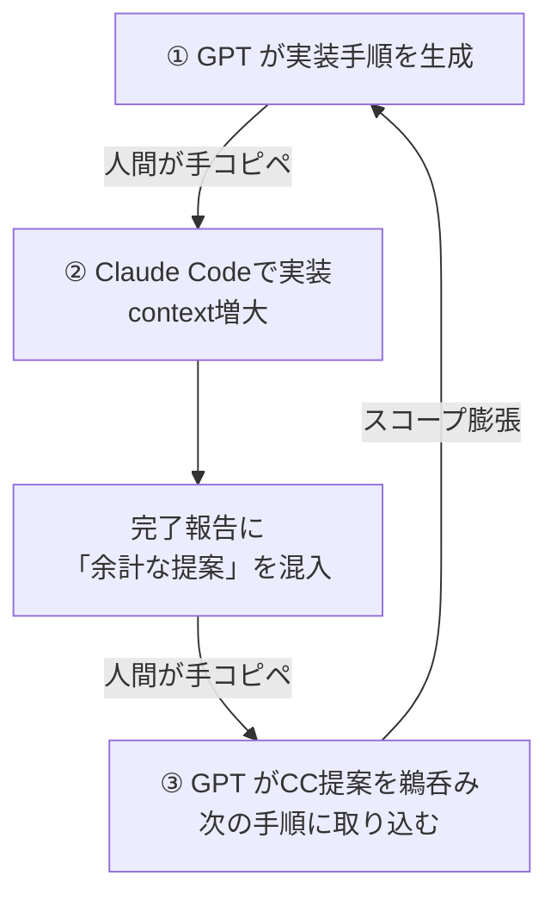

## TL;DR

- とあるAIエージェントの自宅開発で、トークン節約のため、ChatGPT（ブラウザ版）で設計・手順書を作ってClaude Codeに貼って実装させるという、原始的な **「手コピペ往復AI駆動開発」** をやっていた。
- Claude Code の完了報告に混ぜてくる **「余計な提案」** を GPT が真に受けて次の手順に取り込み、往復のたびにスコープが勝手にどんどん膨張。私（人間）も自宅開発だからと、適当にチェックを流していた。
- **結果、めっちゃ時間かかってしまった。**
- 対策：「実装仕様はコピペ投入じゃなく、静的ドキュメントをAIに配置参照させ、一度仕様を決めたら簡単にコロコロ仕様変更しない(**仕様駆動開発ちゃんとやろう**)」
「人間がきちんと出力妥当性チェックできる仕組みづくり」
AI 同士を人間のコピペで直結すると、片方のノイズがもう片方で増幅する。

## この記事でわかること

- 複数の LLM の入出力を手動コピペで連携させるときに起きる、具体的な落とし穴と、その防ぎ方。
:::note warn
ただし、手動コピペでなく、パイプライン化して複数LLMの入出力連携した場合でも同じ問題が発生しうる。
:::

## 環境

| 項目 | サブスク契約・環境 |
|------|------|
| 設計側 | ChatGPT Plus（ gpt-5.5-thinking / ブラウザ版） |
| 実装側 | Claude Code（Opus 4.8 / WSL2 上で実行） |
| Claude プラン | Pro（トークン上限が厳しい） |
| 連携方法 | 人間による手動コピペ（API 連携なし） |

## やろうとしたこと

私のClaude Code は恥ずかしながら Pro プランで、トークン上限が厳しくコーディングで大きいプロダクトを作ろうとするとすぐ上限に達してしまう。そこで、要件定義や設計はChatGPTブラウザ版でやればトークン消費減らせるんじゃね？と考えた。

流れとしてはこんな感じ。

1. **GPT（ブラウザ版）** と人間が壁打ちして、要件定義・設計書・実装手順を書かせる。
2. その出力を**人間が Claude Code（CLI）にコピペ**で投入し、実装させる。
3. Claude Code の実装完了報告を**人間が GPT に貼り戻し**、GPTの想定設計と実装結果が合致するかチェック → 次の手順を生成。
4. 以下繰り返し。

トークンを節約しつつ、各モデルの得意領域を活かせる——はずだった。


## 何が起きたか

作ろうとしていたのは、株式投資のAIデモトレードのシミュレーションツールだった。AIにテクニカル、ファンダ、ニュース情報を与えて自動的に資産運用したらどれぐらい儲けられるの？というシミュレーション。
MVP として考えてた機能はこんな感じ。
```text
Watchlist → Market Data → Indicator → Signal Engine
→ AI Trade Plan → Slack通知 → Human Approval
→ Paper Broker → Position/P&L → Review
```

当初の想定は **10〜12 Phase** で MVP 完成。だが実際は、以下の表のように **「スコープ膨張」** が起こり、勝手に実装範囲が増えてしまっていた。


| 指標 | 当初想定 | 実際 | 倍率 |
|------|---------|------|------|
| 実装Phase 数 | 10〜12 | 28〜32（14D まで細分化） | **約 2.8 倍** |


<details><summary>実際どんな感じに増えてったのか、見たい方はクリック</summary>


#### 具体例：13 Phase

最も象徴的な区間を示す。前の開発PhaseのResearch Journal が完成した時点で、本来の次ステップは **Paper Trading Core**（Signal → Paper Broker → P/L）だった。必要な 実装Phase は **5〜7** 程度。

だが実際は・・・

| 機能 | 消費 Phase 数 | やったこと |
|------|-------------|-----------|
| Research Overview | 5 Phase | 新規画面追加 → docs sync → UI polish → docs sync → final closure |
| Safety Overview | 4 Phase | API/UI/Tests/Docs → UI polish → docs sync → final closure |
| Data Quality Overview | 4 Phase | API/UI/Tests/Docs → UI polish → docs sync → final closure |
| **合計** | **13 Phase** | **MVP 完成率の進捗：ゼロ** |
</details>


### 

自宅開発やしまあええかと思ってチェックも適当に流していた私も、流石に **「なんかやたら実装時間長くね？」**  と思ってGPTに尋問したら、案の定ゲロった。ここまでが事の顛末。


## なぜ起きたか

### GPT5.5 と Opus4.8のモデル特徴についての仮説

まず、今回使った2つのLLMに対し、経験則的に私はこのような仮説を持っている。

- **GPT**: 指示されたことは正確にきっちりやるが、大局観が薄くなりがち。目先のことしか見えなくなってしまってる感じ。
あと、意図を察するのが苦手っぽい。「いい感じにやっといてー」が通用しない。
- **Opus**: 視野が広く「いい感じに」やってくれる。が、コンテキストが膨大になると性能劣化し、指示を思いっきり無視したり本題から外れた提案を始める。

ツイッターとか見てると、他のエンジニアからも同様の観測が報告されていた。

<blockquote class="twitter-tweet"><p lang="ja" dir="ltr">Opus 4.8 、基本的には良いモデルだと思うんだけど、これは Claude 全般に言えることだけど、コンテキストが積み重なると一気に理解の解像度が落ちる。<br>社内の人間とお客さんを混同したりし始める。<br>柔軟な一方で、理解が大雑把。<br>GPT-5.5 よりもはるかに「ありえない勘違い」の頻度が高い。<br>一方で。GPTはカッチリで正確だけど、ちょっと近視眼的だったりする。
自分の中では、自分の進め方に自信のあるタスクならGPTに、なんかよくわかんねぇから一旦雰囲気で進めるか、みたいなのは Claude でやってる。<a href="https://t.co/5unVgNYrCt">https://t.co/5unVgNYrCt</a></p>&mdash; 炎鎮🔥 - ₿onochin - (@super_bonochin) <a href="https://x.com/super_bonochin/status/2066584392240337207?ref_src=twsrc%5Etfw">June 15, 2026</a></blockquote> <script async src="https://platform.x.com/widgets.js" charset="utf-8"></script>

<blockquote class="twitter-tweet"><p lang="ja" dir="ltr">Opus4.8の性能が悪すぎ問題、実際私も最初そういう認識だったんだけど、Codexと敵対的相互壁打ちすると、メタ認識が体感Fable並みになった感じがする<br>Opus4.8の認識甘い素案をcodexがフルボッコすると、Opusが自分の緩さを認識して推論機能が明らかに向上する感じがする…</p>&mdash; Ryousuke_Wayama (@wayama_ryousuke) <a href="https://x.com/wayama_ryousuke/status/2067155959680754148?ref_src=twsrc%5Etfw">June 17, 2026</a></blockquote> <script async src="https://platform.x.com/widgets.js" charset="utf-8"></script>

### 2つの弱点が掛け合わさった

今回の問題は、この**両者の弱点が同時に裏目に出た**構造だった。

<blockquote class="twitter-tweet"><p lang="ja" dir="ltr">コンテキスト増えると一気に馬鹿になるOpus4.8と、言われたことだけはしっかりやる頭でっかちなGPT5.5の組み合わせで悪いところが一気に出てしまった感じ</p>&mdash; kohibito (@yoku8983) <a href="https://x.com/yoku8983/status/2066943988054266244?ref_src=twsrc%5Etfw">June 16, 2026</a></blockquote> <script async src="https://platform.x.com/widgets.js" charset="utf-8"></script>

この組み合わせが、以下の悪循環を引き起こした。




事後に GPT 自身に原因を分析させたところ、こう返ってきた。

> **「Phase 完了後の提案」が、事実上のプロダクトマネージャーになっていた。**

結局どんどんClaude codeが勝手にスコープ増やして、人間のチェックがザルなので見抜けなかったということである。
先のツイッターでの他エンジニアの引用に書いてあるように、**逆にOpusに素案作らせて、GPTに敵対的レビューをさせブラッシュアップするのが効果的な使い方だった** わけだが、それと真逆のことをやっていたわけだ。

### 構造的な根本原因

このループが止まらなかった根本原因は2つある。

**(a) 状態の二重管理**

設計（GPT 側のコンテキスト）と実装（Claude Code 側のコンテキスト）が**別々の場所**にあり、唯一の同期手段が人間のコピペだった。同期のたびに、Opus の「余計な提案」というノイズが混入し、往復で増幅した。

**(b) 確定した正本（マスター、神様ファイル）がない**

実装手順が会話の中で都度生成され、「これが確定版」というアンカーが存在しなかった。正本がないため、毎回の往復でスコープが書き換わり放題になった。

## 対策

### ① スコープを静的な正本に固定する

要件・設計・実装手順は、会話の中で流すのではなく、**静的なドキュメント（ファイル）として保存**する。実装中はよほどのことがない限り書き換えない。これがスコープのアンカーになる。

### ② 完了報告のフォーマットを絞る

Claude Code の完了報告に「次はこうしたらどうですか」という提案が混じるのが発火点だった。完了報告は **「やったこと」と「差分」だけ** に絞る指示を最初に与えておく。

### ③ 人間が毎回ゲートチェックする

AI の出力をもう一方の AI に渡す前に、人間が必ず内容を確認する。特に「元の手順にない要素が追加されていないか」をチェックする。今回は流し読みで素通りさせてしまったことが、膨張を許した直接の原因だった。


### （余談）そもそも、パイプライン化すれば良かったんじゃね？
**手動コピペなんてあまりに原始的すぎる、パイプライン化して連携させれば良かったのでは？** と思う方もいることだろう。

私のChatGPTはサブスクではAPIは使えない、API使うなら別口の従量課金になる。ChatGPTは日常でも使ってたのでサブスク版解約してAPIというのも嫌だし、手コピペという道を選ばざるを得なかった。
また、もし仮にパイプライン化しても、実装担当Claude codeの完了報告に混じるノイズの増幅という本質的な問題は変わらないというのは前述の通りである。


## 学び

- **AI 同士を人間のコピペで直結すると、片方のノイズがもう片方で増幅伝播する。** 間に「確定した正本」と「人間のレビュー」を必ず挟むこと。
まあ、仕様駆動開発きちんとやらないとこうなりますよ、ということ。
- **トークン節約の本筋は、コンテキスト分割の往復ではない。** Claude code単体でもトークン節約できないか見直すべき。
- 複数の AI を組み合わせる場合は、各モデルの特性（得意・不得意）に注意。
これを理解すれば、先に述べたように、Opusにざっくり作らせてGPTに敵対的レビューさせて品質を高める、というそれぞれの持ち味を発揮した応用的な使い方もできる。

<br>

これを契機に、Claude code側単体でもトークン消費を抑える仕組みを再検討した。Opus利用を減らしSonnnetでいけるところはSonnetにする、サブエージェントに切り出す、コンテキスト圧縮や`/clear`を定期的に挟んでコンテキスト抑える、など。


<br>

- 自宅開発でも、ちゃんと人間が最低限チェックするか、ハーネスなど人がチェックしなくてもいい仕組みづくりをしていきたい。
- **AI の自律開発時代でも、人間の直感は意外と大事**。今回も「いつまでも終わらん、なんかおかしい」と思ったことをきっかけに途中で気づけた。


---

*この記事は Claude codeからQiita MCP経由で投稿しました。構成・検証・一次体験は筆者がチェック、手動で加筆修正しています。*
*最終検証日: 2026-06-20*
