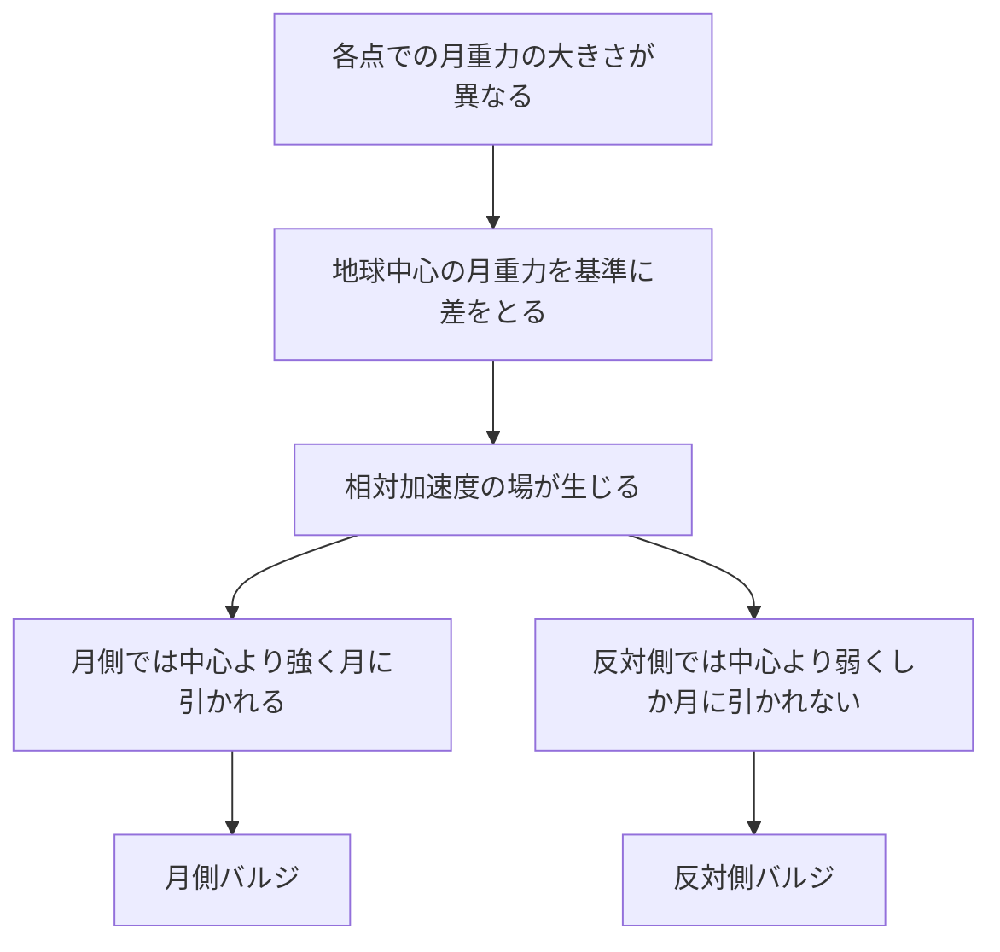
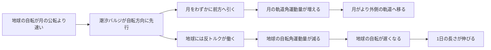
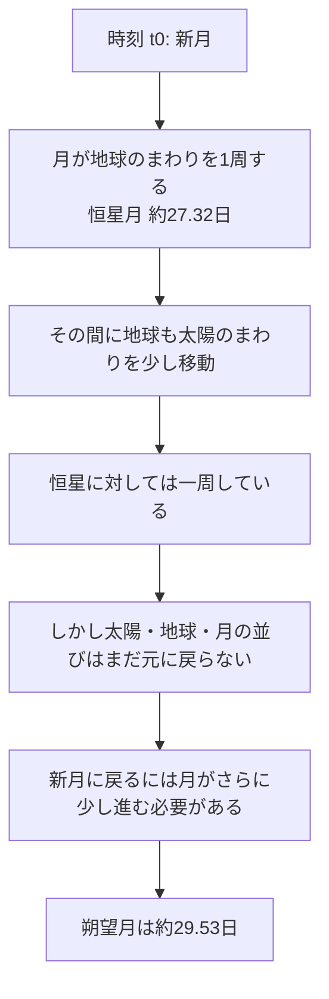

:::note info
**この記事の作り方（生成AIワークフロー）**

本記事は「生成AIで専門技術記事はどこまで作れるか」の検証として、次の構成で作成しました。

- 進行・統括・ファクトチェック: Claude Code
- 記事パイプライン: llm-task-router（create → refine → evaluate → revise）
- 本文生成: ChatGPT（OpenAI）
- 構成・品質審査（LLM-as-judge）: Claude（Anthropic）
- 事実確認: Web 検索で数値・最新動向を一次情報から裏取り
- 外部レビュー（読者・編集視点の批評）: ChatGPT — 指摘を反映して改稿
- 最終確認: 筆者（人間）

本文中の【観測】【有力仮説】【計画】【予測】という確度ラベルも、生成AIが事実と推測を取り違えないための工夫です。
:::

月は夜空に当たり前のように浮かぶ天体ですが、その軌道・自転・潮汐・暦・地球自転の長期変化まで、すべてが地球との重力相互作用で結び付いた一つの力学系です。

本記事では、月の基本諸元から起源、軌道と潮汐、自転同期と秤動、潮汐進化と地球自転の減速、食と暦、そして近年の探査までを一本の流れで解説します。同時に、これは「生成AIが専門教養記事をどこまで正確に書けるか」を検証する文脈も意識した記事です。そのため本文では一貫して、以下を切り分けます。

- **観測で確かめられた事実**
- **有力仮説**
- **計画**
- **予測**

前提知識は、高校〜大学初年級の力学（重力・角運動量・エネルギー散逸）程度を想定します。

---

## 序章：月とは何か — まずは基本諸元を揃える

議論の土台として、最初に月の基本データを並べます。月は「地球に比べれば小さいが、惑星の衛星としてはかなり大きい」存在であり、地球‐月系は単純な「主役の地球に月が従うだけ」の系ではありません。力学的には**無視できない連成系**です。

### 月を語るための基礎データ表

| 項目 | 月 | 地球との比較・補足 |
|---|---|---|
| 平均距離 | 約384,400 km | 地球中心から月中心まで |
| 近地点 | 約363,300 km | 楕円軌道なので変動 |
| 遠地点 | 約405,500 km | 見かけの大きさも変わる |
| 半径 | 約1,737.4 km | 地球半径の約0.273倍 |
| 直径 | 約3,474.8 km | 地球直径の約0.273倍 |
| 質量 | 約7.35×10^22 kg | 地球質量の約1/81.3 |
| 表面重力 | 約1.62 m/s^2 | 地球の約0.165倍（約1/6） |
| 平均密度 | 約3.34 g/cm^3 | 地球より低い |
| 脱出速度 | 約2.38 km/s | 地球よりかなり小さい |
| 恒星月 | 約27.32日 | 恒星に対して一周する周期 |
| 朔望月 | 約29.53日 | 新月から次の新月まで |

【観測】月は直径で地球の約27%、質量で約1/81です。これは「地球に対して非常に小さい点粒子」とみなすには大きく、実際に地球‐月系の共通重心は地球内部にあるものの、**地球中心から約4,671 km**ずれた位置にあります。これは**地球半径 約6,371 km の内側**、言い換えると**地球半径の約73%の位置**です。このずれは潮汐や地球のわずかなふらつきにも関わってきます。

:::note info
本記事では、数値は概算なら **「約」** を付けて示します。月の距離や周期には定義や時点による細かな違いがあるため、まずは全体像をつかむことを優先します。

近地点・遠地点の値は出典により末尾が少し異なることがあります。本記事では NASA NSSDCA の値に準拠しています。
:::

---

## 第I部：月の起源 — ジャイアントインパクト説は何を説明するのか

【有力仮説】月の起源について、現在もっとも有力なのは**ジャイアントインパクト説**です。ただし、ここで重要なのは**「有力だが、まだ仮説である」**という言い方を崩さないことです。

この説の概略はこうです。

- 原始地球に、火星サイズ級の天体が衝突した
- その衝突で地球周辺に高温の破片・蒸気からなる円盤が生じた
- その物質が集積して月が形成された

このモデルが支持される理由はいくつかあります。

### ジャイアントインパクト説が説明しやすい点

- 【観測】**地球‐月系の大きな角運動量**
- 【観測】**月の鉄コアが相対的に小さいこと**
- 【観測】**地球と月の化学・同位体組成がかなり近いこと**

特に月は、全体サイズの割に金属コアが小さいと考えられており、「地球の外層に由来する物質が多く集まった」とみると整合的です。

しかし、話はそれで終わりません。

### まだ残っている難問

【観測】もっともよく知られた問題のひとつが、**地球と月の同位体比が非常によく似ている**ことです。単純な衝突モデルでは「衝突天体由来の物質」と「地球由来の物質」がもっと違っていてもよさそうですが、実際には驚くほど近い値が報告されています。

このため、

- 【有力仮説】どのような衝突条件だったのか
- 【有力仮説】衝突後にどれほど混合が起きたのか
- 【有力仮説】高温の円盤でどのような化学的・力学的進化が起きたのか

といった点には、まだ未解明部分があります。

:::note warn
**月の起源は完全に決着した話ではありません。**

「ジャイアントインパクト説が正しい」と断定するのではなく、
- 観測事実：月の質量、角運動量、同位体比、内部構造の推定
- 有力仮説：巨大衝突による形成
- 未解決点：衝突条件、混合過程、同位体組成の詳細説明

のように分けて扱うのが安全です。生成AIはこの種の「有力仮説」を確定事実として書きがちなので、ここは特に注意点です。
:::

---

## 第II部：軌道と潮汐 — 月はどう回り、なぜ海は動くのか

【観測】月は地球のまわりを回っていますが、その軌道は真円ではなく**楕円**です。したがって地球からの距離は一定ではなく、近地点では近く、遠地点では遠くなります。この差によって、見かけの大きさも少し変わります。

ここから潮汐の話に入ります。

### 潮汐力は「重力」そのものではなく「重力の差」

潮汐を雑に言うと「月が海を引っ張る」ですが、物理的にはそれだけでは不十分です。潮汐力の本質は、**地球の各点で月から受ける重力が少しずつ違うこと**にあります。

- 月に近い地球側では、月の重力が少し強い
- 地球中心では、その中間
- 月と反対側では、月の重力が少し弱い

この「差」が地球全体をわずかに引き伸ばそうとします。これが潮汐の基本です。

### なぜ月の反対側にも潮汐バルジができるのか

ここは初学者が引っかかりやすい点です。月に近い側が引っ張られて盛り上がるのは直感的ですが、反対側にも盛り上がりが生じます。

標準的には、**地球中心を基準にした非慣性系**で考えるとわかりやすくなります。地球は月とともに共通重心のまわりを回っているので、地球上の各点には月に対する相対運動を記述するための**見かけの力（慣性力）**を入れて考えます。

- 地球中心では、月から受ける重力と、共通重心まわりの運動に対応する慣性力がつり合う基準になる
- 月に近い側では、月の重力が地球中心より強いので、相対的に月向きへ引かれる
- 月と反対側では、月の重力が地球中心より弱いので、相対的には外向きへ残る

つまり潮汐力は、**各点での月重力**から**地球中心が受ける月重力**を差し引いた、いわば**相対加速度の場**として理解できます。これが月側と反対側の両方にバルジをつくります。

地球中心を基準に見ると、

- 月側：中心より強く月に引かれる
- 反対側：中心より弱くしか月に引かれない

→ 相対的に両側へ引き伸ばされます。

### 満潮・干潮は単純ではない

理想化すると、潮汐バルジが2つあるので、1日に2回の満潮が起こりそうに見えます。実際、多くの沿岸では**半日周潮**の成分が強く、1日2回に近い振る舞いをします。

ただし現実の海は単純ではありません。

- 海岸線の形
- 海盆の深さ
- 海域ごとの共振
- 海流や気象

などが効くため、潮位変化は地域ごとに大きく異なります。「潮汐は1日2回」と丸暗記すると、現実の海ではすぐ破綻します。

### 太陽の潮汐も効いている

【観測】潮汐を起こすのは月だけではありません。太陽も潮汐に寄与します。月の寄与のほうが大きいですが、太陽の潮汐と重なることで

- **大潮**：新月・満月ごろ
- **小潮**：上弦・下弦ごろ

が生じます。これは、月と太陽の潮汐効果が強め合うか弱め合うかの違いです。

ここで「なぜ太陽はあれほど重いのに、潮汐では月のほうが効くのか」を一度だけ定量で見ておくと、話が締まります。

【観測/理論】潮汐力の大きさは、おおざっぱには**質量に比例し、距離の3乗に反比例**します。つまりインラインで書けば、**\(F_t \propto 1/r^3\)** が効きます。太陽の質量は月の約**2,700万倍**規模ですが、距離は月までの約**390倍**規模です。したがって見積もりは

- 潮汐効果比 ≈ 質量比 ÷ 距離比の3乗
- 約 \(2.7\times10^7 / 390^3\) ≈ **0.46**

となり、**太陽の潮汐は月の約0.46倍**、言い換えると**月の潮汐は太陽の約2.2倍**になります。要するに、**質量は大きく効くが、距離が3乗で効くので、近い月が勝つ**わけです。なお、この比は出典や採用する定数により**約2〜2.4倍**程度の幅で語られることがあります。

### 潮汐は海だけの話ではない

潮汐というと海面の上下を思い浮かべがちですが、本質は**重力差による変形**です。したがって、

- 海洋の潮汐
- 地球固体の潮汐
- 月自身の内部変形
- その結果としてのエネルギー散逸

まで含めて一つの現象です。この「内部変形と散逸」が、次の自転同期や長期進化の鍵になります。

---

## 第III部：自転と公転の同期・秤動 — なぜ月は同じ面を向けるのか

【観測】月は地球から見ると、いつもほぼ同じ面を向けています。これは偶然ではなく、**自転周期と公転周期が等しい**からです。月の自転周期も公転周期も、恒星に対しておよそ**27.32日**です。

この状態は、力学では**1:1スピン軌道共鳴**と呼ばれます。

### なぜ同期するのか

【有力仮説】月が最初からぴったりこの状態だったとは限りません。むしろ、形成直後にはもっと速く回っていた可能性が高いと考えるのが自然です。では、なぜ今のような同期状態に落ち着いたのでしょうか。

鍵はやはり**潮汐変形と内部摩擦**です。

地球の重力は月をわずかに変形させます。しかし月は完全弾性体ではないので、変形は重力方向に瞬時にぴったり一致しません。少し遅れ、つまり**位相ずれ**が生じます。すると、そのずれた「ふくらみ」に対して地球がトルクを及ぼし、月の自転を調整します。

重要なのは、

- 潮汐変形が起こる
- 変形が即応しない
- 位相ずれができる
- そのずれにトルクが働く
- 自転エネルギーが内部摩擦で散逸する

という因果です。

単に「出っ張りを引き戻すから」ではなく、**散逸があるから都合のよい共鳴状態に落ち着く**のです。

### 「いつも同じ面」は厳密ではない

【観測】ここも誤解されやすい点です。月は地球に**まったく同じ半球だけ**を見せているわけではありません。実際には**秤動**によって、長期的には月面の約**59%**を地球から観測できます。

秤動には主に3種類あります。

- **経度秤動**  
  月の**自転角速度はほぼ一定**なのに対し、楕円軌道のため**公転角速度が変動する**（ケプラーの第二法則）ので、東西方向に見え方が少し揺れる
- **緯度秤動**  
  月の自転軸が軌道面に対して少し傾いているため、南北方向に少し見える範囲が変わる
- **日周秤動**  
  地球上の観測者が地球半径ぶん位置を変えながら観測することで、月を少し違う角度から見る

つまり、「月はいつも同じ面を向ける」は教育的には便利ですが、厳密には**「ほぼ同じ面を向ける」**です。秤動があるおかげで、裏側の縁に近い領域まで少しのぞけます。

:::note info
「同期」と「固定」を混同しないのがポイントです。  
同期とは自転周期と公転周期が一致していること、秤動とはその上で見え方が少し揺れることです。
:::

---

## 第IV部：潮汐進化と地球自転 — 月はなぜ遠ざかり、1日はなぜ伸びるのか

ここで話は、海の潮汐から**地球‐月系の長期進化**へつながります。

### 先行する潮汐バルジ

【観測】現在の地球は、月の公転よりも速く自転しています。すると、海洋や地球内部の変形は月の真下にぴったりとは並ばず、**地球の自転方向に少し先行**します。

つまり潮汐バルジは、地球‐月を結ぶ線より少し前にずれます。

### 月は実際に遠ざかっている

【観測】これは理論だけでなく、**観測事実**です。アポロ計画などで月面に設置された反射器を用いる**月レーザー測距**によって、月は地球から**年約3.8 cm**のペースで遠ざかっていることが測定されています。

この値は非常に有名で、潮汐進化を説明する上で欠かせません。

### 角運動量保存と自転減速

先行したバルジは月を前方へ引っ張ります。月が前方へ引かれると、月の**軌道角運動量**が増えます。その結果、月はより外側の軌道へ移ります。

では、その角運動量はどこから来るのでしょうか。答えは**地球の自転**です。地球‐月系全体では外部トルクが十分小さいとみなせるので、全角運動量はおおむね保存されます。したがって、

- 月の軌道角運動量が増える
- 地球の自転角運動量が減る
- 地球の自転は遅くなる
- 1日の長さが伸びる

という関係になります。

### エネルギーは保存されないのか

ここは角運動量とエネルギーを混同しやすいところです。

- **角運動量**：系全体でほぼ保存
- **エネルギー**：潮汐散逸により熱へ変わるので、力学的エネルギーは保存されない

この違いが重要です。フィギュアスケーターの腕の開閉で角運動量保存を思い出すとイメージしやすいですが、潮汐進化では内部摩擦があるため、エネルギーは散逸します。

### 地球自転の減速は一定ではない

【観測】地球自転は長期平均では減速しています。ここでいうのは、**1日の長さが1世紀あたり約1.7〜2.3ミリ秒のオーダーで増加する**という意味です。

この幅があるのは、何を含めるかで値が少し違うからです。

- **潮汐散逸だけ**に着目した理論的な寄与：おおよそ **約2.3 ms/世紀**
- **実際の観測的な長期平均**：おおよそ **約1.7〜1.8 ms/世紀**

このとき注意したいのは、後者の **約1.7〜1.8 ms/世紀** は主に**古代の日食記録などに基づく長期平均**だという点です。採用する時代区間によって推定値には幅があり、近世以降のデータだけを見ると、より小さい値が得られることもあります。

両者が一致しないのは、潮汐以外にも

- 氷河性地殻均衡（氷床消失後の地殻反発）
- 海洋・大気の角運動量交換
- マントルと核の相互作用
- 地球内部の質量再配分

などが効くためです。したがって「地球の自転は毎年同じ割合で遅くなる」と書くのは不正確です。

:::note warn
「月が年3.8 cm遠ざかる」も「1日が長くなる」も、現在観測される値をそのまま何十億年にも機械的に外挿してよいわけではありません。海陸分布や散逸効率は地質時代を通じて変化するためです。

また、「観測的な長期平均」の値は採用するデータ期間によって一意ではありません。
:::

【予測】遠い未来に地球と月がどうなるか、という話は面白いですが、そこには太陽進化まで含む大きな不確実性があります。したがって、その種の記述は**予測**として扱うべきです。

---

## 補論：Love数・Q値・GRAILがつなぐ月内部の物理

:::note info
この節は、本文の流れを壊さないための**一段深い専門的補足**です。  
読みやすさ優先なら飛ばして構いませんが、月の後退速度や自転同期を**どの実測パラメータが支配しているか**をつかむ入口になります。
:::

### 潮汐の応答と散逸 — Love 数と Q 値

【理論】「潮汐でどれだけ変形するか」と「その変形がどれだけ遅れるか」は、専門的には別の量で表します。

- **Love 数**（特に **\(k_2\)**）  
  外力に対して天体がどれだけ重力的・弾性的に応答して変形するか
- **品質係数 \(Q\)**  
  変形の位相遅れ、言い換えると**1周期あたりどれだけエネルギーを散逸するか**の指標

直感的には、

- **\(k_2\) が大きい**ほど「よく変形する」
- **\(Q\) が小さい**ほど「よく熱にして散逸する」

です。

【理論】月の後退速度や地球自転の減速の大きさは、ざっくり言えば地球の **\(k_2/Q\)** に強く依存します。つまり、**どれだけ変形しやすく、どれだけ遅れて応答するか**が、潮汐進化の速さを決めます。

【観測制約】地球については、**\(k_2\) は約0.3のオーダー**で議論されることが多く、**\(Q\) は定義・周波数・モデルによって大きく変わります**。たとえば、地球の散逸は海洋潮汐が大きく効くため、月の後退から逆算した**地球全体の実効Q**は **約10〜十数**と小さく見積もられる一方、海を除いた**固体地球の体潮汐だけのQ**は **100〜数百**のオーダーで扱われます。両者は矛盾ではなく、含める散逸源が違います。ここでは、これらが「潮汐進化のスピードを決める実測パラメータ」だと押さえるのが重要です。

### スピン軌道共鳴の安定性 — なぜ 1:1 が保たれるのか

【理論】月が **1:1 スピン軌道共鳴**に落ち着くのは、単に潮汐でブレーキがかかったからだけではありません。月には**永久的なわずかな扁長**、つまり赤道方向の非対称性があり、重力的には四重極モーメントとして効きます。

この非対称な形をもつ天体が潮汐散逸を伴って公転すると、ある自転比では**平均トルクが安定点**をつくります。月ではそれが 1:1 に対応し、現在の「ほぼ同じ面を向ける」状態が安定終状態になります。

安定な共鳴比は、天体の

- 軌道離心率
- 扁長の大きさ
- 内部散逸の強さ

に依存します。したがって 1:1 だけが唯一の可能性ではありません。代表例として、**水星は 3:2 スピン軌道共鳴**にあることが観測で確かめられています。これは「潮汐があると必ず 1:1 になる」という単純化が正しくないことを示すよい例です。

### GRAIL が内部構造に与えた制約

【観測】**GRAIL** は月の高精度重力場を測ることで、月内部の理解をかなり前進させました。特に重要なのは、月の内部構造が「なんとなく固い球」ではなく、**密度分布と破砕構造をもつ実在の天体**として制約されたことです。

代表的には、GRAIL によって次の点が強く示されました。

- 月の**地殻は従来推定より薄い**可能性が高い  
  重力場データは、**薄い地殻（数十 km 規模）を含む内部構造モデル群**を強く制約しており、**34〜43 km**はそのようなモデルで示唆される範囲として議論される
- 表層には**高い空隙率**をもつ、強く破砕された **megaregolith** が広がる
- 地下には、古い火成活動や衝突後過程に関連する**貫入構造**が残っている可能性がある

こうした内部構造の制約は、単に「月の地質を詳しくした」だけではありません。天体の密度構造や剛性の見積もりは、長期的には**潮汐応答**、つまり Love 数や散逸理解の背景にもつながります。前半で見た「潮汐でどう変形し、どれだけ散逸するか」という問いに、探査機の重力場データが実体を与えているわけです。

---

## 第V部：食と暦 — 27.32日と29.53日は何が違うのか

月の周期には、よく知られた2つの値があります。

- **恒星月**：約27.32日
- **朔望月**：約29.53日

この違いを理解すると、満ち欠けと暦と食が一気につながります。

### 恒星月と朔望月の定義

- **恒星月**：月が恒星に対して同じ位置へ戻る周期
- **朔望月**：新月から次の新月まで、つまり同じ月相へ戻る周期

では、なぜ朔望月のほうが長いのでしょうか。

### 地球も太陽のまわりを動いているから

【観測】月が地球のまわりを一周するあいだに、地球自身も太陽のまわりを少し公転します。すると、月が恒星に対して一周しても、太陽・地球・月の並びはまだ元に戻っていません。新月に戻るには、月がさらに少し先まで進む必要があります。

### 月の満ち欠けは地球の影ではない

これも典型的な誤解です。普段の三日月や半月、満月は、**地球の影**でできるのではありません。月の半分は常に太陽に照らされており、その**照らされた半球を地球からどの角度で見るか**によって満ち欠けが決まります。

地球の影が本当に月にかかるのは、**月食**のときだけです。

### 食が毎月起きない理由

新月のたびに日食、満月のたびに月食が起きてもよさそうですが、実際にはそうなりません。理由は、**月の軌道面が黄道面に対して約5度傾いている**からです。

そのため、朔や望のたびに太陽・地球・月が一直線に並ぶわけではなく、**交点付近**で新月や満月が起きたときにだけ食が成立します。

### 皆既日食と金環日食

【観測】月の見かけサイズは、近地点では大きく、遠地点では小さくなります。したがって、

- 月が見かけ上太陽より大きければ **皆既日食**
- 月が見かけ上太陽より小さければ **金環日食**

になります。ここでも、月軌道が楕円であることが効いています。

### 暦と「1か月」

月の運行は、人類の時間認識に強い影響を与えてきました。

- **太陰暦**：月の満ち欠けを基準
- **太陰太陽暦**：月を基準にしつつ季節とのずれを調整
- **太陽暦**：地球の公転を主基準にする

現代の「1か月」はこの歴史を引きずっていますが、カレンダー上の1か月は天文学的な朔望月と一致しません。28日、30日、31日とばらつくのは、暦法上の都合です。

---

## 終章：探査の現在 — アポロ以降から近年ミッションまで

月は古典力学の教材であるだけでなく、**現在進行形の探査対象**でもあります。

### アポロ計画が作った基準点

【観測】月科学の大きな基準点は、やはりアポロ計画です。有人月着陸と試料持ち帰りによって、

- 月の年代測定
- 岩石・レゴリスの分析
- 月内部や地質史の理解

が飛躍的に進みました。月についての多くの議論が、今もアポロ試料を土台にしています。

さらに、アポロが残した**月レーザー測距用反射器**は、前半で見た「月が年約3.8 cm遠ざかる」という観測の基盤でもあります。つまりアポロは、地質だけでなく**潮汐進化を測る基準点**でもあります。

### 無人探査で何が更新されたか

【観測】その後の無人探査によって、月に対する理解はかなり精密になりました。代表的な問いは次の通りです。

- 月面はどれだけ細かく地形を測れるか
- 表層にどんな鉱物・元素が分布しているか
- 内部構造はどこまで重力場から読めるか
- 極域、とくに恒久影領域に水氷の手がかりはあるか

ここで重要なのは、探査が単なる「写真集」ではなく、前半で扱った

- 潮汐でどれだけ変形するのか
- どれだけ散逸するのか
- その背景にどんな内部構造があるのか

という力学的な問いにも接続していることです。

### 近年ミッションを「何を解いたか」で見る

ここでは個別ニュースを羅列するより、**各ミッションがどの問いに答えたか**で整理するほうが理解しやすいです。

#### 地形・撮像・着陸地点評価という問い
- **LRO (Lunar Reconnaissance Orbiter)**【周回観測】  
  高解像度撮像、詳細地形、極域観測、着陸候補地評価を通じて、「月面をどこまで精密な地図として扱えるか」という問いに答えてきた

#### 重力場から内部構造をどこまで読めるかという問い
- **GRAIL**【観測完了】  
  月重力場を高精度で測定し、内部構造理解を前進させた。とくに、**地殻厚が従来像より薄い可能性**、**表層の高空隙率な megaregolith**、**地下の古い構造**などに制約を与え、前半で触れた「天体がどう変形しうるか」を考える土台を与えた

#### 月試料はどこまで月史を更新できるかという問い
- **中国の嫦娥計画**【周回・着陸・試料回収】  
  周回・着陸・試料回収・月裏側探査まで段階的に実施し、大きな成果を上げている。とくに嫦娥5号は表側試料回収、嫦娥6号は月裏側からの試料回収を達成し、「月の年代・組成・表裏差をどう実証するか」という問いを大きく前進させた

#### 水や組成の手がかりはどこから得られるかという問い
- **インドのチャンドラヤーン計画**【周回・着陸】  
  月の鉱物や水関連の手がかりで注目された。なお、水関連の分光学的手がかりで広く知られるのは主に**チャンドラヤーン1号**搭載の M3 観測によるもので、**着陸成功**は**チャンドラヤーン3号**の成果である。つまりこの計画は、「月面表層に水・OH の痕跡はどう見えるか」と「着陸能力をどう実証するか」の両方に答えている

#### 新興宇宙機関は月科学にどう参加するかという問い
- **韓国のダヌリ（KPLO）**【周回観測】  
  独自の月探査能力確立と科学観測の両面で意味が大きく、「月探査が少数国の専有ではなくなっている」ことを示す

#### 高精度に狙って降りられるかという問い
- **日本のSLIM**【着陸成功】  
  「どこに降りるか」を高精度に制御する技術実証として重要であり、今後の科学探査で**狙った地質地点に着陸する**ための基盤技術という意味をもつ

### なぜ南極域が注目されるのか

【観測】近年の月探査では、特に**南極域**への関心が高まっています。理由は主に工学的です。

- 恒久影に**水氷が存在しうる**
- 水は飲料だけでなく、酸素・水素への分解を通じて資源になりうる
- 長期的な探査拠点候補として魅力がある

もちろん、「存在しうる」と「利用可能な形で十分ある」は別問題です。ここでも事実と期待を混同しないことが重要です。

### 今後の有人探査はどう扱うべきか

【計画】アルテミス計画など、今後の有人探査・月面利用構想は大きな注目を集めています。ただし、この種の話題は**計画**であり、時期や内容は変動しえます。

したがって、書き方としては

- 打ち上げ済み
- 周回成功
- 着陸成功
- 試料回収済み
- 計画中
- 構想段階
- 予測

を混同しないことが大切です。

:::note warn
探査の最新情報は変化が速い分野です。  
特に有人計画や将来拠点構想は、**「執筆時点の公開情報に基づく」**と時点を明記して扱うのが安全です。生成AIはここで古い予定や未確定情報を事実のように書きやすいため、要注意です。
:::

月は、古典力学の教科書に載る対象であると同時に、今も新しいデータが入り続けるフロンティアです。

---

## 執筆上の注意：数値・表現・出典確認の方針

本記事自体が「生成AIで専門技術記事はどこまで作れるか」の検証を意識しているので、最後に品質管理の観点を明示しておきます。

### 1. 数値は検証可能なものを優先する

優先したいのは、次のような比較的安定した値です。

- 平均距離
- 近地点・遠地点
- 半径・直径
- 質量比
- 表面重力
- 恒星月・朔望月
- 月の後退速度

概数なら**必ず「約」**を付ける、というだけでも印象操作を減らせます。

### 2. 誤解されやすい表現には補足を入れる

たとえば、

- 「月はいつも同じ面を向ける」  
  → 厳密には秤動があり、約59%が見える
- 「潮汐で海が引っ張られる」  
  → 本質は重力の差による変形
- 「1日は伸びている」  
  → 長期平均の話で、短期には揺らぐ
- 「反対側の満潮」  
  → 地球中心基準の相対加速度で理解する

といった補足が必要です。

### 3. 確度ラベルを意識する

月の記事では、少なくとも以下を区別すると精度が上がります。

- **【観測】**：距離、周期、レーザー測距、重力場、撮像結果
- **【有力仮説】**：ジャイアントインパクト説
- **【計画】**：今後の有人探査、基地構想
- **【予測】**：遠未来の潮汐進化や最終状態

このラベル付けが曖昧になると、記事全体の信頼性が落ちます。

### 4. 最新情報には時点を書く

探査関連はとくに更新が速いため、

> 本節は執筆時点の公開情報に基づく

のような一文があるだけで、読み手の解釈がかなり安定します。

### 5. 出典は一次・準一次ソースを優先する

候補としては次が有力です。

- NASA
- JAXA
- USGS
- 査読論文
- IERS
- 月レーザー測距関連の資料

二次まとめサイトだけに依存すると、数値や時点がずれていることがあります。

### 6. Qiitaでは式を増やしすぎない

潮汐力や角運動量の話は式で書くこともできますが、Qiitaではまずストーリーと因果を通し、必要な箇所だけ箇条書きや図解で支えるほうが読みやすいことが多いです。

:::note info
このテーマは本来かなり深く掘れますが、一本の記事としては  
**起源 → 潮汐 → 同期 → 暦 → 探査**  
の流れを優先すると、読み手が全体像を失いにくくなります。
:::

---

## まとめ

月は、軌道・潮汐・自転同期・暦・地球自転の長期変化までが、重力相互作用で結ばれた一つの力学系です。

- 【観測】同じ面を向けるのは、月が現在 **1:1スピン軌道共鳴** にあるため
- 【有力仮説】その同期は、潮汐変形と**エネルギー散逸**の帰結として説明される
- 【観測】月が年約**3.8 cm**遠ざかるのは、月レーザー測距で確かめられている
- 【観測】その後退は、**先行する潮汐バルジ**と**角運動量の受け渡し**で理解できる
- 【観測】恒星月**27.32日**と朔望月**29.53日**の差は、**地球の公転**に由来する
- 【観測】食が毎月起きないのは、月軌道が黄道面に対して傾いているため
- 【観測】そして月は、今も探査が進む**現在進行形の対象**である

この話題を通じてもっとも重要なのは、内容そのものだけではありません。  
**観測事実・有力仮説・計画・予測を切り分けて読むこと**。それこそが、生成AIで専門記事を扱う際の最大の品質要因です。

Love数・Q・GRAILのような実測・理論パラメータは、月を単なる天体観察の対象ではなく、**定量的な力学系として理解する入口**になります。
