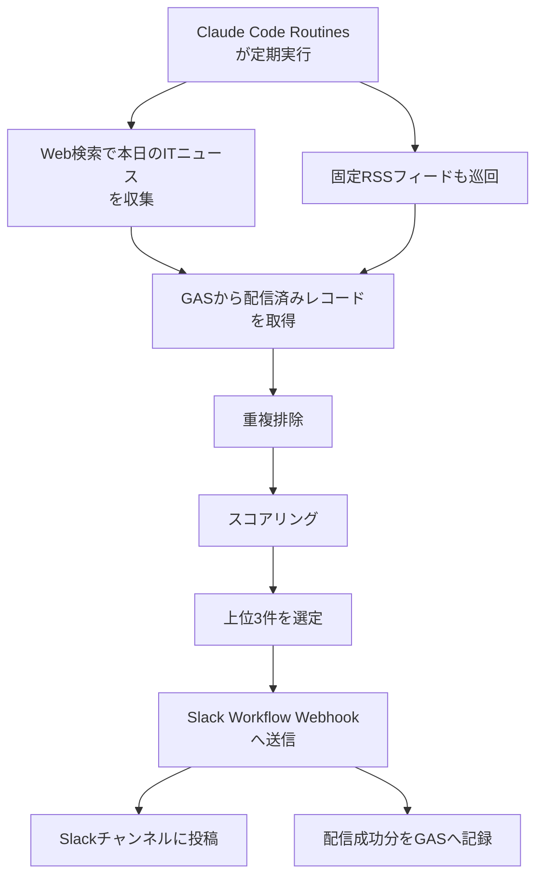
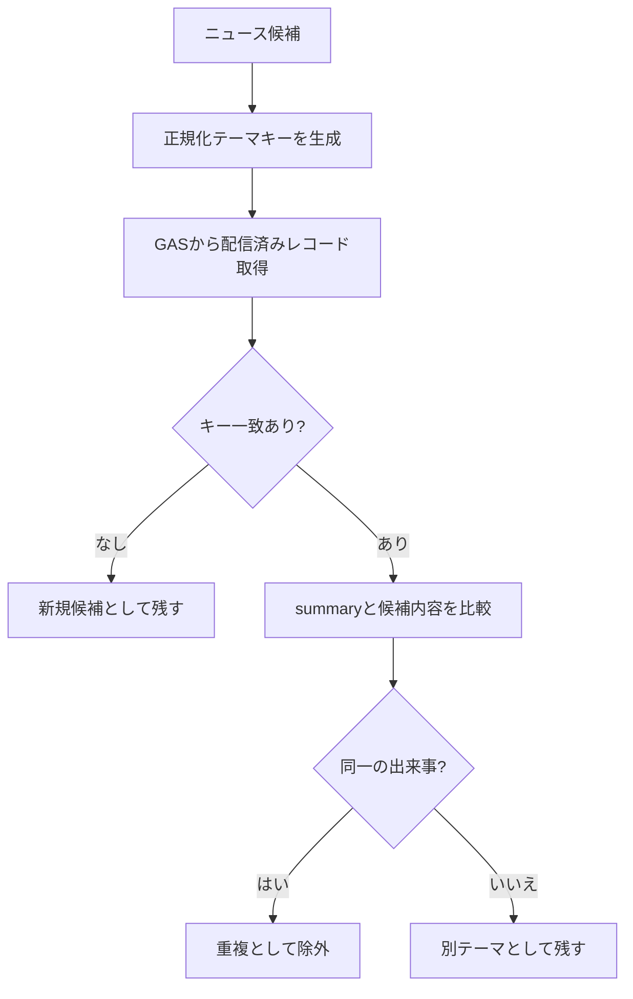
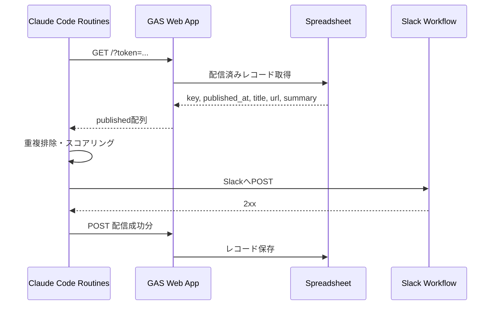
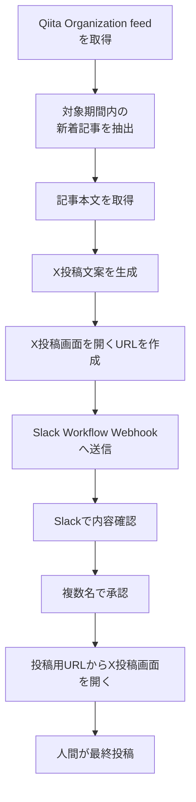

## 0. はじめに
LLMを使った定期タスクを作りたいと思い、ChatGPTやClaudeと壁打ちしながらいくつかの方式を検討しました。

やりたかったことは、ざっくり言うと次のような仕組みです。

* API従量課金なしで動かしたい
* 既に契約しているChatGPTやClaudeのサブスク利用範囲内で試したい
* ローカルPCや自前サーバーを常時起動したくない
* LLMに定期的な調査・要約・文章生成をさせたい
* 結果はSlackに通知したい
* 必要に応じて、人間の確認や承認を挟みたい

候補として、GAS、GitHub Actions、Cloudflare Workers、ローカルcron、各種自動化サービスなども考えました。
その中で、今回の用途には**Claude Code Routines**がかなり相性よく感じました。
この記事では、Claude Code RoutinesとSlack Workflow、GASを組み合わせて、次の2つの自動化を作った事例を紹介します。

1つ目は、技術広報チーム向けに、Qiita記事公開後のX紹介ポスト文案を生成する仕組みです。

2つ目は、毎朝ITニュースを収集し、重要度をスコアリングして、上位3件をSlackへ投稿する仕組みです。

本記事では、後者の **ITニュースキャッチアップ**の仕組みを中心に紹介します。

:::note info
**Claude Code Routinesとは？**
Claude Codeで行う作業を自動実行するための機能です。  
プロンプトや接続先、実行タイミングを保存しておくことで、スケジュール実行、API呼び出し、GitHubイベントなどをきっかけに、Anthropic管理のクラウド上でClaude Codeを動かせます。
:::

https://code.claude.com/docs/ja/routines


## 1. 作ったもの
今回メインで紹介するのは、毎日自動でITニュースを収集し、チーム向けに重要そうなニュースだけをSlackへ投稿する仕組みです。

全体像は以下です。



Slackには、次のような形式で投稿しています。

```text
AWSが脆弱性管理プラットフォーム「Continuum」発表
AWSはコードスキャンにとどまらず、インフラ構成・アクセス権限・ネットワークトポロジー・ビジネスコンテキストを統合してAIが脆弱性を推論する「AWS Continuum」をAWS Summit New Yorkで発表した。検出・優先度付け・検証・サンドボックスでの再現・修正提案という4フェーズを自動化し、偽陽性排除を担保する設計が特徴。複数フロンティアモデルを使い分けるモデル非依存型で、既存のペネトレーションテスト機能も本プラットフォームへ統合された。AWSを使う開発・運用チームは脆弱性対応ワークフローの大幅自動化が期待でき、セキュリティ体制を見直す好機となる。
https://aws.amazon.com/blogs/security/introducing-aws-continuum-security-at-machine-speed/
```

投稿する情報は、シンプルに以下の3つです。

* タイトル
* 要約
* URL

あえて件数は**上位3件**に絞っています。
最初から10件、20件と流してしまうと、読む側の負荷が高くなり、すぐに形骸化しそうだと考えたためです。


## 2. なぜClaude Code Routinesを選んだか
今回の要件では、Claude Code Routinesが一番シンプルでした。

比較した観点は以下です。

| 方式                         | よさ                   | 気になった点                         |
| -------------------------- | -------------------- | ------------------------------ |
| GAS + LLM API              | 手軽に定期実行できる           | LLM APIの従量課金が発生する              |
| GitHub Actions + LLM API   | CI/CDに慣れていれば扱いやすい    | LLM APIキーや課金管理が必要              |
| Cloudflare Workers         | 自前で柔軟に作れる            | LLMへの接続や状態管理を実装する必要がある         |
| ローカルcron + Claude Code CLI | 手元では試しやすい            | PCを起動しておく必要がある                 |
| Claude Code Routines       | LLMの判断を含む定期タスクを作りやすい | Research Previewのため仕様変更の可能性がある |

Claude Code Routinesは、プロンプト、接続先、実行タイミングなどをまとめて定義し、自動実行できます。

今回のように、

* Web検索する
* RSSを読む
* ニュースの価値を判断する
* 要約する
* Slackへ送る
* 配信済み情報を記録する

といった「判断を含む定期タスク」では、単純なcronやスクリプトだけで組むよりも、LLMに任せる部分を自然に定義できました。
もちろん「API従量課金なし」といっても、完全無料という意味ではありません。
Claudeのサブスク利用範囲内で実行できる、という意味です。
実行回数や利用量の上限はあるため、業務クリティカルな本番バッチの代替というより、まずは軽量な社内自動化や個人・チーム向けの補助タスクに向いていると感じました。


## 3. 構成

構成要素は以下です。

| 要素 | 役割 |
| --- | --- |
| Claude Code Routines | 定期実行、ニュース収集、重複判定、スコアリング、要約、Slack配信 |
| Web検索 | 当日のITニュースを広く収集する主軸 |
| 固定RSSフィード | 特定ソースを確実に拾う補完経路 |
| GAS | 配信済みニュースの状態管理 |
| Googleスプレッドシート | GASの保存先 |
| Slack Workflow Webhook | Slack投稿の入口 |
| Slackチャンネル | チームがニュースを確認する場所 |

ニュース収集は、Web検索を主軸にしつつ、固定RSSフィードで補完する構成にしています。収集対象は、AI/LLM・開発生産性を最優先としつつ、クラウド、セキュリティ、フロントエンドなど、開発・運用に関係するニュースを広く拾う方針です。
Web検索では、その日に話題になっているニュースを広く拾います。

一方で、固定RSSフィードでは、継続的に確認したい特定ソースを確実に押さえます。
どちらか一方だけにすると、Web検索では拾い漏れが出たり、固定RSSフィードだけでは範囲が狭くなったりします。  
そのため、Web検索で広く集め、固定RSSフィードで重要なソースを補う形にしました。

また、固定RSSフィードは環境変数でリスト定義できるようにしており、運用しながら追加・差し替えできるようにしています。


## 4. 重複排除・スコアリング
### 重複排除
運用を考えるうえで重要だと感じたのが、重複排除です。
ITニュースは、同じテーマを複数メディアが扱うことがよくあります。
単純にURLだけで重複判定すると、別URLの同一ニュースが何度もSlackに流れてしまいます。
一方で、製品名や企業名だけで雑に重複判定すると、別の出来事まで除外してしまう可能性があります。
そこで、重複排除は2段階にしました。



まず、各候補について正規化テーマキーを作ります。
例としては以下のようなイメージです。

```text
OpenAIが新モデルGPT-X発表
=> openai-gpt-x-release

AWS、東京リージョンで障害
=> aws-tokyo-region-outage
```

キーには、製品名、企業名、CVE番号、バージョン番号、出来事の種類などを含めるようにしています。
そのうえで、GASに保存している配信済みレコードと比較します。
GAS側には、以下の情報を保存しています。

| 列            | 内容       |
| ------------ | -------- |
| key          | 正規化テーマキー |
| published_at | 配信日時     |
| title        | 配信したタイトル |
| url          | 配信したURL  |
| summary      | 配信した要約   |

キーが一致しないものは新規候補として残します。
キーが一致した場合は、さらに候補の要点と過去配信済みの`summary`をLLMに読み比べさせます。
判定基準は以下です。

```text
同一と見なす:
主語（製品・企業・CVE等）と出来事が実質同じ。
続報・別媒体の報道も含む。

別テーマと見なす:
キーは共通でも、出来事・観点が異なる。

迷う場合:
残すことを優先する。
```

ここでは、重複配信よりも取りこぼしの方が損失が大きいと考えています。
そのため、迷った場合は除外せず、配信候補に残す方針としています。

### スコアリング
重複排除後、各テーマをスコアリングします。
スコアリングは以下の4観点です。

| 観点      | 重み | 採点の目安                 |
| ------- | -: | --------------------- |
| 実務インパクト | ×3 | 開発・運用判断に影響しそうなものを高くする |
| 新規性     | ×2 | 今日の新しい動きを高くする         |
| 信頼性     | ×2 | 一次情報や公式発表を高くする        |
| 関心領域の合致 | ×1 | チームの関心領域に合うものを高くする    |

基礎スコアは以下です。

```text
基礎スコア = 実務インパクト×3 + 新規性×2 + 信頼性×2 + 関心領域の合致×1
```

満点は40点です。
さらに、複数の独立したソースが同一テーマを報じている場合は、注目度ボーナスを加えます。

```text
出現ソース数が2    => +2点
出現ソース数が3以上 => +4点
出現ソース数が1    => 加点なし
```

最終スコアは以下です。

```text
最終スコア = 基礎スコア + 注目度ボーナス
```

最終的に、スコアの高い順に上位3件をSlackへ配信します。
配信候補が3件に満たない場合は、無理に埋めません。
この点も重要だと思っています。
ニュース配信は「毎日必ず3件出すこと」よりも、「読む価値があるものだけ流すこと」の方が大事だからです。


## 5. Slack WorkflowとGASによる配信・状態管理
Slack側では、WorkflowのWebhookトリガーを使っています。
Claude Code Routinesからは、ニュース1件につき1回POSTします。
送信するJSONは以下のような形です。
```json
{
  "title": "ニュースタイトル",
  "summary": "ニュースの要約",
  "url": "https://example.com/news"
}
```

Slack Workflow側では、`title`、`summary`、`url` を変数として受け取り、チャンネルへ投稿します。
3件配信する場合は、1回のPOSTにまとめるのではなく、3回POSTします。
Slack上ではニュースごとに独立した投稿として見えるため、読みやすくなります。
投稿イメージは以下です。


配信済みニュースの保存にはGASを使っています。
理由はシンプルです。
* 手軽に作れる
* GoogleスプレッドシートをDBのように使える
* Web Appとして公開すればAPIとして呼び出せる
* 今回の用途では本格的なDBを用意するほどではない

GASでは、GETで配信済みレコードを返し、POSTで配信成功分を保存します。
Claude Code Routines側では、重複排除の前にGETし、Slack配信に成功した後でPOSTします。



<details><summary>今回の用途に合わせたGASのサンプル</summary>

:::note alert
GAS Web AppをAPIエンドポイントとして公開する場合は、必ずトークンなどによる認証を入れてください。
URLを知っていれば誰でもアクセスできる状態にすると、配信履歴の取得や不正なレコード登録ができてしまう可能性があります。
今回のサンプルでは、API_TOKENをスクリプトプロパティに保存し、リクエスト時に渡された tokenと一致する場合のみ処理するようにしています。
:::

```javascript
const SHEET_NAME = 'published';
const EXPIRE_DAYS = 14;
const TOKEN = PropertiesService.getScriptProperties().getProperty('API_TOKEN');

function doGet(e) {
  if (e.parameter.token !== TOKEN) return json_({ error: 'unauthorized' });
  const sheet = getSheet_();
  const rows = sheet.getDataRange().getValues().slice(1);
  const now = Date.now();
  const published = rows
    .filter(r => r[0] && (now - new Date(r[1]).getTime()) < EXPIRE_DAYS * 86400000)
    .map(r => ({ key: r[0], published_at: r[1], title: r[2], url: r[3], summary: r[4] }));
  return json_({ published: published });
}

function doPost(e) {
  const body = JSON.parse(e.postData.contents);
  if (body.token !== TOKEN) return json_({ error: 'unauthorized' });
  const sheet = getSheet_();
  const ts = new Date().toISOString();
  (body.entries || []).forEach(en => {
    sheet.appendRow([en.key, ts, en.title || '', en.url || '', en.summary || '']);
  });
  return json_({ added: (body.entries || []).length });
}

function getSheet_() {
  const ss = SpreadsheetApp.getActiveSpreadsheet();
  let sheet = ss.getSheetByName(SHEET_NAME);
  if (!sheet) {
    sheet = ss.insertSheet(SHEET_NAME);
    sheet.appendRow(['key', 'published_at', 'title', 'url', 'summary']);
  }
  return sheet;
}

function json_(obj) {
  return ContentService
    .createTextOutput(JSON.stringify(obj))
    .setMimeType(ContentService.MimeType.JSON);
}
```
</details>

Claude Code Routines側からは、以下のようにGETします。
```bash
# Claude Code Routinesの環境変数にGAS_TOKENを設定しておきます。
# GAS_TOKEN=*********
curl -s "$GAS_URL?token=$GAS_TOKEN"
```

POST時は、配信成功したニュースだけをまとめて保存します。

```json
{
  "token": "<GAS_TOKEN>",
  "entries": [
    {
      "key": "aws-continuum-release",
      "title": "AWSが脆弱性管理プラットフォーム「Continuum」発表",
      "url": "https://example.com",
      "summary": "AWSがAIを活用した脆弱性管理プラットフォームを発表した。検出から修正提案までの自動化が特徴。"
    }
  ]
}
```

ポイントは、Slack配信に成功したものだけを記録することです。
Slack配信に失敗したニュースまで記録してしまうと、次回以降に「配信済み」と見なされてしまいます。
そのため、配信成功後にだけGASへ記録するようにしています。


## 6. Claude Code Routinesのプロンプト設計
Claude Code Routinesでは、通常のチャットとは違い、途中で人間の確認を挟むことができません。
そのため、プロンプトには以下のような前提を明記しています。

```text
あなたはエンジニア組織向けのITニュースキュレーターです。
本日分の技術ニュースを収集・選別・要約し、Slackに配信してください。
対話的な確認はできないため、以下の手順と基準に厳密に従って自律的に完遂してください。
```

また、Secretとして以下の環境変数を使う前提にしています。

```text
SLACK_WEBHOOK_URL
SOURCE_FEEDS
GAS_URL
GAS_TOKEN
```

さらに、プロンプトでは、これらの値をログやSlack本文に出さないように明記しています。

```text
secret（URL・トークン）をログや配信本文に出力しない。
```

定期実行ジョブでは、以下を明確にしておくと安定しやすいです。

* 何を収集するか
* どのソースを必ず見るか
* 重複をどう判定するか
* 何件配信するか
* SlackにどのJSON形式で送るか
* 配信成功後に何を記録するか
* エラー時にどう振る舞うか
* 人間に確認せず完了すること

特に「人間に確認しない」は重要です。
チャットであれば「この条件で進めてよいですか？」と聞かれても問題ありません。
しかし、定期実行タスクではそこで止まってしまいます。
そのため、プロンプトには「不明点があっても自律的に判断する」「候補が足りない場合は無理に埋めない」「取得に失敗したソースはSlackに報告する」なども含めています。


## 7. 技術広報フローへの応用
今回のITニュース配信を作る前に、技術広報チーム向けの自動化も作りました。
内容は、組織内のQiita記事が公開された後に、Xで紹介するためのポスト文案を生成する仕組みです。
流れは以下です。



このフローでは、Claude Code RoutinesからSlack Workflow Webhookへ、以下の4項目を送っています。

```json
{
  "title": "記事タイトル",
  "url": "記事URL",
  "post": "X投稿文案",
  "x_post_url": "X投稿画面を開くURL"
}
```

Slack Workflow側では、受け取った投稿文案をチーム内で確認し、複数名の承認後に投稿用URLを表示する流れにしています。
Xへの投稿自体は自動化していません。
これは意図的です。
技術広報の投稿は、会社としての見え方や表現のトーンが重要です。
そのため、LLMには下書き作成までを任せ、最終的な投稿は人間が確認して行うようにしています。
生成される投稿文案は、以下のような形式です。

```text
📙テックブログ更新📙
弊社エンジニアが、Claude Codeを活用して開発フローを改善した事例を記事にしました！
AIを使った開発効率化やチームでの活用に関心のある方はぜひご覧ください👀

#Qiita
{記事URL}
```

このフローを作ったことで、LLMによる自動検知、文章生成、Slack通知、人間承認という流れを一度作れました。
その応用として、ITニュースキャッチアップの仕組みも比較的スムーズに作れました。
ちなみに、こうしたQiita記事の公開時には技術広報アカウントで発信していますので、ぜひフォローしてください。

https://x.com/KIYOLEARN_TECH


## 8. 使ってみてよかったこと
### API従量課金なしでLLM定期タスクを作れた
一番大きいのは、API従量課金なしで、LLMを使った定期タスクを形にできたことです。
LLM APIを使う構成だと、APIキーの管理、利用量の監視、費用の見積もりなどを考える必要があります。
もちろんClaude Code Routinesにも利用上限はありますが、まず小さく試すにはかなり手軽でした。

### Slackチャンネルを見る習慣ができた
ITニュースキャッチアップ用のSlackチャンネルを作り、そこに毎朝ニュースが流れるようにしました。
これにより、始業前にITニュースを確認する習慣が自然とつきました。
ニュースサイトを自分から巡回しようとすると続きにくいですが、Slackに必要そうなものだけ流れてくると、確認のハードルが下がります。

### 作るのが簡単だった
ハマりどころは、今のところほとんどありませんでした。
ClaudeやChatGPTと相談しながら、要件をプロンプトに落とし込んでいくと、すんなり動くところまで持っていけました。
個人的には、コードを大量に書くというよりも、「定期実行ジョブとして破綻しないプロンプトを作る」ことが重要だと感じました。


### 注意点
:::note warn
**Research Previewである**
Claude Code Routinesは、現時点ではResearch Previewです。
今後、仕様や制限が変わる可能性があるため、本格的な業務クリティカル処理に使う場合は、その前提を踏まえておく必要があります。
:::

:::note warn
**Secretの扱いに注意する**
Slack Webhook URLやGASのトークンは、絶対にプロンプト本文やログに出さないようにするため、プロンプト内にも、制約を入れています。
:::

:::note warn
**LLMの判断は完全ではない**
スコアリングや重複判定はLLMに任せていますが、完全ではありません。
続報まで重複として除外してしまうなどの問題が出る可能性があります。
:::


## 9.まとめ
Claude Code Routinesを使うことで、API従量課金なしでLLM定期タスクを簡単に作ることができました。

今回作ったのは、主に以下の2つです。

* Qiita記事公開後のX紹介ポスト文案生成
* 毎朝のITニュース収集・スコアリング・Slack通知

特にITニュース配信では、Claude Code Routinesに以下を任せています。

* Web検索
* RSS巡回
* 重複排除
* スコアリング
* 要約
* Slack配信
* GASへの配信記録

一方で、状態管理はGASに出し、Slack Workflowを通知・確認の入口として使っています。

LLMにすべてを任せるのではなく、LLMが得意な判断・要約・文章生成と、外部ツールが得意な状態管理・通知・承認を組み合わせるのがポイントだと感じました。

今後は、よりチームに合うニュースソースの追加や、AI/LLM・クラウド・セキュリティ・フロントエンドなどの領域別配信も試してみたいと考えています。  
また、Slack上のリアクションやコメントをもとに、よく読まれたニュースや実際に業務に影響があったニュースをスコアリングへ反映できると、より実用的な仕組みにできそうです。

Claude Code Routinesは、ニュース配信だけでなく、以下のような用途にも応用できそうです。

* 技術広報の投稿文案作成
* リリース情報の定期監視
* 障害・セキュリティ情報の収集
* 社内ナレッジの定期整理
* GitHub IssueやPRの棚卸し
* チーム向けの定期レポート作成

Slack通知や業務自動化に興味がある人にとって、Claude Code Routinesはかなり試しやすい選択肢だと思います。


## KIYOラーニング株式会社について
当社のビジョンは『世界一「学びやすく、分かりやすく、続けやすい」学習手段を提供する』ことです。革新的な教育サービスを作り成長させていく事で、オンライン教育分野でナンバーワンの存在となり、世界に展開していくことを目指しています。

https://kiyo-learning.com/

### プロダクト

* [スタディング](https://studying.jp/)：「学びやすく・わかりやすく・続けやすい」オンライン資格対策講座
* [スタディングキャリア](https://career.studying.jp/)：資格取得者の仕事探しやキャリア形成を支援する転職サービス
* [AirCourse](https://aircourse.com/)：受け放題の動画研修がついたeラーニングシステム（LMS）

### KIYOラーニング株式会社では一緒に働く仲間を募集しています

https://herp.careers/v1/kiyolearning
