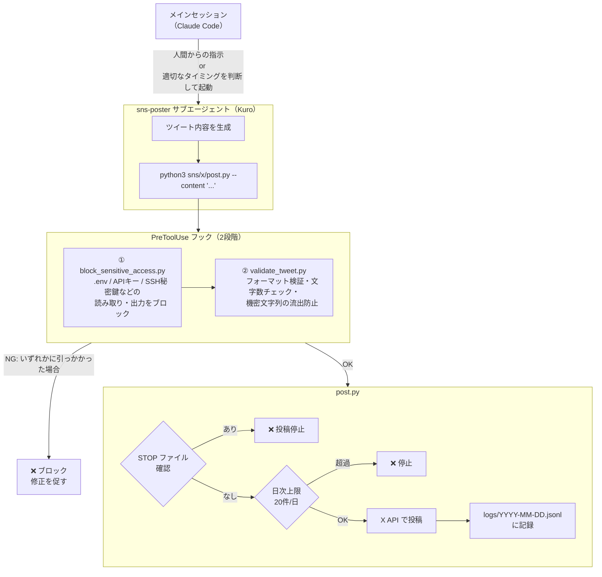

## やったこと

Claude Code で開発ログを X に自動投稿できるようにしました。

考えた設計がことごとく実装できず、なかなか思ったとおりにはいかないなと思ったので、そのボツになった案も含めて共有します。

「AI Agent を使って自動で SNS 運用したい」と思っている方の参考になれば。

---

## ボツ①：X API に下書き保存機能がない

最初に考えた設計

```
Claude が投稿文を生成
→ X API で下書き保存
→ 人間がレビュー
→ 承認して投稿
```

「いきなり投稿するのは不安なので、人間が確認してからにしよう」という発想です。

X API のドキュメントを調べてみると、下書き保存のエンドポイントが存在しないことがわかりました。X アプリの下書き機能はデバイスローカルか X Pro に紐づいており、API から書き込む方法がありませんでした。

---

## ボツ②：GitHub Actions + Anthropic API が別課金

別で考えた設計

```
GitHub Actions (cron) → generate.py（Anthropic API 呼び出し）→ X API 投稿
```

定時に GitHub Actions が起動し、Anthropic API 経由でツイートを生成して投稿する、というものです。

Claude.ai のサブスクリプションと Anthropic API は完全に別の課金体系でした。

- **Claude.ai Pro / Max** → Web UI や Claude Code を使うための月額定額
- **Anthropic API** → プログラムから直接呼び出すための従量課金（別途 API キーの登録が必要）

---

## ボツ③：Stop フックはセッション終了を捕捉できない

次は投稿タイミングについてです。

最初は Stop フック（Claude が応答を終えるたびに発火するフック）を使用してサブエージェントを起動させる方針を考えました。

```
Claude が応答を終える
→ Stop フック発火
→ サブエージェント起動
→ 投稿スクリプト実行
```
claude にこの方針を伝えると、「`/clear` を打ったタイミングで Stop フックが発火し、コンテキストがクリアされた後の状態で投稿スクリプトが走ってしまう」と指摘されました。

直前のコンテキストがない状態で文章を生成するので、まともなツイートを作れません。

Stop フックについて、整理すると以下のとおりです。

- `/clear` でも Stop は発火するが、コンテキストクリア後なので「何を投稿するか」がわからない
- `/exit` では SessionEnd イベントが発火するが、そこでは Claude を呼び出せない
- 結局「各ターン終了時」にしか確実に発火せず、「作業のまとめ」的な投稿には向かない

こちらから明示的に呼び出すか、メインセッションの中で適当なタイミングで呼び出してもらうように切り替えました。

---

## 最終的なアーキテクチャ



### セキュリティの多層構造

**① block_sensitive_access.py（全エージェント共通）**

Claude Code の PreToolUse フックとして、Read ツールと Bash ツールの両方に適用されています。メインセッションもすべてのエージェントも、このフックを通過しない限り機密ファイルにアクセスできません。

ブロック対象：
- `.env` / `.env.local` 等（`.env.example` は除外）
- `.pem` / `.key` / SSH 秘密鍵
- `cat`・`head`・`tail` での `.env` 読み取りコマンド
- `printenv`（環境変数の全出力）

**② validate_tweet.py（サブエージェント用）**

`post.py --content` の呼び出し前にのみ発動するフックです。サブエージェントが生成したツイートを投稿する直前で内容を検査します。

検証内容：
- フォーマット（ヘッダー・吹き出し形式）
- 文字数制限
- ハッシュタグ禁止
- 機密情報の流出防止（32文字以上の英数字列・IPアドレス・メールアドレス・機密ファイルパス）

**③ STOP ファイルと日次上限（post.py 側）**

フックをすり抜けても `post.py` 側でも制御があります。`sns/x/STOP` ファイルが存在すれば即停止、1日20件を超えた場合も自動で停止します。

### コンテキスト分離の恩恵

サブエージェント化によって、SNS 投稿の処理（ツイート生成・API 呼び出し・ログ記録）がメインセッションの会話履歴に混入しなくなります。

メインセッションは開発作業に集中したまま、投稿だけサブエージェントが独立して処理します。また Stop フックを使わないことで、「面白いことが起きた瞬間に投稿する」という柔軟なタイミング制御も可能になりました。

---

## まとめ

- **X API に下書き機能はない** 
モバイルアプリの機能と API でできることは別物なので、「アプリでできる＝APIでもできる」とは限らない

- **Claude.ai と Anthropic API は別の課金体系** 
Claude Code セッション内で完結できるなら、別途 API キーを持ち込まない設計のほうがシンプル

- **Stop フックはセッション終了の捕捉には向いていない** 
「ターン終了」と「セッション終了」は別の概念で、後者は思ったより捕捉しにくい

設計が3回変わりましたが、やってみないと気づけなかったことも多かったです。どの内容もネットを探せば落ちているようなものですが、実際に触りながら知ることに意味があると思っています。

今後も小さな **気づき** を継続的に発信していきます。
