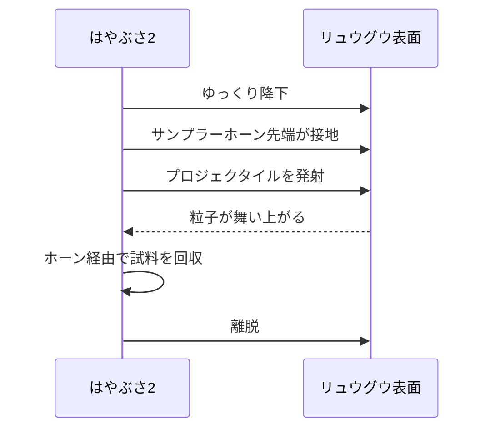

:::note info
この記事は **Claude Code** と **llm-task-router**（Claude・Codex）を用いて作成しました。
ファクトチェックの参考リンクを追加したバージョンです。
:::

「はやぶさ2」という名前は知っていても、**いつ打ち上がって、どこへ行き、何を持ち帰ったのか**を時系列で説明できる人は意外と多くありません。

この記事では、宇宙工学の専門知識を前提にせず、**技術の細部を深掘りするというより、ミッション全体の流れを時系列の物語としてたどること**に重点を置きます。  
**打ち上げ → リュウグウ到達 → 試料採取 → 地球帰還 → 拡張ミッション**までを、一本の物語として読み解きます。  
専門用語には短い補足を添えつつ、**初代はやぶさとの違い**もあわせて整理します。

読み終えたときに、「はやぶさ2」は単なる感動的な探査ではなく、**“小惑星へ行き、採り、持ち帰る”往復探査を確かな技術として定着させたミッション**だった、とつかめることを目指します。

---

## 導入：なぜ小惑星に行くのか

小惑星はしばしば、「**太陽系の化石**」のような存在だと説明されます。  
もちろん本当に化石という意味ではありませんが、**太陽系ができた初期の材料や状態を比較的よく残している可能性がある**、という点でこの表現はとてもわかりやすいです。

地球上の岩石は、長い時間の中で次のような影響を受けます。

- 風化
- 水との反応
- 火山活動
- プレート運動などの地殻変動
- 生物活動

そのため、**地球の石だけを見ても、太陽系のいちばん初期の姿をそのまま読むのは難しい**のです。

一方で小惑星、とくに原始的なタイプのものは、そうした改変を比較的受けずに残っている可能性があります。だからこそ価値があるのは、単に望遠鏡で見ることや、近くで写真を撮ることだけではありません。

**実物を地球へ持ち帰ること**に、大きな意味があります。

地球上の研究室では、探査機に載せられる装置よりもはるかに高性能な分析ができます。  
つまり小惑星探査は、

1. 現地で観測する
2. 試料を採る
3. 地球へ持ち帰って精密分析する

という流れになって初めて、科学的価値が大きく広がります。

:::note info
S型・C型といった分類は、主に**反射スペクトル**に基づく小惑星の分類です。  
一般向けには「岩石質か、より炭素質で原始的か」という理解で十分ですが、厳密には観測スペクトルと組成推定が結びついた分類です。
:::

---

## 初代はやぶさの遺産：2010年の帰還が残したもの

はやぶさ2を理解するうえで、まず外せないのが**初代はやぶさ**です。

初代はやぶさは小惑星**イトカワ**を目指し、数々のトラブルに見舞われながらも、**2010年に地球へ帰還**しました。  
この帰還は、ただの「すごい挑戦」ではなく、**小惑星への往復探査が現実に成立しうる**ことを示した歴史的な出来事でした。

ただし、その道のりは決して順調ではありませんでした。  
探査機はさまざまな不具合を抱え、まさに**満身創痍**の状態で帰ってきたことで知られています。

初代が残したものは、次の2つです。

- **成功**：遠い小惑星まで行き、地球へ戻るという往復探査の可能性を示した
- **教訓**：推進系や運用面で改善すべき点を具体的に残した

はやぶさ2は、この両方を受け継いでいます。  
つまり、**初代の感動をなぞる続編**ではなく、**成功と反省を取り込んだ**“次の世代の再挑戦”でした。

### 初代はやぶさとの違い

| 項目 | 初代はやぶさ | はやぶさ2 |
|---|---|---|
| 打ち上げ | 2003年 | 2014年 |
| 目的天体 | イトカワ | リュウグウ |
| 小惑星の型 | S型 | C型 |
| 主な狙い | 小惑星試料回収の実証 | より原始的な物質の回収と往復探査の高度化 |
| サンプラー | 接触採取方式の設計思想を採用 | 接触採取方式を継承しつつ、運用信頼性を向上 |
| 特徴的な搭載機器 | MINERVA | MINERVA-II、MASCOT、SCI |
| ミッション設計 | 先駆的挑戦 | 初代の教訓を反映した改良型 |

:::note info
初代はやぶさと、はやぶさ2のサンプラーは、どちらも**接触して舞い上がった粒子を回収する**という基本思想を共有しています。  
ただし重要なのは、**初代ではイトカワでのタッチダウン時にプロジェクタイル（弾丸）の正常発射が確認できず、回収試料は主に接地時に舞い上がった微粒子とされる**点です。  
このため、「方式は近いが、実運用での弾丸発射の成否は大きく異なる」と理解すると正確です。詳細はJAXAの公式発表・一次情報の確認をおすすめします。
:::

ここで重要なのは、**目的天体の違い**です。

- **S型小惑星**：岩石質で比較的乾いたタイプ
- **C型小惑星**：炭素に富み、水を含む鉱物や有機物に関わる手がかりが期待される原始的なタイプ

はやぶさ2がC型のリュウグウを選んだのは、**太陽系初期の化学進化を探るうえで、より重要な手がかりが得られる可能性があったから**です。

---

## 打ち上げ：2014年12月、種子島から始まった旅

はやぶさ2の物語の出発点は、**2014年12月**です。  
このとき、探査機は**種子島宇宙センター**から打ち上げられました。

ここから始まったのは、何億km級に及ぶ長い旅です。

目的地の**リュウグウ**は、**地球近傍のC型小惑星**とされます。  
C型というのは、ひとことで言えば、

- **炭素に富む**
- **比較的原始的な物質を含む**
- **水や有機物に関する手がかりが残っている可能性がある**

というタイプです。

### なぜリュウグウだったのか

リュウグウが注目された理由は、単に近づけるからではありません。  
科学的には、**太陽系初期の物質**や、**生命の材料に関わる化学**を考えるうえで重要な候補だったからです。

つまり、はやぶさ2は最初から

- 行ってみる
- 着いてみる

だけではなく、

- **原始的な物質を採って持ち帰る**

ことをはっきり狙った探査でした。

---

## 往路の航行：イオンエンジンと地球スイングバイ

宇宙探査というと、どうしても打ち上げや着陸のような派手な場面に目が行きます。  
しかし、はやぶさ2の往路で本当に重要だったのは、むしろ**地道で緻密な航行技術**でした。

### イオンエンジンとは何か

はやぶさ2の特徴のひとつが、**イオンエンジン**です。

これは簡単に言えば、

> 電気の力でイオンを加速し、少しずつ長く推力を出し続ける仕組み

です。

一気に強い力を出すタイプではありませんが、**燃費が非常によい**のが大きな利点です。  
**同じ量の燃料でも、噴き出す粒子の速さが非常に大きいため、少ない燃料で長く加速し続けやすい**のです。  
遠くの小惑星へ向かうには、この「弱いけれど長く押し続ける」推進がとても有効です。

### 地球スイングバイとは何か

もうひとつ重要だったのが、**地球スイングバイ**です。

これは、

> 地球の重力を利用して、探査機の軌道や速度を調整する飛び方

です。

ガソリンをたくさん積んで一直線に飛ぶのではなく、**天体の重力そのものを**“使う”ことで、限られた燃料の中で効率よく目的地へ向かいます。

### リュウグウまでの距離感

では、リュウグウは地球から見てどれくらい遠いのでしょうか。  
ここで大事なのは、**「直線距離の目安」と「実際に飛んだ道のり」は別物**だということです。まずは、直線距離のスケール感をつかむための目安を並べます。

| 天体／対象 | 地球からの距離の目安 | 月までを1とすると（相対値） | ひとこと補足 |
|---|---|---:|---|
| 月 | 約38.4万km | 1 | いちばん身近な天体 |
| 太陽 | 約1天文単位（約1.496億km） | 約389 | 地球はこの距離で太陽を回っている |
| リュウグウ | **基準：軌道長半径** 約1.19天文単位（約1.8億km級） | 約460〜470 | 軌道天体なので、地球からの実際の距離は時期で変わる |

ここでのリュウグウの値は、**「地球から常にこの距離にある」という意味ではありません**。  
あくまで、**リュウグウの軌道の大きさを表す長半径を基準にした目安**です。正確な値は、JAXAなどの一次情報で確認するのが確実です。

そして、ここが往路の面白いところです。  
**地球からリュウグウまでの直線距離の感覚は数億km級**ですが、はやぶさ2が**実際に飛んだ総航行距離**は**約32億km級**にのぼります。  
なぜそんなに長くなるのかというと、**直線で飛ぶのではなく、太陽のまわりの軌道を回り込みながら、イオンエンジンで少しずつ加速し、地球スイングバイで軌道と速度を調整して向かったから**です。  
つまり、ここまで説明してきた**イオンエンジン**と**地球スイングバイ**こそが、この「直線距離よりずっと長い旅」を成立させた鍵でした。

ちなみにこの「約32億km」は、2014年の打ち上げで選ばれた経路での値です。地球もリュウグウも太陽のまわりを回っているため、出発する時期によって効率のよい経路は変わります。だから探査機は、いつでも飛び立てるわけではなく、限られた「打ち上げウィンドウ」を狙って出発します。

### 実際の時系列

はやぶさ2の往路は、単純な一直線ではありませんでした。  
**2015年12月に地球スイングバイ**を行い、その前後でもイオンエンジンによる巡航を継続しています。

### 往路は地味だが、本質的に重要

往路はニュースとしては地味に見えがちです。  
しかし実際には、

- 燃料を節約し
- 長期間の機器運用を維持し
- 精密に軌道を調整して
- 最終的に小惑星へたどり着く

という、ミッション全体の土台そのものでした。

---

## 2018年6月、リュウグウ到達：見えてきた予想外の難しさ

**2018年6月**、はやぶさ2はついに**リュウグウへ到達**しました。  
ここからが本格的な現地運用の始まりです。

到達してわかったのは、リュウグウが**想像以上に作業しにくい天体**だったことでした。

### リュウグウはどんな天体だったか

リュウグウの全体形状は、しばしば

- **コマ型**
- **そろばんの玉型**

のようだと表現されます。

加えて、基本的な諸元を見るだけでも運用の難しさが伝わります。

| 項目 | 内容 |
|---|---|
| 直径 | 約900m |
| 形状 | コマ型に近い |
| 自転周期 | 約7.6時間 |
| 表面 | 岩が多く、平坦地が少ない |

表面を詳しく見ると、**岩が非常に多く、平坦で安全そうな場所が少ない**ことがわかりました。

### 何が難しかったのか

探査機にとって重要なのは、単に近くまで行くことではありません。  
**安全に降下し、正確に試料を採れる場所を見つけること**が必要です。

ところがリュウグウでは、

- 障害物が多い
- 平らな領域が少ない
- 誤差がそのまま接触事故につながりやすい

という状況でした。

これは、宇宙探査の難しさをよく表しています。  
**「着いたら終わり」ではなく、着いてから本番**なのです。

:::note warn
小惑星への到達は大きな節目ですが、実際の難所はその後の「現地でどう動くか」にあります。  
リュウグウは、まさにその難しさを強く示した天体でした。
:::

---

## 着陸機・ローバの投下：小惑星表面から見えた景色

はやぶさ2は本体だけで観測したのではありません。  
**MINERVA-II**のローバ群や、**MASCOT**といった着陸機・小型探査機を投下し、**リュウグウ表面からの観測**を行いました。

### なぜ「跳ねる」のか

小惑星表面では重力が非常に弱いため、地球の自動車のように**車輪でしっかり地面を押して走る**のは簡単ではありません。  
強く押すと、逆に本体がふわっと浮いてしまうからです。

そこで採られたのが、**跳ねるように移動する設計**でした。

これは直感に反しますが、**弱重力環境では合理的な移動方法**です。

### 表面観測の価値

これらのローバや着陸機によって得られたのは、単なる「現地の写真」以上のものでした。

- 岩の多い環境
- 表層の粒子や地形の特徴
- 温度や物質的性質に関する情報

こうしたデータによって、リュウグウの表面が**どれほど厳しい現場なのか**が具体的に見えてきました。

本体からの遠景だけでは見えない、“**地面の実感**”がここで得られたのです。

---

## 1回目のタッチダウン：2019年2月、試料採取の瞬間

はやぶさ2の大きな山場のひとつが、**2019年2月の1回目のタッチダウン**です。

### タッチダウンとは何か

ここでいうタッチダウンは、単なる「着陸」ではありません。  
**表面に接触して試料を採る瞬間**を指します。

はやぶさ2は、**サンプラーホーン**と呼ばれる採取機構を地表に接触させ、**プロジェクタイル（弾丸）を発射**し、その衝撃で舞い上がった粒子をホーン経由で回収する方式を採りました。

流れを簡単にすると、次のようになります。

### なぜ難しいのか

この運用は、到達そのものとは別次元の難しさがあります。

必要なのは、

- 正確な位置制御
- 安全な降下
- 接触タイミングの最適化
- 限られた時間での確実な回収
- その後の安全な離脱

といった、非常に高精度の運用です。

### 初代との違いで見るポイント

ここで混同しやすいのが、**初代はやぶさ**との違いです。  
初代でも基本的な採取の考え方自体は近いものでしたが、**イトカワでのタッチダウン時にはプロジェクタイルの正常発射が確認できず、後に回収された微粒子は主に接地時の舞い上がりによるものとされています**。一方で、**はやぶさ2では1回目・2回目ともにプロジェクタイル発射を伴う採取運用が正常に実施**されました。

つまり1回目のタッチダウンは、  
「**小惑星へ行けるか**」ではなく、「**小惑星で実際に仕事ができるか**」を問う場面でした。

:::note info
初代はやぶさの弾丸発射状況や試料回収の経緯は、一般向け解説では簡略化されやすい部分です。  
厳密さを重視するなら、JAXAの公式報告や回収試料に関する一次情報をあわせて確認すると、はやぶさ2との違いがより明確に理解できます。
:::

---

## 人工クレーターと2回目のタッチダウン：地下物質を狙う

はやぶさ2のミッションをさらに特別なものにしたのが、**地下由来の試料を狙ったこと**です。

### SCIで人工クレーターをつくる

**2019年4月**、はやぶさ2は**SCI**（Small Carry-on Impactor：衝突装置）を用いて人工クレーターを作りました。

SCIは簡単に言えば、

> 小さな弾を高速でぶつけて、表面を掘り返す装置

です。

これによって、長く宇宙空間にさらされてきた表面だけでなく、**その下にあった物質**にアクセスしようとしました。

### なぜ地下物質を狙うのか

小惑星の表面は、長い年月のあいだに

- 太陽風
- 微小隕石の衝突
- 宇宙線

などの影響を受けます。  
この変化を**宇宙風化**と呼びます。

そのため表面物質は、初期状態からある程度変わっている可能性があります。  
そこで、**宇宙風化の影響を比較的受けにくい地下の物質**を採れれば、より原始的な情報を得られるかもしれません。

### 2019年7月、2回目のタッチダウン

**2019年7月**、はやぶさ2は人工クレーター近傍で**2回目のタッチダウン**を実施しました。  
これは、地下由来の試料回収を目指す運用でした。

### 1回目と2回目の違い

| 回数 | 時期 | 主な狙い | 意味 |
|---|---|---|---|
| 1回目 | 2019年2月 | 表面物質 | 現在の表層の状態を知る |
| 2回目 | 2019年7月 | 地下由来の物質 | より原始的な状態の手がかりを得る |

この対比が重要です。  
はやぶさ2は単に「2回採った」のではなく、**異なる意味をもつ試料を取り分けようとした**のです。

---

## 帰還：2020年12月、カプセルは地球へ、本体は次の旅へ

はやぶさ2の往復探査が大きな節目を迎えたのが、**2020年12月**です。

このとき、試料を入れた**カプセル**が**オーストラリアのウーメラ地区**へ投下され、無事に回収されました。

### 「地球へ帰った」のは誰か

ここで大事なのは、**地球へ帰還したのはカプセル**だという点です。  
探査機本体そのものが大気圏に突入したわけではありません。

本体はカプセルを分離した後、**地球をかすめるように通過し、次の目標へ向かう航行を続けました**。

この構図は、はやぶさ2のミッションを理解するうえでとても象徴的です。

- **カプセル**：試料を地球へ届ける
- **探査機本体**：その後も飛び続ける

### 往復探査の重み

「小惑星に着いた」だけでも大きな成果です。  
しかし、はやぶさ2が特別なのは、そこからさらに

- 試料を採り
- それを守って持ち帰り
- 地球上の研究へつなげた

ところにあります。

**到達ではなく、“持ち帰って終える”ところまで成立した**こと。  
これが、はやぶさ2の往復探査の重みです。

---

## 持ち帰った砂が語ったこと：リュウグウ試料の科学的成果

はやぶさ2の本当の意味は、帰還の瞬間だけでは終わりません。  
**持ち帰った試料をどう分析し、そこから何がわかったか**が、科学的な核心です。

### 回収量はどのくらいだったのか

リュウグウから持ち帰られた試料量は、**約5.4g**（小さじ1杯にも満たないごく少量）と公表されています。  
これは当初の目標だった**100mg**（0.1g）を大きく上回る成果でした。

宇宙探査では「数gしかない」と見えるかもしれませんが、  
**由来が明確で、地球外起源として厳密に扱える試料が数gある**こと自体が非常に大きな価値です。

### 何が見つかったのか

リュウグウ試料からは、**水を含む鉱物**や**多様な有機物**が確認されました。  
さらに、**20種類以上のアミノ酸**も検出されています。

これらは重要な成果ですが、意味づけには注意が必要です。

- **確定していること**：水を含む鉱物、有機物、アミノ酸が試料中に存在する
- **解釈に幅があること**：それらが太陽系初期のどのような化学進化を反映するか
- **飛躍してはいけないこと**：アミノ酸が見つかったからといって、生命そのものが見つかったわけではない

### どう受け止めるべきか

より適切に言えば、リュウグウ試料は、

> **生命の材料に関わる化学が、太陽系初期にどのように存在していたかを考える手がかり**

を与えてくれるものです。

### 科学的な意味

リュウグウは、比較的原始的な天体とされています。  
そのため、持ち帰られた試料は次のような問いに関わります。

- 太陽系初期の物質はどのようなものだったのか
- 水や有機物はどのように存在していたのか
- 地球の環境形成に小天体がどう関わったのか
- 生命の材料となる化学は宇宙でどこまで一般的なのか

:::note info
注目すべきなのは、**アミノ酸の検出そのもの**よりも、  
それが「どんな環境で」「どのような鉱物や水と結びついて」存在していたか、という文脈です。  
科学的には、存在の確認と起源の解釈は分けて考える必要があります。
:::

---

## その後：拡張ミッションで次の小惑星へ

はやぶさ2は、カプセル帰還で完全終了した探査機ではありません。  
**本体はその後も運用を継続**し、拡張ミッションとして別の小惑星を目指しています。

**2026年6月時点では**、現在の主目標として知られているのが**小惑星 1998 KY26**です。  
その前段階として、**2026年7月5日に小惑星トリフネ（仮符号 2001 CC21）をフライバイ**し、**相対速度約5km/s**で高速通過し、**トリフネに約1km程度まで接近する**計画です。  
その後、**2031年7月に1998 KY26へ到達**（ランデブー）を目指しています。

つまり時系列としては、

1. 2020年にカプセル帰還
2. その後も本体は深宇宙航行を継続
3. **2026年7月5日に小惑星トリフネ（2001 CC21）をフライバイ**
4. **その後、2031年7月に1998 KY26へ到達（ランデブー）を目指す**

という順番で理解すると整理しやすくなります。

:::note info
トリフネのフライバイは、相対速度約5km/sでの**高速すれ違い観測**です。  
一方で、トリフネは近接観測前のため、**素性（スペクトル型など）がまだ十分に確定しておらず**、事前の予想と実際の近接観測で見えてくる姿がずれる可能性があります。  
また、拡張ミッションの時期や運用計画は更新されることがあるため、**最新情報はJAXA公式・プロジェクト公式発表で確認する**のが確実です。
:::

最初の関門であるトリフネのフライバイは、2026年7月5日に迫っています。

### はやぶさ2は「終わっていない」

多くの人にとって、はやぶさ2は

- リュウグウへ行って
- 砂を持ち帰って
- 任務完了した探査機

という印象かもしれません。

しかし実際には、

- カプセルは地球へ帰り
- 本体は飛び続け
- 次の科学目標に向けた運用が続く

という形です。

つまり、はやぶさ2は  
「**帰還して終わった探査機**」ではなく、「**帰還後も飛び続ける探査機**」なのです。

---

## よくある質問（Q&A）

### Q1: 初代はやぶさとはやぶさ2は何が違う？

主な違いは次の通りです。

- **目的天体がイトカワからリュウグウへ変わったこと**
- **初代の教訓を受けて、運用や装置の信頼性向上が図られたこと**
- **SCI、MINERVA-II、MASCOTなど、現地探査の幅が広がったこと**

加えて、採取方式の基本思想は近いものの、**初代ではプロジェクタイル発射が正常に確認されなかったのに対し、はやぶさ2では発射を伴う採取運用が正常に実施された**点は、実運用上の大きな違いです。

科学的にも、S型のイトカワより、C型のリュウグウのほうが**より原始的な物質**を含む可能性があるとされ、回収試料への期待が大きくなりました。

### Q2: リュウグウはどんな小惑星？

リュウグウは、**地球近傍のC型小惑星**とされます。  
直径は約900m、自転周期は約7.6時間で、表面には岩が多く平坦地が少ないのが特徴です。  
炭素を多く含む比較的原始的な天体で、水や有機物に関わる手がかりが残っている可能性があります。

### Q3: 持ち帰ったのはどのくらい？

**約5.4g**です。  
これは当初目標の**100mg**を大きく上回る成果でした。

重要なのは量だけでなく、

- 由来が明確であること
- 汚染が抑えられていること
- 地球外物質として高精度に分析できること

に大きな意味がある点です。

### Q4: なぜ地球の砂ではだめ？

地球の物質は、水・空気・生物・地質活動の影響を強く受けています。  
そのため、太陽系初期の状態をそのまま読み取るのは難しい場合があります。

一方、小惑星試料は、**より初期の状態を保っている可能性**があり、太陽系の成り立ちを探るうえで特別な価値があります。

### Q5: はやぶさ2は今どうしている？

探査機本体は現在も拡張ミッションとして航行中です。2026年7月5日にトリフネ（2001 CC21）をフライバイし、2031年7月に1998 KY26へ到達する計画です。

---

## まとめ：はやぶさ2が残した意味と、次に追いたい点

はやぶさ2の物語は、次の時系列でつかむと見通しがよくなります。

| 年 | 出来事 | 意味 |
|---|---|---|
| 2014年 | 打ち上げ | 長い往復探査の出発点 |
| 2015年 | 地球スイングバイ | 重力を使った軌道変更 |
| 2018年 | リュウグウ到達 | 現地運用の開始 |
| 2019年 | 2度のタッチダウン、人工クレーター生成 | 表面・地下由来試料の回収 |
| 2020年 | カプセル帰還 | 往復探査の成立 |
| 2026年7月 | トリフネ（2001 CC21）フライバイ | 拡張ミッションの中間目標 |
| 2031年7月 | 1998 KY26 到達（予定） | 次の主目標天体 |

この記事で持ち帰りたい要点は、次の4つです。

1. **時系列の全行程**  
   打ち上げ（2014年）→ 地球スイングバイ（2015年）→ 到達（2018年）→ タッチダウン（2019年）→ カプセル帰還（2020年）→ **トリフネ（2001 CC21）フライバイ予定（2026年7月5日）** → **1998 KY26到達予定（2031年7月）**

2. **初代との違い**  
   イトカワからリュウグウへ対象が変わり、信頼性向上と現地探査手段の拡充が図られた。加えて、**サンプラーの基本思想は近くても、プロジェクタイル発射の実運用結果には重要な差があった**

3. **リュウグウ試料の科学的意義**  
   水を含む鉱物、有機物、アミノ酸の存在が、太陽系初期や生命関連化学の理解につながる

4. **拡張ミッションの継続**  
   はやぶさ2本体はいまも旅を続け、**まずトリフネ（2001 CC21）のフライバイ、その後1998 KY26到達**を目指している

はやぶさ2は、初代の奇跡的な帰還を一度きりの物語で終わらせず、  
**「往復できる探査」をより確かな技術として定着させた**ミッションでした。

今後ニュースを追うなら、特に注目したいのは次の2つです。

- **リュウグウ試料分析の続報**
- **拡張ミッションの進展（トリフネのフライバイ、1998 KY26到達計画）**

この2点を押さえておくと、今後の報道も「どこに位置づく話なのか」を自分の中で整理しやすくなります。

---

## 参考

<!-- sources:begin -->
- [S001] リュウグウ到着！ | トピックス | JAXA はやぶさ2プロジェクト（primary, retrieved: 2026-06-22）
  https://www.hayabusa2.jaxa.jp/topics/20180629je/index.html
- [S002] JAXA | 小惑星探査機「はやぶさ2」の地球スイングバイ実施結果について（primary, retrieved: 2026-06-22）
  https://www.jaxa.jp/press/2015/12/20151214_hayabusa2_j.html
- [S003] JAXA | 小惑星探査機「はやぶさ2」衝突装置運用の成功について（primary, retrieved: 2026-06-22）
  https://www.jaxa.jp/press/2019/04/20190425a_j.html
- [S004] 第2回タッチダウン画像速報 | トピックス | JAXA はやぶさ2プロジェクト（primary, retrieved: 2026-06-22）
  https://www.hayabusa2.jaxa.jp/topics/20190711_PPTD_ImageBulletin/
- [S006] JAXA | 「はやぶさ2」Phase-2キュレーション成果論文の日本学士院紀要掲載について（primary, retrieved: 2026-06-22）
  https://www.jaxa.jp/press/2022/06/20220610-1_j.html
- [S007] Preliminary analysis of the Hayabusa2 samples returned from C-type asteroid Ryugu | Nature Astronomy（primary, retrieved: 2026-06-22）
  https://www.nature.com/articles/s41550-021-01550-6
- [S008] 小惑星探査機「はやぶさ2」 | 科学衛星・探査機 | 宇宙科学研究所（primary, retrieved: 2026-06-22）
  https://www.isas.jaxa.jp/missions/spacecraft/current/hayabusa2.html
- [S013] JAXA | 小惑星探査機「はやぶさ2」による小惑星「トリフネ」フライバイの時刻決定について（primary, retrieved: 2026-06-22）
  https://www.jaxa.jp/press/2026/06/20260609-1_j.html
- [S014] 小惑星2001 CC21の名前が「トリフネ」と決まりました | トピックス | JAXA はやぶさ2プロジェクト（primary, retrieved: 2026-06-22）
  https://www.hayabusa2.jaxa.jp/topics/20240925_2001_CC21/index.html
- [S017] 小惑星トリフネのフライバイは2026年7月5日に | 宇宙科学研究所（primary, retrieved: 2026-06-22）
  https://www.isas.jaxa.jp/topics/004148.html
- [S018] 月までの距離２ 小中学生向け天文学習コーナー | ぐんま天文台（primary, retrieved: 2026-06-23）
  https://www.astron.pref.gunma.jp/kyozai01/tsuki/kyori2.html
- [S022] 「はやぶさ2」の総飛行距離はどのくらいになりますか？ | ファン!ファン!JAXA!（primary, retrieved: 2026-06-23）
  https://fanfun.jaxa.jp/faq/detail/3187.html
- [S009] 地球帰還後の「はやぶさ2」は2031年に小惑星1998 KY26へ - アストロアーツ（secondary, retrieved: 2026-06-22）
  https://www.astroarts.co.jp/article/hl/a/11506_hayabusa2
- [S015] はやぶさ (探査機) - Wikipedia（secondary, retrieved: 2026-06-22）
  https://ja.wikipedia.org/wiki/%E3%81%AF%E3%82%84%E3%81%B6%E3%81%95_%28%E6%8E%A2%E6%9F%BB%E6%A9%9F%29
- [S016] リュウグウ (小惑星) - Wikipedia（secondary, retrieved: 2026-06-22）
  https://ja.wikipedia.org/wiki/%E3%83%AA%E3%83%A5%E3%82%A6%E3%82%B0%E3%82%A6_%28%E5%B0%8F%E6%83%91%E6%98%9F%29
- [S019] 天文単位 - Wikipedia（secondary, retrieved: 2026-06-23）
  https://ja.wikipedia.org/wiki/%E5%A4%A9%E6%96%87%E5%8D%98%E4%BD%8D
- [S020] 162173 Ryugu - Wikipedia（secondary, retrieved: 2026-06-23）
  https://en.wikipedia.org/wiki/162173_Ryugu
- [S021] 「はやぶさ2」、3年半の宇宙航行を終え、小惑星リュウグウに到着 - ニューズウィーク日本版（secondary, retrieved: 2026-06-23）
  https://www.newsweekjapan.jp/stories/world/2018/06/2-96.php
- [S023] はやぶさ2 - Wikipedia（secondary, retrieved: 2026-06-23）
  https://ja.wikipedia.org/wiki/%E3%81%AF%E3%82%84%E3%81%B6%E3%81%952
- [S025] Launch window - Wikipedia（secondary, retrieved: 2026-06-23）
  https://en.wikipedia.org/wiki/Launch_window
<!-- sources:end -->
