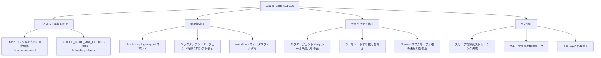
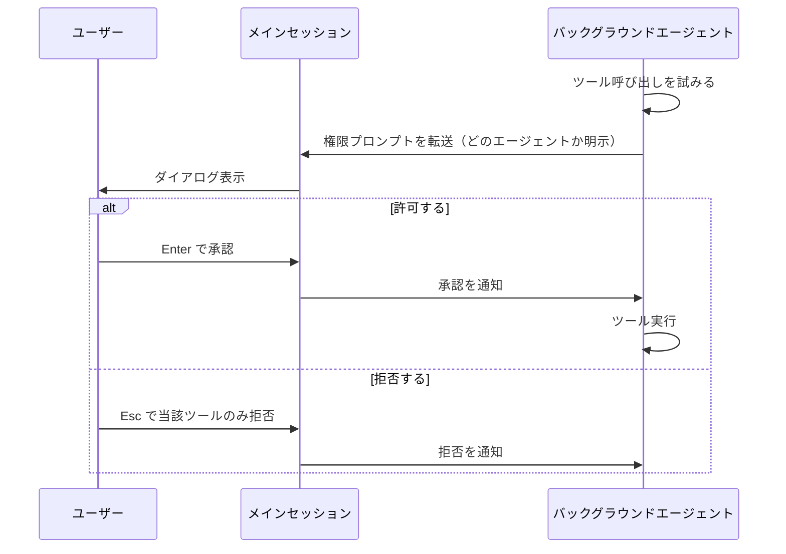
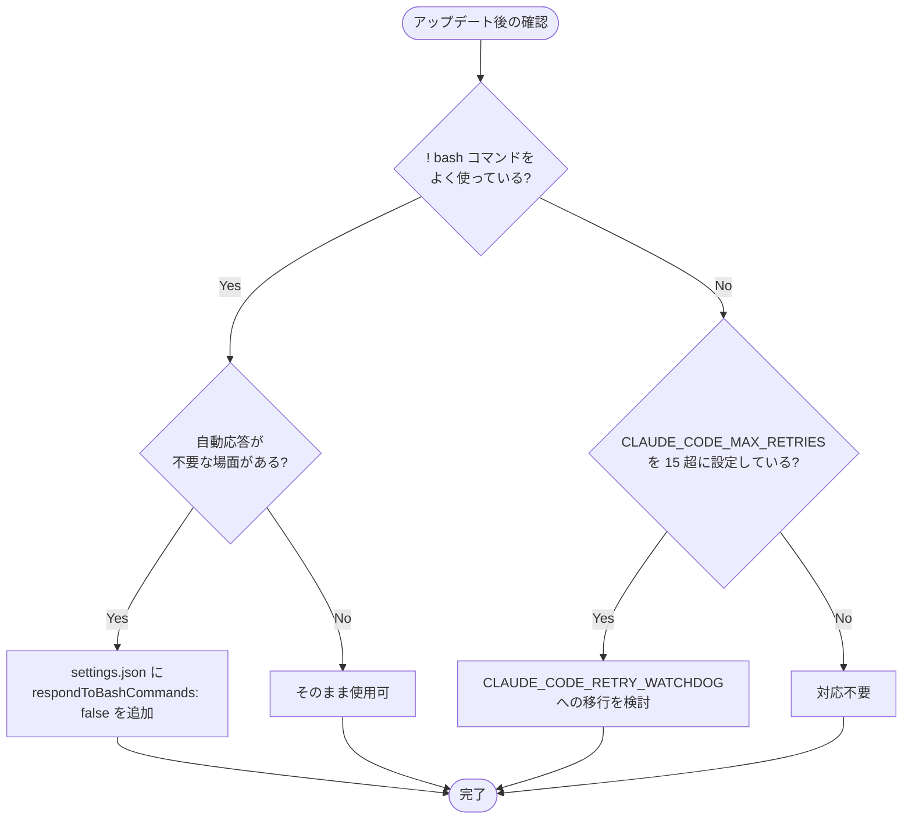

## はじめに

Claude Code v2.1.186 がリリースされ、日常的な開発ワークフローに影響する変更がいくつか含まれています。特に **`!` bash コマンドの出力に Claude が自動応答するデフォルト挙動の変更** は、既存ワークフローを使っている方には即座に影響します。また、サブエージェントの deny ルール未適用というセキュリティ上の不具合修正や、MCP サーバーの CLI 認証コマンド追加など、開発体験を向上させる改善も多数含まれています。

> **📌 影響を受ける人**
> - `!` bash コマンドを日常的に使っている Claude Code ユーザー
> - `CLAUDE_CODE_MAX_RETRIES` を 15 超に設定して無人運用しているチーム
> - マルチエージェント構成でサブエージェントに制限をかけている開発者
> - SSH 越しに MCP サーバーを認証したい方

---

## 変更の全体像



---

## 変更内容

### 1. `!` bash コマンド出力への Claude 自動応答（デフォルト変更）🔴

> **⚠️ Breaking Change**
> デフォルト挙動が変わります。既存ワークフローに影響がある場合はオプトアウト設定が必要です。

これまで `!` で bash コマンドを実行すると、その出力はコンテキストに追加されるだけでした。今後は **Claude が出力内容を自動的に読み取り、応答を返す**ようになります。

**挙動の変化**

| 項目 | 旧挙動 | 新挙動 |
|------|--------|--------|
| `! ls -la` の出力 | コンテキストに追加のみ | Claude が自動で内容を解釈・応答 |
| ユーザーの操作 | 追加で質問が必要 | 自動でレスポンスが返る |
| デフォルト設定 | 自動応答なし | 自動応答あり |

**従来の挙動に戻す方法**

`settings.json` に以下を追加することでオプトアウトできます。

```json
{
  "respondToBashCommands": false
}
```

> **💡 Tips**
> 自動応答が便利な場面（エラーログの解析など）では新デフォルトのまま使い、スクリプト出力をただ記録したいだけの場面では `false` に切り替えるとよいでしょう。

---

### 2. `CLAUDE_CODE_MAX_RETRIES` の上限が 15 に制限（Breaking Change）🟡

> **⚠️ Breaking Change**
> 15 超のリトライ設定をしている無人運用セッションは挙動が変わります。

`CLAUDE_CODE_MAX_RETRIES` 環境変数に 16 以上の値を設定していても、内部的に 15 にキャップされるようになりました。

**対応方法**

長時間の無人運用が必要な場合は、`CLAUDE_CODE_RETRY_WATCHDOG` への移行が推奨されます。

```bash
# 旧：リトライ回数を増やして無人運用（15超は無効に）
export CLAUDE_CODE_MAX_RETRIES=30

# 新：ウォッチドッグを使った無人運用
export CLAUDE_CODE_RETRY_WATCHDOG=true
```

| 設定 | 用途 | 上限 |
|------|------|------|
| `CLAUDE_CODE_MAX_RETRIES` | エラー時のリトライ回数指定 | 最大 15 |
| `CLAUDE_CODE_RETRY_WATCHDOG` | 無人セッションの長時間継続 | 制限なし |

---

### 3. CLI から MCP サーバーを認証できる `login/logout` コマンド追加 🆕

対話的な `/mcp` メニューを開かなくても、コマンドラインで MCP サーバーの認証が完結できるようになりました。

```bash
# MCP サーバーに認証
claude mcp login <server-name>

# SSH 環境など、ブラウザが使えない場合
claude mcp login <server-name> --no-browser

# ログアウト
claude mcp logout <server-name>
```

`--no-browser` オプションにより stdin リダイレクトに対応しており、SSH 越しのリモート環境でも認証フローを完結できます。CI/CD パイプラインや headless 環境で MCP サーバーを使う場合に特に有用です。

---

### 4. バックグラウンドサブエージェントの権限プロンプトがメインセッションに表示 🔔

従来、バックグラウンドで動作するサブエージェントが権限を必要とするツールを呼び出した場合、**自動的に拒否**されていました。今後は **メインセッションにダイアログとして表示**されるようになります。



Esc を押すと**そのツールのみ**が拒否され、他のエージェント動作には影響しません。

---

### 5. セキュリティ関連の不具合修正 🔒

高優先度のセキュリティ修正が 3 件含まれています。

| 修正内容 | 影響 |
|----------|------|
| `Agent(type)` の deny ルールが名前付きサブエージェント spawn 時に未適用だった | サブエージェントに対して意図した制限が効いていなかった |
| コールドスタート時に `--tools` がフィーチャーゲート済みツールをすり抜けさせていた | 初回起動時のみ制限が機能しなかった |
| 複数 CLI セッションで Chrome タブグループ分離が未適用だった | セッション間でタブが混在する可能性があった |

これらはアップデートにより自動的に修正されます。**アクションは不要ですが、マルチエージェント構成でセキュリティポリシーを厳密に適用している場合は、挙動が変わる点に注意**してください。

---

## 影響と対応

開発者が今すぐ確認すべき対応をまとめます。



| 変更 | 対応要否 | 対応内容 |
|------|----------|----------|
| bash 自動応答 | **条件付き** | 不要な場合は `respondToBashCommands: false` を設定 |
| MAX_RETRIES 上限 | **条件付き** | 無人運用で 15 超を設定していた場合、RETRY_WATCHDOG へ移行 |
| MCP login/logout | 不要 | 必要に応じて活用 |
| セキュリティ修正 | 不要（自動適用） | マルチエージェント構成の挙動変化に注意 |

---

## コード例

### Before / After: bash コマンド出力の扱い

**Before（v2.1.186 以前）**

```
! npm test

# → 出力はコンテキストに追加されるだけ
# → Claude は黙って次の入力を待つ
```

**After（v2.1.186 以降・デフォルト）**

```
! npm test

# → テスト結果を Claude が自動で読み取り、解釈・コメントを返す
# 例: "テストが3件失敗しています。auth.test.ts の42行目を確認してください。"
```

**自動応答を無効にする設定**

```json
// settings.json
{
  "respondToBashCommands": false
}
```

### MCP サーバーの CLI 認証フロー

```bash
# ブラウザがある環境
claude mcp login my-mcp-server
# → ブラウザが開いて認証ページが表示される

# SSH 環境・headless 環境
claude mcp login my-mcp-server --no-browser
# → stdin に認証トークンを入力する形式

# 設定確認
claude mcp get my-mcp-server

# ログアウト
claude mcp logout my-mcp-server
```

---

## まとめ

Claude Code v2.1.186 の主なポイントは以下の通りです。

- **`!` bash コマンドの自動応答がデフォルトに**: 便利になる反面、従来の動作を期待するワークフローは `respondToBashCommands: false` でオプトアウトが必要
- **`CLAUDE_CODE_MAX_RETRIES` は最大 15 に制限**: 無人運用で 15 超が必要なら `CLAUDE_CODE_RETRY_WATCHDOG` へ移行
- **MCP CLI 認証コマンドが追加**: `claude mcp login/logout` で SSH 環境でも認証が完結
- **セキュリティ修正**: サブエージェントの deny ルール未適用とツールゲートすり抜けを修正（自動適用）
- **バックグラウンドエージェントの権限プロンプト**: 自動拒否からメインセッション表示へ変更

特に自動応答の挙動変更と MAX_RETRIES の上限化は **既存ワークフローに影響する可能性**があるため、アップデート後に動作確認を行うことを推奨します。
