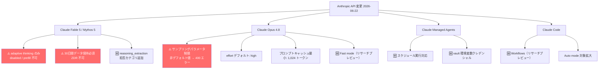
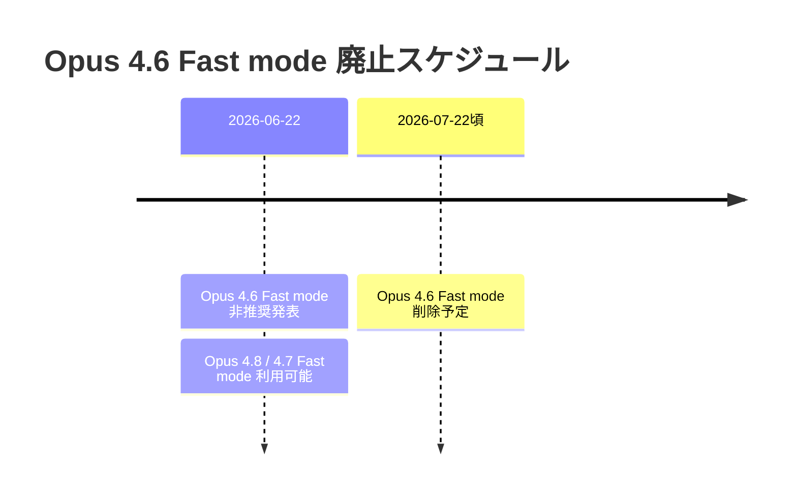

## はじめに

2026年6月22日、Anthropic がリリースノートを更新し、Claude Fable 5・Claude Mythos 5・Claude Opus 4.8 に関する複数の重要な変更が明らかになりました。中でも **thinking モードの制約変更** と **サンプリングパラメータ制限** は既存コードへの影響が大きい破壊的変更です。また、Claude Fable 5 の **30日間データ保持必須化**（ZDR不可）はコンプライアンス要件の確認が必要なケースがあります。

この記事では、特に影響度の高い変更を中心に、具体的な対応方法とコード例を解説します。

## 変更の全体像



## 変更内容

### ⚠️ 破壊的変更（要対応）

#### 1. Fable 5 / Mythos 5: adaptive thinking のみサポート

> **⚠️ Breaking Change**
> `thinking: {"type": "disabled"}` や手動の extended thinking budget、assistant prefill を使用しているコードは **400 エラー** で失敗します。

| 項目 | 旧（Mythos Preview など） | 新（Fable 5 / Mythos 5） |
|------|--------------------------|--------------------------|
| thinking 無効化 | 可能 | **不可（400 エラー）** |
| 手動 thinking budget 設定 | 可能 | **不可（400 エラー）** |
| assistant prefill | 可能 | **不可（400 エラー）** |
| adaptive thinking | オプション | **唯一の選択肢** |

> **📌 影響を受ける人**
> - thinking モードを明示的に `disabled` にしているアプリケーション
> - extended thinking の budget を手動で制御しているコード
> - assistant prefill を利用しているシステム

#### 2. Claude Fable 5: 30日間データ保持が必須（ZDR 不可）

> **⚠️ Breaking Change**
> ゼロデータ保持（ZDR）ポリシーで Claude API を利用している場合、Claude Fable 5 は**使用できません**。

| モデル | データ保持 | ZDR 対応 |
|--------|-----------|----------|
| Claude Fable 5 | 30日間（必須） | **不可** |
| その他モデル | モデル依存 | 要個別確認 |

> **📌 影響を受ける人**
> - 医療・金融・法務など、データ保持に厳格な制約があるシステム
> - エンタープライズ向けの ZDR 契約を締結している組織

#### 3. Claude Opus 4.8: サンプリングパラメータ制限

> **⚠️ Breaking Change**
> `temperature`・`top_p`・`top_k` を非デフォルト値に設定すると **400 エラー** を返します（Opus 4.7 と同様の制限）。

> **📌 影響を受ける人**
> - temperature などを調整してクリエイティブな出力やランダム性を制御しているコード
> - Opus 4.7 からの移行時にこの制限を見落としているケース

---

### 🆕 新機能・改善

#### Claude Opus 4.8 の変更

| 変更点 | 内容 |
|--------|------|
| effort デフォルト | **high**（Messages API・Claude Code 含む全サーフェス共通）|
| プロンプトキャッシュ最小長 | **1,024 トークン**（Opus 4.7 より縮小） |
| Fast mode | リサーチプレビューで利用可能（Claude API のみ） |
| 高解像度画像入力 | 長辺最大 2,576px |
| adaptive thinking | 必要なターンのみ推論し、無駄なトークンを削減 |
| 対応機能追加 | Task budgets・advisor tool・Computer use |

#### Claude Managed Agents の新機能

| 機能 | 詳細 |
|------|------|
| スケジュール実行 | cron スケジュールでセッションを定期実行可能 |
| vault 環境変数クレデンシャル | CLI・SDK 等の認証シークレットをサンドボックスへ安全注入 |
| session_thread_id | Webhook イベントにマルチエージェントスレッド識別 ID を追加 |

#### Claude Code の新機能

| 機能 | 内容 |
|------|------|
| Workflows（リサーチプレビュー）| マルチステップのエージェント計画を定義・実行 |
| Auto mode 拡大 | 長時間タスク向け Auto mode の対象ユーザーを拡大 |
| Max プラン fast mode | Opus 4.8 で fast mode がデフォルト |

#### その他の変更

- **Fine-grained tool streaming GA**: 全モデル・全プラットフォームで一般提供。ベータヘッダーが不要に。
- **reasoning_extraction 拒否カテゴリ**: Fable 5 の `stop_details.category` に追加。利用規約のリバースエンジニアリング／モデル出力複製違反時に返される。

---

### 🗑️ 非推奨・削除予定

> **⚠️ Breaking Change**
> **Claude Opus 4.6 の Fast mode** はリリースからおよそ 30 日後（2026年7月下旬ごろ）に削除されます。



## 影響と対応

### 移行判断フローチャート

```mermaid
flowchart TD
    A[コードベースを確認] --> B{Fable 5 / Mythos 5 を使用?}
    B -->|Yes| C{thinking を明示制御している?}
    C -->|Yes| D["❌ 修正必要\nthinking.disabled / prefill を削除"]
    C -->|No| E{ZDR ポリシーあり?}
    E -->|Yes| F["❌ Fable 5 使用不可\n別モデルを検討"]
    E -->|No| G["✅ 対応不要"]

    B -->|No| H{Opus 4.8 を使用?}
    H -->|Yes| I{temperature 等を設定している?}
    I -->|Yes| J["❌ 修正必要\nサンプリングパラメータを削除"]
    I -->|No| K{effort を明示設定している?}
    K -->|No| L["⚠️ デフォルト high に注意\nコスト増加の可能性あり"]
    K -->|Yes| M["✅ 対応不要"]

    H -->|No| N{Opus 4.6 Fast mode を使用?}
    N -->|Yes| O["❌ 30日以内に移行\nOpus 4.8 / 4.7 へ"]
    N -->|No| P["✅ 対応不要"]
```



### 優先度別 対応チェックリスト

**即時対応が必要（Breaking Change）**

- [ ] Fable 5 / Mythos 5 を利用するコードで `thinking: {type: "disabled"}` を削除
- [ ] Fable 5 / Mythos 5 を利用するコードで手動 thinking budget 設定を削除
- [ ] Fable 5 / Mythos 5 を利用するコードで assistant prefill を削除
- [ ] Opus 4.8 を利用するコードで `temperature`・`top_p`・`top_k` の非デフォルト設定を削除
- [ ] ZDR ポリシー環境での Fable 5 利用可否を確認

**30日以内に対応（Deprecation）**

- [ ] Opus 4.6 Fast mode を Opus 4.8 または 4.7 の Fast mode へ移行

**確認推奨（動作変更）**

- [ ] Opus 4.8 の effort デフォルトが `high` になることによるコスト・レイテンシへの影響を確認
- [ ] Fable 5 / Mythos 5 で思考の要約が必要な場合は `thinking.display: "summarized"` を明示設定

## コード例

### thinking モード制御（Fable 5 / Mythos 5）

**Before（Fable 5 / Mythos 5 では 400 エラー）**

```python
import anthropic

client = anthropic.Anthropic()

response = client.messages.create(
    model="claude-fable-5",
    max_tokens=1024,
    thinking={
        "type": "disabled"  # ❌ Fable 5 / Mythos 5 では 400 エラー
    },
    messages=[{"role": "user", "content": "Hello"}]
)
```

**After（adaptive thinking に委任）**

```python
import anthropic

client = anthropic.Anthropic()

# thinking パラメータを省略 → adaptive thinking が自動で動作
response = client.messages.create(
    model="claude-fable-5",
    max_tokens=1024,
    messages=[{"role": "user", "content": "Hello"}]
)

# 思考の要約を取得したい場合は display を明示
response = client.messages.create(
    model="claude-fable-5",
    max_tokens=1024,
    thinking={
        "type": "adaptive",
        "display": "summarized"  # 思考の要約を返す
    },
    messages=[{"role": "user", "content": "Hello"}]
)
```

---

### サンプリングパラメータ（Opus 4.8）

**Before（Opus 4.8 では 400 エラー）**

```python
response = client.messages.create(
    model="claude-opus-4-8",
    max_tokens=1024,
    temperature=0.7,  # ❌ 非デフォルト値は 400 エラー
    top_p=0.9,        # ❌ 同様
    messages=[{"role": "user", "content": "創造的な文章を書いて"}]
)
```

**After（サンプリングパラメータを削除）**

```python
response = client.messages.create(
    model="claude-opus-4-8",
    max_tokens=1024,
    # temperature / top_p / top_k は設定しない
    messages=[{"role": "user", "content": "創造的な文章を書いて"}]
)
```

---

### Opus 4.6 Fast mode → Opus 4.8 Fast mode への移行

```python
# ❌ Before: Opus 4.6 Fast mode（非推奨・約30日後に削除）
response = client.messages.create(
    model="claude-opus-4-6",
    messages=[{"role": "user", "content": "素早く回答して"}]
)

# ✅ After: Opus 4.8 へ移行（Claude Code Max プランではデフォルトで fast mode）
response = client.messages.create(
    model="claude-opus-4-8",
    messages=[{"role": "user", "content": "素早く回答して"}]
)
```

---

### effort パラメータの明示設定（Opus 4.8）

```python
# Opus 4.8 は effort がデフォルト high → コスト・レイテンシに注意
# 用途に応じて明示的に設定することを推奨

# 高品質な回答が必要な場合（デフォルトと同等）
response = client.messages.create(
    model="claude-opus-4-8",
    max_tokens=1024,
    thinking={"type": "adaptive", "effort": "high"},
    messages=[{"role": "user", "content": "複雑な問題を解いて"}]
)

# コスト削減・低レイテンシが優先の場合
response = client.messages.create(
    model="claude-opus-4-8",
    max_tokens=1024,
    thinking={"type": "adaptive", "effort": "low"},
    messages=[{"role": "user", "content": "簡単な質問に答えて"}]
)
```

---

### 拒否カテゴリの処理（Fable 5）

```python
response = client.messages.create(
    model="claude-fable-5",
    max_tokens=1024,
    messages=[{"role": "user", "content": "..."}]
)

if response.stop_reason == "refusal":
    category = response.stop_details.get("category")
    if category == "reasoning_extraction":
        # リバースエンジニアリング / モデル出力複製違反
        print("利用規約違反: モデルの内部推論の抽出は許可されていません")
    elif category == "cyber":
        print("サイバーセキュリティ関連の拒否")
    elif category == "bio":
        print("生物学的リスク関連の拒否")
```

## まとめ

今回の Anthropic アップデートは、**新しいモデルファミリーへの移行期**における重要な仕様変更を多数含んでいます。

| 変更区分 | 内容 | 対応優先度 |
|----------|------|-----------|
| Fable 5 / Mythos 5 thinking 制約 | adaptive thinking のみ。disabled・prefill・手動 budget 不可 | **高（即時）** |
| Fable 5 ZDR 不可 | 30日間データ保持必須 | **高（即時）** |
| Opus 4.8 サンプリング制限 | temperature 等の非デフォルト値で 400 エラー | **高（即時）** |
| Opus 4.6 Fast mode 廃止 | 約 30 日以内に Opus 4.8/4.7 へ移行 | **中（30日以内）** |
| Opus 4.8 effort デフォルト high | コスト・レイテンシへの影響を確認 | **低（確認推奨）** |

> **💡 Tips**
> 新モデルへの移行時は、ステージング環境でテストしてから本番投入してください。特に `thinking` パラメータの挙動は大きく変わっているため、既存コードの全体レビューを推奨します。

最新モデルの Fable 5 や Opus 4.8 は、adaptive thinking による効率的な推論と多彩な新機能を提供しています。破壊的変更への対応を済ませた上で、スケジュール実行対応の Managed Agents や Claude Code の Workflows など、新しいエージェント機能の活用も検討してみてください。
