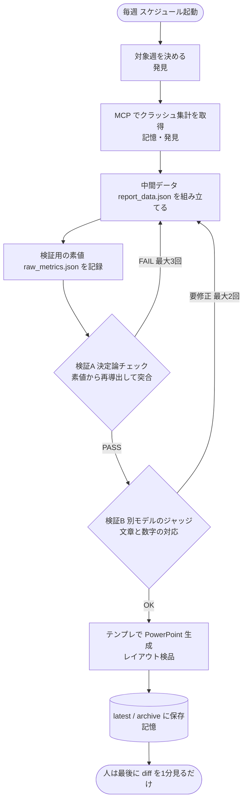
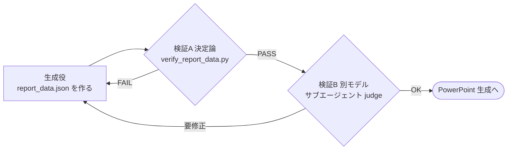

:::note info
Claude Desktop の Cowork で、毎週のクラッシュ週報を「データ取得 → 集計 → 検証 → PowerPoint 生成」まで全自動で回す仕組みを作りました。肝は、生成は全自動でいい、ただし“完了”は本人に名乗らせず別の役（評価役）に判定させること。検証は 2 段構えで、素値から数字を再計算して突き合わせる「決定論チェック」と、別モデルによる「文章チェック」を通します。人がやるのは、最後に diff を 1 分見るだけです。
:::

**対象読者**

- 定例レポート（クラッシュ集計・KPI・障害サマリーなど）を毎週手で作っていて、しんどい人
- Claude / Cowork / Claude Code で「単発の自動化」はできたが、「回り続ける仕組み」にしたい人
- AI に成果物を作らせると品質が安定しない・レビューが大変、という悩みがある人

**この記事で得られること**

- ループエンジニアリングの要点（5 動作 / 6 パーツ）と、なぜその肝が「検証」なのか
- Cowork の機能（スケジュール・スキル・MCP・サブエージェント・フォルダ）を、ループの 6 パーツにどう割り当てるか
- データ→資料パイプラインに「評価役」を組み込む具体的なコード（標準ライブラリだけ、そのまま流用可）
- 全自動で回したときの落とし穴と、その潰し方

きっかけは、Addy Osmani の [Loop Engineering](https://addyosmani.com/blog/loop-engineering/)（と、それを取り上げた [The New Stack の記事](https://thenewstack.io/loop-engineering/)）を読んで、「これ、いま自分が Cowork で組んでいる週次レポートそのものだ」と気づいたことです。

:::note warn
題材は社内の運用ですが、固有名詞・プロジェクト ID・実数値・スタックトレースはすべて架空のサンプルに置き換えています。手法だけ持ち帰ってください（情報は 2026/06 時点）。
:::

## ループエンジニアリングの 30 秒おさらい

この言葉を名づけた Addy Osmani の定義はこうです（[Loop Engineering](https://addyosmani.com/blog/loop-engineering/), 2026/6/7）。

> Loop engineering is replacing yourself as the person who prompts the agent. You design the system that does it instead.

ざっくり「“エージェントにプロンプトを打つ人” から自分を外し、代わりに打ってくれる仕組みを設計する」。プロンプトを上手く書くのでも、コンテキストを整えるのでもなく、自分をその場所からどける、という立ち位置の話です（Boris Cherny も「もう Claude にプロンプトは打たない。ループを書くのが仕事だ」と言っています）。

Addy は「ループがやること」を散文でこう書いています。仕事を見つけ、渡し、確かめ、終わったことを書き留め、次を決める。整理すると 5 つの動作です。

| アクション | やること |
| --- | --- |
| 発見 (discovery) | この 1 周で何をすべきかを自分で決める |
| 受け渡し (handoff) | タスクを隔離して作業役に渡す |
| 検証 (verification) | 別の役が「これでいいか」を確かめる |
| 記憶 (persistence) | 状態を会話の外（ファイル等）に書き出す |
| スケジューリング (scheduling) | 放っておいても回り続けさせる |

そして「これが無いとループにならない」と名指しされているのが検証です。ここが甘いと、ただ生成を垂れ流すだけの装置になります。後半はここに一番ページを割きます。

## なぜ Cowork が「ループの器」に向くのか

[Cowork](https://www.anthropic.com/) は Claude Desktop の機能（記事執筆時点でリサーチプレビュー）で、エンジニア以外でもファイル操作やタスク自動化を Claude に任せられるものです。中身は、ループに必要な道具が最初からだいたい揃っています。

Addy が挙げる「ループを組む 6 つのパーツ」（彼自身は Claude Code と OpenAI Codex の両方に同じ形で対応する、と整理しています）に当てはめると、こうなります。

| 6 パーツ | Cowork での対応 | 5 アクション |
| --- | --- | --- |
| Automations | スケジュールされたタスク（毎週◯曜の朝に実行） | スケジューリング |
| Skills | 手順を 1 ファイルに固定して再利用（本実装ではプロンプトテンプレ `weekly_report_prompt.md`。`SKILL.md` は名前と説明だけの薄いトリガーで、手順本体はテンプレ側に置く） | 発見 |
| Plugins / connectors (MCP) | Firebase / Slack / DB などの外部接続 | 記憶・発見 |
| Sub-agents | 生成役と評価役を別コンテキスト・別モデルに分ける | 検証・受け渡し |
| Memory | 接続フォルダ上のファイル（`output/`、`MEMORY.md` 等） | 記憶 |
| Worktrees | 大きな処理を隔離して別エージェントに渡す | 受け渡し |

つまり Cowork でループを組むときの作業は、「6 つのパーツをどう埋めるか」を決めるだけになります。新しいフレームワークは要りません。

## 作ったもの：クラッシュ週報の全自動ループ

題材は「iOS アプリのクラッシュ週次レポート」です。これまでは、

1. Crashlytics のダッシュボードを開いて
2. 今週・前週の上位クラッシュを数えて
3. スタックトレースを読んで原因を推測して
4. PowerPoint に手で清書する

…を毎週やっていました。これを丸ごとループにします。完成形はこうです。



人がやるのは、最後に出来上がった pptx を一度ながめるだけ。「ターミナルのエラーをコピペして貼り直す作業が消える」の、資料版です。検証で FAIL／要修正が出たら、AI が自分で中間データを直してループの上流に戻る。これが「単発の自動化」と「ループ」の差です。

ファイル構成（接続フォルダ）はこうしています。

````
crashlytics-weekly-report/
├── prompt/
│   └── weekly_report_prompt.md         # ループの台本（手順＋検証(A)(B)を含む）
├── scripts/
│   ├── build_report.py                 # 描画テンプレ（レイアウト固定）
│   ├── verify_report_data.py           # ★評価役（決定論チェック）
│   ├── report_data.sample.json         # 中間データのスキーマ実例
│   └── raw_metrics.sample.json         # 検証用 素値のスキーマ実例
└── output/
    ├── latest/                         # 最新成果物
    └── archive/                        # 週ごとに YYYYMMDD で保存（記憶）
````

ここから 6 パーツを順に埋めていきます。

## 実装①　発見：対象を決定論的に固定して冪等にする

ループの「発見（何を対象にするか）」は、決定論的に固定するのがコツです。スケジュール実行は遅延や手動再実行で発火時刻がブレるので、`now − 7日` のような相対指定だと走るたびに対象がズレます。そこで「直近の完了済み単位（例: 先週・月〜日）」のように曜日で固定し、月曜に走っても水曜に走っても同じ週を指すようにしておく。これで実行タイミングのブレを吸収でき、再実行しても同じ結果になります。

## 実装②　記憶・発見：MCP でクラッシュ集計を取る

データ取得は Firebase の MCP コネクタ越しに行います。Cowork からは「クラッシュ集計レポートをこの条件で取って」と頼むだけで、Claude が MCP を呼びます。

````
report:  topIssues / topOperatingSystems / topVersions
filter:  errorType = FATAL or NON_FATAL
         intervalStartTime / intervalEndTime（JST の ISO 週境界）
````

外部データを使うループ全般で効いた教訓を 2 つだけ（ツール固有の話は省きます）。

- 取得データは不完全なことがある → 欠けを推定で埋めず、信頼できない入力は捨てて確実な指標に差し替える（検証で弾く）。
- ソースは後から動く（完了週でも翌日には件数が増える）→「前回の値」を信用せず、毎回ソースから作り直して検証する。これが後半の検証フェーズの動機。

## 実装③　中間表現：描画はテンプレに固定し、AI は「数字」だけ渡す

ここがこのループの背骨です。Claude には PowerPoint を直接書かせません。代わりに、`report_data.json` という中間データだけを作らせ、描画は固定スクリプト（`build_report.py`）に任せます。

理由は単純で、レイアウト・配色・フォントまで毎回 AI に生成させると、毎週びみょうに違う資料になり、レビューが地獄になるからです。揺らしていい部分（数字と文章）と、固定したい部分（見た目）を分離します。

中間データはこんな形です（架空サンプル）。

````json
{
  "app_name": "SampleReader (iOS)",
  "period": { "start": "2026-06-15", "end": "2026-06-21", "tz": "Asia/Tokyo" },
  "kpi": {
    "fatal_events":   { "current": 174, "previous": 176, "scope": "上位7件合算" },
    "affected_users": { "current": 174, "previous": 175, "scope": "上位7件合算" },
    "fourth": { "label": "NON-FATAL 件数", "current": 65600, "previous": 70600, "scope": "上位7件合算" }
  },
  "summary_lines": [
    "FATAL は上位合算で 174 件（前週比 -1.1%）とほぼ横ばい。最多はレイアウト処理系 54 件。",
    "起動時の初期化系が 2 週連続で上位。ネットワーク系 NON-FATAL は 5 週で約 73% 減と改善継続。"
  ],
  "trend_chart": {
    "labels": ["LayoutEngine.optimize","Startup.initDRM","Startup.personalize",
               "Viewer.closeStream","DB.executeQuery","Viewer.scrollSwitch","Cache.purge"],
    "week_before_last": [60, 80, 34, 38, 2, 17, null],
    "last_week":        [49, 48, 40, 12, null, 10, 3],
    "this_week":        [54, 47, 33, 15, 12, 9, 4],
    "insight": "初期化系は高止まり。DB.executeQuery が前週ランク外から再浮上し要監視。"
  },
  "version_chart": {
    "available": true,
    "chart_type": "vbar",
    "title": "NON-FATAL network errors - last 5 weeks",
    "y_label": "NON-FATAL events",
    "labels": ["5/18-24","5/25-31","6/1-7","6/8-14","6/15-21"],
    "values": [6400, 5000, 5000, 2280, 1700],
    "note": "ネットワーク接続エラーの週次合算。5 週で約 73% 減。"
  },
  "os_chart": {
    "available": true,
    "title": "FATAL by OS (this week)",
    "labels": ["iOS 26.5.0","iOS 26.5.1","iPadOS 26.5.0","iOS 26.3.1","iOS 26.4.2"],
    "values": [107, 26, 18, 5, 4],
    "note": "iOS 26.5.0 が大半。iPadOS の大画面動線も考慮。"
  }
}
````

ここで CJK 豆腐（□□□）対策を 1 つ。グラフ画像は matplotlib で描くので、日本語フォントを持たない環境だと軸ラベルやタイトルが豆腐になります。なのでグラフ内テキスト（labels / title / x_label / y_label）は ASCII のみに縛り、日本語の説明は画像の外（`note`）に置いています。この制約は、後述の検証スクリプトで機械的に守らせます。

## 実装④　★検証：データ→資料パイプラインの「評価役」を 2 段で組む

Addy の主張はシンプルで、コードを書いた本人は自分の作業に甘い（"A model grading its own output is too generous"）。だから生成役と評価役を分け、評価役はできれば別モデルにしろ、という話です。Claude Code でいう `/goal`（毎ターンの最後に別の小さなモデルが完了条件を判定する＝書いた本人には採点させない）が、まさにこれです。

ただ、`/goal` や `npm test` 系の Stop フックはコード修正ループ（テストが通るまで回す）が前提です。今回はデータ→資料のパイプラインなので、「テストが通るか」ではなく「生成物がソースデータと矛盾していないか」に読み替えて評価役を作ります。これを 2 段で組みました。



ねらいは、「作る役」と「採点する役」を絶対に同一にしないこと。決定論チェックは数字を、別モデルは文章を見ます。

そしてこの 2 段は、思いつきで毎回やるのではなく、ループの台本（`weekly_report_prompt.md`）に手順として固定してあります。だから毎週必ず同じ順で走ります。台本の該当節はこんな粒度です。

````markdown
### 検証（評価役・2段構え）  ※ JSON 生成後・PowerPoint 生成前に必ず実行

(A) 決定論チェック（必須・トークン不要）
    verify_report_data.py を --data（report_data.json）/ --raw（raw_metrics.json）で実行。
    FAIL なら report_data.json の該当値を直して再実行。
    修正ループは最大3回。消えなければ error.txt に残して停止（トークン暴走の防止）。

(B) 検証サブエージェント（別モデル）
    (A) が PASS したら、別モデル（例: Haiku）に report_data.json と raw_metrics.json を
    読ませ、文章と数字の対応を点検。要修正なら直して (A) からやり直す。往復は最大2回。
````

以下、(A) と (B) の中身を順に見ていきます。

### (A) 決定論チェック：素値から再導出して突き合わせる（トークン不要）

まず、集計レポートの素値（合算前の生の件数）を `raw_metrics.json` に転記しておきます。合算しないのがポイントで、合算は評価役側がやって突き合わせます。

````json
{
  "fatal_events_topN":   { "this_week": [54,47,33,15,12,9,4], "last_week": [49,48,40,13,12,10,4] },
  "nonfatal_events_topN":{ "this_week": [45000,8500,5100,3500,2100,1400],
                           "last_week": [44000,14000,4900,3300,2200,2200] },
  "trend_issue_counts": {
    "labels": ["LayoutEngine.optimize","Startup.initDRM","Startup.personalize",
               "Viewer.closeStream","DB.executeQuery","Viewer.scrollSwitch","Cache.purge"],
    "week_before_last": [60,80,34,38,2,17,null],
    "last_week":        [49,48,40,12,null,10,3],
    "this_week":        [54,47,33,15,12,9,4]
  },
  "nf_network_weekly": {
    "labels": ["5/18-24","5/25-31","6/1-7","6/8-14","6/15-21"],
    "components": [[6400,0],[5000,0],[4700,300],[980,1300],[700,1000]]
  },
  "os_this_week": {
    "labels": ["iOS 26.5.0","iOS 26.5.1","iPadOS 26.5.0","iOS 26.3.1","iOS 26.4.2"],
    "values": [107,26,18,5,4]
  }
}
````

評価役スクリプトは、この素値から KPI 上位合算・3 週推移・ネットワーク系の週次合算・OS 別件数を再計算して `report_data.json` と突き合わせ、さらに ASCII 制約・配列長・サマリー重複などの体裁も検査します。標準ライブラリだけで動きます。

<details><summary>verify_report_data.py 全文（クリックで展開・標準ライブラリのみ）</summary>

````python
#!/usr/bin/env python3
# -*- coding: utf-8 -*-
"""
report_data.json の決定論的検証ツール（ループエンジニアリングの「評価役」相当）。
描画スクリプトのレイアウト検品とは別レイヤー（あちらは体裁、こちらは数字の整合）。

2 系統:
  (1) 内部整合・体裁   … report_data.json 単体
  (2) 取得データ突合   … raw_metrics.json と再導出比較
FAIL が 1 件でもあれば終了コード 1。WARN は 0。
"""
import argparse, json, sys, unicodedata

FAILS, WARNS, OKS = [], [], []
def ok(m):   OKS.append(m)
def warn(m): WARNS.append(m)
def fail(m): FAILS.append(m)

def disp_width(s):
    return sum(2 if unicodedata.east_asian_width(c) in ("W","F") else 1 for c in str(s))
def is_ascii(s):
    try: str(s).encode("ascii"); return True
    except UnicodeEncodeError: return False
def _sum(lst):
    return sum(x for x in lst if isinstance(x,(int,float)))

# ---- (1) 内部整合・体裁 ----
def check_internal(d):
    for f in ["app_name","period","kpi","summary_lines","trend_chart",
              "issues","version_chart","os_chart"]:
        if f not in d: fail(f"必須フィールド欠落: {f}")

    # KPI scope/note の表示幅（全角16字 = 32 半角幅を超えたら折返し注意）
    for k,obj in d.get("kpi",{}).items():
        if isinstance(obj,dict):
            for fld in ["scope","note"]:
                if obj.get(fld) and disp_width(obj[fld])>32:
                    warn(f"kpi.{k}.{fld} が長い: {obj[fld]!r}")

    # サマリー重複
    seen=set()
    for line in d.get("summary_lines",[]):
        key="".join(str(line).split())
        if key in seen: fail(f"summary_lines に重複行: {line!r}")
        seen.add(key)

    # trend_chart 配列長・型・降順
    tc=d.get("trend_chart",{}); n=len(tc.get("labels",[]))
    for arr in ["week_before_last","last_week","this_week"]:
        if arr in tc:
            if len(tc[arr])!=n: fail(f"trend_chart.{arr} の長さが labels と不一致")
            for v in tc[arr]:
                if v is not None and not isinstance(v,int):
                    fail(f"trend_chart.{arr} に非整数: {v!r}")
    if "this_week" in tc:
        tw=[v for v in tc["this_week"] if isinstance(v,int)]
        if tw!=sorted(tw,reverse=True):
            warn("trend_chart.this_week が降順でない")

    # グラフ内テキストは ASCII 必須（CJK 豆腐対策）
    for cn in ["version_chart","os_chart"]:
        c=d.get(cn,{})
        if not c.get("available",False):
            ok(f"{cn}: available=false（スキップ）"); continue
        for t in ["title","x_label","y_label"]:
            if c.get(t) and not is_ascii(c[t]):
                fail(f"{cn}.{t} に非ASCII: {c[t]!r}")
        labs,vals=c.get("labels",[]),c.get("values",[])
        if len(labs)!=len(vals): fail(f"{cn}: labels と values の数が不一致")
        for lab in labs:
            if not is_ascii(lab): fail(f"{cn}.label に非ASCII: {lab!r}")
    ok("内部整合・体裁チェック完了")

# ---- (2) 取得データ突合 ----
def check_against_raw(d, raw):
    kpi=d.get("kpi",{})
    for kpi_key,raw_key,label in [
        ("fatal_events","fatal_events_topN","FATAL 上位合算"),
        ("affected_users","fatal_users_topN","影響ユーザー 上位合算"),
        ("fourth","nonfatal_events_topN","NON-FATAL 上位合算")]:
        rk=raw.get(raw_key)
        if rk is None: warn(f"raw に {raw_key} なし"); continue
        for rwk,kfield in [("this_week","current"),("last_week","previous")]:
            if rwk in rk:
                exp=_sum(rk[rwk]); act=kpi.get(kpi_key,{}).get(kfield)
                if act is None: warn(f"kpi.{kpi_key}.{kfield} が null")
                elif act!=exp: fail(f"kpi.{kpi_key}.{kfield}={act} だが合算は {exp}（{label}）")
                else: ok(f"kpi.{kpi_key}.{kfield}={act}（{label} 一致）")

    tc=d.get("trend_chart",{}); rtc=raw.get("trend_issue_counts")
    if rtc:
        if tc.get("labels")!=rtc.get("labels"): fail("trend_chart.labels が raw と不一致")
        else:
            for arr in ["week_before_last","last_week","this_week"]:
                if arr in tc and list(tc[arr])!=list(rtc[arr]):
                    fail(f"trend_chart.{arr} が raw と不一致")
                elif arr in tc: ok(f"trend_chart.{arr} 一致")

    vc=d.get("version_chart",{}); rnf=raw.get("nf_network_weekly")
    if vc.get("available") and rnf:
        if vc.get("labels")!=rnf.get("labels"): fail("version_chart.labels 不一致")
        exp=[_sum(c) for c in rnf.get("components",[])]
        if list(vc.get("values",[]))!=exp:
            fail(f"version_chart.values が成分合算と不一致 report={vc.get('values')} raw={exp}")
        else: ok(f"version_chart.values（週次合算）一致: {exp}")

    oc=d.get("os_chart",{}); roc=raw.get("os_this_week")
    if oc.get("available") and roc:
        if oc.get("labels")!=roc.get("labels"): fail("os_chart.labels 不一致")
        if list(oc.get("values",[]))!=list(roc.get("values",[])): fail("os_chart.values 不一致")
        else: ok(f"os_chart 一致: {roc.get('values')}")

def main():
    ap=argparse.ArgumentParser()
    ap.add_argument("--data",required=True)
    ap.add_argument("--raw")
    a=ap.parse_args()
    d=json.load(open(a.data,encoding="utf-8"))
    check_internal(d)
    if a.raw: check_against_raw(d,json.load(open(a.raw,encoding="utf-8")))
    else: warn("--raw 未指定。内部整合のみ")
    print(f"OK:{len(OKS)} WARN:{len(WARNS)} FAIL:{len(FAILS)}")
    for m in FAILS: print("  [FAIL]",m)
    for m in WARNS: print("  [WARN]",m)
    if FAILS:
        print("結果: FAIL — report_data.json を直して再実行"); sys.exit(1)
    print("結果: PASS"); sys.exit(0)

if __name__=="__main__":
    main()
````

</details>

正常系はこう出ます。

````
$ python scripts/verify_report_data.py --data output/latest/report_data.json \
                                       --raw  output/latest/raw_metrics.json
OK:12 WARN:0 FAIL:0
結果: PASS
````

大事なのは、わざと壊したら落ちること。KPI を 1 つ間違え、ネットワーク推移の今週値を“昨日の古い値”にし、グラフラベルに日本語を混ぜてみると、

````
OK:9 WARN:0 FAIL:3
  [FAIL] os_chart.label に非ASCII: 'iOS 26.5.0（最新）'
  [FAIL] kpi.fatal_events.current=168 だが合算は 174（FATAL 上位合算）
  [FAIL] version_chart.values が成分合算と不一致 report=[...,1650] raw=[...,1700]
結果: FAIL — report_data.json を直して再実行
````

このとおり、3 つの典型的な事故（数字の転記ミス・古い値の混入・豆腐）を生成前に弾けます。これがデータ版の Stop フックです。

### (B) 別モデルのジャッジ：文章と数字の対応を点検する

決定論チェックが PASS したら、別モデルのサブエージェント（軽量モデルで十分）に `report_data.json` と `raw_metrics.json` を読ませ、機械では測れない整合を見させます。プロンプトはこんな粒度です。

````text
あなたは週報の「評価役」です。数値の合算は別スクリプトで検証済みなので、
あなたは「文章と数字の対応」だけを見ます。次を点検し、PASS / 要修正 を返してください。

1. summary_lines / insight / note の文章が数字と矛盾していないか。
   割合表現は実際に計算する（例:「約73%減」は最初6400→最後1700 と一致するか）。
2. 各 issue の wow_change_pct が trend の last_week→this_week と符号・概算で整合するか。
3. user_summary にクラス名・スタックトレース・例外コードが混ざっていないか
   （ユーザー視点の平易な表現であるべき）。
4. グラフの labels / title / y_label が ASCII のみか。
出力は PASS / 要修正 と指摘リストのみ。
````

実際にこのジャッジから「`約73%減` は 6400→1700 なら 73.4% で OK」「issue 3 の wow が trend の符号と一致」のように、1 行ずつ計算して確認した結果が返ってきます。生成役本人だと「いい感じ」で流してしまう所を、別の役に詰めさせるわけです。

### 事故防止：ハード上限を切る

評価役を入れても、直し続けて回り続けると今度はトークンが暴走します。Addy の言う "A loop running unattended is also a loop making mistakes unattended."（誰も見ていないループは、誰も見ていないまま間違え続ける）です。だから上限を切ります。上の台本抜粋にある通り (A) の修正ループは最大3回・(B) の往復は最大2回、超えたら止めて報告。`CLAUDE.md` でいう「最大 N 回」「同じエラー 2 回で停止」と同じ発想を、データ用に移しただけです。

## 実装⑤　生成：テンプレートで PowerPoint を出す

検証を通った `report_data.json` を、固定スクリプトに渡すだけです。

````bash
python scripts/build_report.py \
  --data output/latest/report_data.json \
  --out  output/latest/weekly_report.pptx
````

このスクリプトは生成後にレイアウト検品（スライドからのはみ出しチェック）と CJK 欠落警告の確認も自動で走らせます。はみ出しが出たら、該当セルの文章を短く要約し直して再実行する、というのも台本に書いてあります。

ここでも原則は同じで、色・レイアウト・フォントは一切 AI に触らせず、テキスト文言だけを JSON 経由で渡します。見た目を固定すると、毎週の差分が「数字と所見」だけになり、レビューが一瞬で終わります。

## 実際に 1 周まわすとこうなる（架空サンプル）

仕組みだけだとピンと来ないので、ある火曜の朝にループが先週分（6/15–21）を回したときの流れを、架空の数字で再現します。評価役が事故を止めた回です。

1. **取得**: 前日にも同じ週を集計していたが、今日は遅れて届いたクラッシュ（backfill）で FATAL 合算が `172 → 174` に増えていた。
2. **生成**: Claude が前回の `report_data.json` を下敷きに更新。ところがネットワーク推移の今週値を、前日の `1650` のまま置き忘れた（正しくは `1700`）。見た目はまったく自然な資料。
3. **検証A（決定論）**: 素値から再計算して突合し、停止。

   ````
   OK:9 WARN:0 FAIL:1
     [FAIL] version_chart.values が成分合算と不一致 report=[...,1650] raw=[...,1700]
   結果: FAIL — report_data.json を直して再実行
   ````

   Claude が `1650 → 1700` に直して再実行 → PASS。
4. **検証B（別モデル）**: 「summary に『約 73% 減』とあるが、`6400 → 1700` は約 73% で整合」「最上位 issue の前週比の符号も trend と一致」と 1 行ずつ確認して PASS。
5. **生成**: pptx を出力。レイアウト検品も通過。
6. **人**: 最後に diff を 1 分見て承認。

効きどころは、人がまず気づけない「前日の値の置き忘れ」を機械が止めたこと。評価役が無ければ、見た目はきれいな“数字だけ間違った資料”がそのまま会議に出ていました。生成を全自動にするほど、この種の事故は静かに増えます。だから止める役を、作る役とは別に置きます。

## 運用してわかった「回しっぱなしの代価」

便利な一方で、ループは放っておくと静かにツケを溜めます。Addy が挙げる注意点（検証は人に残る・理解の劣化＝comprehension debt・判断の放棄＝cognitive surrender、そしてトークンコスト）に沿って、実際に踏んだものを共有します。

| 落とし穴 | 実際に起きたこと | 防ぎ方 |
| --- | --- | --- |
| 検証の積み残し | 数字が合っていない資料が、見た目はきれいに出てしまう | 作業役と別の評価役（決定論＋別モデル） |
| 理解の劣化 | 「先週の値」が翌日には変わっていた（遅延集計） | 完了週でも素値を archive し、突き合わせ可能に |
| 判断の放棄 | 流用したスタック説明が、今週の別 Issue とすり替わる | ジャッジに Issue 対応の点検をさせる |
| トークン暴走 | 1 つの不整合で直し続けると課金が読めない | 修正ループ・往復回数にハード上限 |

:::note info
特に 2 番目は AI 特有でした。クラッシュは遅れて届くので、同じ週を翌日に集計し直すと件数が増えます。だから「昨日の数字」を絶対視せず、毎回素値から再導出して突き合わせる設計にしてあります。
:::

## まとめ：器はツールが用意してくれる。物差しは人が持つ

やってみて一番実感したのは、Addy Osmani の締めの一文でした（[Loop Engineering](https://addyosmani.com/blog/loop-engineering/) より）。

> Build the loop. But build it like someone who intends to stay the engineer, not just the person who presses go.

ループは作れ。ただし “起動ボタンを押すだけの人” ではなく、“エンジニアであり続けるつもりの人” として作れ。

Cowork を使うと、ループの器（スケジュール・スキル・MCP・サブエージェント・フォルダ）はほぼ設定だけで揃います。生成も全自動にできます。でも肩代わりしてくれないものが 1 つだけあって、それが「どの数字を正とするか」「どの所見で止めるか」という判断基準です。

今回のループでも、効いたのは検証スクリプトの配線そのものよりも、「良い週報とは何か（数字は素値と一致・グラフは ASCII・所見は重複しない・完了は本人に名乗らせない）」という物差しを台本と評価役に書き下した部分でした。器はツールが作ってくれても、そこに込める良し悪しの基準は、結局やってきた人間の中にしかないんだな、と。

気になった方は、まず難しく考えず、手元の定例レポート 1 つを「中間 JSON ＋ 固定テンプレ ＋ 決定論チェック」に分解してみるのがおすすめです。「あ、こういうことか」がすぐ腹落ちします。

## 参考

- Addy Osmani, [Loop Engineering](https://addyosmani.com/blog/loop-engineering/)（2026/6/7）― 概念の初出。本記事の引用（定義・"A loop running unattended is also a loop making mistakes unattended."・締めの "Build the loop. But build it like someone who intends to stay the engineer..."）はすべてここから。
- Janakiram MSV, [The Anthropic leader who built Claude Code says he ditched prompting — now he just writes loops](https://thenewstack.io/loop-engineering/)（The New Stack, 2026/6/10）― 上記を取り上げた解説記事。

:::note warn
本記事のコード・数値・アプリ名はすべて説明用の架空サンプルです。実環境では Firebase の project ID / App ID、対象アプリ名、しきい値などをご自身の値に置き換えてください。
:::
