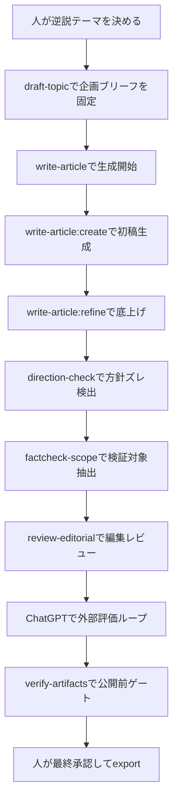
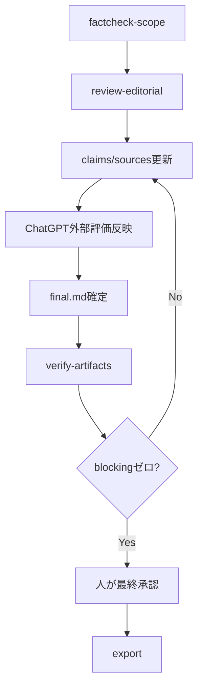

生成AIで物語や記事を作ること自体は、もはや入口にすぎません。品質を本当に左右するのは、人が方向を決め、複数のAIで多角的に磨き、機械ゲートで担保し、最終判断を編集として行う、**仕上げの工程設計**です。

本記事では、逆説の童話『やさしいだけのさるかに』を題材に、発案から公開前ゲートまでの流れを具体例つきで紹介します。主役は童話本文そのものではなく、**発案から改稿、レビュー、公開前ゲートまでをどう設計して仕上げたか**という工程です。想定読者は、童話の作り方そのものより、生成AIで創作物を公開できる品質まで仕上げたい人です。

なお、**Claude Code** と **ChatGPT** は実名で扱います。

**llm-task-router** と **編集長サブエージェント** は筆者の自作ツールですが、いずれも **MIT ライセンスで公開**しています。llm-task-router は npm パッケージ `@rex0220/llm-task-router` として、編集長サブエージェントはリポジトリ内の Claude Code サブエージェント定義として利用できます。

本記事で再現できるのは、“工程設計の思想と人・AIの役割分担”です。加えて、これらのツール自体も読者がそのまま利用できます。もちろん、ゲートの考え方自体は素のLLMと手作業でも置き換えられます。

:::note info
この記事は **Claude Code** と **llm-task-router**（Claude・Codex を使い分けるルーター）を用いて、童話作成チャットを基に作成しました。
:::

また、本文中に出てくるAI評価スコア **8.5 → 9.0 → 9.3** は、筆者と各AIのやり取りの記録です。客観的・絶対的な品質指標ではありません。数値そのものより、**どの指摘で何を直したか**を見るための制作ログとして読んでください。

## はじめに：何を作ったのか

今回完成した童話は、『やさしいだけのさるかに』です。

全員がやさしい。だから争いは起きません。けれど、やさしさが行き過ぎた結果、育てたみんなは誰ひとり柿を食べられず、最後に何もしていない通りすがりのことりがおいしくいただいてしまう。そんな逆説で着地する短い童話です。

さわりだけ、冒頭を少しだけ引用します。

> むかしむかし、あるところに、かにと さるが すんでいました。
>
> あるひ、かには、つやつやの にぎりめしを ひとつ、もっていました。  
> さるは、ぴかりと ひかる、かきの たねを ひとつ、もっていました。

全文は記事末尾の付録に掲載します。

先に登場人物だけ整理しておくと、次の通りです。

| 役割 | 使ったもの | 位置づけ |
| --- | --- | --- |
| 執筆・対話 | Claude Code | 実名の外部ツール |
| 外部評価 | ChatGPT | 実名の外部ツール |
| ルーティング | llm-task-router | 自作CLI（MITライセンス・npm公開） |
| 進行・統括 | 編集長サブエージェント | 自作のClaude Codeサブエージェント（MIT・リポジトリ公開） |

また、全工程を通じた大枠の役割分担は次のようにしていました。

| 項目 | 人 | AI |
| --- | --- | --- |
| テーマ・結末・読者設定 | 決める | 候補出し |
| 本文生成・言い換え | 監督する | 担当する |
| 方針ズレ検出 | 判定する | 検出する |
| 事実確認 | 採否判断する | 候補整理する |
| 公開可否 | 最終承認する | 機械検査する |

工程全体の見取り図は次の通りです。以降の図は、この全体フローの一部を拡大したものです。



### 童話作成にかかった概算コストと処理時間

今回の童話1本（初稿 → ChatGPT評価による改稿2回 → 完成）の概算は、**コスト約 $0.43 ／ エージェント処理時間 約20分強**でした。

| 項目 | 概算 | 内訳 |
| --- | --- | --- |
| コスト | 約 $0.43 | 初稿〜GO ~$0.34（create ~$0.24／refine ~$0.06／方向性チェック後のrevise ~$0.05）＋ ChatGPT評価を反映した改稿2回 ~$0.09 |
| 処理時間 | 約20分強 | 初稿の駆動 ~12分／改稿① ~4分／改稿② ~5分／書き出し ~1分（いずれもエージェント処理のwall-time） |

ただし、この数字には注意が必要です。**コストと処理時間は llm-task-router パイプラインの概算であり、外側の Claude Code（ハーネス）のトークン使用量は含みません。** また「処理時間」はエージェントの実行時間の合計であって、人が考えて判断した時間や、ChatGPT評価とのやり取りを含む実際の経過時間ではありません（実経過はこれよりかなり長くかかっています）。数値そのものより、「この規模の童話なら数十円〜・エージェント実働は十数分オーダー」という桁感の参考として読んでください。

なお、実際の童話の制作時間（発案から完成まで）は、50分程度でした。

## 1. 発案・テーマ設計：逆説の種は人が決め、具体化はAIに任せる

出発点はシンプルでした。

- **猿蟹合戦の平和版**
- **全員やさしいのに残念な結末**

この2つを同時に満たす話にしたい、というのが最初の核です。

ここで大事だったのは、面白さの中心を人が先に決めたことです。AIに「何か面白い童話を作って」と丸投げしたのではなく、逆説の芯をこちらで定義しました。

具体化の過程では、対話の中で次のような選択をしていきました。

- 残念さの仕掛けは、悪意ではなく**余計なお世話**や**世話の焼きすぎ**、**譲り合いすぎ**にする
- 読者層は、幼児〜低学年の読み聞かせを想定する
- 教訓を強く言い切るより、読後に少し考えさせる余韻を残す

さらに、結末は途中で一段鋭くしました。最初は「みんなが食べそこねる」程度の案でしたが、そこから**なんにもしていない誰かがおいしくいただく**へ転換しています。

この編集判断で、逆説の輪郭がかなりはっきりしました。やさしい人たちが損をする、というだけでは弱い。そこに「何もしていない第三者」が入ることで、読後の引っかかりが強くなります。

要するに、**方向と核となる面白さは人が決め、言い換えや候補出しの具体化はAIに任せる**、という分担です。

## 2. ブリーフ化：本文の前に企画を固定する

発案ができたら、すぐ本文には入りません。先に企画を固定します。

今回は `topics/<slug>.txt` の形で企画を保存し、`draft-topic` の承認ゲートを通しました。これをやる理由は明快で、**執筆中のブレを防ぎ、後工程のレビューや改稿の基準点を持つため**です。

「書きながら考える」は創作としては楽しいのですが、AIを複数使うと、途中で話の軸がぶれやすくなります。だからこそ、本文の前に「何を書くか」よりも「何を書かないか」を含めた編集方針を固定しておく必要があります。

今回、先に明文化した方針は次のようなものでした。

- 誰に向けた話か
- どこまで説明するか
- 教訓を断定しない
- 余韻で閉じる
- 全文は付録に置き、本論では工程を主役にする

ブリーフの抜粋イメージはこんな感じです。

```yaml
title: やさしいだけのさるかに
audience: 幼児〜小学校低学年の読み聞かせ
core_paradox:
  - みんなやさしい
  - そのやさしさが行き過ぎて、だれも実を食べられない
ending:
  - なんにもしていない通りすがりのことりがおいしくいただく
editorial_policy:
  - 教訓を断定しない
  - 説明しすぎない
  - 余韻で閉じる
article_structure:
  - 本論は工程中心
  - 童話全文は付録に掲載
```

AIにやらせたのは、このブリーフの叩き台の整形や不足項目の洗い出しです。ただし、**承認可否と固定する内容は人が決める**。ここを曖昧にすると、後で「AIごとに違う正しさ」が発生して収拾がつかなくなります。

:::note info
ブリーフは、AIに対する指示文というより、後工程で人間が立ち返るための編集契約書に近いです。
:::

## 3. 内容生成：`write-article:create` と `write-article:refine`、そして `direction-check` で童話に戻す

企画が固定できたら、ここで初めて本文生成に入ります。

コマンド設計では、**書く系**と**確かめる系**（ゲート）を分けています。書く工程と確かめる工程を分離して責務を分けることで、生成の勢いと品質確認を混同しにくくするためです。

今回は `write-article` から編集長サブエージェントへ駆動を委譲し、そこから `write-article:create` で初稿、`write-article:refine` で底上げ、さらに `direction-check` で方向性の確認をかけました。

これは全体フローのうち、生成から方針確認までを拡大した図です。


CLI呼び出しのイメージは次のようなものです。

```bash
llm-task-router write-article:create \
  --topic topics/yasashii-sarukani.txt \
  --out runs/YYYY-MM-DD-yasashii-sarukani/draft.md

llm-task-router write-article:refine \
  --input runs/YYYY-MM-DD-yasashii-sarukani/draft.md \
  --out runs/YYYY-MM-DD-yasashii-sarukani/refined.md

llm-task-router direction-check \
  --brief topics/yasashii-sarukani.txt \
  --input runs/YYYY-MM-DD-yasashii-sarukani/refined.md
```

ここでの `final.md` は、`refined.md` に対して `direction-check`、後述のレビュー、外部評価の反映を経て、人が採用した修正を統合して確定した版です。

もちろん、これは概念説明用の抜粋であり、環境やモデルで結果は変わります。再現手順として固定的に読まないでください。

初稿では、いかにもAIらしいズレが出ました。具体的には、一部に**技術記事っぽいスコープ**が混入し、図表や整理された教訓の断定のような、ブリーフ外の癖が混ざったのです。

たとえば、童話なのに「この物語が示すポイントは〜」のようなまとめ方に寄ったり、読後解説を足したがる傾向がありました。これは単なる誤字脱字ではなく、**ジャンル逸脱**です。

そこで効いたのが `direction-check` でした。これは文法チェックではなく、**ブリーフ忠実性の自動チェック**として使っています。ここは、ツール非依存で考え方だけ取り出せる例で、素のLLMに同趣旨のチェックを頼んでも近い役割を持たせられます。

見るべき点は次のようなものです。

- 童話として読めるか
- 教訓を言い切りすぎていないか
- 説明過剰になっていないか
- 余韻で閉じる方針から外れていないか

再現性のため、少なくとも入力と判定基準の粒度はここで明示しておきます。

| 項目 | 内容 |
| --- | --- |
| 入力 | ブリーフ、対象原稿 |
| 出力 | pass / warn / blocking の判定と、該当箇所・理由 |
| 主な評価軸 | ジャンル適合、教訓の断定度、説明過多、結末の余韻、読者層適合 |
| blocking の定義 | ブリーフの必須条件に反するズレ。例: 教訓断定、解説調への逸脱、対象読者から外れた語彙過多 |
| warn の定義 | 方針違反ではないが、余韻やテンポを損ねうる箇所 |

判定のための実際の指示文も、概念だけなら素のLLMで置き換えられます。たとえば、以下のような形です。

```text
あなたは編集チェック担当です。
以下のブリーフと原稿を比較し、ブリーフ違反を検出してください。

判定カテゴリ:
- pass: 問題なし
- warn: 改善余地あり
- blocking: ブリーフの必須条件に反する

特に次を確認すること:
1. 童話として自然か
2. 教訓を断定しすぎていないか
3. 説明しすぎていないか
4. 余韻で閉じているか
5. 想定読者の語彙レベルに合っているか

出力形式:
- overall: pass/warn/blocking
- findings:
  - severity:
  - location:
  - reason:
  - suggested_fix:
```

ここでも、AIは書くし、直すし、警告も出せます。でも、**何を正とするか**は最後まで人が持つ必要があります。

## 4. 裏取り：フィクションでも事実部分は検証する

童話本文は創作です。それでも、事実として触れる部分は検証しました。

今回、事実として扱ったのは主に次の点です。

- 『さるかに合戦』が実在の昔話であること
- 本作がその平和版の翻案として読めること
- 地域差や異本があること

創作だから全部自由、とはしていません。読者が「元ネタは本当にあるのか」「一般にどう知られているのか」を気にする部分は、きちんと裏を取る運用にしました。

また、参考章については、出典台帳から機械生成する方式にしています。LLMにURLを直接書かせると、もっともらしい偽URLが混ざる危険があるからです。

この部分の設計思想は単純です。AIにやらせたのは、検証対象の抽出と出典候補の整理まで。**採用する出典や、どの程度を諸説として書くかは人が決める**、という線引きです。

実際に使った台帳は手元ではもう少し長いですが、サンプル化すると次のようなイメージです。

| claim_id | 主張 | 出典種別 | 確認内容 | 採否 |
| --- | --- | --- | --- | --- |
| C-001 | 『さるかに合戦』は日本の昔話として広く知られる | 昔話辞典・児童文学資料 | 話型と基本筋の存在確認 | 採用 |
| C-002 | 異本・地域差がある | 昔話研究書・民話集成 | 登場人物や展開の差異確認 | 採用 |
| C-003 | 本作は平和版の翻案として読める | 筆者判断 | 事実主張ではなく解釈 | 出典不要として区別 |

たとえば、本文で「地域差や異本がある」と書くなら、裏では「どの資料で差異が確認できたか」を台帳に残します。逆に、「平和版の翻案として読める」は解釈なので、事実主張とは別管理にしています。

`factcheck-scope` が見ているのは、ざっくり言えば次の2段階です。

1. 原稿から**事実主張らしい文**を抽出する
2. その文が「要出典」なのか「解釈」なのかを人が仕分ける

この考え方も、素のLLMとチェックリストで代替できます。重要なのはツール名より、**事実主張と解釈を分けて扱う**という運用です。

:::note warn
フィクション記事でも、周辺説明に事実が混じるなら、その部分はノンフィクションの精度で扱ったほうが安全です。
:::

## 5. 編集レビュー：別providerのモデルで批評し、方針に照らして取捨する

執筆したモデルとは別providerのモデルにも読ませ、`review-editorial` で批評を取ります。これは、書き手の癖から少し離れた視点を入れるためです。別provider・別系列のモデルを選ぶのは、評価指摘どうしの相関を下げて見落としを減らす狙いがある（同系列のモデルは似た指摘に寄りやすい）。

ここで重要なのは、**別モデルの指摘だからといって自動採用しない**ことです。

この節では `review-editorial` の出力例だけに絞って示します。

```text
[review-editorial]
- 終盤の寓意がやや説明的。余韻を優先するなら整理余地あり
- 一部で童話本文よりも解説調に寄る箇所あり
- 媒体適性を考えると、本文後に寓意を言語化したあとがきがあると親切
- 教育的明確性を上げるため、結論文を補強してもよい
```

この指摘自体は、一般的な編集としては理解できます。ですが、今回は承認済みブリーフに次の方針がありました。

- **教訓を断定しない**
- **余韻で閉じる**

つまり、指摘は「よい批評」ではあっても、**今回の作品方針とは衝突**していたわけです。そこで編集長が `waive` し、採用しない判断をしました。

この場面で大事なのは、AIの批評を「正解」ではなく「評価軸の提案」として扱うことです。別モデルは、しばしば違う善意で違う改善案を出してきます。その善意は有益ですが、最終的に従うべきなのは作品ごとの編集方針です。

## 6. ChatGPTによる外部評価ループ：8.5→9.0→9.3の改稿記録

ここが今回の山場でした。

完成稿に近づいた段階で、さらに別系統の評価者として **ChatGPT** に読ませ、外部評価ループを回しました。目的は、書き手モデルともレビュー用モデルとも異なる観点を入れることです。

ただし、ここでの数値は普遍的な品質スコアではありません。評価の中身を揃えるため、毎回ほぼ同じ観点で採点させていました。

### 評価の観点

使った評価観点は次の5つです。

| 観点 | ねらい |
| --- | --- |
| 逆説の鮮明さ | 「やさしさ」が残念な結末につながる構造が見えるか |
| 童話としての自然さ | 語り口や展開が説教臭くないか |
| 伏線とオチの納得感 | ことりの登場が唐突すぎないか |
| 冗長さの少なさ | 反復が効いている範囲に収まっているか |
| 音読リズム | 読み聞かせたときに詰まらないか |

採点は各観点2点満点、合計10点満点のラフな方式です。小数点はコメント全体の印象補正として使っており、厳密な計量ではありません。

評価依頼のイメージは次のようなものでした。

```text
次の童話を、以下の5観点で評価してください。
各観点は0〜2点、合計10点満点です。

観点:
1. 逆説の鮮明さ
2. 童話としての自然さ
3. 伏線とオチの納得感
4. 冗長さの少なさ
5. 音読リズム

出力:
- total_score
- sub_scores
- good_points
- issues
- concrete_revision_suggestions

注意:
- 数値は絶対評価ではなく、この原稿を改善するための相対評価として扱う
- 教訓を言い切る方向の提案は、余韻を損ねる可能性もあるので別枠で示す
```

### 1回目：8.5

最初の評価は **8.5** でした。主な指摘は次の3つです。

- 後半の「どうぞ、どうぞ」の反復がやや冗長
- ラストに出る **ことり** の伏線が不足している
- 結びで「やさしさ」を説明する文が重複気味

抜粋イメージはこんな感じです。

この小数はLLMの出力をそのまま転記した印象値で、刻みに厳密な意味はない。

```text
total_score: 8.5
sub_scores:
  reverse_paradox: 2.0
  fairy_tale_naturalness: 1.8
  setup_and_payoff: 1.4
  concision: 1.5
  read_aloud_rhythm: 1.8

issues:
- 反復のリズムは良いが、後半で少し長く感じる
- ことりの登場がやや突然で、寓話的な落ちに見えるぶん準備が欲しい
- 最後の説明が一歩前に出すぎており、余韻がやや薄まる
```

これはかなり納得感のある指摘でした。特に「ことりの突然感」は、逆説オチを狙った副作用でもあります。驚きを残しつつ、唐突さだけは避けたい。そのバランス調整が必要でした。

### 2回目：9.0

そこで次の改稿を実施しました。

- 前半に、ことりの存在を一文だけ忍ばせる
- 反復表現を圧縮する
- 説明の重複を削る

その結果、評価は **9.0** に上がりました。

```text
total_score: 9.0
changes_applied:
- 前半にことりの気配を追加
- 「どうぞ」の連なりを圧縮
- 終盤の説明重複を整理

comments:
- ラストの納得感が増した
- 余韻を保ちながらテンポが良くなった
```

ここで効いたのは、**伏線を足しすぎない**ことでした。あからさまに準備するとオチが弱くなる。だから「いた」とわかる程度のごく軽い気配だけを置く、という編集にしています。

### 3回目：9.3

さらに3回目では、細部の言い回しを整えました。

- はちの役回りを、花どうしをなかよくする表現に寄せる
- 核フレーズの反復を少し整理する
- 全体の音読リズムを微調整する

その結果、評価は **9.3** になりました。

```text
total_score: 9.3
changes_applied:
- はちまわりの表現を自然化
- 反復の意味密度を調整
- 読み聞かせ時のリズムを改善

comments:
- 細部の違和感が減り、完成度が上がった
- 逆説の後味がよりクリアになった
```

一方で、ChatGPTが推した案の中にも見送ったものがあります。たとえば、**タイトル短縮**や**はじめにの削除**などです。これは作品単体として見れば合理的でも、Qiita記事としての媒体方針や構成都合とは一致しませんでした。

つまり、外部AIの評価は強い燃料になりますが、**採否を決めるのは編集**です。

数値の流れを整理すると、こうなります。

| ラウンド | スコア | 主な論点 | 対応 |
| --- | --- | --- | --- |
| 1回目 | 8.5 | 冗長さ、ことりの伏線不足、説明重複 | 改稿実施 |
| 2回目 | 9.0 | 納得感向上、テンポ改善 | 細部調整へ |
| 3回目 | 9.3 | 細部の自然さ、反復整理 | 完成稿へ |

なお、この **8.5 → 9.0 → 9.3** は、あくまで今回のやり取りにおける相対的な記録です。モデルや環境が変われば同じ数字にはなりません。

## 7. 公開前ゲートと完成：`verify-artifacts` から `export` へ

本文を直すたびに、`claims/sources` の台帳も更新しました。完成前には `verify-artifacts` を通し、次のような点を機械チェックします。

- blocking ゼロ
- 出典到達確認
- 参考リンクと台帳の一致
- 原稿ファイルと公開用出力の整合

ここは地味ですが、かなり重要です。factcheckやレビューを通った本文でも、公開前に機械ゲートを挟むことで、**抜け漏れの種類が変わる**からです。人の確認だけだと、「知っているつもり」の漏れが残ります。

これは全体フローのうち、検証から公開までを拡大した図です。



CLIの抜粋例を載せると、こんな感じです。

```bash
llm-task-router factcheck-scope \
  --input runs/YYYY-MM-DD-yasashii-sarukani/refined.md

llm-task-router review-editorial \
  --brief topics/yasashii-sarukani.txt \
  --input runs/YYYY-MM-DD-yasashii-sarukani/refined.md

llm-task-router verify-artifacts \
  --run runs/YYYY-MM-DD-yasashii-sarukani

llm-task-router export \
  --input runs/YYYY-MM-DD-yasashii-sarukani/final.md \
  --format markdown
```

`verify-artifacts` が最低限見ている項目も、技術記事として読めるように書き下しておきます。

| チェック項目 | 内容 | blocking 条件の例 |
| --- | --- | --- |
| 出典整合 | 台帳にある出典が参照可能か | URL切れ、識別子不一致 |
| 参照漏れ | 要出典主張に台帳紐付けがあるか | claim_id 未付与 |
| 生成物整合 | `final.md` と export 対象が一致するか | 古い版を出力 |
| レビュー残件 | blocking 指摘が未解消で残っていないか | 未対応 blocking が存在 |

ここでも、AIにさせたのは**検査と差分の洗い出し**までです。どの差分を正とするか、そして公開してよいかの最終承認は人が行いました。ここも、考え方は素のLLM＋チェックリストで代替できます。

この工程を入れることで、「生成して終わり」ではなく「公開できる状態まで持っていく」運用になります。

## まとめ：生成AIで作るより仕上げる

今回の制作から得た学びは、4点に整理できます。

### 1. 方向は人が決める

テーマ、読者、結末、どこまで説明するか。ここは編集判断です。AIは候補を出せますが、軸そのものは持ってくれません。

### 2. 複数モデル・複数系統で多角評価すると品質が上がる

書き手モデル、別providerの校閲、ChatGPTの外部評価。役割を分けると、同じ原稿に異なる角度の光が当たります。

### 3. `factcheck-scope` や `verify-artifacts` のような機械ゲートは、人の見落としを減らす

創作でも事実部分は検証する。公開前には機械的な整合確認を通す。この2段構えが効きます。

### 4. AIのスコアや指摘も、編集方針に照らして取捨する

スコアは燃料であって判決ではありません。どれだけ高評価でも、作品方針と衝突する提案は見送るべきです。

結局のところ、生成AIで童話や記事を作ること自体は入口にすぎません。品質を決めるのは、人が方向を決め、複数のAIで多角的に磨き、機械ゲートで担保し、最終判断を編集として行う、**仕上げの工程設計**です。

**逆説テーマの面白さは人の発案、磨きはAIループ、可否は人**。今回持ち帰れた再現可能な原則は、特定ツールの実装ではなく、この思想と役割分担にあります。

> ここから先は完成版の童話全文です。工程設計の話はここまでで完結しているので、童話そのものに興味がある方だけ読み進めてください。

## 付録：完成した童話『やさしいだけのさるかに』全文

### やさしいだけの「さるかに」――だれもわるくないのに、かきはだれのものにもならなかった話

> これは **創作童話・翻案** です。  
> 原典の『さるかに合戦』にある、だましや復讐の場面はありません。  
> わるもののいない、やさしいだけのお話です。

#### はじめに

むかしばなしの「さるかに」を、やさしく へいわに よみかえしたおはなしです。  
ちいさなおこさんへの よみきかせにも なるように、そっと つくりました。

#### おはなし

むかしむかし、あるところに、かにと さるが すんでいました。

あるひ、かには、つやつやの にぎりめしを ひとつ、もっていました。  
さるは、ぴかりと ひかる、かきの たねを ひとつ、もっていました。

さるは たねを てのひらに のせて、にこにこ いいました。

「かにさん、かにさん。  
その にぎりめし、おいしそうだねえ。  
もし よかったら、この かきの たねと こうかんしない？  
たねは まけば、いつか きになるよ。  
きになれば、らいねんも、その つぎの としも、かきが みのるんだ」

さるは、だますつもりなんて、すこしも ありません。  
ほんとうに、よいものを わけたいと おもったのです。

かには、めを まるくして いいました。

「まあ、それは すてき。  
にぎりめしは きょう たべたら おしまいだけど、  
かきの きが できたら、たのしみが つづくものね」

こうして、にぎりめしと かきの たねは、にこにこ こうかんされました。

かには さっそく、うちの うらにわへ いって、  
やわらかな つちに、たねを そっと まきました。

「おおきく なあれ。  
あまい かきに なあれ」

ときどき、そらを ことりが とんでいきました。  
どこか とおくへ、たびを しているようでした。

すると、それを みていた むらの なかまたちが、  
ひとり、また ひとりと、あつまってきました。

はじめに きたのは、くりです。

「てつだうよ。  
たねが さむくないように、あたためてあげるね」

「ありがとう」

つぎに きたのは、はちです。

「てつだうよ。  
おはなが さいたら、ぼくが ぶんぶん とんで、  
おはなと おはなを なかよく してあげるね」

「ありがとう」

つぎに きたのは、うすです。

「てつだうよ。  
ひが つよい ひは、どっしり かげを つくってあげよう」

「ありがとう」

つぎに きたのは、うしです。

「てつだうよ。  
つちが げんきに なるように、こやしを やろう」

「ありがとう」

さいごに さるも、はりきって きました。

「ぼくも てつだうよ。  
みずを たっぷり、じゃぶじゃぶ あげるね」

「ありがとう。  
でも、ちょっと おおいかも」

みんなは、はっとして わらいました。

けれど、やさしい みんなは、つぎのひも、また そのつぎのひも、  
「てつだうよ」  
「ありがとう」  
「でも ちょっと おおいかも」  
と、なんども くりかえしました。

くりは ほかほか、あたためすぎました。  
はちは ぶんぶん、がんばりすぎました。  
うすは かげを つくりすぎました。  
うしは こやしを、たくさん やりすぎました。  
さるは みずを、やっぱり じゃぶじゃぶ やりすぎました。

それでも、たねは けなげでした。  
ちいさな めを だし、ほそい えだを のばし、  
はるを すぎ、なつを こえて、あきの ころ。

ついに きに、かきが ひとつだけ、なりました。

たった ひとつ。  
でも、それは それは、みごとな かきでした。  
まるくて、あかくて、ゆうやけみたいに つやつやでした。

みんなは、わあっと こえを あげました。

「できた！」  
「なった！」  
「おいしそう！」

けれど、そこで みんなは、ぴたりと しずかに なりました。

たった ひとつの かき。  
では、だれが たべるのでしょう。

さるが、ぽりぽり あたまを かきました。

「これは、たねを もっていた ぼくが たべるより、  
そだてた かにさんが たべるべきだよ」

かには、ぶるぶると はさみを ふりました。

「ううん。  
はじめに たねを くれたのは、さるさんだもの。  
さるさんが どうぞ」

すると、くりが ころんと いいました。

「ううん、ううん。  
みんなで てつだったんだから、みんなで どうぞ」

はちも ぶんぶん、いいました。

「どうぞ、どうぞ」

かきは、てから てへ、そっと わたされました。

「いえいえ、どうぞ」  
「あなたこそ、どうぞ」  
「みなさんで、どうぞ」

そんなふうに ゆずりあっている うちに、  
ひは かたむき、やまは きんいろに なり、  
かぜが すこし すずしく なりました。

そして。

その てと ての あいだから、  
かきが、ぽとり。

ぽとりと じめんに おちて、  
ころころ、ころころ、ころがって いきました。

みんなは、あっと おもいました。  
でも、だれも だれかを せめませんでした。

いそいで とりに いこうとした、そのときです。

みちの むこうから、ちいさな ことりが とんできました。  
たびの とちゅうで、おなかが ぺこぺこだったのです。

ことりは、ころがってきた かきを みつけて、めを かがやかせました。

「わあ、おいしそう！」

ことりは じじょうを しりません。  
だれが そだてたのかも、  
だれが ゆずりあっていたのかも、しりません。

ただ、うれしそうに ついばんで、こう いいました。

「ごちそうさま。  
ありがとう！」

そして、ぴい、と ないて、  
きげんよく そらへ とんでいってしまいました。

あとには、かにと さると、くりと、はちと、うすと、うしが のこりました。

みんな、ぽかんと していました。  
それから みんな、すこし しょんぼり しました。

いっしょうけんめい そだてたのに。  
みんなで てつだったのに。  
だれ ひとり、たべられなかったのです。

しばらくして、かにが そっと、じめんを みました。

ことりが たべた あとから、  
かきの たねが ひとつ、つちの うえに こぼれていました。

かには それを、やさしく ひろいました。

そして、ぽつりと いいました。

「らいねんは……  
ひとくちずつ、みんなで わけようね」

みんなは、しずかに うなずきました。

「うん」  
「そうしよう」  
「こんどは、みんなで そうだんしながら てつだおうね」

そのこえは、すこし さびしくて、  
でも、ほんのり あたたかでした。

ことしの かきは、もう ありません。  
けれど、やさしさまで なくなったわけでは ありません。  
だれも だれかを せめません。  
だれも うらみません。

「こんどは、ちょうど よく てつだおうね」

そんな こえが、あきの くうきに そっと のこりました。  
そうして みんなは、  
らいねんの あきを、たのしみに まつことに したのでしたとさ。

## 参考

<!-- sources:begin -->
- [S001] さるかに合戦 - Wikipedia（secondary, retrieved: 2026-06-23）
  https://ja.wikipedia.org/wiki/%E3%81%95%E3%82%8B%E3%81%8B%E3%81%AB%E5%90%88%E6%88%A6
- [S002] 『猿蟹合戦』の異伝と流布（近世文藝 93巻, 沢井耐三, 2011）（primary, retrieved: 2026-06-23）
  https://www.jstage.jst.go.jp/article/kinseibungei/93/0/93_45/_article/-char/ja/
- [S003] Claude Code | Anthropic's agentic coding system（primary, retrieved: 2026-06-23）
  https://www.anthropic.com/product/claude-code
- [S004] ChatGPT | OpenAI（primary, retrieved: 2026-06-23）
  https://openai.com/chatgpt/overview/
- [S005] @rex0220/llm-task-router - npm（primary, retrieved: 2026-06-23）
  https://www.npmjs.com/package/@rex0220/llm-task-router
- [S006] rex0220/llm-task-router (GitHub)（primary, retrieved: 2026-06-23）
  https://github.com/rex0220/llm-task-router
<!-- sources:end -->
