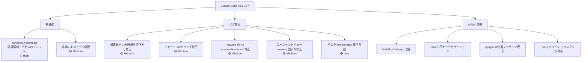
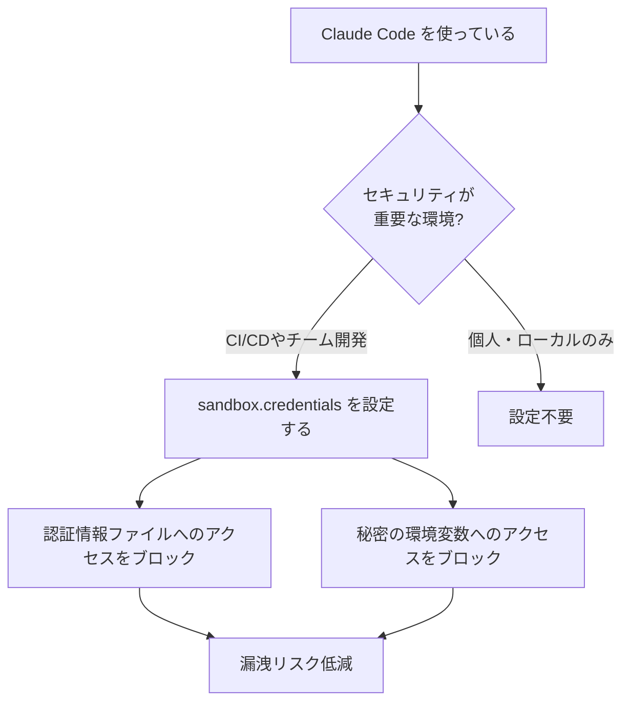

## はじめに

Claude Code v2.1.187 がリリースされました。このリリースで最も注目すべきは **`sandbox.credentials` 設定の追加**です。サンドボックス化されたコマンドが認証情報ファイルや秘密の環境変数を読み取れないようにするセキュリティ強化機能で、CI/CD 環境や複数人開発チームで Claude Code を運用している場合に特に重要です。

また、構造化出力（`--json-schema` / `agent({schema})`）の無限ループバグや、リモート MCP ツールの無応答ハングなど、自動化パイプラインに影響していた中程度の不具合も複数修正されています。

> **📌 影響を受ける人**
> - Claude Code をセキュリティが求められる環境（CI/CD、チーム開発）で利用している方
> - ワークフローで `--json-schema` や `agent({schema})` を使っている方
> - リモート MCP ツールを統合している方
> - VSCode 拡張機能で大規模セッションを扱っている方

---

## 変更の全体像



---

## 変更内容

### severity 別サマリー

| severity | 件数 | 主な変更 |
|----------|------|----------|
| 🔴 High | 1 | `sandbox.credentials` 設定追加 |
| 🟡 Medium | 4 | 構造化出力バグ、MCP ハング、`--resume` バグ、エージェントビューバグ |
| 🟢 Low | 15 | UI 改善、韓国語/CJK 文字化け、worktree クリーンアップ 等 |

### 新機能

#### `sandbox.credentials`（High）
サンドボックス化されたコマンドが認証情報ファイルや秘密の環境変数を読み取れないようブロックする設定です。`.env` ファイルや AWS クレデンシャル等を Claude Code のサブプロセスに見せたくない場面で有効です。

#### 組織によるモデル制限（Medium）
管理者が設定したモデル制限が、`--model` フラグ・`/model` コマンド・`ANTHROPIC_MODEL` 環境変数のすべてに反映されます。制限されたモデルを選択すると `restricted by your organization's settings` というメッセージが表示されます。

### バグ修正（Medium 以上）

| ID | 内容 | 影響 |
|----|------|------|
| change-005 | 構造化出力の StructuredOutput 無限再呼び出し修正 | `--json-schema` / `agent({schema})` が無限ループしていた |
| change-006 | リモート MCP ツール呼び出しの無応答ハング修正 | 応答なしで5分間フリーズしていた（`CLAUDE_CODE_MCP_TOOL_IDLE_TIMEOUT` で上書き可） |
| change-004 | `--resume` が `No conversation found` で失敗する問題 | `-p` でモデルターンが生成されなかったセッションの再開が不可だった |
| change-010 | エージェントビューのバックグラウンドジョブが `working` で固まる問題 | 構造化出力を生成せずターンを終えた場合に無限フリーズしていた |

### バグ修正（Low）

- **韓国語/CJK 文字化け修正**（change-008）: バイト単位の extended-key イベントで配信するターミナルでの文字化けを解消
- **Remote Control 経由の `/update` ハング修正**（change-009）
- **`/share` アップロード中の Esc/Ctrl-C/Ctrl-D 無効化修正**（change-017）
- **macOS Ghostty フルスクリーンで Cmd+click が URL を開かない問題修正**（change-015）
- **サブエージェントの深度トラッキング修正**（change-013）: resume 後の深度復元とフォーク時の深度カウント修正
- **リークした worktree 登録の自動クリーンアップ**（change-014）: kill されたエージェントが残した `.git/worktrees/` エントリを自動削除
- **Claude Code Remote セッション起動の約2.7秒遅延修正**（change-007）
- **チャンネル接続の切断問題修正**（change-011）: エージェントビュー移動後や `/bg`・`/tui`・`/update` 後の接続ドロップを修正
- **`claude --help` に `--bg/--background` が表示されない問題修正**（change-016）
- **エージェント停止通知の文言改善**（change-012）: `came to rest` → `finished`/`stopped` に変更
- **VSCode 拡張機能の大規模セッション再開フリーズ修正**（change-021）

### UI/UX 改善

- **フルスクリーンモードでのマウスクリック対応**（change-003）: 権限プロンプト・`/model`・`/config` 等をマウスで選択可能に
- **`/install-github-app` の改善**（change-018）: GitHub Actions ワークフロー設定が任意化。App のみのインストールが可能に
- **`/btw` の矢印キーナビゲーション追加**（change-019）: ←/→ キーで過去の回答を辿れるように
- **`/plugin` で未使用プラグインを表示**（change-020）: 不要なプラグインの整理が容易に

---

## 影響と対応

### `sandbox.credentials` の設定方法（要対応）

セキュリティ強化を行いたい場合は `sandbox.credentials` を設定します。認証情報ファイルや秘密の環境変数へのサンドボックスからのアクセスをブロックできます。



### 構造化出力・MCP を使っているチームへ

| 使用機能 | 修正前の問題 | 修正後 |
|----------|-------------|--------|
| `--json-schema` / `agent({schema})` | StructuredOutput が無限再呼び出し | 正常に1回で返却 |
| リモート MCP ツール | 応答なし時に5分ハング | タイムアウトでエラー終了（設定可） |
| `--resume` + `-p` | `No conversation found` エラー | 正常に再開可能 |

> **💡 Tips**
> リモート MCP ツールのタイムアウト時間を変更したい場合は `CLAUDE_CODE_MCP_TOOL_IDLE_TIMEOUT` 環境変数で上書きできます。デフォルトの5分より長いタイムアウトが必要なツール（重い処理など）がある場合に活用してください。

---

## コード例

### Before/After: `sandbox.credentials` 設定

**Before（v2.1.186 以前）**

```json
// .claude/settings.json
{
  "sandbox": {
    "enabled": true
  }
}
```

サンドボックス内のコマンドが `.env` や AWS クレデンシャルなどの認証情報ファイル・秘密の環境変数にアクセス可能な状態でした。

**After（v2.1.187 以降）**

```json
// .claude/settings.json
{
  "sandbox": {
    "enabled": true,
    "credentials": {
      "block": true
    }
  }
}
```

`sandbox.credentials` を設定することで、サンドボックス化されたコマンドからの認証情報ファイルや秘密の環境変数へのアクセスをブロックできます。

---

### Before/After: 構造化出力の挙動

**Before（v2.1.186 以前）**

```typescript
// agent({schema}) が成功した後も StructuredOutput を再呼び出しし続けるバグがあった
const result = await agent("タスクを実行してください", {
  schema: MY_SCHEMA
})
// → StructuredOutput が無限に呼び出され、処理が終わらないことがあった
```

**After（v2.1.187 以降）**

```typescript
// 正常に1回で構造化出力が返るようになった
const result = await agent("タスクを実行してください", {
  schema: MY_SCHEMA
})
// → result に期待通りの構造化データが返却される
// → フォローアップターンでも構造化出力が確実に返る
```

---

### MCP タイムアウトのカスタマイズ

```bash
# デフォルト（5分）より長いタイムアウトが必要な場合
export CLAUDE_CODE_MCP_TOOL_IDLE_TIMEOUT=600000  # 10分（ミリ秒）

# または .env に追記
CLAUDE_CODE_MCP_TOOL_IDLE_TIMEOUT=600000
```

---

## まとめ

Claude Code v2.1.187 の要点を整理します。

| カテゴリ | 内容 | 対応優先度 |
|----------|------|-----------|
| 🔒 セキュリティ | `sandbox.credentials` でクレデンシャル漏洩リスク低減 | **高**（チーム・CI/CD 環境） |
| 🏢 組織管理 | モデル制限が全モデル選択手段に反映 | 自動適用 |
| 🔄 構造化出力 | 無限再呼び出しバグ修正 | 自動修正済み |
| 🔌 MCP | リモートツールのハング修正 + タイムアウト設定 | 自動修正済み（必要に応じてタイムアウト調整） |
| 🔁 セッション管理 | `--resume` バグ修正、worktree クリーンアップ自動化 | 自動修正済み |
| 🖥️ VSCode | 大規模セッション再開フリーズ修正 | 自動修正済み |

最も手動対応が必要なのは **`sandbox.credentials` の設定**です。チーム開発や CI/CD パイプラインで Claude Code を活用している場合は、設定を検討してください。構造化出力や MCP 関連のバグは自動的に修正されているため、v2.1.187 へのアップデートだけで恩恵を受けられます。
