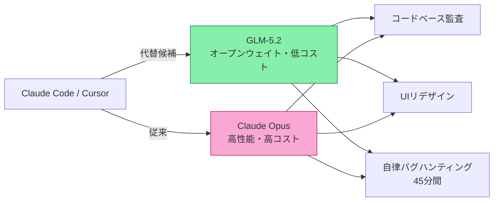
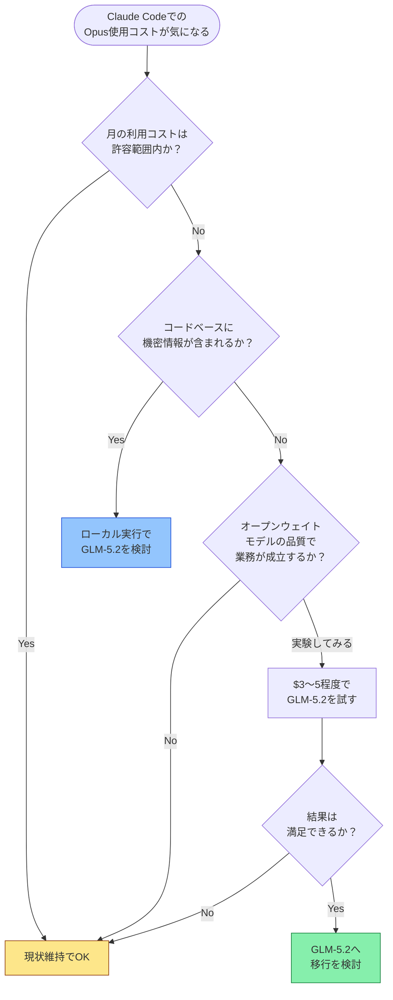

## はじめに

Claude CodeでOpusを使っていると、コストが気になることはありませんか？

Lenny's Newsletterに掲載された検証記事が話題を集めています。Z.AIが提供するオープンウェイトモデル「**GLM-5.2**」を、CursorおよびClaude Code上で実際の開発タスクに投入し、**総コストわずか$3.36**でClaude Opusの代替として機能するかを検証したというものです。

本記事では、その検証内容を整理し、「どんな人が影響を受けるか」「実際に乗り換えを検討すべきか」を解説します。

> **📌 影響を受ける人**
> - Claude Code（またはCursor）でOpusを日常的に使っている開発者
> - AIコーディングアシスタントのコスト削減を検討しているチーム
> - オープンウェイトモデルの実用性に興味があるエンジニア

---

## 変更の全体像

今回の話題の核心は「**クローズドモデル vs オープンウェイトモデル**」という構図です。



GLM-5.2はZ.AIが提供するオープンウェイトモデルで、モデルの重みが公開されているため、ローカル実行やAPI経由での利用が可能です。Claude Opusはその高い推論性能で知られますが、コストも相応に高くなります。

---

## 検証内容の詳細

### 実施したタスク

| タスク | 内容 | 難易度 |
|---|---|---|
| コードベース監査 | 既存コードの品質・問題点のレビュー | 中〜高 |
| UIリデザイン | 画面設計の改善提案と実装支援 | 中 |
| 自律バグハンティング | 45分間の自律的なバグ探索と修正 | 高 |

### 検証環境

| 項目 | 詳細 |
|---|---|
| 対象モデル | GLM-5.2（Z.AI提供） |
| 比較対象 | Claude Opus |
| 使用プラットフォーム | Cursor、Claude Code |
| 総コスト | **$3.36** |
| 提供元 | Z.AI（オープンウェイト） |

---

## モデル比較：GLM-5.2 vs Claude Opus

```mermaid
graph TD
    subgraph GLM-5.2
        G1[オープンウェイト]
        G2[低コスト]
        G3[自律タスク対応]
        G4[ローカル実行可能]
    end

    subgraph Claude Opus
        C1[クローズドモデル]
        C2[高性能・高コスト]
        C3[Anthropic API経由]
        C4[Claude Codeネイティブ]
    end

    Compare[実地検証で比較] --> GLM-5.2
    Compare --> Claude Opus
```

> **💡 Tips**
> オープンウェイトモデルは「重みが公開されている」という特徴から、企業のセキュリティポリシーでクラウドLLM利用が制限されているケースでも、オンプレミス展開の選択肢が生まれます。

---

## なぜこれが重要なのか

### コスト面

Claude CodeでOpusを使うと、複雑なタスクでは1セッションあたり数ドルかかることも珍しくありません。今回の検証では**3つの実タスクを合計$3.36**で実施できたとされており、コスト効率の高さが示されています。

### オープンウェイトの意味

| 観点 | クローズドモデル（Opus） | オープンウェイト（GLM-5.2） |
|---|---|---|
| コスト | 高め | 低コスト傾向 |
| カスタマイズ | 不可 | ファインチューニング可能 |
| ローカル実行 | 不可 | 可能 |
| ベンダーロック | あり | なし |
| エンタープライズ利用 | API利用規約に依存 | 重みを直接管理可能 |

### 自律エージェントとしての実用性

「**45分間の自律バグハンティング**」というタスクは注目に値します。単発の質問応答ではなく、継続的に自律判断しながらコードを調査・修正するエージェント的な使い方での検証であり、Claude Code的なワークフローとの親和性を評価しています。

---

## 移行を検討すべきかの判断フロー



---

## コード例：Claude CodeでGLM-5.2を使う場合のイメージ

Claude Code自体はAnthropicのモデルを使う前提で設計されていますが、GLM-5.2のようなモデルはOpenAI互換APIを通じてCursorなどのツールから呼び出すことが可能です。

### Before（Opus使用時のCursor設定イメージ）

```json
{
  "model": "claude-opus-4",
  "provider": "anthropic",
  "apiKey": "sk-ant-..."
}
```

### After（GLM-5.2をOpenAI互換APIで使う場合のイメージ）

```json
{
  "model": "glm-5.2",
  "provider": "openai-compatible",
  "baseUrl": "https://api.z.ai/v1",
  "apiKey": "YOUR_Z_AI_KEY"
}
```

> **⚠️ Breaking Change**
> Claude Code（Anthropic公式CLIツール）はAnthropicモデル専用です。GLM-5.2をClaude Code上で動かすには、OpenAI互換エンドポイントをサポートする設定変更や、Cursor等の別ツールへの移行が前提になります。公式サポート外の構成となる点に注意してください。

---

## こんな人に特に刺さる検証

1. **スタートアップ・個人開発者**: AIコーディングアシストのコストを最小化したい
2. **セキュリティ要件が厳しい企業**: クラウドAPIへのコード送信を避けたい
3. **オープンソース志向のチーム**: ベンダーロックインを避けながらAIを活用したい
4. **AIエージェント開発者**: 自律タスクを低コストで大量実行したい

---

## まとめ

| ポイント | 内容 |
|---|---|
| 検証モデル | Z.AI製オープンウェイトモデル「GLM-5.2」 |
| 検証コスト | $3.36（3タスク分） |
| 評価タスク | コードベース監査・UIリデザイン・自律バグハンティング |
| 結論 | Claude Codeにおけるopusの代替候補として推奨 |

GLM-5.2の実地検証は、「高性能クローズドモデルでなければ業務に使えない」という思い込みを覆す可能性を示しています。**$3.36という低コストで実際の開発タスクを完遂できた**という事実は、コスト意識の高い開発者にとって無視できない情報です。

まずは小さなタスクでGLM-5.2を試し、自分のユースケースに合うかを検証してみるのが現実的なアプローチでしょう。オープンウェイトモデルの進化は著しく、今後もこうした「コスパ最強モデル」の登場が続くと考えられます。

---

*本記事はLenny's Newsletter（2026年6月24日掲載）の検証記事をもとに構成しています。*
