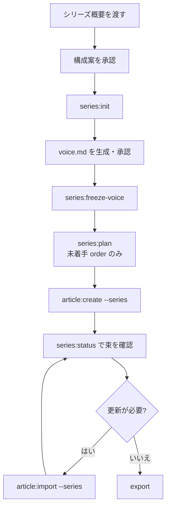
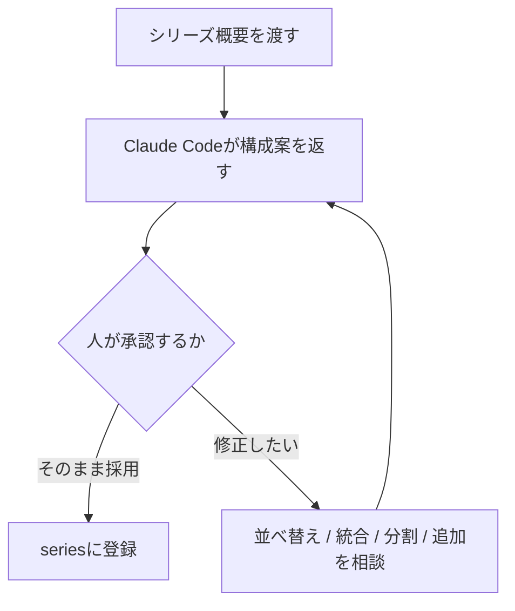

## この記事でやること

Claude Code と llm-task-router 0.2.53 を使って、連載記事を次の流れで管理します。

- `series:init` でシリーズを作る
- Claude Code が `voice.md`（文体ルール）を生成し、人が承認する
- `series:freeze-voice` で文体ルールを凍結する
- `series:plan` で未着手回を登録する
- `article:create --series` で各回を作る
- `series:status` で状態を確認する

単発記事なら、`create → evaluate → factcheck → revise → export` の流れを回せても、**連載**になると難しさが一段上がります。

- 各回をどう分けるか
- どの順番で並べるか
- 文体や見出しの作法をどう揃えるか
- 途中で1本足したくなったときに、全体をどう崩さず直すか

このあたりを全部自分で設計しようとすると、本文を書く前にかなり消耗します。

そこで本記事では、「**縄文時代の入門連載をやりたい**」という曖昧な状態から出発して、Claude Codeに**シリーズ概要**を渡し、構成案をまとめてもらい、人は**承認と修正**に集中する進め方を紹介します。

題材は実例として、次の前提で最後まで通します。

- `seriesId=jomon` 〜 シリーズの識別子。`series/<slug>/` のディレクトリ名であり `--slug` に渡す値（ここでは jomon）。
- `profile=note` 〜 出力先・記事作法のプロファイル。ここでは note 向け。シリーズの各回は既定でこのプロファイルに揃う。
- `voice v1` 〜 シリーズ共有の文体ルール（voice）の凍結バージョン。v1＝最初に凍結した版。
- **完成済みは order 1〜3**（`done`）〜 order はシリーズ内の並び順（1始まり）、done は member の状態で「完成（export 済み）」を表す。
- **作成中は order 4**（`writing`）〜 writing は「作成中」の状態。
- **予定は order 5〜6**（`planned`）〜 planned は「未着手の予定枠」の状態。

ポイントは、**決定権は人に残す**ことです。Claude Codeには、構成案づくり、`voice.md` の生成、CLI実行、`status` 管理を担ってもらい、人は「どういう連載にしたいか」と「その案を採るかどうか」を決めます。

## この記事の前提

`llm-task-router` は、記事作成フローやシリーズ運用をCLIから進めるためのツールです。  
この記事では、**Claude Code と連携して使う前提**で、シリーズ企画から `series` 運用までの流れを扱います。

対象バージョンは `llm-task-router 0.2.53` です。  
最新仕様は利用中のリポジトリや README を確認してください。

また、冒頭で触れた `create → evaluate → factcheck → revise → export` は、**単発記事1本を作るときの基本フロー**です。この記事はその知識を前提に、**連載（シリーズ）運用**に絞って解説します。単発記事フローの詳細は別途または README を参照してください。

実行例では、コマンド名を次の形式で表記します。

```shell
llm-task-router series:init --slug jomon --profile note
```

環境によっては、実際の呼び出しが `npx ...` や別名コマンドになることがあります。  
自分の環境での実行名、インストール方法、対応バージョンは、利用中の `llm-task-router` のリポジトリや README を確認してください。

### 用語のミニ定義

- `seriesId`: シリーズ識別子。`series/<slug>/` のディレクトリ名であり `--slug` に渡す値
- `profile`: 出力先や記事作法に関わるプロファイル
- `voice`: シリーズ全体で共有する文体・語り口・見出し作法などのルール
- `member`: シリーズを構成する各回
- `order`: シリーズ内での並び順
- `run`: ある回の作成実行と成果物の単位
- `status`: 各 member の状態。`planned` / `writing` / `done` / `updating`

:::note info
この記事では、CLIの**操作の流れ**と**連載設計の考え方**に重点を置いています。  
`direction-check`、`factcheck`、`export` など単発記事側の詳細は、既存の単発記事フローの説明とあわせて読むと追いやすいです。
:::

---

## 導入: 「縄文時代で連載をやりたい」から始める

単発記事では、「今回のテーマはこれ」と決めてしまえば走りやすいです。  
一方で連載では、記事単体の良し悪しだけでなく、**束として自然か**を考える必要があります。

たとえば縄文時代の入門連載をやるとしても、

- 第1回で何を説明するか
- 「縄文人とは」を先に置くか、「環境」を先に置くか
- 暮らし・信仰・ものづくりを何本に分けるか
- 読者に「次も読みたい」と思わせる並びになっているか

といった設計が必要です。

この設計を最初から厳密に1人でやるのではなく、Claude Codeに**連載の輪郭**を伝えて、まずはたたき台を作らせる。そこから人が直す。この流れにすると、最初のハードルがかなり下がります。

本記事では抽象論ではなく、**縄文時代の入門連載**を例に、構成案の相談から `series` 運用までを具体的に見ていきます。



---

## 最初に押さえる役割分担: 人が決めること / Claude Codeが駆動すること

先に、責任分界をはっきりさせます。

### 人が決めること

- シリーズ概要を伝える
- 生成された `voice.md` を確認・承認する
- 構成案の採否を決める
- 並べ替え、統合、分割、追加の方針を決める

### Claude Codeが駆動すること

- 概要をもとに構成案を提案する
- テーマと形式から `voice.md`（文体方針）を生成する
- `series:*` / `article:*` のCLIを実行する
- `status` や `order` を見ながら束の状態を管理する

つまり、**本文も構成も丸投げ**ではありません。  
Claude Codeは、連載設計の下書き、`voice` のたたき台づくり、運用の実務を支えますが、「この連載はこういう形でいく」という決定は人が持ちます。

:::note info
この線引きを最初に決めておくと、期待値が安定します。  
「全部いい感じにやってくれるはず」と思うとズレやすく、逆に「たたき台と運用補助を任せる」と割り切ると使いやすいです。
:::

---

## ステップA: Claude Codeにシリーズ概要を伝える

良い構成案を出してもらうには、最初に渡す概要が重要です。  
とはいえ、厳密な目次まで決める必要はありません。

まず伝えたいのは、次の5点です。

- 題材
- 想定読者
- 全体の狙い
- だいたいの本数
- 語り口の希望

たとえば、こんな自然文で十分です。

```text
縄文時代の入門連載を全6回くらいで作りたいです。
読者は歴史好きの一般人で、専門知識はあまり前提にしません。
狙いは、縄文時代を「土器の時代」くらいの理解から、
人びとの暮らし・環境・祈りまで見通せるようにすることです。
語り口はやさしめで、読み物として続けて読める感じにしたいです。
各回のテーマと順番のたたき台を提案してください。
```

ここでは「全6回くらい」と曖昧に始めていますが、この記事の題材では、対話を通じて**6本構成で確定**したものとして進めます。  
そして運用上の前提は、**order 1〜3 が done、order 4 が writing、order 5〜6 が planned** です。

この段階では、「第3回は必ずこれ」と細かく縛らなくて構いません。  
連載の輪郭があれば、Claude Code に構成案のたたき台を作らせやすくなります。

大事なのは、**題材の情報量を盛ることより、連載として何を目指すかを伝えること**です。  
「読者は誰か」「どこまで連れていきたいか」が明確だと、分割の仕方が安定します。

---

## ステップB: 構成案を受け取り、対話で直す

概要を渡すと、Claude Codeから各回テーマ・順番・`voice` の方針を含んだ構成案が返ってきます。

縄文シリーズの例では、たとえば次のような案になります。

1. 第1回 概説・年代
2. 第2回 縄文人とは（起源＋人口）
3. 第3回 環境と自然の大事件（縄文海進＋鬼界カルデラ噴火）
4. 第4回 暮らし（食糧＋村）
5. 第5回 ものづくりと装い（土器・道具＋衣服）
6. 第6回 こころと祈り（祭祀・精神世界・最終回）

この段階で、シリーズ構成のたたき台としては十分に使えます。  
ただし、**ここで確定と思わない**のが大事です。

たとえば、こんな修正相談ができます。

- 第2回と第3回を入れ替えたい
- 暮らし回を2本に分けたい
- 信仰回を終盤ではなく中盤に置きたい
- 転換点を扱う回を1本追加したい

### 追加回を相談する例

これは、**最終的には採用しないものの、こう相談すれば差し込み位置まで提案が返る**ことを示す対話デモです。

たとえば人がこう言います。

> 縄文時代の大きな事件、転換点を1回足したいです。どこに差し込むのが自然ですか？

するとClaude Codeは、候補テーマと差し込み位置を提案できます。  
たとえば、こんな返しです。

- 候補: 「縄文時代を揺らした大事件」
- 内容候補: 気候変動、縄文海進、鬼界カルデラ噴火、地域社会への影響
- 差し込み位置候補:
  - 第3回の前後に置く
  - 既存の環境回を再編して独立回にする
  - 最終回前に「変化と終焉」の回として置く

ここで人が判断します。

たとえば、

- **環境**は長期的な背景として扱う
- **大事件**は社会へのショックと変化に絞る

という切り分けにすれば、既存の第3回と新設回がきれいに分かれます。

ただし、この記事では最終的に**追加回は採用せず、6本構成で確定した例**として進めます。

### `voice` 方針と member タイトルは別に考える

ここで注意したいのは、`voice` の方針と、`series.json` に入る各 member の `title` は別物だという点です。

たとえば縄文シリーズでは、`voice.md` に

- 小見出しは疑問形で統一する
- やさしい語り口にする
- 学説差がある箇所は断定しすぎない

といった方針を書くのは自然です。  
一方で、シリーズの各回タイトルそのものは、実データでは疑問形に統一されていません。

結論だけ先に言うと、member の `title` は「小見出しは疑問形で統一」という `voice` 方針の対象外なので、疑問形と体言止めが混在していて構いません。

なぜなら、member の `title` は**シリーズ構成を表す固定ラベル**であり、各記事本文の**小見出しルールとは別レイヤー**だからです。

つまり、

- **`voice` の「見出しは疑問形」方針**は、各記事の中の小見出しに関するルール
- **member の `title`** は、シリーズ全体の見取り図として置く構成ラベル

として分けて扱います。

この区別を意識しないと、member タイトルまで無理に全部疑問形へ変換しようとして、不自然なタイトルになり、シリーズ構成の見通しがかえって悪くなります。  
構成案を受け取った段階で、member タイトルを無理に疑問形へ変換する手順は不要です。



---

## ステップC: 承認した構成をseriesの土台に落とす

構成案を承認したら、今度はそれを `series` の土台に落とします。  
この記事では、次の順で進めます。

1. `series:init`
2. `voice.md` を生成・承認
3. `series:freeze-voice`
4. `series:plan`

### 1. seriesを初期化する

まずシリーズを作ります。

```shell
llm-task-router series:init --slug jomon --profile note
```

これで `series/jomon/` と空の `voice.md` ができます。

実行後の対応関係は、次のように見ると把握しやすいです。

```text
series/
  jomon/
    voice.md       # series:init が空で作成→Claude Code が生成→人が承認→freeze
    series.json    # シリーズ台帳（members/order/status/voice）
    README.md      # series:status --write / create で生成（派生ビュー）
topics/
  jomon-crafts.txt
  jomon-ritual.txt
out/
  ...              # article:export の成果物
```

`README.md` は `series:init` の生成物ではなく、`article:create --series` や `series:status --write` で生成される派生ビューです。

### 2. voice.md を Claude Code に生成させる（人が承認）

ここは重要です。`voice.md` は**人が承認する肝**であり、生成そのものはClaude Codeが担います。

`series:init` が作る `voice.md` は**空の placeholder**です。  
人がゼロから一行ずつ書き始める前提ではなく、この空ファイルに対して、Claude Codeが**指定されたテーマと形式**に合わせた文体方針を書き込み、人がそれを確認・微調整・承認する流れで進めます。

定義するものの例:

- 文体
- 人称
- トーン
- 見出しの作法
- 説明の粒度
- 断定の強さ
- 読者への語りかけ方

縄文シリーズなら、Claude Codeにはたとえば次のような方針を含む `voice` を生成させられます。

- やさしい語り口
- 歴史好きの一般読者向け
- 専門用語は必要最小限
- 小見出しは疑問形で統一
- 断定しすぎず、学説差がある箇所は含みを持たせる

大事なのは、**生成された `voice.md` をそのまま盲信しない**ことです。  
人はゼロから全部を書く代わりに、出てきた文体方針が「この連載らしいか」を見て、必要なら言い回しや制約を調整してから承認します。

### 3. voiceを凍結する

生成・確認した `voice.md` を承認したら凍結します。

```shell
llm-task-router series:freeze-voice --slug jomon
```

これで `voice` がシリーズに固定され、以後の `create` に焼き込まれます。  
あとから変えたい場合は、別ファイルとして更新し、**再凍結してversionを上げる**運用にします。

### 4. plannedとして未着手回を登録する

`series:plan` は、**空いている order の planned 枠を登録する**ためのコマンドです。  
この記事ではこのルールを基準にし、**plan の対象は未着手 order のみ**として扱います。

したがって、現在の状態を

- order 1〜3: `done`
- order 4: `writing`
- order 5〜6: `planned`

としている本記事では、`series:plan` の例は**未着手の order 5, 6 のみ**にします。

```shell
llm-task-router series:plan --slug jomon --title "ものづくりと装い（土器・道具＋衣服）" --order 5 --member-slug crafts
llm-task-router series:plan --slug jomon --title "縄文人のこころと祈り（祭祀・精神世界・最終回）" --order 6 --member-slug ritual
```

### `--member-slug` はいつ必要か

`--member-slug` は、メンバーに使うslugを明示したいときに付けます。  
とくに**日本語タイトルから自動slugを安定して作れない環境**や、**期待しないslug生成を避けたい場合**は、明示しておくと安全です。

つまり、

- 英語タイトル中心で自動生成に任せても問題ない環境では任意
- 日本語タイトル中心、またはslugを固定したい場合は実質必須

と考えるとわかりやすいです。

たとえばこのシリーズでは、実データに合わせて次の slug を使います。

| Order | Member slug |
| --- | --- |
| 1 | `jomon-intro` |
| 2 | `jomon-people` |
| 3 | `jomon-environment` |
| 4 | `jomon-life` |
| 5 | `crafts` |
| 6 | `ritual` |

追加した回を採用するなら、同様に `series:plan` で登録します。  
ただし、**すでに run のある `order` は `plan` で埋められない**点には注意が必要です。

### `series.json` にはどう記録されるか

たとえば抜粋イメージはこんな感じです。

```json
{
  "seriesId": "jomon",
  "version": 1,
  "profile": "note",
  "voice": {
    "frozen": true,
    "version": 1,
    "frozenAt": "2026-06-24T07:49:04.658Z",
    "hash": "sample-hash-value"
  },
  "members": [
    {
      "order": 1,
      "slug": "jomon-intro",
      "title": "縄文時代ってどんな時代？（概説・年代）",
      "status": "done",
      "runId": "2026-06-24-jomon-intro"
    },
    {
      "order": 2,
      "slug": "jomon-people",
      "title": "縄文人とは誰か（起源＋人口）",
      "status": "done",
      "runId": "2026-06-24-jomon-people"
    },
    {
      "order": 3,
      "slug": "jomon-environment",
      "title": "環境と自然の大事件（縄文海進＋鬼界カルデラ噴火）",
      "status": "done",
      "runId": "2026-06-24-jomon-environment"
    },
    {
      "order": 4,
      "slug": "jomon-life",
      "title": "縄文人の暮らし（食糧＋村）",
      "status": "writing",
      "runId": "2026-06-24-jomon-life"
    },
    {
      "order": 5,
      "slug": "crafts",
      "title": "ものづくりと装い（土器・道具＋衣服）",
      "status": "planned",
      "runId": null
    },
    {
      "order": 6,
      "slug": "ritual",
      "title": "縄文人のこころと祈り（祭祀・精神世界・最終回）",
      "status": "planned",
      "runId": null
    }
  ]
}
```

`frozenAt` はサンプル値、`hash` は環境で変わるサンプル値です。  
`runId` も環境で変わりますが、`done` / `writing` の回は文字列を持ち、`planned` は `null` になる形を押さえておくと全体像がつかみやすいです。

ここで押さえたいのは、`voice version`、`members`、`order`、`status`、`runId` がシリーズの運用基盤になることです。

---

## ステップD: 各回をarticle:create --seriesで作る

土台ができたら、各回を作っていきます。

この記事の前提では、**order 1〜3 はすでに完成済み**で、**order 4 は作成中**です。  
したがって、これから新規着手する対象は **order 5〜6** です。

基本形はこれです。

```shell
llm-task-router article:create --series jomon --order 5 --topic-file topics/jomon-crafts.txt
```

この指定で、

- シリーズ `jomon`
- `order=5`
- 対応する planned member
- 凍結済み `voice`

を使って記事作成が始まります。

### 自動で揃うもの

`--series` を使うと、次の点が自動で整合されます。

- 凍結 `voice` が `meta.style` に反映される
- `profile` はシリーズ側に自動整合される

もし `profile` が食い違う指定になっている場合は拒否されます。  
例外的に必要な場合だけ、`--allow-profile-mismatch` を使います。

:::note info
これらは **0.2.53 時点の挙動**です。詳細や例外は、自分の環境の README や実機で確認してください。
:::

### 単発記事の延長として回せる

生成後の流れは、基本的に単発記事と同じです。

- `direction-check`
- `factcheck`
- 編集レビュー
- `export`

たとえば最小限なら、次のように進めます。

```shell
llm-task-router article:create --series jomon --order 5 --topic-file topics/jomon-crafts.txt
llm-task-router article:direction-check --series jomon --order 5
llm-task-router article:factcheck --series jomon --order 5
llm-task-router article:export --series jomon --order 5 --out-dir out/
```

つまり、連載で新しく難しくなるのは**企画と管理**であって、各回の制作フロー自体はいつもの延長です。

### order 4 は「作成中」の例として見る

order 4 の「縄文人の暮らし（食糧＋村）」は、この記事の前提ではすでに `writing` です。  
そのため、「これから `plan` して新規作成する回」ではなく、**現在進行中の回を `status` で把握する例**として扱うのが自然です。

以下に一連のCLI例をまとめます。

```shell
# 1. シリーズ初期化
llm-task-router series:init --slug jomon --profile note

# 2. voice.md（Claude Code が生成）を確認・承認したあと凍結
llm-task-router series:freeze-voice --slug jomon

# 3. 未着手の planned メンバーだけ登録
llm-task-router series:plan --slug jomon --title "ものづくりと装い（土器・道具＋衣服）" --order 5 --member-slug crafts
llm-task-router series:plan --slug jomon --title "縄文人のこころと祈り（祭祀・精神世界・最終回）" --order 6 --member-slug ritual

# 4. 状態確認
llm-task-router series:status --slug jomon

# 5. これから作る planned メンバーを順に作成
llm-task-router article:create --series jomon --order 5 --topic-file topics/jomon-crafts.txt
llm-task-router article:create --series jomon --order 6 --topic-file topics/jomon-ritual.txt
```

`export` 時の `--out-dir` による自動命名も、単発記事で慣れていればそのまま使えます。  
なお、plan の対象は未着手 order のみです。詳しくはステップCを参照してください。

---

## ステップE: series:statusで束を見渡し、必要なら修復する

連載では、1本ずつ見るだけでなく、**束として今どうなっているか**が重要です。  
その確認に使うのが `series:status` です。

```shell
llm-task-router series:status --slug jomon
```

### member状態の4値

状態は次の4つです。

| Status | Icon | 意味 |
| --- | --- | --- |
| `planned` | ⬜ | 予定 |
| `writing` | 🚧 | 作成中 |
| `done` | ✅ | 完成 |
| `updating` | ✏️ | 更新中 |

### 「完成3本＋作成中1本＋予定2本」の見え方

縄文シリーズの例なら、READMEテーブルはこんなイメージです。

| Order | Status | Title |
| --- | --- | --- |
| 1 | ✅ done | 縄文時代ってどんな時代？（概説・年代） |
| 2 | ✅ done | 縄文人とは誰か（起源＋人口） |
| 3 | ✅ done | 環境と自然の大事件（縄文海進＋鬼界カルデラ噴火） |
| 4 | 🚧 writing | 縄文人の暮らし（食糧＋村） |
| 5 | ⬜ planned | ものづくりと装い（土器・道具＋衣服） |
| 6 | ⬜ planned | 縄文人のこころと祈り（祭祀・精神世界・最終回） |

この一覧があるだけで、「今は3本できていて、1本が進行中、未着手は2本」「次に新規着手するのは第5回」といった見通しがかなり良くなります。

### 補修とREADME生成

必要なら、`series:status` には補助機能があります。

```shell
llm-task-router series:status --slug jomon --fix
llm-task-router series:status --slug jomon --write
```

- `--fix`: runを正として `members` や `order` を補修
- `--write`: READMEを生成

コンソール出力イメージはこんな感じです。

```text
Series: jomon
Profile: note
Voice: v1 (frozen)

[1] done      jomon-intro         縄文時代ってどんな時代？（概説・年代）
[2] done      jomon-people        縄文人とは誰か（起源＋人口）
[3] done      jomon-environment   環境と自然の大事件（縄文海進＋鬼界カルデラ噴火）
[4] writing   jomon-life          縄文人の暮らし（食糧＋村）
[5] planned   crafts              ものづくりと装い（土器・道具＋衣服）
[6] planned   ritual              縄文人のこころと祈り（祭祀・精神世界・最終回）
```

:::note warn
日付、hash、runId、行数などは環境によって変わります。  
記事やREADMEに例を載せるときは、**実データの雰囲気を示すサンプル**として扱うのが安全です。
:::

---

## 公開済みメンバーの更新はarticle:import --seriesから始める

連載運用で意外と大事なのが、**公開済み回の扱い**です。

公開した第2回にあとから補足を入れたい、構成を少し直したい、ということは普通に起きます。  
このとき、全面リライトのつもりで新規作成し直すより、**import起点の差分更新**として扱うほうが管理しやすいです。

```shell
llm-task-router article:import --series jomon --order 2
```

この流れに入ると、member状態は `updating` になります。  
`series:status` でも、その回が**新規作成中ではなく更新中**であることが見えるようになります。

連載では、

- **新規作成**
- **既存回の更新**

を分けて考えるだけで、かなり運用が安定します。

:::note info
`article:import` は**更新が必要な場合のみ**使う任意手順です。  
初回作成の標準フローに毎回含めるものではありません。
:::

---

## つまずきやすい点 / FAQ

### freeze前にcreateできないのはなぜ？

シリーズの一貫性を支える前提が、**voice凍結**だからです。  
各回を作り始めてから文体ルールを決めると、束として揃いにくくなります。

### planはfreeze前でもできる？

実装によって許容範囲はありえますが、少なくとも**create前にはfreeze済み**にしておくのが安全です。  
この記事では、手順の混乱を避けるために **freezeしてからplanし、その後createする**順にそろえています。

### `voice.md` はCLIが自動生成してくれる？

いいえ。ここは切り分けが必要です。  
`series:init` がやるのは、**空の `voice.md` placeholder を用意することだけ**です。  
文体方針の生成はCLIではなくClaude Codeが担い、人はその内容を確認・微調整・承認したうえで `series:freeze-voice` に進みます。

### profile mismatchで拒否された

基本は**シリーズ側に合わせる**のが正解です。  
例外的な事情がある場合だけ `--allow-profile-mismatch` を使います。  
これも **0.2.53 時点の挙動**として、自環境で確認してください。

### 既にrunのあるorderにplanできない

`planned` 枠は、**空いている order を埋めるためのもの**だからです。  
すでに run が存在するなら、その order は `done` / `writing` / `updating` のいずれかとして管理されます。  
この縄文シリーズの前提でも、order 1〜4 は runId を持つため、`plan` の対象にはしません。

### voiceを変えたくなった

その場合は、`voice.md` を更新して**再freeze**し、`version` を上げる運用にします。  
過去回と今後の回でどう整合を取るかは、人が判断するポイントです。

### 構成は最初に全部決め切る必要がある？

ありません。  
むしろ連載は、やりながら学んで修正する前提のほうが自然です。`plan` は後から足せます。

### まだ未搭載のものは？

現状未搭載として区別しておきたいものには、たとえば次があります。

- `plan` のoutline自動割り付け
- 章送りの連続性の自動管理
- `/series` スラッシュコマンド

これらは今後の段階として考えるとよいです。  
「今できること」と「これから載るもの」を分けて認識しておくと、運用判断がしやすくなります。

---

## まとめ: まずは自分の題材で「概要を伝える」ところから

Claude Codeに**シリーズ概要**を渡して構成をまとめてもらうと、連載設計の手数はかなり減ります。  
さらに、`series:init` が用意した空の `voice.md` に対して、Claude Codeに文体方針を生成させ、人が確認・承認してから凍結することで、**決定権を人に残したまま**文体も揃えやすくなります。

人はゼロから全部を組み立てる代わりに、**採る・直す・決める**ことへ集中できます。

そのうえで、連載運用の軸になるのが次の2つです。

- **voice凍結**による文体の一貫性
- `series:status` による束の見通し

この2つがあると、単発記事の制作フローを、無理なく連載運用へ拡張できます。

まずは自分の題材で、

- 題材
- 読者
- 狙い
- 本数

をClaude Codeに伝えて、構成案を受け取るところから始めてみてください。  
連載づくりは、「完璧な目次を最初に作ること」ではなく、**対話しながら輪郭を固めること**から始められます。

## 参考

<!-- sources:begin -->
- [S001] 縄文海進 - Wikipedia（secondary, retrieved: 2026-06-24）
  https://ja.wikipedia.org/wiki/%E7%B8%84%E6%96%87%E6%B5%B7%E9%80%B2
- [S002] Notes on the Holocene Sea-level Study in Japan (第四紀研究 / The Quaternary Research)（primary, retrieved: 2026-06-24）
  https://www.jstage.jst.go.jp/article/jaqua1957/21/3/21_3_133/_article/-char/en
- [S003] 鬼界アカホヤ火山灰 - Wikipedia（secondary, retrieved: 2026-06-24）
  https://ja.wikipedia.org/wiki/%E9%AC%BC%E7%95%8C%E3%82%A2%E3%82%AB%E3%83%9B%E3%83%A4%E7%81%AB%E5%B1%B1%E7%81%B0
- [S004] 考古資料からみた鬼界アカホヤ噴火の時期と影響（第四紀研究）（primary, retrieved: 2026-06-24）
  https://www.jstage.jst.go.jp/article/jaqua1957/41/4/41_4_317/_article/-char/ja/
- [S005] 縄文時代について – 【公式】世界遺産 北海道・北東北の縄文遺跡群（secondary, retrieved: 2026-06-24）
  https://jomon-japan.jp/learn/jomon-culture
- [S006] 縄文時代 - Wikipedia（secondary, retrieved: 2026-06-24）
  https://ja.wikipedia.org/wiki/%E7%B8%84%E6%96%87%E6%99%82%E4%BB%A3
<!-- sources:end -->
