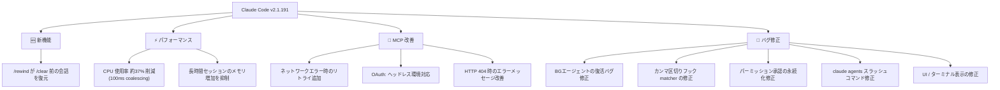
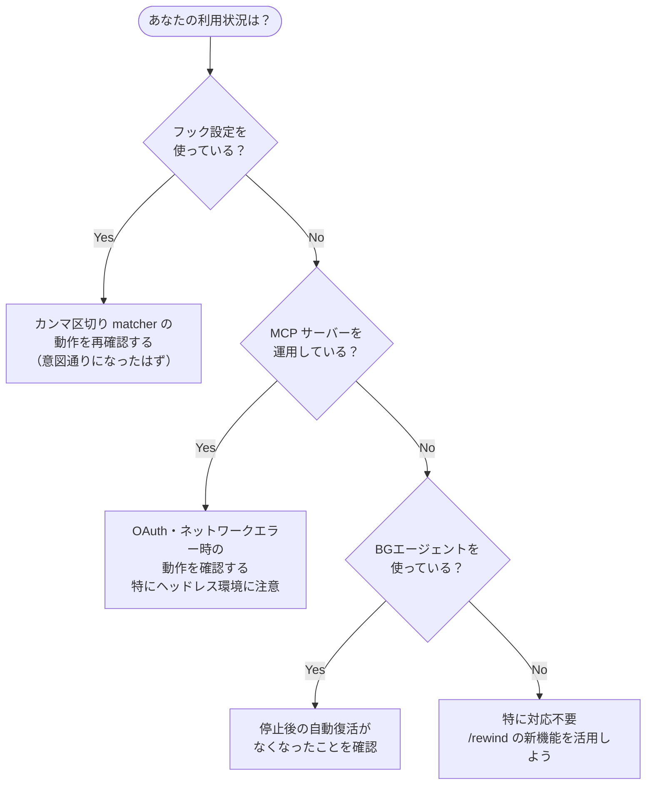

## はじめに

Claude Code v2.1.191 がリリースされました。このバージョンの目玉は、誤って `/clear` してしまった際に以前の会話状態を復元できる `/rewind` の強化です。加えて、ストリーミング中の CPU 使用率を約 37% 削減するパフォーマンス改善、MCP の信頼性向上、そしてバックグラウンドエージェントやフック設定に関する重要なバグ修正が含まれています。

> **📌 影響を受ける人**
> - Claude Code を日常的に使う開発者全般
> - MCP サーバーを運用・開発している方
> - フック（hooks）を活用してワークフローを自動化している方
> - 組織で MDM / ポリシー管理をしている管理者

## 変更の全体像



## 変更内容

### 新機能: /rewind で /clear 前の会話を復元

従来、`/clear` を実行すると会話履歴は完全に消去され、それ以前の状態に戻る手段がありませんでした。v2.1.191 では `/rewind` コマンドを使うことで、`/clear` 実行前の会話状態に遡れるようになりました。

「長時間かけて進めたコンテキストを誤って `/clear` で消してしまった」というシチュエーションでのリカバリーに有効です。

### パフォーマンス改善: CPU 使用率を約 37% 削減

| 改善項目 | 内容 |
|----------|------|
| CPU 使用率 | ストリーミング応答中のテキスト更新を 100ms 単位にまとめ（coalescing）、約 37% 削減 |
| メモリ使用量 | ターミナル出力キャッシュによる長時間セッションでのメモリ増加を抑制 |

大量のコード生成や長時間の開発セッションで特に恩恵を受けやすい改善です。マシンの発熱やバッテリー消費が気になっていた方にも効果があるでしょう。

### MCP サーバーの信頼性・OAuth・エラーメッセージを改善

MCP を使っている開発者には嬉しい改善が複数入りました。

| 改善項目 | 詳細 |
|----------|------|
| ネットワークエラーのリトライ | `tools/list`、`prompts/list`、`resources/list` が一時的なエラー時に短いバックオフでリトライ |
| OAuth の改善 | ヘッドレス環境ではブラウザ起動をスキップし、URL 貼り付けプロンプトへ直行 |
| HTTP 404 エラー | エラー発生 URL を表示し、MCP 設定への案内を提示 |

> **💡 Tips**
> CI/CD 環境などヘッドレスで MCP の OAuth 認証を行う場合、ブラウザが起動しなくなり URL を手動で貼り付けるフローに変わります。スクリプトで自動化している場合は動作を再確認してください。

### サンドボックスのネットワーク許可を記憶

サンドボックス実行時のネットワーク接続許可ダイアログで「Yes」を選ぶと、そのセッション中は同じホストへの接続許可が記憶されるようになりました。毎回確認ダイアログが表示される煩わしさが解消されます。

### バグ修正の詳細

#### 停止したバックグラウンドエージェントが復活する不具合を修正（重要度: 高）

タスクパネルから停止したバックグラウンドエージェントが、操作後に復活（resurrect）するケースがありました。本修正で停止が恒久的に反映されるようになり、意図しないエージェントの再起動を防げます。

> **⚠️ 動作変更に注意**
> エージェントの「自動復活」を前提にワークフローを組んでいた場合、停止後は明示的な再起動が必要になります。

#### カンマ区切りフック matcher が発火しない不具合を修正（要確認）

フック設定で `"Bash,PowerShell"` のようにカンマ区切りで matcher を指定すると、エラーも出ずに一度も発火しない不具合がありました。本修正で正しく動作するようになります。

フック設定を使っている方は、既存の設定が意図通り動くようになったことを確認してください。

#### /permissions の Recently-denied タブで承認が保存されない不具合を修正

`/permissions` の最近拒否した項目タブで承認しても、ダイアログを閉じると無言で破棄されていました。本修正で承認内容が永続化されます。

#### claude agents のスラッシュコマンド・画像表示の修正

- `/usage` などの組み込みスラッシュコマンドがヒント表示されず、バックグラウンドセッションへのプロンプトとして送信されていた問題を修正
- 貼り付け画像がフルパスではなく `[Image #N]` プレースホルダで表示されるよう修正

## 影響と対応



## コード例

### フック matcher の修正（Before/After）

フック設定で複数の matcher をカンマ区切りで指定していた場合、v2.1.191 から正しく動作するようになりました。

**Before（v2.1.190 以前: 発火しなかった）**

```json
{
  "hooks": {
    "PreToolUse": [
      {
        "matcher": "Bash,PowerShell",
        "hooks": [
          {
            "type": "command",
            "command": "echo 'ツールが呼ばれました'"
          }
        ]
      }
    ]
  }
}
```

上記の設定は、エラーも警告も出ずに `Bash`・`PowerShell` どちらのツール呼び出しでも発火しませんでした。

**After（v2.1.191 以降: 正しく発火する）**

同じ設定のまま、`Bash` と `PowerShell` 両方のツール呼び出しでフックが発火するようになります。ワークアラウンドとして個別に matcher を分けていた場合は、カンマ区切りに統合できます。

```json
{
  "hooks": {
    "PreToolUse": [
      {
        "matcher": "Bash,PowerShell",
        "hooks": [
          {
            "type": "command",
            "command": "echo 'ツールが呼ばれました'"
          }
        ]
      }
    ]
  }
}
```

### /rewind の使い方

```bash
# 長時間の会話の途中で誤って /clear してしまった場合
/clear
# → 会話がリセットされる（以前は完全に消えていた）

# v2.1.191 以降は /rewind で /clear 前の状態を復元できる
/rewind
# → /clear 実行前の会話状態に戻る
```

## まとめ

Claude Code v2.1.191 の主な変更点をまとめます。

| カテゴリ | 内容 | 重要度 |
|----------|------|--------|
| 新機能 | `/rewind` で `/clear` 前の会話を復元 | 🔴 高 |
| 改善 | ストリーミング CPU 使用率を約 37% 削減 | 🟡 中 |
| 改善 | MCP の信頼性・OAuth・エラーメッセージ改善 | 🟡 中（MCP 利用者は要確認） |
| 修正 | BGエージェントの意図しない復活を修正 | 🔴 高 |
| 修正 | カンマ区切りフック matcher のバグを修正 | 🟡 中（フック利用者は要確認） |
| 修正 | `/permissions` 承認の永続化 | 🟡 中 |
| 修正 | `claude agents` のスラッシュコマンド・画像表示 | 🟢 低 |
| 修正 | UI / ターミナル表示の軽微な修正 | 🟢 低 |

**今すぐ対応すべき人:**
- **フック設定を使っている方** → カンマ区切り matcher の挙動変更（バグ修正による正常化）を確認
- **MCP + ヘッドレス環境を使っている方** → OAuth フロー（URL 貼り付け方式への変更）を確認
- **BGエージェントを使っている方** → 停止後に自動復活しなくなったことを確認

アップデートは以下のコマンドで行えます。

```bash
npm update -g @anthropic-ai/claude-code
