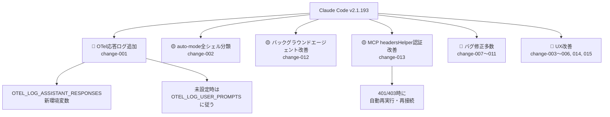
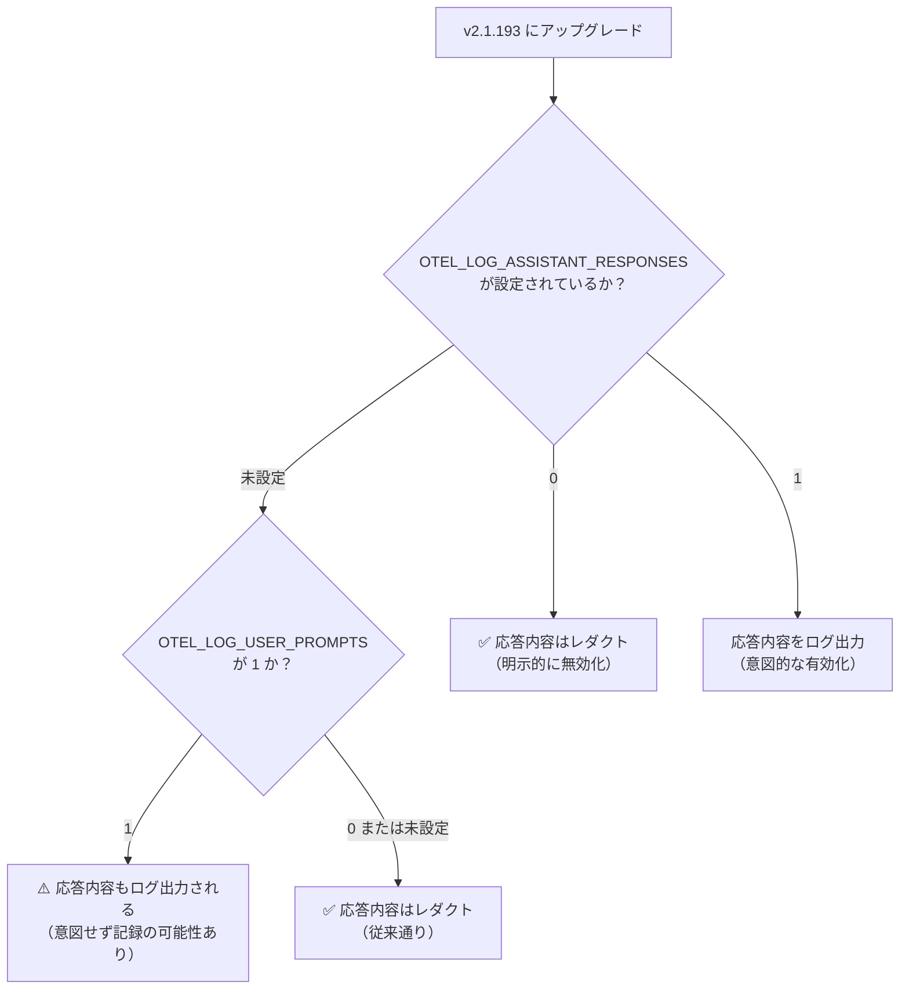
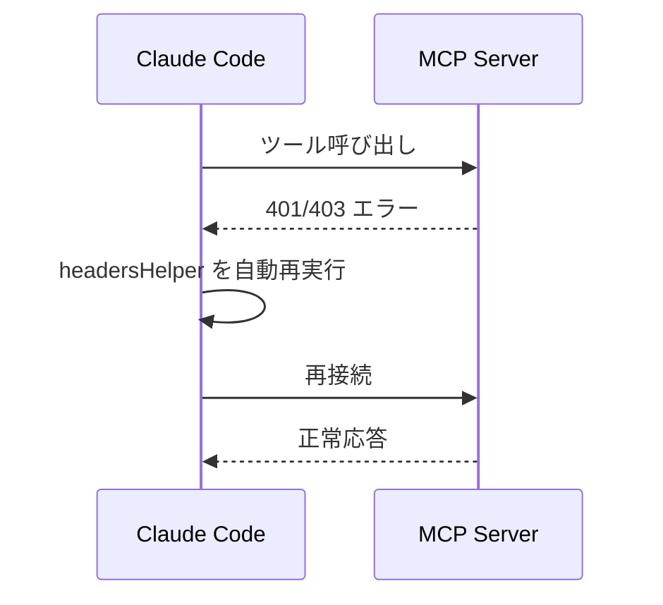

## はじめに

Claude Code v2.1.193 がリリースされ、複数の新機能・改善・バグ修正が含まれています。

中でも **最も注意が必要なのが OpenTelemetry へのアシスタント応答ログ追加**です。既存のプロンプトログ設定を引き継ぐ仕様のため、アップグレードするだけで**応答内容が意図せず記録され始める**可能性があります。本記事では、この挙動変更の詳細と対応方法を中心に、v2.1.193 の全変更を解説します。

> **📌 影響を受ける人**
> - Claude Code に OpenTelemetry を設定して `OTEL_LOG_USER_PROMPTS=1` でプロンプトをログ収集している開発者・運用チーム
> - Claude Code を企業・チームでデプロイしている管理者
> - MCP サーバーを利用しているユーザー

---

## 変更の全体像



---

## 変更内容

### 変更一覧と重要度

| ID | 種別 | 重要度 | タイトル | 対応要否 |
|---|---|---|---|---|
| change-001 | 改善 | 🔴 High | OTelにアシスタント応答ログを追加 | **要対応** |
| change-002 | 新機能 | 🟡 Medium | `autoMode.classifyAllShell` 設定を追加 | 任意 |
| change-012 | 改善 | 🟡 Medium | バックグラウンドエージェントの挙動改善 | 不要 |
| change-013 | 改善 | 🟡 Medium | MCP headersHelper が401/403で自動再接続 | 不要 |
| change-003 | 改善 | Low | auto-mode の拒否理由を可視化 | 不要 |
| change-004 | 新機能 | Low | bash モード（!）にファイルパス補完を追加 | 不要 |
| change-005 | 改善 | Low | MCP サーバー認証が必要な場合に起動時通知 | 不要 |
| change-006 | 新機能 | Low | アイドルシェルをメモリ圧迫時に自動回収 | 不要 |
| change-007〜011 | バグ修正 | Low | UI・エージェント関連の複数バグ修正 | 不要 |

---

## 影響と対応

### 🔴 【要注意】OTel アシスタント応答ログの挙動変更

今回最も影響が大きい変更です。

新しい `claude_code.assistant_response` OpenTelemetry ログイベントが追加されました。このイベントは**デフォルトではレダクト（秘匿）**されますが、環境変数の設定次第で意図せず出力されます。

> **⚠️ Breaking Change**
> `OTEL_LOG_USER_PROMPTS=1` を設定している環境では、`OTEL_LOG_ASSISTANT_RESPONSES` を明示的に設定していない場合、**アップグレード後から自動的に応答内容もログ出力されます**。

**優先度の判定フロー:**



**取るべきアクション:**

| 運用ケース | 対応 |
|---|---|
| プロンプトのみログ収集、応答はログ不要 | `OTEL_LOG_ASSISTANT_RESPONSES=0` を明示設定 |
| プロンプト・応答の両方をログ収集したい | `OTEL_LOG_ASSISTANT_RESPONSES=1` を明示設定 |
| OTel を使っていない / プロンプトログも無効 | 対応不要 |

---

### 🟡 `autoMode.classifyAllShell` 設定の追加

全ての Bash/PowerShell コマンドを auto-mode の分類器経由でルーティングできるようになりました。

従来は任意コード実行パターンのみが対象でしたが、この設定を有効にすることで**全シェルコマンドに対して権限制御を厳格化**できます。セキュリティポリシーが厳しい環境や、コマンド実行を細かく管理したいチームに有用です。

---

### 🟡 バックグラウンドエージェントの挙動改善

エージェント起動時の結果が「end your response（応答を終了せよ）」と Claude に指示しなくなりました。

これにより、**バックグラウンドエージェントが動作中も Claude が別のタスクを継続**できます。マルチエージェントを活用した並行作業がより自然に行えるようになります。

---

### 🟡 MCP headersHelper 認証の自動再接続

MCP の headersHelper 認証が改善され、ツール呼び出しで 401/403 が返った場合に**自動で再実行・再接続**するようになりました。



トークン失効が発生しても手動での再認証が不要になり、長時間セッションでの MCP 利用が安定します。

---

## コード例

### Before / After: OTel アシスタント応答ログ設定

**Before（v2.1.192 以前）:**

```bash
# プロンプトをログ出力する設定（応答ログは存在しなかった）
export OTEL_LOG_USER_PROMPTS=1
```

**After（v2.1.193 以降）:**

```bash
# プロンプトのみログ出力し、応答はログしない場合（明示的な設定が必要）
export OTEL_LOG_USER_PROMPTS=1
export OTEL_LOG_ASSISTANT_RESPONSES=0  # ← 新たに追加が必要

# プロンプト・応答の両方をログ出力する場合
export OTEL_LOG_USER_PROMPTS=1
export OTEL_LOG_ASSISTANT_RESPONSES=1

# 応答のみログ出力し、プロンプトはログしない場合
export OTEL_LOG_USER_PROMPTS=0
export OTEL_LOG_ASSISTANT_RESPONSES=1
```

> **💡 Tips**
> Docker や CI 環境では環境変数の変更を忘れがちです。`docker-compose.yml` や `.env` ファイルを確認し、`OTEL_LOG_ASSISTANT_RESPONSES=0` の明示設定を忘れずに。

---

### autoMode.classifyAllShell の設定例

```json
// .claude/settings.json または settings.local.json
{
  "autoMode": {
    "classifyAllShell": true
  }
}
```

> **💡 Tips**
> この設定は権限チェックを厳格化するため、従来は許可されていたコマンドが確認を求められるようになる場合があります。開発環境での動作確認後に本番環境へ適用してください。

---

### バックグラウンドシェルの自動回収を無効化する場合

```bash
# メモリ圧迫時のアイドルシェル自動回収を無効にする
export CLAUDE_CODE_DISABLE_BG_SHELL_PRESSURE_REAP=1
```

---

## まとめ

Claude Code v2.1.193 の主要な変更点を整理します。

| 優先度 | 変更 | 対応 |
|---|---|---|
| **最優先** | OTel アシスタント応答ログの追加 | `OTEL_LOG_ASSISTANT_RESPONSES=0` を明示設定（プロンプトのみログ運用の場合） |
| 確認推奨 | `autoMode.classifyAllShell` 設定 | 厳格な権限制御が必要な場合に有効化を検討 |
| 確認推奨 | MCP headersHelper 自動再接続 | 手動対応が不要になるため恩恵を受けられる |
| 確認推奨 | バックグラウンドエージェント改善 | マルチエージェント利用者は並行作業効率が向上 |

**アップグレード前のチェックリスト:**

- [ ] `OTEL_LOG_USER_PROMPTS=1` を設定している環境を確認した
- [ ] 該当環境に `OTEL_LOG_ASSISTANT_RESPONSES=0` を追加した（または意図的に `=1` とした）
- [ ] Docker / CI の環境変数定義ファイルを更新した
- [ ] MCP サーバー利用中の場合、headersHelper 自動再接続の動作を確認した
