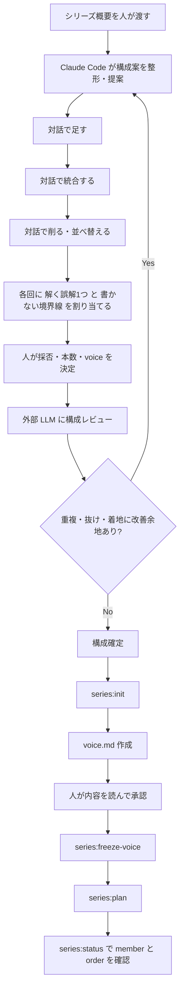

# 年金連載を題材に、テーマの追加・統合・削減と「各回で解く誤解」をどう決めたか

本記事は、`llm-task-router` を Claude Code 経由で使って、単発記事の create → evaluate → factcheck → revise → export を一通り触ったことがある人を主な読者に想定しています。

扱うのは、その次のステップである、**シリーズ連載の構成をどう確定するか** です。題材は年金連載の実録ケーススタディですが、制度解説そのものではなく、**ばらした十数個のテーマ案を、読み通せる連載構成へどう収束させたか** という編集プロセスに焦点を当てます。

先に射程をはっきりさせると、この記事で扱うのは、**シリーズ構成を確定するまで** です。各回本文の執筆や、本文以降の create / factcheck / export の詳細には立ち入りません。

出発点は、たとえば「年金で連載をやりたい。扱いたいテーマはこれくらいある」という、次のようなばらばらのテーマ列挙でした。

- しくみ
- 資金
- 世代格差
- 厚生年金
- 国民年金
- 負担率
- 世界の年金
- 20歳の若者
- 箱もの失敗
- 毎年の収支
- 運用
- いつまでもつか

この段階では、**整った目次はありません**。でも、それで始められます。むしろ最初から完璧な目次を作ろうとしないほうが、論点の取りこぼしを減らしやすいです。

## 導入: この記事でやることと射程

この記事で再現したいのは、次のような進め方です。

1. シリーズ全体の概要を人がざっくり渡す
2. Claude Code に構成案の整形や候補出しをさせる
3. 人がテーマの採否・本数・境界線・voice を決める
4. 各回に **解く誤解 1 つ** を割り当てる
5. Claude Code に `plan.yaml`、`series.json`、README への反映を任せる
6. 最後に CLI でシリーズの土台へ落とす

要するに、**最初から完成した目次を作る作業** ではなく、**対話で構成を収束させる編集プロセス** です。

年金のように論点が多く、しかも読者の先入観や誤解が強い題材では、テーマを並べるだけだと散らばりやすいです。そこで役立ったのが、各回ごとに **何を解く回なのか** を先に決めるやり方でした。

## 前提: ツール・環境・この記事での扱い

この記事では、`llm-task-router` の series 系コマンドが利用できる環境を前提にします。最低限、次の 2 点を確認してください。

- `llm-task-router --help` が実行できる
- `llm-task-router series:init --help` のように、series 系コマンドのヘルプが参照できる

たとえば次のように確認できます。

```shell
llm-task-router --help
llm-task-router series:init --help
llm-task-router series:freeze-voice --help
llm-task-router series:plan --help
llm-task-router series:status --help
```

この記事のコマンドのフラグや挙動は、`llm-task-router <コマンド名> --help` やツール本体の表示で確認できます。バージョンによって差があるため、最終的には手元の `--help` 出力を正としてください。

:::note info
実際のオプション名や挙動は、利用している `llm-task-router` のバージョンで異なる可能性があります。この記事のコマンド例は、series 系コマンドが使える版を前提にした再現用の最小イメージです。手元の環境では、必ず `--help` を先に確認してください。
:::

また、この記事ではインストール方法や単発記事フローの説明は省略します。そこはすでに触ったことがある前提で、**シリーズ構成をどう固めるか** に話を絞ります。

## 前提用語のミニ定義

本文で使う用語を、最初に短くそろえておきます。

| 用語 | 意味 |
| --- | --- |
| series | 連載全体の器。各回の member と共通方針を持つ単位 |
| voice 凍結 | 文体や説明姿勢の方針を確定し、後続の各回でぶれにくくする手順 |
| member | シリーズを構成する各回の記事単位 |
| order | 各回の並び順 |
| planned | 構成上は登録済みだが、本文執筆前の状態 |
| profile | Qiita など出力先向けの設定。構成確定の段階では深く関わらないが、`series:init` や各回作成時に効く |
| `plan.yaml` | CLI の入力ファイルではない。人が自然文で伝えた要件をもとに Claude Code が編集・維持し、人は内容を確認して採否を決めるための、人が読みやすい構成メモの総称 |
| `series.json` | `series:init` で作られる管理用データ。`series:plan` はここに planned 枠を追記する |

:::note info
本記事では総称として `plan.yaml` と書きますが、実際のファイル名は固定ではありません。以降の例では、`plans/nenkin-plan.yaml` を具体例として使います。
:::

とくに **voice 凍結** は、単に「方針を文章に書く」だけではありません。典型的には、`voice.md` にまとめた文体・説明姿勢・禁止事項などを、後続の各回生成時に参照させるための固定ステップです。つまり、**後で各回を書き始めたときに同じ説明姿勢を再利用しやすくする** ための手順です。

このあたりを最初に押さえておくと、構成の話と実装上の反映の話が混ざりにくくなります。

## 役割分担: 人が決めること、Claude Code が回すこと

シリーズ構成では、この役割分担を明示しておくのがかなり重要でした。

### 人が決めること

- テーマを採るか捨てるか
- 何本にするか
- 各回で何を書かないか
- シリーズ全体の voice をどうするか
- 各回で解く誤解を何にするか

### Claude Code に任せること

- 構成案の整形
- タイトル案や説明文の叩き台づくり
- `plan.yaml`、`series.json`、README への反映
- order の振り直し
- 用語の噛み砕き
- 構成変更後の一貫性チェック

重要なのは、**決定権は一貫して人に残す** ことです。Claude Code は提案と反映の駆動役です。

ここが曖昧だと、テーマ採否のような本質的な編集判断まで機械任せになりやすいです。シリーズは単発記事よりも **境界線の引き方** が重要なので、この切り分けは最初に固定しておいたほうが安定します。

:::note warn
Claude Code がうまく回るほど、つい提案された構成をそのまま採用しやすくなります。ですが、シリーズ構成では **何を捨てるか** が品質に直結するため、採否だけは人が持ったまま進めるのがおすすめです。
:::

## 図解: 構成ブラッシュアップの全体フロー

まずは全体像です。対話ループ、外部レビュー、確定後の CLI 手順を 1 枚にまとめると、次のようになります。



前半は **対話で磨くループ**、後半は **確定後に土台へ落とす一方向の手順** です。

ここでの外部レビューは、**正確性ゲート** ではありません。あくまで **構成レビュー** です。重複や抜け、最終回の着地の弱さを見つけるために使います。

なお、図の「人が内容を読んで承認」は CLI 操作ではなく、`voice.md` を人間が開いて確認し、「この説明姿勢で行く」と判断する手作業の承認を指します。その承認が済んでから `series:freeze-voice` を実行します。

## 構成が収束する過程 1: まずは足す

最初のフェーズでは、**本数を固定しない** のが効きました。

年金連載の初期列挙には、制度のしくみや財政、世代格差のような話はありましたが、対話を進めると「これも必要では」という論点が次々に出てきました。たとえば、次のようなテーマです。

- 誰がつくり、変え、運用し、責任をとるのか  
  → **ガバナンス**
- 会社負担分はどこへ  
  → **労使折半**
- 消えた年金問題
- 年金だけで暮らせないとき
- これからの社会保障  
  → 年金・生活保護・ベーシックインカム

この段階で大事だったのは、**まず気になる論点を出し切る** ことでした。

「本当に 8 本に収めるべきか」「6 本がよいか」といった議論を早く始めすぎると、論点追加のハードルが上がります。結果として、あとから読者視点で重要な論点が抜けていたと気づいても、戻しづらくなります。

追加判断の軸として使いやすかったのは、主に次の 2 つです。

- 読者が実際に引っかかりやすい論点か
- 独立回が必要か、それとも既存回の章で扱えるか

たとえば「ガバナンス」は、制度が誰によって運営されるかという根本の話なので強い論点ですが、最終的には単独回ではなく **#1「年金とは何か」** の中に入れました。一方で「会社負担分はどこへ」も関心は高いものの、単独記事より **#2「国民年金と厚生年金」** の中で保険料の基本とあわせて扱うほうが読みやすい、という判断になりました。

## 構成が収束する過程 2: 統合して削る

追加をある程度やると、次に来るのが **多すぎる問題** です。

実際、途中で出たのが「記事数が多いのでは？」という問いでした。ここから、個別テーマを **統合していくフェーズ** に入ります。

年金連載で最初にまとまりやすかったのは、財政系の論点でした。

- 毎年の収支
- 積立金
- 運用
- いつまでもつか

これらは別々にも見えますが、読者からするとかなり近接した関心です。分けすぎると、毎回「財政とは何か」から入り直すことになって重複しやすい。そこで、**#4 に財政系をまとめる** 方向に寄せました。

同じように、将来系もまとめやすい塊でした。

- 世代格差
- 持続可能性
- 若者の立場

これも個別回にすると話題は立つのですが、読後感が似やすいです。結局、「将来に対する不安」に読者の認知が吸い寄せられるので、複数回に分けると境界が曖昧になります。そこで、**#6 に将来系をまとめる** 調整をしました。

この過程で、切り口の数は揺れました。

- いったん **14 の切り口**
- そこから **6 本** に畳む
- でも「受給・備え」の回が必要だと分かって **7 本**
- 最後に **これからの社会保障** を独立させて **8 本**

ここが実務的にはかなり大事で、**本数は一度で決まらない** のが普通です。揺れながら収束します。

また、統合は「削除」と同義ではありません。たとえば次のテーマは、新規記事にせず既存回へ吸収しました。

- 会社負担分 → **#2**
- 消えた年金問題 → **#5**
- 年金だけで暮らせないとき → **#3**
- 誰がつくり・運用し・責任をとるか → **#1**

これは **記事を消した** のではなく、**章に畳んだ** だけです。シリーズ本数は抑えつつ、論点は残せます。この発想があると、削ることへの抵抗がかなり減ります。

### 本数を決めるときに見たシグナル

この「14 → 6 → 7 → 8」の揺れは、感覚だけで決めたわけではありません。実際には次のようなシグナルを見ていました。

- **読後感が重複していないか**  
  複数回読んでも「結局どれも将来不安の話だった」と感じるなら、分けすぎの兆候です。
- **独立した誤解が立つか**  
  その回だけで解くべき誤解を 1 つ立てられないなら、他回へ吸収したほうがよいことが多いです。
- **章で吸収できるか**  
  単独記事にしなくても、既存回の 1 章で十分に処理できる論点は統合候補です。
- **前提説明を毎回やり直していないか**  
  別記事にした結果、毎回同じ基礎説明が必要になるなら、切り分けが細かすぎる可能性があります。
- **最終回までの着地が見えるか**  
  本数を減らしすぎると、全体像は簡潔でも「最後にどこへ着地するか」が弱くなることがあります。

この観点を持っておくと、自分の題材でも本数調整を転用しやすいです。

## 構成が収束する過程 3: 置き場所と order をどう直したか

テーマを足したり統合したりしていると、必ず出てくるのが **中間挿入** です。

たとえば新しい回を「#2 に入れたい」となると、それ以降の回は順番を繰り下げる必要があります。これを手で追いかけると、`series.json` や README の更新が地味に面倒です。

そこで、**order の振り直しは Claude Code に任せる** 運用にしました。人は、**どこに置くべきか** だけを判断します。

並べ順は、次のような読者体験で見ると決めやすかったです。

1. 理解の土台
2. 誤解しやすい論点
3. 将来と着地

つまり、論理順だけでなく、**読む順として自然か** を見るわけです。制度ものは、正確さだけで並べると「正しいけれど読みにくい」構成になりがちです。

今回の実録でも、その判断は具体の配置に表れました。たとえば、**誰がつくり・動かし・責任をとるのか** というガバナンスの論点は単独回ではなく **#1** に入れ、**会社負担分** は **#2** の保険料説明に畳み、**財政系** は **#4** に、**将来系** は **#6** に寄せました。こうしておくと、前後のつながりが自然でした。

## 最終的に決定した構成（確定版・全8回）

こうした追加・統合・order 調整を経て、最終的に次の全8回へ収束しました。

| 回 | タイトル |
| --- | --- |
| #1 | 年金とは何か ― しくみと、つくる人・動かす人・責任をとる人 |
| #2 | 国民年金と厚生年金 ― 2階建て制度と保険料の基本 |
| #3 | 年金はいくら・いつからもらえるのか ― 足りないときの備え |
| #4 | 年金財政のしくみ ― 保険料・税金・積立金・GPIF |
| #5 | 年金不信はなぜ生まれたのか ― 箱ものと消えた年金問題、責任の所在 |
| #6 | 年金の将来 ― 世代格差・少子高齢化・若者は本当にもらえるか |
| #7 | 世界の年金制度 ― 日本はどこが違うのか |
| #8 | これからの社会保障 ― 年金・生活保護・ベーシックインカムをどう考えるか |

この確定版は `profile=note` のシリーズ `nenkin` として voice 凍結のうえ planned 登録しました。

## 各回で解く誤解を 1 つに絞る

今回のケースで最も効いたのは、各回に **この回で解く誤解は 1 つ** を割り当てたことでした。

この確定版に解く誤解を割り当てると、次のようになります。

| 回 | 主題 | この回で解く誤解 |
| --- | --- | --- |
| #1 | 年金とは何か ― しくみと、つくる人・動かす人・責任をとる人 | 年金は高齢者だけの制度 |
| #2 | 国民年金と厚生年金 ― 2階建て制度と保険料の基本 | 会社負担分は会社が余分に払ってくれているだけ |
| #3 | 年金はいくら・いつからもらえるのか ― 足りないときの備え | 年金額は固定で自分では何もできない |
| #4 | 年金財政のしくみ ― 保険料・税金・積立金・GPIF | 払った保険料がそのまま積み立てられて返る |
| #5 | 年金不信はなぜ生まれたのか ― 箱ものと消えた年金問題、責任の所在 | 年金不信は単なる思い込み |
| #6 | 年金の将来 ― 世代格差・少子高齢化・若者は本当にもらえるか | 若者は絶対もらえない／高齢者だけ得 |
| #7 | 世界の年金制度 ― 日本はどこが違うのか | 海外制度には正解がある |
| #8 | これからの社会保障 ― 年金・生活保護・ベーシックインカムをどう考えるか | 年金だけ直せば老後不安は解決する |

この表の役割は、**構成を見栄えよくすること** ではありません。各回の中心線を固定することです。

たとえば #4 で扱う内容は、保険料、税金、積立金、運用など広がりやすいです。ですが、主軸を「**払った保険料がそのまま積み立てられて返る**」という誤解を解く回と決めておくと、説明対象が増えても中心がぶれにくいです。

また、この割り当てを先に決めておくと、統合の判断もしやすくなります。財政系を **#4** に寄せ、将来系を **#6** に寄せたのも、それぞれで解く誤解を 1 つずつ独立して立てられる形にしたかったからです。逆に **会社負担分** は単独で 1 回立てるより **#2** の中で扱うほうが構成全体が締まりました。**消えた年金問題** も **#5** に畳み、**年金だけで暮らせないとき** は **#3** の中で備えの話として扱うほうが自然でした。

シリーズ構成では「何を扱うか」だけ決めてもまだ弱くて、**何を誤解として解きにいく回なのか** まで決めると一気に安定します。

## 境界線を置くと重複が減る

もうひとつ効いたのが、各回に **その回では書かないこと** を置くことでした。

これは削るためというより、**他回へ論点を逃がす編集ルール** です。

たとえば、こんな境界線を置けます。

- 財政回では、制度史を深追いしない
- 若者回では、運用技術の詳細には入らない
- 年金不信の回では、個別給付額の計算例には踏み込まない
- 社会保障全体の回では、年金財政の細部を繰り返さない

このやり方のよいところは、重複を減らせるだけでなく、**他回との役割分担が明確になる** ことです。

各回は次の 2 点セットで持つと安定します。

- **解く誤解 1 つ**
- **書かないこと**

この 2 つがあると、構成を見直すときにも「この論点はどこに逃がすか」を判断しやすくなります。

:::note info
「書かないこと」を決めるのは、説明を薄くするためではありません。むしろ **シリーズ全体で説明を厚くするために、各回の射程を守る** ための工夫です。
:::

## voice 方針は本数やタイトルと分けて決める

構成調整の途中で、voice の話まで混ぜると議論が散りやすくなります。そこで、年金連載では voice を別軸で固めました。

採った方針は、たとえば次のようなものです。

- やさしい解説
- 中立
- 煽らない
- 両論併記

これは「何本にするか」「タイトルをどうするか」とは別の意思決定です。

また、見出し体裁についても、番号付き統一を無理に押し通すより、**説明調を維持するシリーズ方針** として整理しました。見出しの見栄えを整える話と、文体・説明姿勢の話は、似ているようで別です。

本数・タイトル・順番の調整と、voice の凍結を混ぜないことで、議論の軸がかなり整理しやすくなりました。voice は後続の各回すべてに効くので、構成が固まったあとに `series:freeze-voice` へ進む流れが自然です。

## 最小再現手順

ここまでの話を、再現用に最小限の手順へ圧縮するとこうなります。

1. `llm-task-router` で series 系コマンドが使えることを確認する
2. 人がシリーズ概要を作る
3. Claude Code と対話して、テーマ追加・統合・削減・並べ替えを行う
4. 各回に **解く誤解 1 つ** と **書かないこと** を決める
5. その要件を Claude Code に伝え、`plans/*.yaml` などの構成メモへまとめさせる（人は内容を確認する）
6. `series:init` でシリーズの器を作る
7. `voice.md` を作って人が確認する
8. `series:freeze-voice` を実行する
9. `series:plan` で各回を planned 登録する
10. `series:status` で member と order を確認する

コマンドだけ先に見たい人は、この節と次の節を読めばだいたい再現できます。

## `plan.yaml` をどう書くか

レビューで最も大きかったのが、**構成メモの形が見えないと再現しづらい** という点でした。たしかに、`series.json` だけ見せても、読者は「では人間は何を整理しておけばよいのか」が分かりません。

そこで、人が自然文で伝えた要件をもとに Claude Code が編集・維持する構成メモ（ここでは `plan.yaml` と呼ぶ）の最小サンプルを示します。人がこのファイルを直接手書きする必要はありません。

```yaml
series:
  slug: nenkin
  title: 日本の年金を知る
  profile: note

members:
  - id: nenkin-shikumi
    title: 年金とは何か ― しくみと、つくる人・動かす人・責任をとる人
    order: 1
    status: planned
    misconception: 年金は高齢者だけの制度
    out_of_scope:
      - 財政の深掘りは #4 に送る
      - 制度詳細は #2 に送る
      - 将来論は #6 に送る

  - id: seido-hokenryo
    title: 国民年金と厚生年金 ― 2階建て制度と保険料の基本
    order: 2
    status: planned
    misconception: 会社負担分は会社が余分に払ってくれているだけ
    out_of_scope:
      - 年金財政の詳細な収支構造は #4 に送る
      - 将来不安の一般論は #6 に送る
      - 不信の歴史は #5 に送る

  - id: ikura-itsu-sonae
    title: 年金はいくら・いつからもらえるのか ― 足りないときの備え
    order: 3
    status: planned
    misconception: 年金額は固定で自分では何もできない
    out_of_scope:
      - 社会保障全体としての是非は #8 に送る
      - 財政の仕組みは #4 に送る
      - 制度不信の歴史は #5 に送る

  - id: okane-no-nagare
    title: 年金財政のしくみ ― 保険料・税金・積立金・GPIF
    order: 4
    status: planned
    misconception: 払った保険料がそのまま積み立てられて返る
    out_of_scope:
      - 個別の受給額計算は扱わない
      - 不信の歴史や責任論は #5 に送る
      - 将来の損得論は #6 に送る

  - id: shippai-sekinin
    title: 年金不信はなぜ生まれたのか ― 箱ものと消えた年金問題、責任の所在
    order: 5
    status: planned
    misconception: 年金不信は単なる思い込み
    out_of_scope:
      - 怒りを煽る書き方はしない
      - 個別給付額の計算はしない
      - 海外制度比較は #7 に送る

  - id: shorai
    title: 年金の将来 ― 世代格差・少子高齢化・若者は本当にもらえるか
    order: 6
    status: planned
    misconception: 若者は絶対もらえない／高齢者だけ得
    out_of_scope:
      - 財政メカニズムの詳細は #4 に送る
      - 制度不信の歴史は #5 に送る
      - 海外の勝ち負け比較は #7 に送る

  - id: sekai-no-nenkin
    title: 世界の年金制度 ― 日本はどこが違うのか
    order: 7
    status: planned
    misconception: 海外制度には正解がある
    out_of_scope:
      - 各国制度の勝ち負けにしない
      - 日本の財政細部は #4 に送る
      - 国内の将来不安の議論は #6 に送る

  - id: korekara-no-shikumi
    title: これからの社会保障 ― 年金・生活保護・ベーシックインカムをどう考えるか
    order: 8
    status: planned
    misconception: 年金だけ直せば老後不安は解決する
    out_of_scope:
      - 年金財政の細部を繰り返さない
      - 個別の記録問題は #5 に送る
      - 各国制度の詳細比較は #7 に送る
```

この YAML は CLI に直接渡す入力ファイルではない。人は対話で要件を伝え、Claude Code がこの構成メモと `series.json` に反映する。人はこの内容を読んで採否を確認すればよく、転記や `series:plan` の実行も Claude Code に任せられる（`series:plan` は 1 件ずつ登録する）。

ポイントは次のとおりです。

- `series` にシリーズ全体の基本情報を書く
- `members` に各回の一覧を書く
- 各 member に `id / title / order / status` を持たせる
- 編集上の重要情報として `misconception` と `out_of_scope` を持たせる

:::note info
`misconception` や `out_of_scope` のようなフィールド名は、実際のツール仕様と一致しない可能性があります。その場合は、手元の実装に合わせて名前を調整してください。ここでは、**構成の判断をデータとして持つと運用しやすい** ことを示すために書いています。
:::

## `plan.yaml` と `series.json` の対応

ここでの運用は、「YAML を渡すと `series.json` が機械生成される」というより、**人は自然文で要件を伝え、Claude Code が YAML と `series.json` を維持し、`series:plan` を 1 件ずつ実行する。人は内容の確認と採否に集中する** 形です。

対応イメージは、次のようになります。

| 作業メモ側 | 役割 | 実運用での反映先 |
| --- | --- | --- |
| `series.slug` | シリーズ識別子 | `series:init --slug` や各コマンドの `--slug` |
| `series.title` | 人が把握するシリーズ名 | README や説明文、作業メモ |
| `series.profile` | 出力先設定 | `series:init --profile` |
| `members[].id` | 各回 slug の案 | `series:plan --member-slug` |
| `members[].title` | 各回タイトル | `series:plan --title` |
| `members[].order` | 並び順 | `series:plan --order` |
| `members[].status` | 状態の意図 | `series:plan` 実行後の planned 状態として確認 |
| `members[].misconception` | 解く誤解 | 実装の正式フィールドではなく、構成管理用のメモ |
| `members[].out_of_scope` | 書かないこと | 実装の正式フィールドではなく、構成管理用のメモ |

つまり、**人は自然文で要件を伝え、Claude Code が YAML と `series.json` を維持し、`series:plan` を 1 件ずつ実行する** という分担です。人は内容の確認と採否に集中できます。

## 確定した構成を土台へ落とす

構成が固まったら、そこではじめて CLI で **シリーズの器** へ落とします。最小運用の流れは次のとおりです。

1. `series:init`
2. `voice.md` を生成して確認
3. `series:freeze-voice`
4. `series:plan`
5. `series:status` で確認

この環境での実行例を書くと、たとえば次のようになります。

```shell
# 1. シリーズの器を作る
llm-task-router series:init \
  --slug nenkin \
  --profile note

# 2. Claude Code に voice.md の叩き台を作らせる
# 例: docs/voice.md を生成する
# このあと人が docs/voice.md を読み、
# 「やさしい解説 / 中立 / 煽らない / 両論併記」などの方針でよいか確認する

# 3. voice を凍結する
llm-task-router series:freeze-voice \
  --slug nenkin \
  --voice-file docs/voice.md

# 4. 各回を planned として登録する
llm-task-router series:plan \
  --slug nenkin \
  --order 1 \
  --member-slug nenkin-shikumi \
  --title "年金とは何か ― しくみと、つくる人・動かす人・責任をとる人"

llm-task-router series:plan \
  --slug nenkin \
  --order 2 \
  --member-slug seido-hokenryo \
  --title "国民年金と厚生年金 ― 2階建て制度と保険料の基本"

llm-task-router series:plan \
  --slug nenkin \
  --order 3 \
  --member-slug ikura-itsu-sonae \
  --title "年金はいくら・いつからもらえるのか ― 足りないときの備え"

llm-task-router series:plan \
  --slug nenkin \
  --order 4 \
  --member-slug okane-no-nagare \
  --title "年金財政のしくみ ― 保険料・税金・積立金・GPIF"

llm-task-router series:plan \
  --slug nenkin \
  --order 5 \
  --member-slug shippai-sekinin \
  --title "年金不信はなぜ生まれたのか ― 箱ものと消えた年金問題、責任の所在"

llm-task-router series:plan \
  --slug nenkin \
  --order 6 \
  --member-slug shorai \
  --title "年金の将来 ― 世代格差・少子高齢化・若者は本当にもらえるか"

llm-task-router series:plan \
  --slug nenkin \
  --order 7 \
  --member-slug sekai-no-nenkin \
  --title "世界の年金制度 ― 日本はどこが違うのか"

llm-task-router series:plan \
  --slug nenkin \
  --order 8 \
  --member-slug korekara-no-shikumi \
  --title "これからの社会保障 ― 年金・生活保護・ベーシックインカムをどう考えるか"

# 5. member と order を確認する
llm-task-router series:status --slug nenkin
```

`series:plan` は、**1 回につき 1 つの planned 枠を記録する最小機能** です。現行版は YAML での一括投入には対応していないため、候補名を 1 件ずつ記録します。日本語タイトルは slug 化できない前提で、各回は `--member-slug` を明示しておくと扱いやすいです。

また、`series.json` は `series:init` で先に作られ、`series:plan` はその既存データに planned 枠を追記します。未初期化のまま `series:plan` を打つのではなく、**まず器を作る** という順序を明示しておくと混乱しにくいです。

出力は環境依存なので、実行結果は各自の設定で変わります。ここで大事なのは、**構成確定後にシリーズの土台へ落とす順番** です。

- まず器を作る
- voice を固める
- そのうえで各回を planned 登録する

この順番にしておくと、あとから各回を書き始めるときにぶれが少なくなります。

### 参考: `series:status` で見たいもの

`series:status` の出力形式は環境依存ですが、確認したい観点はほぼ共通です。

- series の slug が意図どおりか
- member が 8 件そろっているか
- order が 1〜8 で連番になっているか
- status が `planned` で入っているか

たとえば概念的には、次のような状態を確認できれば十分です。

| order | id | title | status |
| --- | --- | --- | --- |
| 1 | nenkin-shikumi | 年金とは何か ― しくみと、つくる人・動かす人・責任をとる人 | planned |
| 2 | seido-hokenryo | 国民年金と厚生年金 ― 2階建て制度と保険料の基本 | planned |

（#3〜#8 も同様に order 連番・status=`planned`）

## `series.json` の完成イメージ

本文では 8 回構成が確定しているので、完成イメージもあると分かりやすいです。ここでは重複を避けるため、構造が分かる最小限だけ示します。

:::note info
以下は **実際の `series.json` 構造そのものではなく**、「構成判断をデータに持つとどう見えるか」を示す概念図です。実 SeriesData 構造とは異なりえます。とくに `misconception` / `outOfScope` は実装の正式フィールドではなく、構成管理用のメモという位置づけです。
:::

```json
{
  "series": {
    "slug": "nenkin",
    "title": "日本の年金を知る",
    "voiceFrozen": true,
    "profile": "note"
  },
  "members": [
    {
      "id": "nenkin-shikumi",
      "title": "年金とは何か ― しくみと、つくる人・動かす人・責任をとる人",
      "order": 1,
      "status": "planned",
      "misconception": "年金は高齢者だけの制度",
      "outOfScope": [
        "財政の深掘りは #4 に送る",
        "制度詳細は #2 に送る",
        "将来論は #6 に送る"
      ]
    },
    {
      "id": "seido-hokenryo",
      "title": "国民年金と厚生年金 ― 2階建て制度と保険料の基本",
      "order": 2,
      "status": "planned",
      "misconception": "会社負担分は会社が余分に払ってくれているだけ",
      "outOfScope": [
        "年金財政の詳細な収支構造は #4 に送る",
        "将来不安の一般論は #6 に送る",
        "不信の歴史は #5 に送る"
      ]
    }
    // 第3回〜第8回も同じ構造（id / title / order / status / misconception / outOfScope）で続く
  ]
}
```

これはあくまで **概念的な完成イメージ** ですが、少なくとも次の 2 点が見えるようになります。

- **構成上の判断** がデータに落ちている
- **各回の役割分担** が、タイトルだけでなく誤解と境界線でも表現されている

## 外部レビューで構成を磨く

構成をひと通り作ったら、**別の LLM に構成レビューをさせる** 運用も有効でした。

目的は、主に次の 3 つです。

- 重複の指摘
- 抜けの指摘
- 最終回の着地の改善

実際に受けた指摘の例としては、こんなものがあります。

- 障害年金・遺族年金が抜けていないか
- 最終回は何に着地すると読後感がよいか
- 将来不安の話が複数回で重なっていないか
- 財政回と若者回の境界が曖昧ではないか

このとき、評価点が上がったかどうかを見るのも悪くありませんが、重視したのは **点数そのものより指摘の質** でした。

とくに別モデルのレビューは、同じモデル内の自己反省では出にくい **抜けや重複の見え方** を持ち込みやすいです。ただし、これはあくまで **構成レビュー** であって、事実確認の代替ではありません。

### 外部レビューに渡した入力の形

再現しやすいように、私が有効だと感じた最小入力の形を書いておきます。外部レビューでは、本文全文よりも **構成サマリ** を渡すほうが扱いやすいです。

```markdown
シリーズ名: 日本の年金を知る

各回:
1. 年金とは何か ― しくみと、つくる人・動かす人・責任をとる人
   - 解く誤解: 年金は高齢者だけの制度
   - 書かないこと: 財政の深掘りは #4 に送る

2. 国民年金と厚生年金 ― 2階建て制度と保険料の基本
   - 解く誤解: 会社負担分は会社が余分に払ってくれているだけ
   - 書かないこと: 年金財政の詳細な収支構造は #4 に送る

3. 年金はいくら・いつからもらえるのか ― 足りないときの備え
   - 解く誤解: 年金額は固定で自分では何もできない
   - 書かないこと: 社会保障全体としての是非は #8 に送る

...以下 8 回まで
```

これを、外部の LLM に手動で貼ってレビューさせました。`llm-task-router` 経由でなくても十分機能します。

### 外部レビュー用プロンプトの骨子

プロンプトは長くなくてよく、次の観点が入っていれば十分でした。

```text
次のシリーズ構成をレビューしてください。
目的は事実確認ではなく構成改善です。

見てほしい点:
- 回ごとの重複
- 欠けている重要論点
- 並び順の不自然さ
- 最終回の着地の弱さ
- 各回の「解く誤解」と「書かないこと」が噛み合っているか

改善提案は、
1. 追加
2. 統合
3. 削除
4. 順番変更
のどれかで返してください。
```

この形式にしておくと、**構成レビューとして見てほしい** ことが伝わりやすいです。

## つまずきやすい点 / FAQ

### Q. 本数は最初に決めるべきですか？

決め切らなくて大丈夫です。まずは論点を並べて、あとから統合や章への吸収で絞るほうが進めやすいです。

### Q. 途中で追加したいテーマが出たらどうしますか？

中間挿入して、order を振り直せばよいです。反映作業は Claude Code に任せ、人は置き場所の判断に集中するのが楽です。

### Q. 統合すると論点が消えませんか？

消す必要はありません。**記事を減らしつつ、章に畳む** という選択肢があります。統合は削除ではなく吸収でもあります。

### Q. 外部レビューは本当に必要ですか？

必須ではありませんが、重複や抜けの気づきは増えやすいです。とくに別 LLM に投げると、同じモデルでは出にくい観点が入りやすくなります。

### Q. 論点が多い題材でも破綻しませんか？

毎回 **誤解 1 つ** と **境界線** を置けば、射程を保ちやすいです。年金のように論点の多いテーマでも、この 2 点でかなり安定します。

### Q. `series:freeze-voice` はなぜ構成確定後なのですか？

voice は後続の各回すべてに効くからです。構成が揺れている段階で凍結すると、あとから「もう少し中立寄りにしたい」「説明の粒度を変えたい」が出たときに、全体を戻しづらくなります。**本数・順番・役割分担が見えてから凍結する** のが扱いやすいです。

### Q. `series:plan` は YAML をそのまま読めますか？

現行版ではそうではありません。`series:plan` は `--slug` と `--title` を必須にした **1 件ずつの planned 登録** です。YAML は CLI 入力ではなく、人が自然文で要件を伝えた結果を Claude Code が整理・維持し、人はその内容を確認するための構成メモとして使うのが実態に合っています。

## まとめ

シリーズ構成の確定は、**最初から完璧な目次を作る作業** ではありません。

流れとしては、次のように整理できます。

1. 概要を渡す
2. 対話で足す
3. 統合する
4. 削る
5. 並べ替える
6. 各回の **解く誤解** と **境界線** を決める
7. voice を凍結する
8. planned 登録する

年金連載の実録で見えたのは、論点の多い題材ほど、**各回で解く誤解を 1 つに絞る** ことが効くということでした。さらに、**その回では書かないこと** をセットで決めると、シリーズ全体の役割分担が明確になります。

そして最後まで一貫して重要なのは、役割分担です。

- **人が決める**  
  テーマの採否、本数、境界線、voice
- **Claude Code が回す**  
  整形、反映、order の更新、土台化

この切り分けがあると、構成の決定権を手放さずに、編集の往復コストだけを下げられます。

本文執筆以降の create / evaluate / factcheck / revise / export については、別記事に譲ります。

この記事はツール運用（連載構成の確定）が主題で、年金制度そのものを検証した記事ではありません。以下は「題材として参照した年金制度の公式情報」です。`llm-task-router` の各コマンドの仕様は本文中で触れたとおり `--help` で確認できます。

## 参考・題材として確認した公式情報

<!-- sources:begin -->
- [S007] 年金制度の仕組みと考え方 第2 公的年金制度の体系（被保険者、保険料）｜厚生労働省（primary, retrieved: 2026-06-25）
  https://www.mhlw.go.jp/stf/nenkin_shikumi_002.html
- [S008] 公的年金制度の種類と加入する制度｜日本年金機構（primary, retrieved: 2026-06-25）
  https://www.nenkin.go.jp/service/seidozenpan/20140710.html
<!-- sources:end -->
