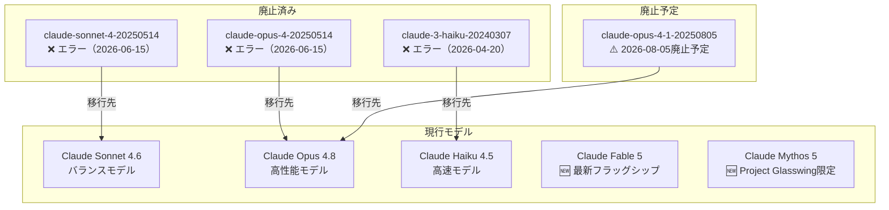
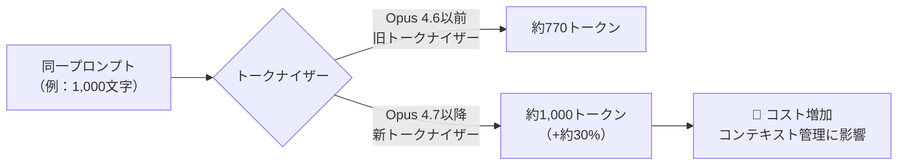
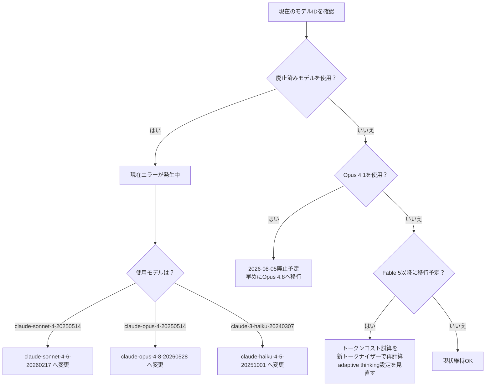

## はじめに

2026年4〜6月にかけて、AnthropicはClaude APIに大規模な変更を加えました。Claude Fable 5・Mythos 5という新フラッグシップモデルの登場、Claude Sonnet 4/Opus 4・Haiku 3などの旧モデル廃止（リクエストがエラーに）、新トークナイザーによるトークン数約30%増加と、**コスト・互換性に直結する破壊的変更**が複数含まれています。

本記事では、severityがcritical/highの変更に絞り、何が変わり、なぜ重要で、どう対応すべきかを解説します。

> **📌 影響を受ける人**
> - `claude-sonnet-4-20250514` または `claude-opus-4-20250514` を使っているすべての開発者（**即時対応必須**）
> - `claude-3-haiku-20240307` を使っている開発者（**即時対応必須**）
> - Claude Fable 5 / Opus 4.7 以降へ移行予定の開発者（トークンコスト試算の見直しが必要）
> - エージェント型ワークフローを構築している開発者

---

## 変更の全体像



---

## 変更内容

### 1. 旧モデル廃止：今すぐ対応が必要

> **⚠️ Breaking Change**
> `claude-sonnet-4-20250514`、`claude-opus-4-20250514`、`claude-3-haiku-20240307` への全リクエストが現在エラーを返しています。

| 廃止モデル | 廃止日 | 移行先モデル |
|---|---|---|
| claude-sonnet-4-20250514 | 2026-06-15（済） | Claude Sonnet 4.6 |
| claude-opus-4-20250514 | 2026-06-15（済） | Claude Opus 4.8 |
| claude-3-haiku-20240307 | 2026-04-20（済） | Claude Haiku 4.5 |
| claude-opus-4-1-20250805 | **2026-08-05（予定）** | Claude Opus 4.8 |

また、Claude Sonnet 4.5 / Sonnet 4 向けの **1Mトークンコンテキスト beta（context-1m-2025-08-07）** も廃止されています。このbetaヘッダーを使っている場合、200k超のリクエストはエラーになります。1Mコンテキストが必要な場合は Claude Sonnet 4.6 または Opus 4.6 以降への移行が必要です。

---

### 2. 新フラッグシップモデル：Claude Fable 5 / Mythos 5 / Opus 4.8

| モデル | モデルID | コンテキスト | 出力トークン | 特記事項 |
|---|---|---|---|---|
| Claude Fable 5 | claude-fable-5 | 1M | 128k | 一般提供、adaptive thinking常時有効 |
| Claude Mythos 5 | claude-mythos-5 | 1M | 128k | Project Glasswing参加者限定 |
| Claude Opus 4.8 | claude-opus-4-8 | 1M（一部200k） | 128k | 一般提供 |

**Claude Fable 5 の主な特徴：**
- adaptive thinking が唯一の思考モード（extended thinking手動設定不可）
- 安全分類器を搭載、拒否時は `stop_reason: "refusal"` を返す（出力前の拒否は課金なし）
- fallbacks パラメータ（beta）で別モデルへ再実行可能
- **30日データ保持が必須** → zero data retention 環境では利用不可

**Claude Opus 4.8 の主な特徴：**
- mid-conversation system messages に対応（長時間セッション中の指示変更でキャッシュヒットを維持）
- stop_details が公開ドキュメント化（category: cyber/bio/null と explanation を返す）
- effort デフォルト high、高解像度画像入力（長辺2576px）対応

---

### 3. 新トークナイザー：コスト試算の見直しが必要

> **⚠️ Breaking Change**
> Claude Fable 5、Mythos 5、Opus 4.7 以降は新トークナイザーを採用。**同じテキストで旧モデルより約30%多いトークンを生成します。**



この変更は特に以下に影響します：
- **コスト試算**：同じワークロードでも請求額が増加する可能性
- **コンテキスト上限の管理**：1Mトークンウィンドウが実質的に狭まる
- **token counting API**：必ず移行先の新モデルIDを指定して再計算する必要あり

---

### 4. Fable 5 での adaptive thinking の変更点

> **⚠️ Breaking Change**
> Fable 5 / Mythos 5 では以下の設定を行うと **400エラー** が返ります。

| 設定項目 | Opus 4.7以前 | Fable 5 / Mythos 5 |
|---|---|---|
| `thinking.type: "disabled"` | 可能 | ❌ 400エラー |
| extended thinking 手動予算指定 | 可能 | ❌ 400エラー |
| assistant prefill | 可能 | ❌ 400エラー |
| `thinking.display` | 任意 | デフォルト `"omitted"`（`"summarized"` 推奨） |
| adaptive thinking | opt-in | 常時有効（唯一の思考モード） |

マルチターン会話では、同一モデルに思考ブロックをそのまま渡す必要があります（生のchain of thoughtは返りません）。

---

### 5. エージェント基盤の大幅強化

action_required: false の変更ですが、エージェント開発者は把握しておく価値があります。

| 機能 | 概要 | 状態 |
|---|---|---|
| code_execution_20260120 | REPL状態の永続化、betaヘッダー不要 | GA |
| Claude Managed Agents | セキュアサンドボックス、SSEストリーミング | public beta |
| MCP tunnels | プライベートネットワーク内MCPサーバーへ接続 | research preview |
| Claude Platform on AWS | AWS課金・IAM認証でClaude APIを利用可能 | GA |
| scheduled deployments | Managed Agentsのcronスケジュール実行 | GA |
| advisor tool | executor単価でadvisor品質を実現 | public beta |
| Swift パッケージ（beta） | Apple Foundation ModelsへClaude統合 | beta |

---

## 影響と対応

### 緊急対応フロー



### 対応チェックリスト

- [ ] `claude-sonnet-4-20250514` / `claude-opus-4-20250514` / `claude-3-haiku-20240307` の参照をコードから削除
- [ ] `context-1m-2025-08-07` betaヘッダーを使用している場合は Sonnet 4.6 / Opus 4.6以降へ移行
- [ ] `claude-opus-4-1-20250805` を使用している場合は 2026年8月5日までに Opus 4.8 へ移行
- [ ] Fable 5 / Opus 4.7以降へ移行する場合はコスト試算を新トークナイザーで再計算
- [ ] Fable 5で `thinking.type: "disabled"` または手動予算を設定していないか確認

---

## コード例

### Before/After：廃止モデルから新モデルへの移行

```python
# Before（現在エラーになる）
import anthropic
client = anthropic.Anthropic()

response = client.messages.create(
    model="claude-sonnet-4-20250514",  # ❌ 廃止済み
    max_tokens=1024,
    messages=[{"role": "user", "content": "Hello"}]
)
```

```python
# After（Sonnet 4.6 へ移行）
import anthropic
client = anthropic.Anthropic()

response = client.messages.create(
    model="claude-sonnet-4-6-20260217",  # ✅ 現行モデル
    max_tokens=1024,
    messages=[{"role": "user", "content": "Hello"}]
)
```

### 新トークナイザーでのトークン数確認

```python
import anthropic
client = anthropic.Anthropic()

prompt = [{"role": "user", "content": "your prompt here"}]

old_count = client.messages.count_tokens(
    model="claude-opus-4-6-20260226",  # 旧トークナイザー
    messages=prompt
)
new_count = client.messages.count_tokens(
    model="claude-fable-5",  # 新トークナイザー
    messages=prompt
)

print(f"旧トークナイザー: {old_count.input_tokens} tokens")
print(f"新トークナイザー: {new_count.input_tokens} tokens")
print(f"増加率: {(new_count.input_tokens / old_count.input_tokens - 1) * 100:.1f}%")
```

### Fable 5 の adaptive thinking（display: summarized）

```python
import anthropic
client = anthropic.Anthropic()

response = client.messages.create(
    model="claude-fable-5",
    max_tokens=8000,
    thinking={
        "type": "enabled",       # "disabled" は400エラー
        "display": "summarized"  # デフォルトは "omitted"、可読性の高いサマリーを取得
    },
    messages=[{"role": "user", "content": "複雑な問題を解いてください"}]
)
```

### code_execution_20260120（betaヘッダー不要）

```python
import anthropic
client = anthropic.Anthropic()

response = client.messages.create(
    model="claude-fable-5",
    max_tokens=4096,
    tools=[{
        "type": "code_execution_20260120",  # betaヘッダー不要
        "name": "code_execution"
    }],
    messages=[{"role": "user", "content": "Pythonでフィボナッチ数列を計算してください"}]
)
```

> **💡 Tips**
> `code_execution_20260120` はREPL状態の永続化をサポートします。複数のツール呼び出しにわたって変数や実行状態が保持されるため、段階的な計算処理やデータ分析に特に有効です。

---

## まとめ

| 変更 | 重要度 | 対応期限 |
|---|---|---|
| Sonnet 4 / Opus 4 廃止（エラー中） | 🔴 緊急 | 今すぐ |
| Haiku 3 廃止（エラー中） | 🔴 緊急 | 今すぐ |
| 1M コンテキスト beta 廃止 | 🔴 緊急 | 今すぐ |
| Opus 4.1 廃止予定 | 🟡 高 | 2026-08-05まで |
| 新トークナイザーでのコスト再試算 | 🟡 高 | Fable 5移行前 |
| Fable 5 の adaptive thinking 制限確認 | 🟡 高 | Fable 5移行前 |
| Claude Managed Agents / MCP tunnels | 🟢 任意 | 新機能として検討 |

今回の変更は「モデル世代交代」と「エージェント基盤の拡充」が同時進行した大型アップデートです。旧モデルへの依存箇所は今すぐ修正が必要であり、新しい Fable 5 へ移行する場合はトークナイザー変更によるコスト増加と adaptive thinking の挙動変更を事前に把握した上で臨みましょう。
