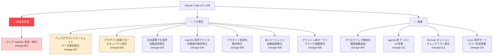
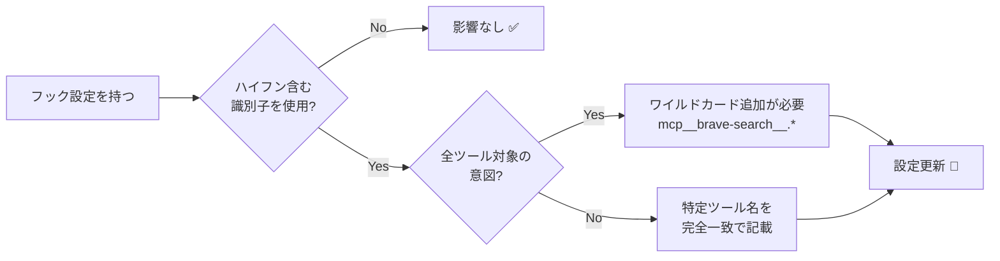

## はじめに

Claude Code v2.1.195 がリリースされ、**既存のフック設定に影響する破壊的変更**を含む複数の修正が行われました。中でも「ハイフン区切り識別子のマッチング動作変更」は、MCP サーバーのフックを設定している開発者全員が対応を確認する必要があります。

また、バックグラウンドエージェントのデータ喪失バグの修正や、日本語・中国語・タイ語ユーザーに直接影響する音声入力の修正など、実用上重要な改善も含まれています。

> **📌 影響を受ける人**
> - `.claude/settings.json` でフック（hooks）を設定している開発者
> - MCP サーバーを利用して自動化を構築している開発者
> - `claude agents` でバックグラウンドジョブを運用している開発者
> - 日本語・中国語・タイ語で音声ディクテーションを使っている方

---

## 変更の全体像



---

## 変更内容

### 優先度別の変更一覧

| 優先度 | ID | 種別 | タイトル | 対応要否 |
|--------|-----|------|---------|---------|
| 🔴 高 | change-001 | 破壊的変更 | フック matcher のハイフン区切り識別子が完全一致に | **要対応** |
| 🟠 中 | change-007 | バグ修正 | バックグラウンドジョブのデータ喪失を修正 | — |
| 🟡 中 | change-005 | バグ修正 | プラグインのインストール同意フロー修正（セキュリティ） | — |
| 🟡 中 | change-003 | バグ修正 | 日本語等での音声自動送信が動作しない問題を修正 | — |
| 🟢 低 | change-002 | 新機能 | マウスクリック無効化環境変数を追加 | — |
| 🟢 低 | change-004 | バグ修正 | macOS 音声デバイス変更後の無音問題を修正 | — |
| 🟢 低 | change-006 | バグ修正 | plugin.json の name 不一致で /plugin が動かない問題を修正 | — |
| 🟢 低 | change-008 | バグ修正 | クラッシュタスク再オープン時のブランク画面を修正 | — |
| 🟢 低 | change-009 | バグ修正 | 制御ソケット失敗時にデーモンが再起動を阻害する問題を修正 | — |
| 🟢 低 | change-010 | 改善 | Linux でマイク無しと SoX 未インストールを区別 | — |
| 🟢 低 | change-011 | 改善 | claude agents の完了リスト UI 改善 | — |
| 🟢 低 | change-012 | 改善 | Remote セッション起動時のチェックリスト表示 | — |

---

## 影響と対応

### 1. フック matcher の完全一致化（要対応）

> **⚠️ Breaking Change**
> ハイフンを含む識別子（`code-reviewer`、`mcp__brave-search` 等）の matcher が、従来の部分一致（substring match）から**完全一致（exact match）**に変更されました。既存のフック設定が部分一致の挙動に依存していた場合、フックが発火しなくなります。

**影響を受けるケース:**



**確認すべき設定ファイル:**
- `~/.claude/settings.json`（グローバル設定）
- `.claude/settings.json`（プロジェクト設定）

---

### 2. バックグラウンドエージェントのデータ喪失修正

`claude agents` でバックグラウンドジョブを運用している開発者に直接影響するバグが修正されました。**新しいバージョンの Claude Code が書き込みを行った際に、ジョブが消失したりデータを失う**問題です。

バージョンアップ後は自動的に修正済みの挙動となるため、追加対応は不要です。ただし、アップデート前に発生した喪失データは復旧できません。

---

### 3. 音声ディクテーション自動送信の修正（日本語ユーザー向け）

日本語・中国語・タイ語など、**スペースで単語を区切らない言語**で音声ディクテーションの自動送信（auto-submit）が一度も発火しなかった問題が修正されました。

日本語ユーザーが Claude Code の音声入力機能を利用している場合、今回のアップデートで初めて正常に動作するようになります。

---

### 4. プラグインのインストール同意フロー修正（セキュリティ）

プロジェクトの `.claude/settings.json` だけで有効化された外部プラグインが、一部のローダー経路で**インストール同意を求めずに実行される**セキュリティ上の問題が修正されました。

アップデートにより、すべての経路で明示的な同意が必要になります。

---

### 5. 新環境変数: `CLAUDE_CODE_DISABLE_MOUSE_CLICKS`

フルスクリーンモードでマウスのクリック・ドラッグ・ホバーを無効化しつつ、ホイールスクロールは維持できる環境変数が追加されました。ターミナルマルチプレクサや特殊な環境での操作性向上に役立ちます。

---

## コード例

### フック設定の修正（Before / After）

**Before（旧動作: 部分一致で意図せず全ツールにマッチしていた）**

```json
// .claude/settings.json
{
  "hooks": {
    "PreToolUse": [
      {
        "matcher": "mcp__brave-search",
        "hooks": [
          {
            "type": "command",
            "command": "echo 'brave-search tool called'"
          }
        ]
      }
    ]
  }
}
```

旧動作では `mcp__brave-search` が `mcp__brave-search__web_search` や `mcp__brave-search__local_search` にも部分一致していました。

---

**After（新動作: 完全一致のため、全ツールを対象にする場合はワイルドカードが必要）**

```json
// .claude/settings.json
{
  "hooks": {
    "PreToolUse": [
      {
        "matcher": "mcp__brave-search__.*",
        "hooks": [
          {
            "type": "command",
            "command": "echo 'brave-search tool called'"
          }
        ]
      }
    ]
  }
}
```

> **💡 Tips**
> - **特定のツール1つだけ**を対象にしたい場合: `"mcp__brave-search__web_search"` と完全一致で指定
> - **サーバー配下の全ツール**を対象にしたい場合: `"mcp__brave-search__.*"` とワイルドカードを末尾に付与
> - ハイフンを含まない識別子（`Bash`、`Read` 等）はこの変更の影響を受けません

---

### マウスクリック無効化の設定例

```bash
# フルスクリーンモードでクリック/ドラッグ/ホバーを無効化
export CLAUDE_CODE_DISABLE_MOUSE_CLICKS=1
claude
```

シェルの設定ファイル（`~/.zshrc` など）に追記することで永続化できます。

---

## まとめ

| ポイント | 内容 |
|---------|------|
| **最重要対応** | ハイフン含むフック matcher を使っている場合、`.*` ワイルドカードへの更新が必要 |
| **安定性向上** | バックグラウンドエージェントのデータ喪失・起動阻害バグが修正された |
| **日本語ユーザー朗報** | 音声ディクテーションの自動送信がようやく日本語でも動作するように |
| **セキュリティ修正** | プラグインのインストール同意フローが全経路で適切に要求されるように |
| **全体評価** | 安定性・音声体験・セキュリティを改善するメンテナンスリリース |

今回のリリースで最も注意すべきは **フック matcher の動作変更**です。MCP サーバーの自動化フックを設定している場合は、アップデート後に設定ファイルを確認し、必要に応じてワイルドカードを追加してください。それ以外の変更はバグ修正と改善が中心であり、基本的に追加対応は不要です。
