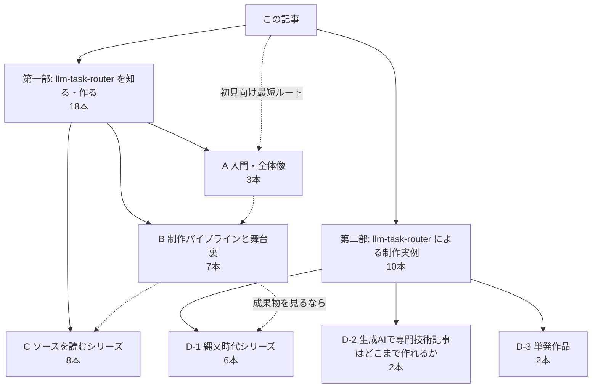

llm-task-router は、**薄い ModelRouter で記事の生成・評価・改稿を回す TypeScript 製 CLI**です。  
この記事は、このツールに関する**これまでの28本の記事を一枚で見渡すためのハブ**です。

ここでいう28本は、**本記事を除いたリンク先の記事数**です。全部を順番に読む必要はありません。  
「ツールを知る・作る」と、「ツールで作った制作実例」の二部構成で、関心のある地点から最短で入れるように整理しました。

薄い ModelRouter は、**複数の LLM プロバイダやモデルを共通インターフェースで差し替え可能にする薄い抽象化層**です。  
また、create は生成、refine は自動推敲ループ、evaluate は評価、revise は改稿を担います。詳細は最初の入門記事で説明しています。  
このプロジェクトの核は、LLM に記事を書かせること自体ではなく、生成・評価・改稿・出典確認・公開・連載管理までを再現可能な工程に分けたことにあります。

各カテゴリの下に記事リンクを置いているので、気になる項目からそのまま飛んでください。

## この記事の使い方

このインデックスは、次の2つの入口でできています。

- **第一部**：llm-task-router を知る・作る
- **第二部**：llm-task-router による制作実例

読む順番を固定するための記事ではなく、**関心別の地図**として使う想定です。

- **ツールの概要**を知りたい
- **品質改善の進め方**を見たい
- **実装や設計判断**まで追いたい
- **実際の制作物**を見たい

## 第一部：llm-task-router を知る・作る

ここは、**ツールの概要を知りたい人**、**制作ワークフローの舞台裏を追いたい人**、**実装レベルまで見たい人**向けの入口です。

### A 入門・全体像

まずは、**llm-task-router が何をする CLI なのか**を短時間でつかみたい人向けです。

- [薄い ModelRouter で記事生成ワークフローを回す](https://qiita.com/rex0220/items/f501b9983f26e4434eeb)  
  llm-task-router が何をする CLI なのかを最短でつかむ導入記事

- [llm-task-router は他の記事生成ワークフローと何が違うのか](https://qiita.com/rex0220/items/31f9f13965e5336d387d)  
  既存のやり方と比べた設計上の違いや立ち位置を整理

- [チュートリアル（インストール〜生成・評価・改稿・エクスポート）](https://qiita.com/rex0220/items/788554bfd0c69a6c470c)  
  使い始め方を一通りたどれる実践入口

### B 制作パイプラインと舞台裏

ここは、**llm-task-router をどう育て、どう運用してきたか**を追う実践記録です。  
品質改善、連載管理、成果物の見方まで、実運用での判断や試行錯誤が見えます。

- [Claude Code を編集長にして Qiita 記事生成パイプラインを作る](https://qiita.com/rex0220/items/8ab1a9082ea9c09da0a4)  
  Claude Code を軸に記事制作パイプラインを組み立てた出発点

- [一発生成をやめた：LLM-as-Judge × Critique Loop で記事品質を底上げ](https://qiita.com/rex0220/items/6b906ebde7ffde5373a4)  
  単発生成から評価と批評のループへ移った理由と効果

- [書くAIと見るAIを分ける：自動推敲ループ開発記](https://qiita.com/rex0220/items/e1f62de3be66dda9f67e)  
  生成役とレビュー役を分ける発想で自動推敲を設計した経緯

- [runs/ の成果物で記事生成の全工程を振り返る](https://qiita.com/rex0220/items/34a965a62472e74aa61b)  
  実行結果の保存物を手がかりに生成工程全体を追う

- [Claude Code と llm-task-router でシリーズの構成を対話で確定するまで](https://qiita.com/rex0220/items/5c2242931e67bc21eca1)  
  連載の章立てや構成を対話的に詰めていく実例

- [シリーズ記事の表記ゆれを機械で見つける](https://qiita.com/rex0220/items/2de17b758ed83566ca65)  
  シリーズ運用で起きやすい表記の揺れを機械検出する方法

- [series 機能で連載記事を管理する（題材：縄文時代シリーズ）](https://qiita.com/rex0220/items/dd1cca50b3a91062162e)  
  連載単位で記事群を管理する仕組みを縄文時代シリーズで説明

### C ソースを読むシリーズ

ここは、**CLI の内部実装や設計判断まで追いたい人**向けのソース解説シリーズです。  
第0回を全体地図として、その後を構成要素ごとの掘り下げとして読むと、設計から公開までつながります。

- [第0回 LLM記事生成パイプライン設計の全体地図](https://qiita.com/rex0220/items/4a088705f93d8614c962)  
  実装を読む前に押さえるべき構成を示す見取り図

- [第1回 設計思想と全体像](https://qiita.com/rex0220/items/434341bda70a9b0ed1ea)  
  ツール全体の設計方針と責務分割を整理

- [第2回 複数LLMを1つのインターフェースで扱う](https://qiita.com/rex0220/items/d3113e70af8fd43214f7)  
  複数モデルを薄い共通層で扱う実装上の考え方

- [第3回 Zodスキーマと構造化出力](https://qiita.com/rex0220/items/083d1b7c486de3c192c8)  
  構造化出力とスキーマ検証の扱い方

- [第4回 工程の連鎖と止まる自動ループ](https://qiita.com/rex0220/items/c98696ef59cd9c3558bf)  
  create から revise までの工程連鎖と停止条件を持つループ設計

- [第5回 progress台帳のイベントソーシング](https://qiita.com/rex0220/items/616625739f8e517ec8c8)  
  進行状況の記録と復元の考え方を progress 台帳から読む

- [第6回 裏取りと参考章の機械生成](https://qiita.com/rex0220/items/60114b19f74a511c028f)  
  参考情報の扱いと参考章生成の仕組み

- [第7回（最終回）公開と版管理](https://qiita.com/rex0220/items/d87051b551b1ccfcc1fe)  
  公開手順と版管理まで含めた運用の出口

## 第二部：llm-task-router による制作実例

ここは、**実際にこのワークフローでどんな記事が作られたか**を見たい人向けの入口です。

### D-1 縄文時代シリーズ

シリーズ運用の実例として、テーマを分割しながら積み上げた作品群です。

- [第1回 縄文時代ってどんな時代？](https://qiita.com/rex0220/items/611f32aee3ccb5beb7a3)  
  縄文時代全体の輪郭をつかむ入口

- [第2回 縄文人とは誰か](https://qiita.com/rex0220/items/db7a0c540edd684bf7b7)  
  縄文人という存在をテーマに理解を深める回

- [第3回 縄文海進と鬼界アカホヤ噴火](https://qiita.com/rex0220/items/71b3a20054c12d74da66)  
  環境変化や大規模噴火が縄文時代に与えた影響

- [第4回 食糧と定住の暮らし](https://qiita.com/rex0220/items/9f6c135f24ae5eda710c)  
  生活基盤や定住のあり方に焦点を当てた回

- [第5回 ものづくりと装い](https://qiita.com/rex0220/items/119e66f000d0a6e7c73b)  
  技術や装飾の面から縄文文化を見る回

- [第6回（最終回）土偶・祭祀・精神世界](https://qiita.com/rex0220/items/36281ed097c0f43f45c5)  
  土偶や祭祀を手がかりに精神文化へ踏み込む最終回

### D-2 生成AIで専門技術記事はどこまで作れるか

特定テーマの記事制作に生成AIワークフローを適用した実験です。

- [富士山編](https://qiita.com/rex0220/items/abe0d86f9e2065a6603f)  
  富士山を題材に、専門性を含む記事制作をどこまで進められるかを試す

- [月編](https://qiita.com/rex0220/items/f41265ad3a53479e8375)  
  月を題材に、同じ問題意識で生成AIによる記事制作の到達点を探る

### D-3 単発作品

連載ではないものの、llm-task-router による制作実例として雰囲気の違う作品です。

- [生成AIで童話を作る：やさしいだけの「さるかに」制作記](https://qiita.com/rex0220/items/cf1893ec3ad738dca73d)  
  童話制作を題材に生成AIによる物語づくりを扱った単発記事

- [はやぶさ2 リュウグウ往復の全行程を物語として読み解く](https://qiita.com/rex0220/items/cc76a34c4b07fba10722)  
  はやぶさ2の往復ミッションを物語として再構成して読む作品

## 件数の確認

この記事で扱っているリンク先は、合計**28本**です。内訳は次のとおりです。

| 区分 | 本数 | 備考 |
| --- | ---: | --- |
| A 入門・全体像 | 3 | 本文リスト3件 |
| B 制作パイプラインと舞台裏 | 7 | 本文リスト7件 |
| C ソースを読むシリーズ | 8 | 第0回〜第7回の8件 |
| D-1 縄文時代シリーズ | 6 | 第1回〜第6回の6件 |
| D-2 生成AIで専門技術記事はどこまで作れるか | 2 | 富士山編・月編 |
| D-3 単発作品 | 2 | さるかに・はやぶさ2 |
| 合計 | 28 | 第一部18本 + 第二部10本 |

Cシリーズは**第0回〜第7回で8本**です。  
第一部は A=3, B=7, C=8 の合計で**18本**、第二部は D-1=6, D-2=2, D-3=2 の合計で**10本**です。

## おすすめの読む順序

初見の方に向けて、まずは迷いにくい**一本道の最小ルート**を置いておきます。

1. [薄い ModelRouter で記事生成ワークフローを回す](https://qiita.com/rex0220/items/f501b9983f26e4434eeb)  
   何を作っているのかを最短で把握できます。

2. [一発生成をやめた：LLM-as-Judge × Critique Loop で記事品質を底上げ](https://qiita.com/rex0220/items/6b906ebde7ffde5373a4)  
   運用思想と品質改善の中核がわかります。

3. [第0回 LLM記事生成パイプライン設計の全体地図](https://qiita.com/rex0220/items/4a088705f93d8614c962)  
   実装を追う前の地図として読むのがおすすめです。

4. [第1回 縄文時代ってどんな時代？](https://qiita.com/rex0220/items/611f32aee3ccb5beb7a3)  
   成果物として何が作れるかを確認できます。

さらに深めたい場合は、次の分岐があります。

- **制作運用の起点**を見たいなら  
  [Claude Code を編集長にして Qiita 記事生成パイプラインを作る](https://qiita.com/rex0220/items/8ab1a9082ea9c09da0a4)

- **ソース実装**を順に追いたいなら  
  第0回から第7回までのソース解説シリーズ

- **別ジャンルの成果物**を見たいなら  
  [生成AIで童話を作る：やさしいだけの「さるかに」制作記](https://qiita.com/rex0220/items/cf1893ec3ad738dca73d)

:::note info
このインデックスは、**全部を順番に読むための目次**というより、**関心から最短で入るための地図**として作っています。
:::

### 迷ったらこの3本

- [薄い ModelRouter で記事生成ワークフローを回す](https://qiita.com/rex0220/items/f501b9983f26e4434eeb)
- [一発生成をやめた：LLM-as-Judge × Critique Loop で記事品質を底上げ](https://qiita.com/rex0220/items/6b906ebde7ffde5373a4)
- [第0回 LLM記事生成パイプライン設計の全体地図](https://qiita.com/rex0220/items/4a088705f93d8614c962)

成果物も見たいなら [第1回 縄文時代ってどんな時代？](https://qiita.com/rex0220/items/611f32aee3ccb5beb7a3) もどうぞ。

28本の記事群は、**1つのツールの設計・運用・改善**と、**そのツールで作った実例群**という形で一貫しています。  
気になったカテゴリの入口から、地図をたどってみてください。

## 参考

本文中のリンクを、出典台帳としてあらためて一覧に再掲します。

<!-- sources:begin -->
- [S001] llm-task-router: 薄い ModelRouter で記事生成ワークフローを回す（primary, retrieved: 2026-06-27）
  https://qiita.com/rex0220/items/f501b9983f26e4434eeb
- [S002] llm-task-router は他の記事生成ワークフローと何が違うのか（primary, retrieved: 2026-06-27）
  https://qiita.com/rex0220/items/31f9f13965e5336d387d
- [S003] llm-task-router チュートリアル — インストールから最初の記事生成・評価・改稿・エクスポートまで手を動かして学ぶ（primary, retrieved: 2026-06-27）
  https://qiita.com/rex0220/items/788554bfd0c69a6c470c
- [S004] Claude Code を編集長にして Qiita 記事生成パイプラインを作る（primary, retrieved: 2026-06-27）
  https://qiita.com/rex0220/items/8ab1a9082ea9c09da0a4
- [S005] llm-task-router 一発生成をやめた：LLM-as-Judge × Critique Loop で記事品質を底上げする（primary, retrieved: 2026-06-27）
  https://qiita.com/rex0220/items/6b906ebde7ffde5373a4
- [S006] llm-task-router 書くAIと見るAIを分ける：Claude Code × codex × 人間で OSS に「自動推敲ループ」を実装した開発記（primary, retrieved: 2026-06-27）
  https://qiita.com/rex0220/items/e1f62de3be66dda9f67e
- [S007] llm-task-router で Qiita 記事を1本作った全工程を runs/ の成果物で振り返る（primary, retrieved: 2026-06-27）
  https://qiita.com/rex0220/items/34a965a62472e74aa61b
- [S008] Claude Code と llm-task-router で「シリーズの構成」を対話で確定するまで（primary, retrieved: 2026-06-27）
  https://qiita.com/rex0220/items/5c2242931e67bc21eca1
- [S009] llm-task-router シリーズ記事の「表記ゆれ」を機械で見つける（primary, retrieved: 2026-06-27）
  https://qiita.com/rex0220/items/2de17b758ed83566ca65
- [S010] llm-task-router の series 機能で連載記事を管理する：縄文時代シリーズ（primary, retrieved: 2026-06-27）
  https://qiita.com/rex0220/items/dd1cca50b3a91062162e
- [S011] llm-task-router のソースを読む 第0回：LLM記事生成パイプライン設計の全体地図（primary, retrieved: 2026-06-27）
  https://qiita.com/rex0220/items/4a088705f93d8614c962
- [S012] llm-task-router のソースを読む 第1回：LLM記事生成CLIの設計思想と全体像（primary, retrieved: 2026-06-27）
  https://qiita.com/rex0220/items/434341bda70a9b0ed1ea
- [S013] llm-task-router のソースを読む 第2回：複数LLMを1つのインターフェースで扱う（primary, retrieved: 2026-06-27）
  https://qiita.com/rex0220/items/d3113e70af8fd43214f7
- [S014] llm-task-router のソースを読む 第3回：LLMの自由出力を型安全に受け取る ― Zod スキーマと構造化出力（primary, retrieved: 2026-06-27）
  https://qiita.com/rex0220/items/083d1b7c486de3c192c8
- [S015] llm-task-router のソースを読む 第4回：LLM生成を「工程の連鎖」と「止まる自動ループ」で設計する（primary, retrieved: 2026-06-27）
  https://qiita.com/rex0220/items/c98696ef59cd9c3558bf
- [S016] llm-task-router のソースを読む 第5回：追記専用ログで工程を観測する ― progress 台帳のイベントソーシング（primary, retrieved: 2026-06-27）
  https://qiita.com/rex0220/items/616625739f8e517ec8c8
- [S017] llm-task-router のソースを読む 第6回：LLMに嘘の出典を書かせない ― 裏取りと参考章の機械生成（primary, retrieved: 2026-06-27）
  https://qiita.com/rex0220/items/60114b19f74a511c028f
- [S018] llm-task-router のソースを読む 第7回（最終回）：公開と版管理を仕組みで支える ― export / 公開台帳 / 更新 / シリーズ管理（primary, retrieved: 2026-06-27）
  https://qiita.com/rex0220/items/d87051b551b1ccfcc1fe
- [S019] 生成AIで縄文時代シリーズ記事を作る１：縄文時代ってどんな時代？ — いつからいつまで・何が新しかったのか（シリーズ概説）（primary, retrieved: 2026-06-27）
  https://qiita.com/rex0220/items/611f32aee3ccb5beb7a3
- [S020] 生成AIで縄文時代シリーズ記事を作る２：縄文人とは誰か？どこから来て、どれだけ列島にいたのか（primary, retrieved: 2026-06-27）
  https://qiita.com/rex0220/items/db7a0c540edd684bf7b7
- [S021] 生成AIで縄文時代シリーズ記事を作る３：縄文の海はどこまで来た？— 縄文海進と鬼界アカホヤ噴火が変えた暮らし（primary, retrieved: 2026-06-27）
  https://qiita.com/rex0220/items/71b3a20054c12d74da66
- [S022] 生成AIで縄文時代シリーズ記事を作る４：縄文人は何を食べ、どんなムラに住んでいた？ — 食糧と定住の暮らしを読む（primary, retrieved: 2026-06-27）
  https://qiita.com/rex0220/items/9f6c135f24ae5eda710c
- [S023] 生成AIで縄文時代シリーズ記事を作る５：縄文のものづくりと装い — 土器・道具と、衣服・おしゃれ（primary, retrieved: 2026-06-27）
  https://qiita.com/rex0220/items/119e66f000d0a6e7c73b
- [S024] 生成AIで縄文時代シリーズ記事を作る６：縄文人は何を祈った？――土偶・祭祀・精神世界から見る「こころ」（primary, retrieved: 2026-06-27）
  https://qiita.com/rex0220/items/36281ed097c0f43f45c5
- [S025] 生成AIで専門技術記事はどこまで作れるか：富士山編 — 火山・水循環・防災をつなぐ一つの自然システム（primary, retrieved: 2026-06-27）
  https://qiita.com/rex0220/items/abe0d86f9e2065a6603f
- [S026] 生成AIで専門技術記事はどこまで作れるか：月編 — 軌道・潮汐・自転同期から探査の現在まで（primary, retrieved: 2026-06-27）
  https://qiita.com/rex0220/items/f41265ad3a53479e8375
- [S027] 生成AIで童話を作る：やさしいだけの「さるかに」制作記（primary, retrieved: 2026-06-27）
  https://qiita.com/rex0220/items/cf1893ec3ad738dca73d
- [S028] はやぶさ2 小惑星リュウグウへの往復、その全行程を物語として読み解く（primary, retrieved: 2026-06-27）
  https://qiita.com/rex0220/items/cc76a34c4b07fba10722
<!-- sources:end -->
