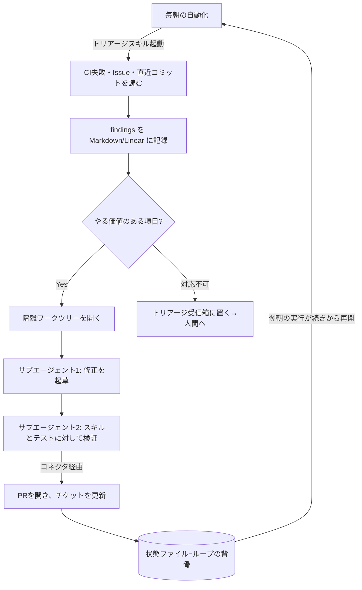

## はじめに

最近、Addy Osmani 氏のブログで [Loop Engineering](https://addyosmani.com/blog/loop-engineering/) という記事を読みました。記事中で引用されている Peter Steinberger 氏の一文が刺さります。

> You shouldn't be prompting coding agents anymore. You should be designing loops that prompt your agents.
> （もうコーディングエージェントにプロンプトを書くのをやめろ。エージェントにプロンプトを書く「ループ」を設計しろ）

これは Peter Steinberger 氏の言葉で、Anthropic で Claude Code を率いる Boris Cherny 氏も「自分はもう Claude にプロンプトを書いていない。Claude にプロンプトを書いて次に何をするか判断するループを走らせている。自分の仕事はループを書くことだ」と述べています。

筆者は普段から Claude Code でスキルやスケジュールタスクを組んで個人開発をしているので、この「ループ設計」という考え方が腑に落ちました。本記事では、Addy 氏の整理を下敷きにしつつ、筆者なりにこの概念を「5つの部品 + 1つの記憶」という形で噛み砕いて整理します。

## 背景：ハーネスの「一階上」

筆者は以前、Agent Harness Engineering（エージェントが動く環境＝ハーネスを設計する考え方）についても記事を書きました。Loop Engineering はその一段上の概念にあたります。

- **ハーネス** … 1体のエージェントが動く「環境」そのもの。コンテキスト、ツール、ガードレールを整える
- **ループ** … ハーネスを **タイマーで回し**、ヘルパーを生成し、自分自身に仕事を供給し続ける仕組み

Addy 氏の言葉を借りれば「ハーネスがタイマーで動き、小さなヘルパーを生み、自分自身に餌を与える」のがループです。ここ1〜2年、エージェントから成果を引き出す手段は「良いプロンプトを書いて十分なコンテキストを渡す」ことでした。1ターン書いて、返ってきたものを読んで、また次を書く。ツールを握っているのは常に自分でした。

ループエンジニアリングは、その「握る人」を自分から **システム** に置き換えます。仕事を見つけ、割り振り、検証し、何が終わったかを記録し、次にやることを決める。その一連を自動化して、エージェントを突くのを自分ではなくシステムにやらせる、という発想です。

筆者が面白いと感じたのは、これがもはや「自前ツールを書く話」ではなくなっている点です。1年前なら、ループを組むには大量の bash を書いて永久にメンテし続ける必要がありました。いまは部品が製品の中に標準で載っています。

## 本論：ループを構成する「5つの部品 + 1つの記憶」

Addy 氏は、ループには5つの部品と、状態を覚えておく1つの場所が必要だと整理しています。筆者なりに表にすると次の通りです。

| 部品 | ループ内での役割 | Codex での実装 | Claude Code での実装 |
| --- | --- | --- | --- |
| 自動化（Automations） | スケジュールで発見とトリアージ | Automations タブ、`/goal` | スケジュールタスク / cron、`/loop`、`/goal`、hooks、GitHub Actions |
| ワークツリー（Worktrees） | 並列作業の隔離 | スレッドごとの組み込みワークツリー | `git worktree`、`--worktree`、サブエージェントの `isolation: worktree` |
| スキル（Skills） | プロジェクト知識の明文化 | Agent Skills（`SKILL.md`） | Agent Skills（`SKILL.md`） |
| コネクタ / プラグイン | 既存ツールへの接続 | Connectors（MCP）+ プラグイン | MCP サーバ + プラグイン |
| サブエージェント | 立案役と検証役の分離 | `.codex/agents/` の TOML | `.claude/agents/` の Task サブエージェント |
| 状態（State）※記憶 | 完了したことの記録 | Markdown または Linear（コネクタ経由） | Markdown（`AGENTS.md` 等）または Linear（MCP 経由） |

名前は微妙に違いますが、能力はほぼ同じです。順番に見ていきます。

### 1. 自動化 — ループの心臓

自動化こそがループを「一度きりの実行」ではなく「本当のループ」にする部品です。スケジュールで起動し、自分で発見とトリアージを行います。

Claude Code では、プロンプトやコマンドを一定間隔で再実行する `/loop`、cron でのスケジュールタスク、エージェントのライフサイクルの各点でシェルコマンドを撃つ hooks、ラップトップを閉じても回し続けたいなら GitHub Actions、という手段があります。

ここで特に押さえたいのが、ループの本質に最も近いセッション内プリミティブの違いです。

- `/loop` … 一定の **間隔** で再実行する
- `/goal` … 自分が書いた **条件が本当に真になるまで** 走り続ける

`/goal` が秀逸なのは、毎ターンの後に **別の小さなモデルが「終わったかどうか」を判定する** 点です。つまりコードを書いたエージェント自身が採点しません。例えば次のような停止条件を渡して立ち去ることができます。

```bash
# 「test/auth のテストが全て通り、lint がクリーンになるまで」走り続ける
/goal "all tests in test/auth pass and lint is clean"
```

Codex にも同名の `/goal` があり、検証可能な停止条件が満たされるまでターンをまたいで動き続けます。pause / resume / clear も同じ。**同じプリミティブが両方のツールに載っている** ——これが本記事を通じたパターンです。

### 2. ワークツリー — 並列がカオスにならないために

エージェントを2体以上同時に走らせた瞬間、ファイルの衝突が始まります。同じファイルを2体が書くのは、2人のエンジニアが相談せずに同じ行をコミットするのと同じ頭痛です。

これを解決するのが git のワークツリーです。同じリポジトリ履歴を共有しつつ、それぞれ別ブランチ・別ディレクトリで作業するため、片方のエージェントの編集が物理的にもう片方のチェックアウトに触れません。

```bash
# サブエージェントごとに使い捨てのチェックアウトを与える例（Claude Code）
git worktree add ../feature-a feature-a
# サブエージェント定義側では isolation: worktree を指定すると
# ヘルパーごとに新しいチェックアウトが切られ、終了後に自動で掃除される
```

ただし Addy 氏も釘を刺していますが、ワークツリーが消すのは「機械的な衝突」だけです。**何体まで実際に回せるかの上限は、あなたのレビュー帯域** です。ツールではなく人間がボトルネックになります。

### 3. スキル — 毎回プロジェクトを説明し直さない

スキルは、毎セッションで同じプロジェクト文脈を金魚のように説明し直すのをやめるための部品です。両ツールとも形式は同じで、`SKILL.md` を中心に、命令・メタデータ・任意のスクリプトや参照・アセットを置いたフォルダです。

ポイントは **description（説明文）を「気の利いた表現」より「退屈で的確な表現」にする** ことです。タスクがスキルの description にマッチしたときに自動起動するため、曖昧な説明だと発火しません。

スキルは「意図（intent）を一度きりの記述で済ませる」場所でもあります。エージェントは毎セッション冷えた状態から始まり、意図の穴を自信たっぷりの推測で埋めます。規約・ビルド手順・「あの一件があったからこうはしない」といった暗黙知を、エージェントが毎回読む場所に一度書いておく。スキルが無ければループは毎サイクルでプロジェクトをゼロから再導出しますが、スキルがあれば積み上がっていきます。

なお **スキルは「書く形式」、プラグインは「配る形式」** です。複数リポジトリで共有したり束ねたりするときにプラグインとしてパッケージします。

### 4. コネクタ / プラグイン — ループが実際のツールに触れる

ファイルシステムしか見られないループは小さなループです。MCP を土台にしたコネクタによって、エージェントは issue トラッカーを読み、DB に問い合わせ、ステージング API を叩き、Slack にメッセージを落とせます。

Codex も Claude Code も MCP を話すため、片方向けに書いたコネクタはたいていもう片方でもそのまま動きます。これが「ここに修正案があります」と言うだけのエージェントと、「CI がグリーンになったら自分で PR を開き、Linear チケットを紐づけ、チャンネルに通知する」ループの違いです。

### 5. サブエージェント — 作る者と検証する者を引き離す

ループの中で最も有用な構造は、**書く者と検証する者を分ける** ことだと筆者も思います。コードを書いたモデルは、自分の宿題を採点するには優しすぎます。別の命令、ときには別のモデルを持つ2体目が、1体目が自分を言いくるめて通してしまった問題を拾い上げます。

Claude Code では `.claude/agents/` にサブエージェントを定義し、エージェントチームで仕事を受け渡します。典型的な分業は「1体が探索、1体が実装、1体が仕様に対して検証」です。

```toml
# Codex の場合: .codex/agents/ に TOML で定義する例
name = "security-reviewer"
description = "セキュリティ観点でPRを批判的にレビューする"
model = "<強いモデルを指定>"        # 検証役は強いモデル
reasoning_effort = "high"          # かつ高い reasoning effort で
```

サブエージェントはそれぞれ独自にモデルとツールを動かすのでトークンを多く消費します。**第二の意見を払う価値がある場所** に絞って使うのがコツです。前述の `/goal` が裏でやっているのも本質的にはこれで、作業したモデルではない新しいモデルが「終わったか」を判定する——停止条件そのものに maker / checker 分離を適用しています。

## 一つのループはどんな形か

部品を組み合わせると、1スレッドが小さな管制盤になります。Addy 氏が挙げ、筆者も真似したくなった形はこうです。



状態ファイルがこのループの背骨です。何を試し、何が通り、何がまだ開いているかを覚えているので、翌朝の実行は今日止まった場所から再開できます。モデルは実行間ですべてを忘れますが、リポジトリは忘れません。**記憶はコンテキストではなくディスクに置く** ——これが長時間走るエージェントが共通して依存しているトリックです。

そして注目すべきは、ここで実際にやったのは「一度設計しただけ」という点です。個々のステップにプロンプトを書いてはいません。それが Steinberger 氏の主張の実体で、部品が同じである以上 Codex でも Claude Code でも同じループになります。

## ハマりどころ：ループ化しても手元に残る3つの仕事

ループは仕事を「変える」のであって、自分を消してくれるわけではありません。むしろループが良くなるほど鋭くなる問題が3つあります。

1. **検証は依然として自分の仕事**。無人で走るループは、無人でミスを犯すループでもあります。検証役サブエージェントを分けるのは「終わった」に意味を持たせるためですが、それでも「終わった」は主張であって証明ではありません。
2. **理解は放置すれば腐る**。ループが自分の書いていないコードを速く出すほど、「存在するもの」と「自分が把握しているもの」のギャップが広がります（comprehension debt）。
3. **居心地の良い姿勢が一番危ない**。ループが回り出すと意見を持つのをやめ、返ってきたものをそのまま受け取りたくなります。Addy 氏はこれを cognitive surrender（認知的降伏）と呼んでいます。

同じ「ループを設計する」という行為が、判断を持ってやれば処方箋になり、考えないためにやれば加速装置になる——行為は同じで結果は正反対、という指摘が筆者には一番響きました。

## まとめ

Loop Engineering は「プロンプトエンジニアリングが要らなくなる」話ではなく、**レバレッジの効く点が移動した** という話だと筆者は理解しました。

- ループは「5つの部品（自動化・ワークツリー・スキル・コネクタ・サブエージェント）+ 1つの記憶（状態）」で構成される
- これらはもう自前 bash ではなく、Codex / Claude Code の標準機能として揃っている
- 心臓は `/goal` のような「条件が真になるまで走り、別モデルが採点する」自動化
- それでも検証・理解・主体性は自分に残る

同じループを2人が組んでも、深く理解している作業を加速するのに使う人と、作業を理解しないために使う人とでは正反対の結果になります。ループはその違いを知りませんが、自分は知っています。ボタンを押すだけの人ではなく、エンジニアであり続けるつもりでループを組む——というのが筆者の結論です。まずは「毎朝 CI 失敗をトリアージするスキルをスケジュール起動する」あたりから小さく試してみるつもりです。

## 参考

- Addy Osmani, [Loop Engineering](https://addyosmani.com/blog/loop-engineering/)（本記事の一次情報）
- Addy Osmani, [Agent Harness Engineering](https://addyosmani.com/blog/agent-harness-engineering/)
- Addy Osmani, [Long-running agents](https://addyosmani.com/blog/long-running-agents/)
- Addy Osmani, [The intent debt](https://addyosmani.com/blog/intent-debt/) / [Comprehension debt](https://addyosmani.com/blog/comprehension-debt/) / [Cognitive surrender](https://addyosmani.com/blog/cognitive-surrender/)
- Peter Steinberger 氏の[発言](https://x.com/steipete/status/2063697162748260627) / Boris Cherny 氏の[発言](https://x.com/rohanpaul_ai/status/2063289804708835412)
