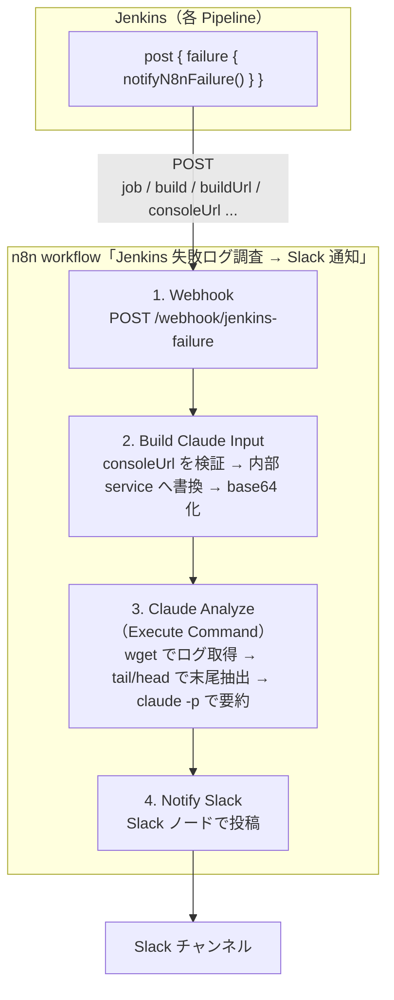

CIが落ちたとき、コンソールログを開いて原因を目で追う作業は地味に消耗します。
本記事では **Jenkins の失敗を検知 → n8n がログを回収 → Claude が原因を要約 →
Slack に通知** までを全自動化した仕組みを、実コードを交えて解説します。

ポイントは **役割分担を徹底したこと** です。Jenkins 側は「失敗した事実とログのありか」を
投げるだけ。ログ回収・AI 調査・通知はすべて n8n に寄せています。

## 前提環境

後半で Kubernetes 固有の話（内部 service への書き換えなど）が出てくるので、先に
筆者の環境を共有しておきます。読み替えればオンプレ VM やマネージド環境でも成立します。

- **Jenkins**: Kubernetes 上で稼働。公開は `https://jenkins.example.info`、内部からは
  K8s service `jenkins-app.jenkins.svc.cluster.local:8080` でアクセス可能。
- **n8n**: 同じ Kubernetes クラスタ上で稼働。
  - **Claude CLI（`claude` コマンド）を同梱した独自イメージ**を使用。
  - **Execute Command ノードを有効化**してあり、pod 内でシェルを実行できる。
  - pod イメージには `curl` が**入っていない**（busybox の `wget` を使う前提）。
- **シークレット管理**: HashiCorp Vault → pod の環境変数として供給。
  - `CLAUDE_CODE_OAUTH_TOKEN`（Claude CLI 認証）
  - Jenkins の API ユーザー / トークン（コンソールログ取得の Basic 認証用）
- **公開 URL の保護**: Jenkins の公開ホストは Cloudflare Access 配下にあり、n8n pod から
  公開 URL を直接叩いてもブロックされる。このため後述の URL 書き換えが必要になります。

> Kubernetes / Vault は必須ではありません。「n8n から Jenkins の内部エンドポイントに
> 到達できる」「pod 内で `claude` が実行できる」「Jenkins の認証情報を安全に渡せる」の
> 3 点が満たせれば、構成は何でも構いません。

## 全体像



役割分担の原則は次のとおりです。

- **回収・調査・通知は n8n の責務**。Jenkins は「失敗した」事実とログの場所を通知するだけ。
- Jenkins 側の共通処理は Shared Library 1 ファイルに集約し、各パイプラインからは 1 行で呼びます。

この切り分けによって、AI 解析のロジックを変えても Jenkins 側には一切手を入れずに済みます。

## Jenkins 側：失敗を通知する Shared Library

各パイプラインのパイプラインレベル `post { failure { } }` から、共通関数を 1 行呼ぶだけにします。

```groovy
post {
    failure {
        notifyN8nFailure()
    }
}
```

中身は Shared Library（`vars/notifyN8nFailure.groovy`）です。設計上のキモが 3 つあります。

### 1. 失敗ハンドラ内では絶対に throw しない

この関数は `failure {}` の中、つまり「すでにビルドが失敗している後処理」から呼ばれます。
ここで例外を投げると後処理そのものを壊しかねないので、**いかなる失敗も握り潰して warn ログだけ出します**。
通知は best-effort（届かなくてもビルドの結果は FAILURE のまま完了する）という方針です。

```groovy
def call(Map args = [:]) {
    def urlCredId   = args.urlCredentialId   ?: 'n8n-failure-webhook-url'
    def tokenCredId = args.tokenCredentialId ?: 'n8n-failure-webhook-token'

    try {
        def payload = buildPayload(args.extra instanceof Map ? args.extra : [:])
        def payloadFile = '.n8n-failure-payload.json'
        writeFile file: payloadFile, text: payload
        // ... (送信処理)
    } catch (err) {
        // 失敗通知自体の失敗でビルド後処理を壊さない。
        echo "[WARN] n8n 失敗通知の送信中にエラーが発生しましたが無視します: ${err}"
    }
}
```

### 2. Credential をログに漏らさない

Webhook URL / 認証トークンは Jenkins Credentials から取得します。
このとき **Groovy 文字列補間（`"${...}"`）で curl コマンドに埋め込みません**。
補間するとマスク機構をすり抜けてログに平文が出ることがあるためです。
`withCredentials` で環境変数に束縛し、シェル側で `$N8N_WEBHOOK_URL` として参照します。

```groovy
withCredentials([string(credentialsId: urlCredId, variable: 'N8N_WEBHOOK_URL')]) {
    sh """#!/bin/bash
        set -uo pipefail
        URL="\${N8N_WEBHOOK_URL:-}"
        if [ -z "\$URL" ]; then
          echo "[WARN] n8n-failure-webhook-url が空のため失敗通知をスキップします。" >&2
          exit 0
        fi
        TOKEN="\${N8N_WEBHOOK_TOKEN:-}"
        AUTH_HEADER=()
        if [ -n "\$TOKEN" ]; then
          AUTH_HEADER=(-H "X-N8N-Webhook-Token: \$TOKEN")
        fi
        HTTP=\$(curl -sS -o /dev/null -w '%{http_code}' \\
          --connect-timeout 10 --max-time 30 \\
          -X POST \\
          -H 'Content-Type: application/json; charset=utf-8' \\
          "\${AUTH_HEADER[@]}" \\
          --data @${payloadFile} \\
          "\$URL" || echo 000)
        # 2xx 以外でも warn のみで処理継続
    """
}
```

URL は必須・トークンは任意という非対称も実装に効いています。
トークン credential が存在しなくても通知は続けたいので、トークンだけ別 try で取得を試み、
無ければヘッダを付けずに送ります。

### 3. n8n に渡すのは「ログ本体」ではなく「ログのありか」

ペイロードは失敗のメタ情報だけです。**コンソールログそのものは送りません**。
代わりに `consoleUrl`（`BUILD_URL + consoleText`）を渡し、回収は n8n に任せます。

```groovy
private String buildPayload(Map extra) {
    def cb = currentBuild
    def data = [
        job        : env.JOB_NAME       ?: '',
        build      : env.BUILD_NUMBER   ?: '',
        buildUrl   : env.BUILD_URL      ?: '',
        consoleUrl : env.BUILD_URL ? "${env.BUILD_URL}consoleText" : '',
        branch     : env.BRANCH_NAME    ?: (env.GIT_BRANCH ?: ''),
        node       : env.NODE_NAME      ?: '',
        jenkinsUrl : env.JENKINS_URL    ?: '',
        result     : (cb?.currentResult ?: 'FAILURE'),
        durationMs : (cb?.duration ?: 0),
    ]
    if (extra) { data.extra = extra }
    return groovy.json.JsonOutput.toJson(data)
}
```

送られる JSON はこんな形になります。

```json
{
  "job": "GitHub/n8n-i18n-japanese-pr-review",
  "build": "67",
  "buildUrl": "https://jenkins.example.info/job/.../67/",
  "consoleUrl": "https://jenkins.example.info/job/.../67/consoleText",
  "branch": "main",
  "result": "FAILURE",
  "durationMs": 12345
}
```

### 必要な Jenkins Credentials

| Credential ID | 種別 | 必須 | 用途 |
| --- | --- | --- | --- |
| `n8n-failure-webhook-url` | Secret text | 必須 | n8n Webhook の本番 URL |
| `n8n-failure-webhook-token` | Secret text | 任意 | Header Auth トークン（`X-N8N-Webhook-Token`） |

URL が未登録／空なら通知をスキップするので、段階的に導入できます。

## n8n 側：回収 → Claude 調査 → Slack 通知

n8n のワークフローは 4 ノードです。順に見ていきます。

### 1. Webhook（受信）

`POST /webhook/jenkins-failure` で Jenkins からの JSON を受けます。
任意で Header Auth を設定し、Jenkins 側の `n8n-failure-webhook-token` と一致させると
外部から叩かれにくくなります。

### 2. Build Claude Input（URL の検証と書き換え）

ここが地味ですが重要です。受け取った `consoleUrl` を**そのまま使わず**、

1. URL を厳格検証（想定パターン以外は弾く）
2. 公開ホストを **内部 Kubernetes service** に書き換え
3. base64 化してシェルへ安全に受け渡す

公開 URL（例: Cloudflare Access 配下）は n8n pod から直接叩けないことが多いです。
そこで consoleUrl の**パスだけ**を抜き出して内部 service
`jenkins-app.jenkins.svc.cluster.local:8080` に向け直します。
これで CF を迂回しつつ、ホストは内部固定なので SSRF の面も限定されます。

### 3. Claude Analyze（Execute Command でログ取得 → AI 要約）

n8n pod 内の Execute Command ノードで完結させます。

```sh
wget --header="Authorization: Basic <base64(user:token)>" \
  http://jenkins-app.jenkins.svc.cluster.local:8080/.../consoleText \
  -O - \
  | tail -n 400 | head -c 24000 \
  | claude -p "このJenkinsビルドの失敗原因を、根本原因・該当ステージ・対処を添えて日本語で簡潔に要約して"
```

実環境のハマりどころが 2 つあります。

- **pod に `curl` が無い** → busybox の `wget` を使います。busybox wget は `--user/--password`
  非対応なので、Basic 認証は `--header="Authorization: Basic <base64>"` で渡します。
- **ログが長い** → `tail -n 400 | head -c 24000` で末尾だけ抽出してから claude に渡します。
  失敗の根本原因は末尾付近に出ることが多いためです。原因が末尾に無いケースは抽出範囲を調整します。

Claude CLI の認証は pod の環境変数 `CLAUDE_CODE_OAUTH_TOKEN`（Vault 由来）で供給します。
**Jenkins の API 認証情報も n8n の credential store ではなく pod env 経由**で渡しているので、
n8n 側に追加で credential を登録する必要がありません（Slack だけ既存 credential を流用）。

### 4. Notify Slack（通知）

Claude の要約を Slack チャンネルへ投稿します。既存の Slack API credential を共用します。
Claude が長文を返すと Slack の文字数上限に当たることがあるので、必要なら
プロンプト側で出力長を制限します。

## 動作確認とつまずきどころ

実際に CI をわざと失敗させて end-to-end で検証しました。
`ssh: connect to host github.com port 22: Connection timed out` で落ちたビルドを、
Claude が **根本原因・該当ステージ・対処付き**で要約し、Slack に投稿するところまで確認できました。

導入時にハマった／注意した点をまとめます。

- **失敗通知は best-effort に倒す**。Webhook 不達でもジョブは FAILURE のまま完了させます。
  通知の失敗でビルド後処理を壊さないことが最優先です。
- **ログ本体は Jenkins から送らない**。メタ情報 + URL だけにして回収を n8n に寄せると、
  ペイロードが小さく保て、責務も綺麗に分かれます。
- **内部 service への書き換え**で公開ゲートウェイ（Cloudflare Access 等）を迂回します。
- **pod に curl が無い前提**で wget + Basic ヘッダを使います。
- n8n の各ノードに `retryOnFail` / `onError` は未設定です。一時障害に備えるなら追加します。

## まとめ

「Jenkins は失敗を投げるだけ、回収・AI 調査・通知は n8n」という割り切りで、
CI 失敗の一次調査をまるごと自動化できました。Jenkins 側は Shared Library 1 行、
AI 解析ロジックは n8n に閉じているので、改善のイテレーションが回しやすいです。

同じ構成は Slack を Discord や Teams に差し替えても、解析を Claude 以外の CLI に
差し替えても成立します。CI が落ちるたびにログを目で追っている方は、まず
「失敗イベントを 1 箇所に集める」ところから始めると効果が大きいです。

---
:sparkles:未経験から学べます！一緒に挑戦していきましょう:sparkles:

https://jqit.co.jp/recruit/engineer/

noteもやってます↓

https://note.com/jqit_itsaiyo

---
