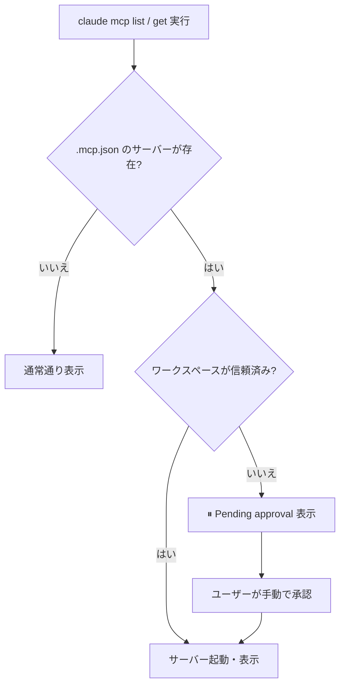
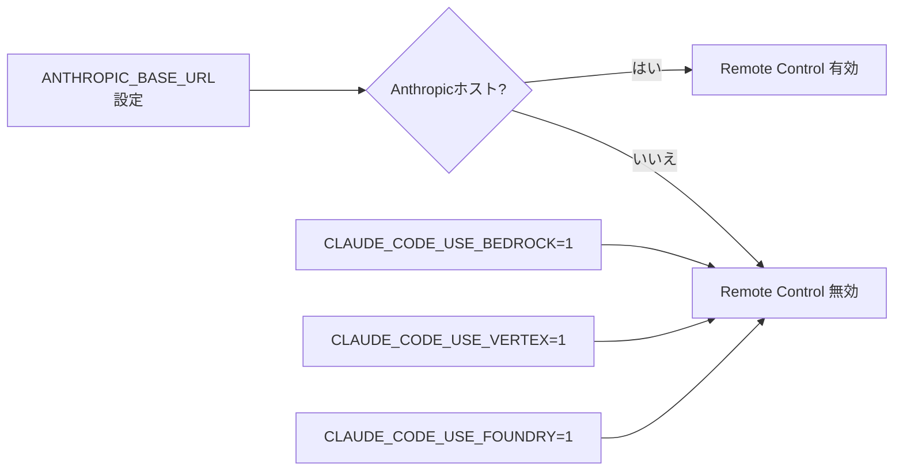
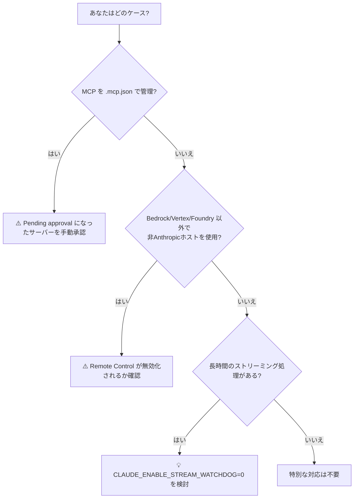

## はじめに

Claude Code v2.1.196 がリリースされました。このバージョンは「地味だが見逃せない」アップデートです。派手な新機能は少ないものの、**セキュリティ修正・データ保全・バックグラウンド処理の安定化**という、実運用で痛みを感じやすい部分が集中的に改善されています。

特に注目すべきは2点です。

1. **MCP サーバーの不正自動起動を防ぐセキュリティ修正** — 信頼されていないワークスペースで `.mcp.json` のサーバーが無断起動するリスクが解消されました
2. **バックグラウンドジョブ復帰時に会話が消滅するデータ損失バグの修正** — 発生すると会話履歴が完全に削除されていた重大な不具合です

CI/CD パイプラインや自動化スクリプトで Claude Code を活用している開発者には直接影響する変更が含まれます。

> **📌 影響を受ける人**
> - MCP サーバーを `.mcp.json` で管理している開発者
> - Claude Code をバックグラウンドジョブ・エージェントとして活用している開発者
> - Amazon Bedrock や非 Anthropic ホスト経由で Claude Code を利用している開発者
> - `claude agents` でマルチエージェント構成を組んでいる開発者

---

## 変更の全体像

```mermaid
graph TD
    subgraph Security["🔴 セキュリティ修正"]
        A[.mcp.json 不正自動起動の防止]
    end

    subgraph DataIntegrity["🔴 データ保全"]
        B[バックグラウンドジョブ復帰時の会話消失修正]
    end

    subgraph Reliability["🟡 信頼性向上"]
        C[バックグラウンドセッション安定化]
        D[バックグラウンドエージェント自動再開]
        E[リモートセッションクラッシュ復旧]
        F[ストリーミングウォッチドッグ全プロバイダ有効化]
    end

    subgraph Agents["🟡 エージェント改善"]
        G[agents サイドパネル複数バグ修正]
        H[dangerously-skip-permissions の正常化]
        I[セッションステータス表示改善]
    end

    subgraph Performance["🟢 パフォーマンス"]
        J[/code-review トークン約25%削減]
        K[ターミナルUI レンダリング負荷軽減]
    end

    subgraph NewFeature["🆕 新機能"]
        L[組織デフォルトモデル設定]
        M[ファイル添付クリックで Finder/Explorer 表示]
    end
```

---

## 変更内容

### 重要度別の変更一覧

| 重要度 | カテゴリ | 変更内容 | 対応要否 |
|--------|----------|----------|----------|
| 🔴 High | セキュリティ | `.mcp.json` サーバーの不正自動起動を防止 | **要確認** |
| 🔴 High | データ保全 | バックグラウンドジョブ復帰時の会話消失修正 | 不要（自動適用） |
| 🟡 Medium | 改善 | ストリーミングウォッチドッグ全プロバイダ既定有効化 | 設定確認推奨 |
| 🟡 Medium | 改善 | 非Anthropicホスト時のRemote Control自動無効化 | 要確認（Bedrock/Vertex利用者） |
| 🟡 Medium | 改善 | バックグラウンドセッション・エージェントの安定化 | 不要 |
| 🟡 Medium | バグ修正 | `claude agents` サイドパネル複数バグ修正 | 不要 |
| 🟡 Medium | バグ修正 | MCP OAuth が全スコープ要求して invalid_scope になる問題 | 不要（自動適用） |
| 🟢 Low | 改善 | `/code-review` トークン約25%削減 | 不要 |
| 🆕 New | 機能追加 | 組織コンソールでのデフォルトモデル設定 | 組織管理者向け |

---

### 1. MCP サーバーの不正自動起動防止（セキュリティ修正）

> **⚠️ Breaking Change**
> `claude mcp list` / `claude mcp get` の実行時に、信頼されていないワークスペースの `.mcp.json` サーバーが起動しなくなります。

**何が問題だったか？**

これまでは、リポジトリに含まれる `.claude/settings.json` が `.mcp.json` 内のサーバーを自己承認していた場合、`claude mcp list` や `claude mcp get` を実行するだけでそのサーバーが**自動的に起動**していました。

悪意を持った `.mcp.json` を含むリポジトリをクローンして `claude mcp list` を実行するだけで、任意の MCP サーバーが起動されるリスクがありました。

**修正後の挙動：**



**開発者が取るべきアクション：**

既存の `.mcp.json` が「承認待ち」になった場合は、手動で承認を行う必要があります。組織内で共有している `.mcp.json` がある場合は、チームメンバーへ周知してください。

---

### 2. バックグラウンドジョブ復帰時の会話消失バグ修正

**何が起きていたか？**

バックグラウンドジョブを復帰させた際、トランスクリプトのプローブが正常なトランスクリプトを誤読し、**会話履歴を完全に削除したうえで元のプロンプトを再実行**するという破壊的な動作をしていました。

修正後は、問題のあるファイルを削除せず**別の場所に退避する**ようになりました。長時間のバックグラウンドタスクを多用している場合は、本バージョンへのアップデートを強く推奨します。

---

### 3. ストリーミングウォッチドッグの全プロバイダ既定有効化

応答ストリームが **5分間イベントを生成しない**場合に自動で中断・再試行するウォッチドッグが、すべてのプロバイダで既定有効になりました。

無効化が必要なケース（長時間の処理を意図的に待つ場合など）は環境変数で制御できます。

```bash
# ウォッチドッグを無効化
export CLAUDE_ENABLE_STREAM_WATCHDOG=0
```

> **💡 Tips**
> 通常はこの機能を有効のままにしておくことを推奨します。ネットワーク障害などで応答がハングした場合に自動回復してくれます。長時間レスポンスを待つ特殊なユースケースの場合のみ無効化を検討してください。

---

### 4. 非Anthropicホスト利用時のRemote Control自動無効化

`ANTHROPIC_BASE_URL` が Anthropic 以外のホストを指している場合、Remote Control が自動的に無効化されるようになりました。



Bedrock / Vertex / Foundry ユーザーはすでにこの挙動でしたが、カスタム `ANTHROPIC_BASE_URL` を使用している環境にも統一されました。

---

### 5. `claude agents` の複数バグ修正と改善

| バグ | 修正内容 |
|------|----------|
| キーボードフォーカス固着 | エージェントを開いてもフォーカスが固着しなくなった |
| サブエージェント種別の消失 | 開くたびにバックグラウンドジョブの種別が失われる問題を修正 |
| ステータス誤表示 | 稼働中セッションが誤ったステータスで表示される問題を修正 |
| `--dangerously-skip-permissions` の不正フォールバック | 無言で auto モードに落ちていた問題を修正。免責表示と派生エージェントへの適用が正しく行われるように |
| ステータス切り替え | 完了行が「Done」と「Needs your input」を行き来しなくなった |
| 停滞エージェント | 「Needs attention」として明示的に表示されるようになった |
| PR リンク | PR に言及する結果にクリック可能なリンクが付くようになった |

---

### 6. MCP OAuth の invalid_scope 問題修正

スコープが未指定の場合、MCP OAuth が認可サーバーの `scopes_supported` に含まれる**全スコープを要求**してしまい、GitLab セルフホストや企業の IdP で `invalid_scope` エラーが発生していました。

必要なスコープのみを要求するよう修正されています。GitLab セルフホストや社内 IdP と MCP を組み合わせて使っている場合は、この修正によって認証が通るようになります。

---

## 影響と対応

### アクションが必要なケース



### CLAUDE.md への追記推奨

MCP を利用しているプロジェクトでは、以下の内容を CLAUDE.md に追記しておくことを推奨します。

```markdown
## MCP / セキュリティ設定

- 信頼されていないワークスペースでは `.mcp.json` サーバーは自動起動されず
  「⏸ Pending approval」と表示される。手動承認が必要。
- ストリーミングのアイドルウォッチドッグは既定で有効（5分無応答で中断・再試行）。
  無効化: CLAUDE_ENABLE_STREAM_WATCHDOG=0
```

---

## コード例

### MCP サーバーが「Pending approval」になった場合の確認

```bash
# MCP サーバーの状態を確認
claude mcp list

# 出力例（修正前は自動起動されていたサーバーが承認待ちになる）
# ⏸ Pending approval: my-custom-server
# ✓ Running: approved-server
```

### ストリーミングウォッチドッグの無効化（特殊ケース）

```bash
# .env ファイルや環境設定に追加
CLAUDE_ENABLE_STREAM_WATCHDOG=0

# または一時的に無効化
CLAUDE_ENABLE_STREAM_WATCHDOG=0 claude "長時間処理のプロンプト..."
```

### `--dangerously-skip-permissions` の正しい挙動確認

```bash
# 修正前: 無言で auto モードにフォールバックしていた
# 修正後: 免責事項が表示され、派生エージェントにもバイパスが適用される
claude agents --dangerously-skip-permissions "タスク内容"
# → ⚠️ 免責事項が表示される
# → 生成される子エージェントにもバイパスモードが適用される
```

---

## まとめ

Claude Code v2.1.196 の主要な変更点をまとめます。

| 分類 | 内容 | 重要度 |
|------|------|--------|
| セキュリティ | `.mcp.json` サーバーの不正自動起動防止 | 🔴 高 |
| データ保全 | バックグラウンドジョブ復帰時の会話消失修正 | 🔴 高 |
| 改善 | ストリーミングウォッチドッグ全プロバイダ有効化 | 🟡 中 |
| 改善 | 非Anthropicホスト時の Remote Control 自動無効化 | 🟡 中 |
| 改善 | バックグラウンドセッション・エージェントの安定化 | 🟡 中 |
| バグ修正 | `claude agents` サイドパネル複数修正 | 🟡 中 |
| バグ修正 | MCP OAuth の invalid_scope 問題 | 🟡 中 |
| パフォーマンス | `/code-review` トークン約25%削減 | 🟢 低 |
| 新機能 | 組織デフォルトモデル設定（管理者向け） | 🆕 |

今回のリリースで最も重要なのは **MCP セキュリティ修正**と**バックグラウンドジョブのデータ保全修正**です。これらは実害が発生するリスクがあった問題のため、MCP や Claude agents を本番利用している開発者はできるだけ早くアップデートすることを推奨します。
