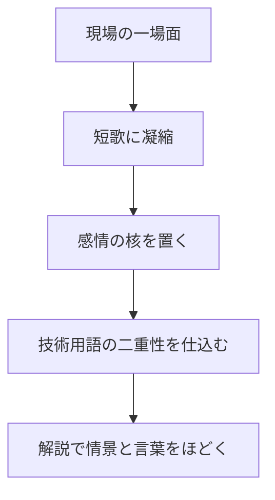

:::note info
この記事は生成AIで作成した記事の作成例です。Claude Code と llm-task-router（Claude・Codex を使い分けるルーター）で執筆しました。
:::

ビルド成功、差し込みの仕様変更、深夜のアラート、噛み合うリファクタ、レガシーとの再会――技術者の日常には、進捗や数値、議論だけではこぼれ落ちる感情があります。

本稿は、**技術エッセイ／創作** として読む記事です。コード例や実装手順は扱いません。  
短歌の専門知識は前提にせず、技術用語は現場を知る人にはそのまま通じ、知らない人にも情景が見えるように扱います。

ここでは、技術者の感情を「喜・怒・哀・楽・哀愁・希望」として六首に分け、**短歌**（5句・31音・57577）＋解説の形で並べます。  
「あるある」として読んでもらえたら、それで十分です。

## 導入：なぜ技術者の心情を短歌に詠むのか

開発や運用の現場では、成果はしばしば数値で語られます。  
完了率、応答時間、エラー率、チケット件数、リリース日程。どれも大切です。

ただ、それだけでは言い切れないものがあります。  
長く詰まっていた不具合が直ったときの、胸の奥がすっと軽くなる感じ。  
差し込み変更で積み上げたものが崩れたときの、声にしづらい熱。  
夜中にシステムを支え、朝には何事もなかったように日常へ戻る、その静かな空白。

短歌は、そうした感情を必要以上に煽らず、しかし薄めもせず、切り取るのに向いた形式です。**短い** からこそ、説明しすぎず、読む側の経験が入り込む余地が残ります。

技術用語も同じです。  
「ビルド」「アラート」「リファクタ」「レガシー」といった言葉は、現場では機能語ですが、少し角度を変えると、そのまま心の風景にもなります。ここでは、その二重性を大事にしながら読んでいきます。

本稿での音数は、短歌の読みを **かな** に直して数えます。拗音（きゃ・きゅ・きょ等）は小書きの「ゃ・ゅ・ょ」を単独で数えず、前の仮名と合わせて全体で1音として扱います。たとえば「きょう」は「きょ」＋「う」で2音です。長音「ー」・促音「っ」・撥音「ん」は、それぞれが1音を足すものとして数えます。本稿の各首の音数表も、この数え方で統一しています。技術用語や漢語が入るため、各首のあとに読みと音数を併記します。誤読しやすい漢語・外来語についても、必要な箇所では解説の中で数え方に触れます。

## 第1首：喜 ― ビルドが通る、長く粘ったバグが落ちる

### 短歌

夜更けまで  
噛みし不具合  
ほどけゆき  
ビルド通りて  
朝のしずけさ

### 音数

| 句 | 読み | 音数 |
| --- | --- | --- |
| 1 | よふけまで | 5 |
| 2 | かみしふぐあい | 7 |
| 3 | ほどけゆき | 5 |
| 4 | びるどとおりて | 7 |
| 5 | あさのしずけさ | 7 |

### 解説

長く格闘していた不具合がようやく解消し、ビルドも成功する。その瞬間の高揚と、その直後に訪れる **静かな安堵** を詠んだ一首です。

嬉しさの中心は、歓声というよりも、張っていたものがふっとほどける感じにあります。現場では「やった！」より先に、まず静かになることがよくあります。ずっと気になっていたノイズが消え、世界の抵抗がひとつ減る。そんな朝です。

第三句を「ほどけゆき」としたことで、バグの解消だけでなく、自分の内側のこわばりが解けていく感覚も重ねました。  
また、「通りて」はビルドが通ることと、自分自身もようやく先へ通ることの二重の意味を含ませています。

この首の第二句「噛みし不具合」は、噛みし＝**かみし**（3音）と、不具合＝**ふぐあい**（4音）に分けて数えると7音になります。「不具合」はかなに直すと検証しやすくなります。  
また、**ビルド** はソースコードをまとめて実行可能な形にしたり、各種チェックを通したりする工程で、**バグ** は不具合や想定外の動作のことです。

「落ちる」という語は現場では多義的です。**ビルドが落ちる** なら失敗、**バグが落ちる** なら取り除かれる、という具合に向きが変わります。ここではその多義性を避けるため、歌そのものでは「ほどけゆき」と言い換え、解説で二重性を補いました。

## 第2首：怒 ― 差し込みの仕様変更と静かな憤り

### 短歌

積みしもの  
ひとことにして  
差し戻り  
締切だけが  
こちら見る夜

### 音数

| 句 | 読み | 音数 |
| --- | --- | --- |
| 1 | つみしもの | 5 |
| 2 | ひとことにして | 7 |
| 3 | さしもどり | 5 |
| 4 | しめきりだけが | 7 |
| 5 | こちらみるよる | 7 |

### 解説

差し込みの仕様変更や、終盤での差し戻し。開発の現場では珍しくない出来事ですが、そのたびに、積み上げたものが一瞬でほどける感覚があります。この歌では、そのときの **静かな怒り** を、誰かを断罪しない形で置いています。

怒りは、必ずしも激しい言葉にはなりません。むしろ多くの場合、表には出さず、手を動かしながら内側で熱を持ちます。  
「ひとことにして」は、軽く発せられた一言が、実務の上では大きな影響を持つことへの重さです。

「締切だけがこちら見る夜」という結句には、責める相手の顔ではなく、ただ淡々と迫ってくる期限の圧があります。現場で心を削るのは、しばしば人そのものよりも、時間と手戻りの組み合わせです。

「差し戻り」は工程上の出来事であると同時に、気持ちまで後ろへ引き戻される感覚を含みます。  
「積みしもの」も、成果物と気力の両方を指しています。

:::note warn
仕様変更そのものは、プロダクトを良くするために必要な場合も多くあります。  
この歌は特定の立場や人物を責めるものではなく、手戻りが生む普遍的な摩耗を詠んでいます。
:::

文体は口語を基調にしつつ、一部で「積みし」のような文語を交えています。短歌では、この程度の古語が凝縮と余韻を作りやすいためです。

## 第3首：哀 ― 深夜アラート対応と運用の孤独

### 短歌

午前二時  
アラートひとつ  
鳴りひびき  
なおりしのちの  
世は常のまま

### 音数

| 句 | 読み | 音数 |
| --- | --- | --- |
| 1 | ごぜんにじ | 5 |
| 2 | あらーとひとつ | 7 |
| 3 | なりひびき | 5 |
| 4 | なおりしのちの | 7 |
| 5 | よはつねのまま | 7 |

### 解説

深夜のアラート対応には、独特の孤独があります。眠気の底から起き上がり、原因を探り、影響を見極め、復旧する。緊張は濃いのに、終われば朝はいつも通り始まっていく。この歌は、その **目立たなさゆえの哀しさ** を詠んでいます。

「アラートひとつ」は小さく見えて、実際には大きな呼びかけです。誰かの利用、誰かの仕事、誰かの日常が、その一音の向こう側にぶら下がっているかもしれません。

それでも、なおりしのちの世界は驚くほど平静です。  
「世は常のまま」は冷たさというより、**保たれた平常** の言い換えです。何事もなかったように朝が来ること自体が、運用の仕事が果たされた証でもあります。

ここには、支える仕事ほど目立ちにくいという哀しみと、だからこその矜持が同居しています。誰にも気づかれないまま、システムが止まらない状態を守る。その静けさが、この一首の芯です。

**アラート** は、システムに異常の兆候が出たときの通知です。運用では、夜中でも必要に応じて確認・調査・復旧を行います。

## 第4首：楽 ― きれいに書けたコードとフローの快さ

### 短歌

絡まりし  
依存ほどけば  
風とおる  
関数ならぶ  
午後のまどろみ

### 音数

| 句 | 読み | 音数 |
| --- | --- | --- |
| 1 | からまりし | 5 |
| 2 | いぞんほどけば | 7 |
| 3 | かぜとおる | 5 |
| 4 | かんすうならぶ | 7 |
| 5 | ごごのまどろみ | 7 |

### 解説

これは、何かを征服した喜びというより、書くこと自体が気持ちよくなっていく **没頭の楽しさ** を詠んだ歌です。リファクタが噛み合い、不要な複雑さがほどけ、流れがすっと通るとき、心拍まで整うような感覚があります。

「依存ほどけば風とおる」は、複雑に絡んでいた関係が整理され、見通しがよくなる状態を、部屋に風が通る感覚へ寄せた表現です。きれいなコードは単なる自己満足ではなく、読みやすさや整合性のある手触りとして感じられます。

「関数ならぶ」には、ただ並んでいるだけではなく、必要なものが必要な位置に収まっている安心があります。  
その結果として訪れるのが、「午後のまどろみ」という緩んだ快さです。興奮ではなく、呼吸の整った楽しさです。

リファクタの価値は、新機能のように目立たないことも多いですが、ノイズが消えていくこと自体が、書き手の心を静かに助けます。コードの流れが整うとき、頭の中の流れもまた整います。

この首では、第二句「依存ほどけば」を、依存＝**いぞん**（3音）＋ほどけば（4音）＝7音として数えています。  
また第四句の「**関数**」は「かんすう」と読み、**か・ん・す・う** の4音として数えます。漢語や技術用語が入る短歌では、読みを明記しておくと検証しやすくなります。

## 第5首：哀愁 ― レガシーコード、去った同僚、移ろう技術

### 短歌

古き名の  
名付けの癖に  
ひとを知り  
コメントのすみ  
春ののこり香

### 音数

| 句 | 読み | 音数 |
| --- | --- | --- |
| 1 | ふるきなの | 5 |
| 2 | なづけのくせに | 7 |
| 3 | ひとをしり | 5 |
| 4 | こめんとのすみ | 7 |
| 5 | はるののこりが | 7 |

### 解説

レガシーコードは、しばしば「古いもの」「直したいもの」として語られます。けれど実際には、そこには長く現場を支えてきた時間が層になって残っています。この歌は、その **記憶の器** としてのレガシーを詠んでいます。

「古き名の名付けの癖」は、変数名や命名規則、書き方の傾向に、その人らしさがにじむことを指しています。コードは無機質に見えて、意外なほど手つきが残ります。誰が書いたか、どんな時代だったか、どんな前提で作られていたか。そうした気配は、古いコードほど濃く残ることがあります。

「コメントのすみ」は、仕様説明よりもむしろ余白です。急ぎで残されたひとこと、少し古い表現、今では使わない言い回し。そこに去った同僚の気配や、その頃の空気が宿ります。

結句の「春ののこり香」は、過ぎ去った季節が完全には消えていない感覚です。  
技術は移ろい、人もまた異動し、退職し、現場を去ります。それでも残るものがある。その残り方を、否定ではなく哀愁として受け止めた一首です。

**レガシーコード** は、古くから動き続けている既存コードを指す言葉です。単に「古いから悪い」ではなく、長く使われている理由や背景を持つことも多くあります。

## 第6首：希望 ― 無常の中でも明日また書き続ける

### 短歌

更新は  
今日をほどいて  
また結ぶ  
古びるものへ  
明日も鍵盤

### 音数

| 句 | 読み | 音数 |
| --- | --- | --- |
| 1 | こうしんは | 5 |
| 2 | きょうをほどいて | 7 |
| 3 | またむすぶ | 5 |
| 4 | ふるびるものへ | 7 |
| 5 | あすもけんばん | 7 |

### 解説

技術は絶えず古びます。今日の最適解は、明日には更新対象かもしれません。だからこそ、この一首は大きな成功譚ではなく、不確かさを知った上でなお手を動かす **小さな希望** として結んでいます。

「更新は今日をほどいてまた結ぶ」は、デプロイや改善の営みを、破壊ではなく結び直しとして捉えた表現です。作ったものは固定されず、ほどかれ、組み直され、別の明日へ渡されていきます。

「古びるものへ明日も鍵盤」には、どうせ古びると知っているからこそ、なお触れ、直し、書き続ける意志があります。完成しきらない仕事だからこそ、続けること自体に意味が宿る。これは諦めではなく、無常を引き受けたうえでの肯定です。

あえて強い未来像を置かず、「明日も鍵盤」という具体で終えたのは、技術者の希望がしばしば壮大な宣言ではなく、明日もキーボードに向かうという日々の所作に宿るからです。体言止めにすることで、続いていく明日への余韻も残しました。

## 短歌と解説の書き方ルール

本稿の各組は、次のルールで統一しています。

| 項目 | ルール |
| --- | --- |
| 形式 | **短歌**（5句・31音・57577）＋解説 |
| 音数の数え方 | 読みを **かな** にし、拗音は前の仮名と合わせて1音、長音・促音・撥音はそれぞれ1音として数える |
| 解説内容 | **情景・心の動き・言葉の二重の意味** を含める |
| 技術用語 | 専門用語を叙情へ転じた箇所の **種明かし** を1〜2行入れる |
| 文体 | 口語を基調としつつ、必要に応じて **文語表現** を一部用いる |
| コード例 | **出さない**。技術用語の正確さのみ意識する |

流れとしては、次のような構成です。

この形式にすることで、読み手はまず感覚で受け取り、次に解説で「ああ、そういうことか」と戻れるようになります。技術と叙情のあいだに橋をかけるための、ささやかな作法です。

## 六首の音数一覧

本稿では、あえて破調（字余り・字足らず）を作らず、六首すべてを定型の 5/7/5/7/7 に収めました。技術用語や漢語を含みながらも定型で揃えること自体を、制作上のひとつの選択としています。  
以下は、その全首が定型どおりに収まっていることの一覧です。

| 首 | 1句 | 2句 | 3句 | 4句 | 5句 |
| --- | --- | --- | --- | --- | --- |
| 第1首 | 5 | 7 | 5 | 7 | 7 |
| 第2首 | 5 | 7 | 5 | 7 | 7 |
| 第3首 | 5 | 7 | 5 | 7 | 7 |
| 第4首 | 5 | 7 | 5 | 7 | 7 |
| 第5首 | 5 | 7 | 5 | 7 | 7 |
| 第6首 | 5 | 7 | 5 | 7 | 7 |

## まとめ：六首を貫く通奏低音

六首を貫いているのは、技術者の **静かな矜持** と、声高ではない哀歓です。

通ったビルド。  
飲み込んだ差し戻し。  
眠れなかった夜。  
きれいに流れた午後。  
懐かしいコメント。  
そして、明日また書くという小さな意思。

現場の感情は、仕様書にも障害報告書にも書かれません。けれど確かにそこにあって、三十一文字はそれを意外なほどまっすぐ掬い上げます。

あなたの現場にも、きっと一場面あるはずです。  
うまく詠めなくてもかまいません。  
言葉にすると、少しだけ救われることがあります。

## 生成AIで創作記事を作るときの工夫

この短歌集は、llm-task-router のパイプラインで制作しました。流れとしては、作成 → 底上げ → ファクトチェック → 編集レビュー → 公開前チェック → 書き出し、という順です。

創作記事を生成AIで作るときに、今回とくに効いたのは次の工夫でした。

- 先に感情カテゴリ（喜・怒・哀・楽・哀愁・希望）を決め、各首に役割を割り当てる
- 各首に技術現場の具体場面（ビルド・差し戻し・深夜アラート・リファクタ・レガシー・更新）を割り当てる
- 57577 の音数を表で機械的に検証し、字余りを是正する
- 技術用語は「機能としての意味」と「叙情の比喩」の両方を解説で種明かしする
- 最後に全体の読後感（暗くなりすぎないか・着地）を調整する

- 検証の過程では、拗音の扱い（小書きの「ゃ・ゅ・ょ」を独立音とみなすか）でモデルの自己申告が揺れた箇所があり、最終的には人手で数え直して是正しました。機械検証と相性の良い定型だからこそ、こうした揺れもログとして残す価値があります。
- また、「落ちる」のような多義語では文脈と逆の含意を取りかける場面があったため、歌では言い換え、解説で二重性を補いました。

こうした作り方は、短歌に限らず、ほかの技術系創作コンテンツにも応用しやすいと感じています。

## 参考

<!-- sources:begin -->
- [S001] 短歌（タンカ）とは？ 意味や使い方 - コトバンク（secondary, retrieved: 2026-06-29）
  https://kotobank.jp/word/%E7%9F%AD%E6%AD%8C-94882
- [S002] 短歌 - Wikipedia（secondary, retrieved: 2026-06-29）
  https://ja.wikipedia.org/wiki/%E7%9F%AD%E6%AD%8C
- [S003] ビルドとは - IT用語辞典 e-Words（secondary, retrieved: 2026-06-29）
  https://e-words.jp/w/%E3%83%93%E3%83%AB%E3%83%89.html
- [S004] ビルドとは？意味・用語説明｜IT用語集｜KDDI株式会社（secondary, retrieved: 2026-06-29）
  https://biz.kddi.com/content/glossary/b/build/
- [S005] アラートとは - IT用語辞典 e-Words（secondary, retrieved: 2026-06-29）
  https://e-words.jp/w/%E3%82%A2%E3%83%A9%E3%83%BC%E3%83%88.html
- [S006] アラートとは？意味・用語説明｜IT用語集｜KDDI株式会社（secondary, retrieved: 2026-06-29）
  https://biz.kddi.com/content/glossary/a/alert/
- [S007] レガシーコードとは？ 意味や使い方 - コトバンク（secondary, retrieved: 2026-06-29）
  https://kotobank.jp/word/%E3%83%AC%E3%82%AC%E3%82%B7%E3%83%BC%E3%82%B3%E3%83%BC%E3%81%A9-2133392
- [S008] 「レガシーコード改善ガイド」のススメ 第1回：レガシーコードの定義、テストの重要性とは（secondary, retrieved: 2026-06-29）
  https://codezine.jp/article/detail/4103
- [S009] モーラ - Wikipedia（secondary, retrieved: 2026-06-29）
  https://ja.wikipedia.org/wiki/%E3%83%A2%E3%83%BC%E3%83%A9
- [S010] 【短歌の文字数の数え方】簡単にわかりやすく解説!! 小さい文字(拗音)や伸ばし棒(長音)など（secondary, retrieved: 2026-06-29）
  https://tanka-textbook.com/how-to-count/
<!-- sources:end -->
