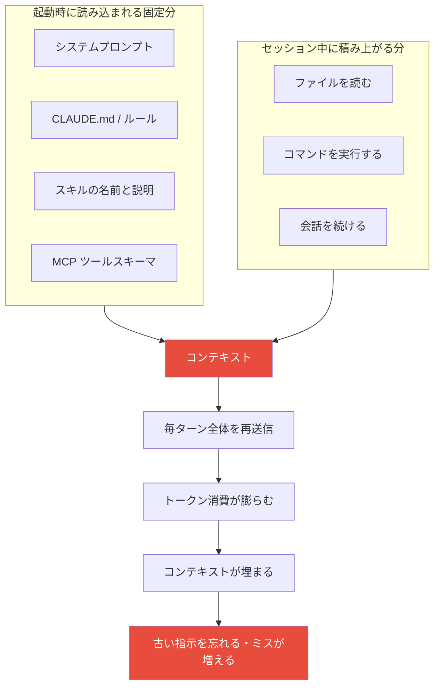

# はじめに

Claude Code を導入すると Web システム開発の速度は大きく上がりますが、何も対策をしないと長大なソースコードや会話履歴でトークン（およびコスト）が一瞬で枯渇します。

トークンを消費するのは、実は自分が打ち込むプロンプトそのものよりも、その裏で積み上がっていくコンテキストです。会話が長くなるほど品質も落ちていきます。コンテキストが埋まると Claude が最初の指示を忘れたり、以前はしなかったミスをし始めたりします。つまりトークン管理はコストの問題であると同時に、出力品質の問題でもあると思います。

この記事では、Claude Code のトークン消費を抑えながら開発効率を保つための運用術を、コンテキスト管理を軸に整理して紹介します。

https://code.claude.com/docs/en/best-practices

:::note
本記事の内容は 2026年7月時点のものです。Claude Code はコマンド・機能・仕様の変化が速いので、コマンド名や挙動は公式ドキュメントで最新の情報を確認してください。
:::

# 前提：トークンを消費するのはコンテキスト

Claude Code は、リクエストのたびに「そのセッションの全履歴」を毎回送信します。これまでに読んだファイル、実行したコマンドの出力、`CLAUDE.md` などがすべてコンテキストに積み上がり、毎ターン再課金されていきます。

そして、コンテキストが膨らむ要因は会話の長さだけではありません。セッションを開始した時点で、まだ一文字も打っていなくても、次のものがコンテキストに読み込まれます。

- システムプロンプト
- `CLAUDE.md`（グローバル・プロジェクト）
- ルールファイル（`.claude/rules/`）
- スキルの名前と説明
- 接続済み MCP サーバーのツールスキーマ

これらは起動時の固定オーバーヘッドで、その後のすべてのメッセージに乗り続けます。



コンテキストが埋まって品質が劣化していく現象は context rot と呼ばれます。1つのデバッグセッションやコードベースの探索だけで数万トークンを消費することも珍しくありません。だからこそ、起動時の固定分を軽くしつつ、セッション中に積み上がる分をいかに小さく保つかが運用の中心になります。

:::note
**プロンプトキャッシュの5分ルール**

Claude Code はプロンプトキャッシュをデフォルトで使っています。同じコンテキストを繰り返し送る場合、キャッシュ済みの部分は大幅に安く読み込まれます。ただしキャッシュはおよそ5分でexpireします。セッションを動かし続けている間はキャッシュが温かいままですが、5分以上放置するとキャッシュが切れ、次のリクエストはフルの料金で再処理されます。後述する `/compact` の使いどころにも関わってきます。
:::

以下、具体的な運用術を6つの切り口で見ていきます。

# 1. モデルと思考の深さを使い分ける

常に最上位モデルをフルパワーで動かすのは、トークンの無駄です。タスクの複雑さに応じてモデルと思考の深さを調整します。

## モデルの使い分け

出力トークンは入力トークンより割高で、モデル間でも単価が大きく違います。公式ドキュメントでは、おおまかに次のような使い分けが推奨されています。

| モデル | 位置づけ | 向いているタスク |
|---|---|---|
| Sonnet | デフォルト | 機能追加、テスト、既知のバグ修正、リファクタリングなど大半のコーディング |
| Opus | 深い推論用 | 難しいデバッグ、複数ファイルにまたがる大規模リファクタリング、アーキテクチャの判断 |
| Haiku | 最速・最安 | リネーム、ログ行の追加、簡単な調べ物、大量の機械的処理 |

Opus はデフォルトで使い続けるのではなく、必要なときに `/model` で切り替えて、終わったら Sonnet に戻すのが基本です。セッションの途中でモデルを変えても会話は失われません。

## Opus で計画、Sonnet で実装

計画そのものは数百トークンで済みますが、方向性を間違えたまま数百行の差分を生成し、それを破棄して作り直すと、その数千トークンを2回払うことになります。Opus の一番価値ある使い道は、この計画を書くフェーズだと思います。良い計画さえできれば、実装はほぼ機械的な作業なので、Sonnet が安く処理できます。

このパターンは `opusplan` エイリアスとして組み込まれています。プランモード中は Opus で推論し、実装フェーズでは自動的に Sonnet に切り替わります。モデルを切り替えても会話はクリアされないので、Sonnet は Opus が書いた内容をそのまま引き継げます。

```bash
/model opusplan
```

## 思考の深さ（拡張思考）を調整する

拡張思考はデフォルトで有効になっており、複雑な計画・推論では性能を大きく引き上げます。ただし思考トークンは出力トークンとして課金され、モデルによってはリクエストあたり数万トークンに達することもあります。

タイポ修正やリネームのような単純作業では深い推論は不要なので、`/effort` で思考レベルを下げたり、`/config` で思考をオフにしたりすることでトークンを節約できます。固定の思考バジェットを持つモデルでは、環境変数でバジェット自体を下げられます。

```bash
# 単純なタスク向けに思考バジェットを絞る例
export MAX_THINKING_TOKENS=10000
```

# 2. コンテキストを積極的に捨てる

会話が長くなると全履歴が毎ターン送信され、コストが跳ね上がります。不要になったコンテキストは早めに捨てます。

## タスクを切り替えたら `/clear`

1つのバグ修正や機能実装が終わったら、迷わず `/clear` でコンテキストをリセットします。判断の目安はシンプルで、「次のプロンプトを新品のターミナルに打ち込んでも意味が通じるなら、送る前に `/clear` する」です。`CLAUDE.md` やプロジェクトファイルは残り、会話履歴だけが消えます。

```bash
/clear
```

後から見返したいセッションは、`/clear` の前に `/rename` で名前を付けておき、`claude --resume` で選んで再開できます。

:::note
`/clear` は取り消せません。履歴からまだ必要なものがあるかもしれない場合は、先にコピーしておくか、後述の `/compact` を使ってください。
:::

## 修正ループは2回で諦めてリセット

Claude が間違った出力をして、それを直そうと指示し直す修正ループに入ると、失敗の履歴でコンテキストが汚染されます。同じ問題で2回以上修正しても直らないときは、一度 `/clear` して、学んだ前提を織り込んだクリーンなプロンプトで再スタートした方が安く済みます。汚れた長いセッションより、良いプロンプトで始めるきれいなセッションの方が、ほぼ確実に良い結果を出します。

## 文脈を残したいときは `/compact`

途中のエラーログや試行錯誤は消したいが、決定事項や作業の現状は維持したい場合は `/compact` を使います。会話が要約され、コンテキストに空きが生まれます。何を残すかを指示することもできます。

```bash
/compact Focus on the API changes
```

`/compact` の使いどころには、先に触れたキャッシュの5分ルールが効いてきます。セッションを動かしている最中（キャッシュが温かいうち）に `/compact` すれば、要約処理もキャッシュ割引が効きます。5分以上放置してキャッシュが切れた後だと、全コンテキストをフル料金で再処理することになるので、その場合は `/clear` で新しく始める方が安く済みます。

また、`/compact` は早めに呼ぶほど要約がきれいになります。Claude が忘れ始めたりコンテキスト警告が出たりしてからだと、すでにセッションが過積載で、要約の質も落ちます。セッションが「健康なうち」に圧縮すると、要点を保ったままノイズだけを落とせます。

## 何がコンテキストを消費しているか見る

削る前に、まず現状を把握します。`/usage` でセッションの消費状況、`/context` でコンテキストの内訳を確認できます（起動時の固定分の内訳は後述の「6.」で詳しく扱います）。

```bash
/usage
/context
```

# 3. リンターや CLI に事前委任する

Claude Code に「エラーの原因をイチから探させる」「ログを丸ごと読ませる」のは、トークンを最も浪費するパターンです。手元のツールで絞ってから渡します。

## Linter や検索を手元で実行して絞る

構文エラーやスタイル違反は、Claude に丸投げせず手元の Linter で検出し、エラー箇所の周辺だけを渡します。生ログや全テスト結果をそのまま渡さず、エラーとスタックトレースなど要点だけに絞ります。

```bash
# ESLint の出力を絞ってから渡す
npx eslint src/ --format compact 2>&1 | head -20

# テストログはエラー箇所だけ抽出
grep -A 5 "FAIL" test.log

# 検索は手元で実行して対象ファイルを特定してから指示する
rg "useState" --files-with-matches src/
```

「プロジェクト全体から探して」と頼むと全ファイルを走査されます。手元で対象を特定し、「この3つのファイルを確認して」と渡す方が、読み込むファイルが減ります。静的解析ツールで機械的に検出できる部分をツール側に寄せておくと、Claude に渡すコンテキストそのものが小さくなります。

## 外部サービスは CLI ツールを使わせる

外部サービスとやり取りする際は、CLI ツールが最も効率的です。GitHub を使うなら `gh` CLI を入れておくと、Claude が issue 作成・PR 作成・コメント取得に使えます。`gh` がないと GitHub API を叩こうとしますが、未認証リクエストはレートリミットに引っかかりがちです。

```bash
# 例：gh CLI を使わせる
gh pr create
```

:::note
MCP サーバーは便利ですが、ツール定義がコンテキストを圧迫することがあります。Claude Code では MCP のツール定義はデフォルトで遅延読み込みされ、Claude が特定のツールを実際に使うまではツール名だけがコンテキストに入ります。それでも使っていない MCP サーバーは、`/mcp` で定期的に見直して無効化しておくと無駄が減ります。
:::

# 4. サブエージェントに調査を委任する

大規模なコードベースの調査や外部ドキュメントの読み込みなど、多くのコンテキストを消費しそうな重いタスクは、サブエージェントに切り出します。サブエージェントは別のコンテキストウィンドウで動き、探索の詳細はそちらに閉じ込めたまま、要約だけをメインの会話に返します。

```text
認証システムがトークンリフレッシュをどう扱っているか、
再利用できる既存の OAuth ユーティリティがないか、
サブエージェントを使って調査して。
```

実装後のレビューにも使えます。新しいコンテキストのサブエージェントは、実装時の推論を引きずらずに差分だけを見るので、独立した視点でチェックできます。

```text
このコードのエッジケースをサブエージェントでレビューして。
```

:::note
サブエージェントは常に安いわけではありません。プロンプトやツール定義、追加のツール呼び出しのオーバーヘッドがあるため、単純なシェル操作や短い git 操作のような小さいタスクではかえって無駄になることがあります。「メインのコンテキストが散らかるのを防げる価値が、起動のオーバーヘッドを上回るとき」に使うのが実践的な判断です。
:::

# 5. プランモードとピンポイント指示で手戻りを防ぐ

最大のトークン浪費は、方向性を間違えたまま大量のコードを生成させ、後から全消しして作り直すことです。

## プランモードで先に方針を確認する

`Shift+Tab` を2回押してプランモードに入ると、Claude はファイルを読んで推論するだけで、コードは書き換えません。先に「どのファイルをどう変更するか」の計画を出させ、人間が確認してから実装に移ることで、手戻りをなくせます。計画の修正はほぼタダですが、途中まで実装したアプローチの修正には、それまでに積んだコンテキストのコストがかかります。

複数ファイルにまたがる変更や、慣れていないコードを触るときに特に有効です。逆に、タイポ修正やログ行の追加のように一文で差分を説明できる小さい変更なら、プランモードは省いて直接頼む方が速いです。

## ピンポイントで指示する（曖昧さを排除する）

範囲を限定した指示は、読み込むファイルを減らします。

```text
❌ 悪い例
ログイン画面をいい感じに修正して
```

これだと認証関連ファイル・ルーティング・スタイルをすべて読み込んで推測しようとし、トークンが膨らみます。

```text
✅ 良い例
src/auth.ts の login 関数に、メールアドレスの形式チェックの
バリデーションを追加して。関連ファイルは src/components/LoginForm.tsx です。
```

ファイルの中身を貼り付けるより、パスを伝えて Claude に必要な箇所だけ選んで読ませる方が節約できます。ログやスタックトレースは、貼る前に該当する20〜30行に絞ります。

## `/rewind` で失敗を巻き戻す

送ったプロンプトごとにチェックポイントが作られます。`Esc` を2回押すか `/rewind` で巻き戻しメニューを開き、会話・コード・その両方を以前の状態に戻せます。うまくいかなければ巻き戻して別のアプローチを試せるので、慎重に計画を練るより、まず試してダメなら戻す、という進め方もできます。

:::note
チェックポイントが追跡するのは Claude が加えた変更だけで、外部プロセスの変更は含みません。git の代わりにはならない点に注意してください。
:::

# 6. 起動時の固定オーバーヘッドを削る

前半で触れたとおり、`CLAUDE.md`・ルール・スキル・MCP スキーマはセッション開始時に読み込まれ、その後のすべてのメッセージに乗り続けます。会話の中身を削るのと同じくらい、この「毎回必ず乗る固定分」を軽くしておくことが効いてきます。

## CLAUDE.md は必要なものだけに保つ

`CLAUDE.md` が肥大化すると、毎回のプロンプトが重くなるだけでなく、重要なルールがノイズに埋もれて Claude が見落とす原因になります。公式ドキュメントでも、各行について「これを消したら Claude がミスをするか？」を自問し、そうでなければ削るよう推奨されています。

含めるべきもの、避けるべきものはおおむね次のように分けられます。

| ✅ 含める | ❌ 避ける |
|---|---|
| Claude が推測できないコマンド（ビルド・テスト） | コードを読めばわかること |
| デフォルトと異なるコードスタイル規約 | 言語標準の慣習 |
| テスト方法・使うテストランナー | 詳細な API ドキュメント（リンクで十分） |
| ブランチ命名や PR の作法 | 頻繁に変わる情報 |
| プロジェクト固有のアーキテクチャ判断 | 長い説明やチュートリアル |

## 長い手順はスキルに切り出す

タスク固有の手順（デプロイ手順など）は `CLAUDE.md` に全部書くのではなく、スキル（`.claude/skills/` 配下の `SKILL.md`）として切り出します。通常のセッションでは、起動時にスキルの名前と説明だけが読み込まれ、本文は Claude がそのスキルを実際に使うと判断したときに初めて読み込まれます（progressive disclosure）。これにより、深いワークフローを手元に置きつつ、使わない間はコンテキストを消費せずに済みます。

ただし、一度呼び出された `SKILL.md` の本文は、そのセッション中はずっとコンテキストに残ります。Claude Code は後続のターンでスキルファイルを読み直さないので、スキル本文は簡潔に保つのが基本です。本文の1行1行が、呼び出し後は繰り返しのトークンコストになります。

:::note
`CLAUDE.md` から手順を追い出しても、移した先が毎回読み込まれる場所だと意味がありません。スキルのように「必要なときだけ読み込まれる場所」に移すことで初めて起動時のコンテキストが軽くなります。
:::

## ルールはディレクトリにスコープする

`.claude/rules/` にルールファイルを置く場合、`paths:` frontmatter がないルールは、フロントエンドを触っていようがDBを触っていようが、起動時にすべて読み込まれます。この状態では肥大化した `CLAUDE.md` と同じで、常時コンテキストを圧迫します。

`paths:` を付けると、そのパターンに一致するファイルを Claude が初めて触れるまでルールが読み込まれなくなります。

```.claude/rules/api-rules.md
---
paths:
  - "src/api/**/*.ts"
---
# API レイヤーのルール
- エンドポイントは Zod スキーマで入力を検証する
- エラーは共有の ApiError クラスで返す
```

このルールはフロントエンドの作業中はコンテキストを消費せず、`src/api/` 配下のファイルを触ったときだけ読み込まれます。

## 使っていない MCP サーバーは無効化する

接続済みの MCP サーバーは、使う・使わないにかかわらず起動する際、ツールスキーマを読み込みます。複数サーバーを繋ぎっぱなしにすると、何も打たないうちからスキーマ分のコンテキストを消費します。`/mcp` で定期的に見直し、そのプロジェクトで使わないサーバーは無効化しておきます。

なお Claude Code では MCP のツール定義はデフォルトで遅延読み込みされ、Claude が特定のツールを実際に使うまではツール名だけがコンテキストへ入る挙動になっています。それでも接続数が増えるほど起動時の負担は積み上がるので、繋ぎっぱなしは避けるのが無難です。

## 現状を可視化する

何が起動時のコンテキストを食っているかは、コマンドで確認できます。

```bash
/context   # コンテキストウィンドウの内訳（要素ごとのトークン数）
/memory    # 読み込まれている CLAUDE.md・メモリファイル
/mcp       # 接続中の MCP サーバー
```

:::note
かつて使われていた `.claudeignore` は現在では非推奨です。AI に読ませたくないファイルの制御は、`.claude/settings.json` の `permissions.deny` を使うのが現在の方法です。こちらは Read ツールを許可レイヤーでブロックするため、確実に読み込みを防げます。
:::

# まとめ

この記事では、Claude Code のトークン消費を抑える運用術を、コンテキスト管理を軸に紹介しました。

トークンを消費するのはプロンプトそのものではなく、その裏で積み上がるコンテキストです。しかもコンテキストは会話履歴だけでなく、`CLAUDE.md`・ルール・スキル・MCP スキーマといった起動時の固定分でも膨らみます。モデルと思考の深さをタスクに応じて使い分け、`/clear` や `/compact` で不要なコンテキストを捨て、Linter や CLI で絞ってから渡し、重い調査はサブエージェントに委任し、プランモードとピンポイント指示で手戻りを防ぐ。そして毎回読み込まれる `CLAUDE.md`・ルール・スキル・MCP は必要なものだけに保つ。

いずれもコストの節約であると同時に、context rot を避けて出力品質を保つための工夫でもあります。まずは「1タスク終わったら `/clear`」と「起動時の固定分のダイエット」から始めてみるとよいと思います。

# 参考

- [Best practices for Claude Code](https://code.claude.com/docs/en/best-practices)
- [Manage costs effectively - Claude Code Docs](https://code.claude.com/docs/en/costs)
- [Models, usage, and limits in Claude Code](https://support.claude.com/en/articles/14552983-models-usage-and-limits-in-claude-code)
- [Extend Claude with skills - Claude Code Docs](https://code.claude.com/docs/en/skills)
