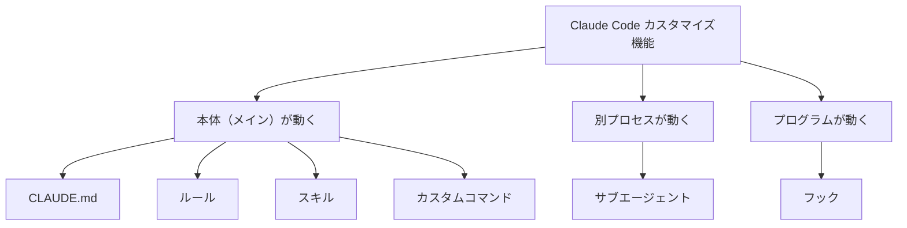
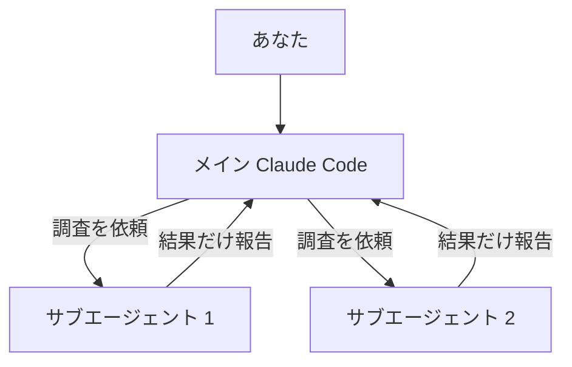
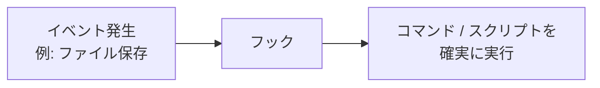
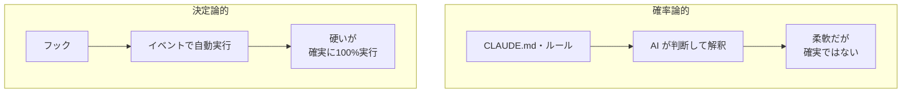

## はじめに

Claude Code には、`CLAUDE.md`・ルール・スキル・サブエージェント・カスタムコマンド・フックと、たくさんのカスタマイズ方法があります。

いざ使おうとすると「**結局どれを使えばいいの？**」と悩んでしまう方は多いのではないでしょうか。私自身も最初はこれらの使い分けにかなり混乱していました。

ただ、これらは **2つの軸** で整理すると、それぞれの違いと使いどころがスッキリ見えてきます。この記事では、その2軸を使って6つの機能の全体像をお伝えします。

### この記事でわかること

- 6つのカスタマイズ機能を整理する「2つの軸」
- 各機能の役割と使いどころ（会社の組織にたとえて解説）
- 「確率論的に動く機能」と「決定論的に動く機能」の違い

## 整理のための2つの軸

混乱の原因は、機能を「バラバラの点」として覚えようとすることにあります。次の2軸に沿って並べると、迷いにくくなります。

**軸1：いつ読み込まれるか（タイミング）**

- 起動時に常時読み込まれる
- 条件付きで（半自動的に）読み込まれる
- Claude が「必要」と判断したときだけ読み込まれる
- 手動で明示的に呼び出す
- イベント発生時に自動実行される

**軸2：誰が動くか（実行主体）**

- Claude Code 本体（メインプロセス）が動く
- 別プロセス（分身）が動く
- Claude Code とは別のプログラム／スクリプトが動く

「誰が動くか」で並べると、次の3グループに分かれます。



## 全体像：組織にたとえるとわかりやすい

これらの機能は、**会社の組織** にたとえるとイメージがつかみやすくなります。

| 機能 | 組織でのたとえ | いつ読み込まれるか | 誰が動くか |
|------|----------------|--------------------|------------|
| **CLAUDE.md** | 経営理念・就業規則 | 起動時に常時 | 本体（メイン） |
| **ルール** | 部署別マニュアル | 条件付き・半自動 | 本体（メイン） |
| **スキル** | 社内Wiki・ナレッジベース | Claude が必要と判断したとき | 本体（メイン） |
| **カスタムコマンド** | 定型業務のテンプレート | 手動で明示的に呼び出す | 本体（メイン） |
| **サブエージェント** | 専門チーム・外部コンサル | 仕事を任せたとき | 別プロセス（分身） |
| **フック** | 自動化システム | イベント発生時に自動 | プログラム／スクリプト |

ここからは、1つずつ詳しく見ていきましょう。

## 1. CLAUDE.md ― 経営理念・就業規則

Claude Code を学び始めて最初に触れる、最も馴染みの深い機能です。

`CLAUDE.md` は **起動時に自動で必ず読み込まれる** ファイルで、組織でいえば「経営理念・就業規則」にあたります。プロジェクト全体の共通ルールや規約、コーディング規約などを書いておく場所です。

```md
# コーディング規約
- インデントはスペース2つ
- コミットメッセージは Conventional Commits に従う
```

こうしておくと、プロジェクトの背景や約束事を毎回説明する手間が省け、Claude Code は常にそのルールを意識して作業してくれます。

:::note warn
**注意点：長くしすぎない**
`CLAUDE.md` は常に読み込まれるため、内容が長くなりすぎると **コンテキスト（＝Claude の頭）を圧迫** します。ルールが多いからといって何でも書けばいいわけではなく、「本当に常に意識してほしいこと」だけに絞りましょう。個別のルールは、この後の機能で必要なときだけ教えるのがコツです。
:::

## 2. ルール ― 部署別マニュアル

`CLAUDE.md` の肥大化問題を、比較的かんたんに解決してくれるのがルールファイルです。`.claude/rules` に置き、組織でいえば「その部署だけで必要なマニュアル」にあたります。

ポイントは **条件付き（半自動）で読み込まれる** こと。`path` フィールドでフォルダ名や拡張子を指定すると、そのファイルを読み込み・変更するときだけルールが読み込まれます。

- `src/api/` 配下を触ったときだけ → API 開発のルールを読み込む
- テストファイルを書くときだけ → テストに関するルールを読み込む

「本当に必要なときだけルールを教える」ことができるので、コンテキストの節約という観点でとても有効です。

## 3. スキル ― 社内Wiki・ナレッジベース

スキルはルールと少し違い、**Claude 自身が「必要だ」と自主的に判断したときだけ** 読み込むものです。組織でいえば「社内Wiki・ナレッジベース」にあたります。

読み込まれ方が特徴的です。普段は「どこに何が書いてあるか」という **目次（説明文）だけがメモリに常駐** していて、必要になったときに初めて中身の全体、あるいは段階的に必要な箇所だけを読み込みます。

そのため、スキルを数百個登録していても、常に読まれるのは目次と説明文だけ。コンテキストを圧迫しにくいのがメリットです。

:::note warn
**注意点：説明文が命**
読み込むかどうかは、目次・説明文をもとに Claude が自動判断します。そのため **説明文が曖昧だったり、目次として不適切だと、必要なときに読み込まれない** ことがあります。また、目次・説明文自体は起動時に読まれるので、これが長すぎると結局コンテキストを圧迫してしまう点にも注意しましょう。
:::

## 4. サブエージェント ― 専門チーム・外部コンサル

ここからは「ルール」ではなく、動くタイミングや役割の話になります。

サブエージェントは、メインの Claude Code とは **別に動く分身** のようなものです。普段直接話しかけている Claude Code を「メイン」とすると、複製された独立した Claude Code が分身として動くイメージ。組織でいえば「専門チーム・外部コンサル」の立ち位置です。

最大のポイントは、**メインのコンテキストとは完全に独立して作業する** こと。



たとえば「この機能の実装がどこかにあった気がする」というとき、「該当のソースコードを探しておいて」と分身に依頼し、**結果だけを報告** してもらえます。メインの会話が汚れずコンテキストを節約でき、さらに **複数を並列で同時実行** することも可能です。

100ファイル以上のコードベースを調査するときなど、大規模な調査ほど恩恵が大きくなります。私も大規模な調査や、似たコードを探すときはサブエージェントに任せることが多いです。

## 5. カスタムコマンド ― 定型業務のテンプレート

カスタムコマンドは、プロンプトを `/コマンド名` という形で呼び出せる機能です。組織でいえば「申請書・報告書のフォーマットを用意しておく」ような、定型業務のテンプレート化にあたります。

サブエージェントとの大きな違いは、**自動では呼ばれず、明示的に実行する** 点です。

```bash
# 例：変更内容からコミットメッセージを提案してもらうコマンド
/suggest-commit
```

ワンコマンドで複雑な指示を実行したいときに役立ちます。さらに、コマンドの中に **スキルやサブエージェントの名前・使いどころを書いておく** と、それらを明示的に呼び出せるので、少ない労力でスムーズに連携させられます。

## 6. フック ― 自動化システム

最後はフックです。少し難しい言い方をすると「**ライフサイクルイベントで自動的に実行されるコマンド**」です。自分で書いたスクリプトなども実行でき、汎用性の高い機能です。

組織でいえば「自動化システム」。たとえば **朝パソコンを起動したら（＝イベント）、出勤の打刻が自動で行われる（＝実行される処理）** ようなイメージです。



ここでのポイントは **決定論的** であること。設定した処理は **確実に100%実行され、AI の判断に依存しません**。

## 【重要】確率論的 vs 決定論的

フックを理解するうえで大事なのが、この違いです。

`CLAUDE.md` やルールに書いた指示は、Claude が AI として頭で判断し、学習結果から「確率的に正しそうなら実行する」という **確率論的** な動き方をします。「ちゃんと指示したのに実行してくれなかった」という経験がある方も多いはず。柔軟な反面、確実に実行される保証はありません。

一方フックは **決定論的** で、特定のイベントに基づいて確実にコマンドやスクリプトを実行します。柔軟性は低いものの、確実性を取るという特徴があります。



「柔軟さを取るか、確実さを取るか」で使い分けるとよいでしょう。

## まとめ

Claude Code の6つのカスタマイズ機能は、「**誰が動くか**」「**いつ読み込まれるか**」の2軸で整理すると迷いにくくなります。

**誰が動くか**

- 本体（メイン）が動く（4つ）… `CLAUDE.md` / ルール / スキル / カスタムコマンド
- 別プロセス（分身）が動く … サブエージェント
- プログラム／スクリプトが動く … フック

**いつ読み込まれるか**

- 常時 / 条件付きで半自動 / Claude の判断で必要なとき / 手動 / イベントで自動

最後に補足を1つ。スキルとサブエージェントは「Claude が必要と判断したとき・依頼されたとき」に動きますが、**プロンプトの中で「このスキルを使って」「このサブエージェントを使って」と明示的に指定すれば、ほぼ確実に呼び出せます**。少しややこしいポイントですが、覚えておくと連携がスムーズになります。

それぞれの役割を理解して、`CLAUDE.md` を肥大化させずに、賢くカスタマイズしていきましょう。

---
