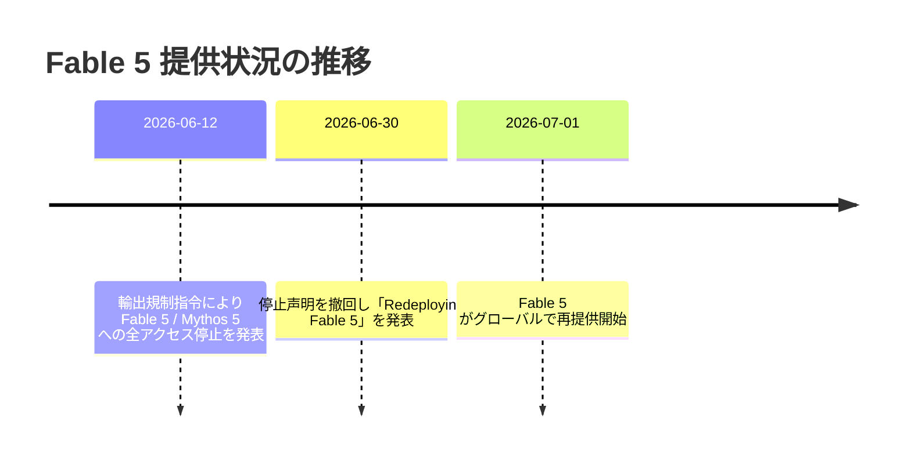
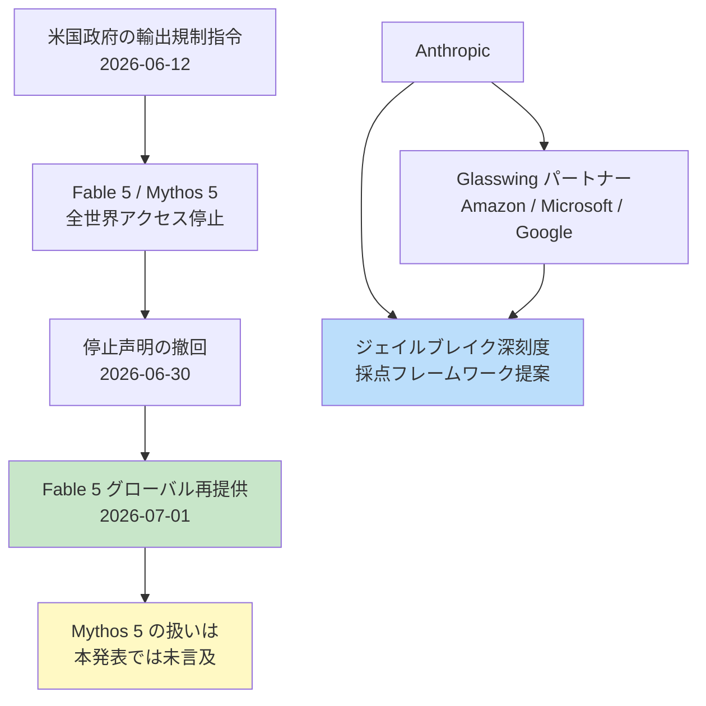
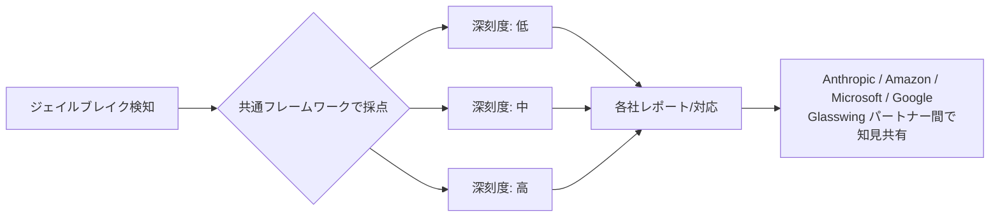

## はじめに

2026年7月1日、Anthropic は米国政府の輸出規制指令により一時停止していた **Fable 5** の全世界への再提供を発表しました。あわせて、Amazon・Microsoft・Google などの Glasswing パートナーと共同で、ジェイルブレイク(脱獄)の深刻度を評価するための**業界共通スコアリングフレームワーク**を提案することも明らかにしています。

> **📌 影響を受ける人**
> - Fable 5 / Mythos 5 を組み込んだプロダクトを運用している開発者
> - 輸出規制の影響でモデル切り替えや代替実装を余儀なくされたチーム
> - LLM の安全性評価・レッドチーミングに関わるセキュリティ担当者

停止からわずか3週間弱での撤回という異例の展開であり、モデルの可用性を前提に設計を組んでいるプロダクトには実務上のインパクトがあります。本記事では、今回の変更点を時系列で整理し、開発者が取るべき対応を解説します。

## 変更の全体像

今回の一連の出来事を時系列で見ると以下のようになります。



停止から再提供までの関係性を図示すると次のとおりです。



## 変更内容

### 1. Fable 5 のグローバル再提供(severity: high)

| 項目 | 内容 |
|---|---|
| 対象モデル | Fable 5(Mythos 5 は本発表では明記なし) |
| 停止開始 | 2026年6月12日(米国政府の輸出規制指令) |
| 撤回発表 | 2026年6月30日「Redeploying Fable 5」 |
| 再提供開始 | 2026年7月1日、全世界 |
| ニュース一覧の扱い | 従来の停止声明は削除済み |

停止の根拠となっていた輸出規制指令自体が撤回された形であり、Anthropic 側の技術的な問題ではなく規制対応によるものです。Mythos 5 については再提供に関する明示的な記載が今回の差分にはないため、引き続きステータス確認が必要です。

> **⚠️ Breaking Change ではないが要確認**
> 一時停止に備えて代替モデルへフォールバックする実装を入れていた場合、Fable 5 復旧後の切り戻し可否を確認してください。

### 2. ジェイルブレイク深刻度スコアリングの業界共通フレームワーク(severity: medium)

Fable 5 再提供の発表に合わせて、Anthropic は Amazon・Microsoft・Google をはじめとする Glasswing パートナーと共同で、ジェイルブレイクの深刻度を採点する業界横断フレームワークを提案しました。安全性評価を各社ばらばらの基準で行うのではなく、共通の物差しで評価しようという取り組みです。



現時点では提案段階であり、具体的な採点基準やAPIレベルでの反映内容はまだ公開されていません。今後の続報を待つ必要があります。

## 影響と対応

| 変更 | action_required | 開発者が取るべきアクション |
|---|:---:|---|
| Fable 5 再提供 | ✅ 必要 | モデル可用性チェックのロジック・CLAUDE.md 等のドキュメントを更新 |
| 脱獄採点フレームワーク | ー(不要) | 現時点では静観でよいが、安全性評価チームは動向を追跡 |

**具体的なチェックリスト:**

- [ ] Fable 5 を呼び出すコードに残っている「利用停止」対応のフォールバック処理を確認する
- [ ] モデル可用性を管理するドキュメント(CLAUDE.md など)の「利用可能なモデル」欄を更新する
- [ ] Mythos 5 の利用有無を確認し、再提供に関する続報がないか注視する
- [ ] レッドチーミング・安全性評価を行っているチームは Glasswing フレームワークの正式版公開をウォッチする

## コード例

モデル可用性チェックを実装している場合、停止期間中に追加した回避ロジックを元に戻す例です。

```diff
  const MODEL_STATUS = {
    "fable-5": {
-     available: false,
-     reason: "Suspended due to US export control directive (2026-06-12)",
-     fallback: "claude-sonnet-5",
+     available: true,
+     restoredAt: "2026-07-01",
    },
    "mythos-5": {
-     available: false,
-     reason: "Suspended due to US export control directive (2026-06-12)",
-     fallback: "claude-sonnet-5",
+     status: "unconfirmed", // 本発表では再提供の明記なし。要確認。
    },
  };
```

```diff
  # CLAUDE.md - 利用可能なモデル
- - Fable 5: 現在利用停止中(米国政府の輸出規制指令、2026-06-12〜)
- - Mythos 5: 現在利用停止中(米国政府の輸出規制指令、2026-06-12〜)
+ - Fable 5: 2026年7月1日よりグローバルで再提供開始
+ - Mythos 5: 再提供に関する明示的な発表なし(要確認)
```

## まとめ

- 輸出規制指令により停止していた **Fable 5** が撤回を経て **2026年7月1日にグローバル再提供**された
- **Mythos 5** については再提供の明記がなく、引き続きステータスの確認が必要
- Anthropic は Amazon・Microsoft・Google など Glasswing パートナーと共に、**ジェイルブレイク深刻度の業界共通スコアリングフレームワーク**を提案。安全性評価の標準化が今後進む可能性がある
- 開発者は、停止対応で入れたフォールバックロジックやドキュメントの更新を忘れずに行うこと

規制対応によるモデル可用性の変化は、機能追加とは違い見落としがちです。フォールバック実装やドキュメントを一度棚卸ししておくとよいでしょう。
