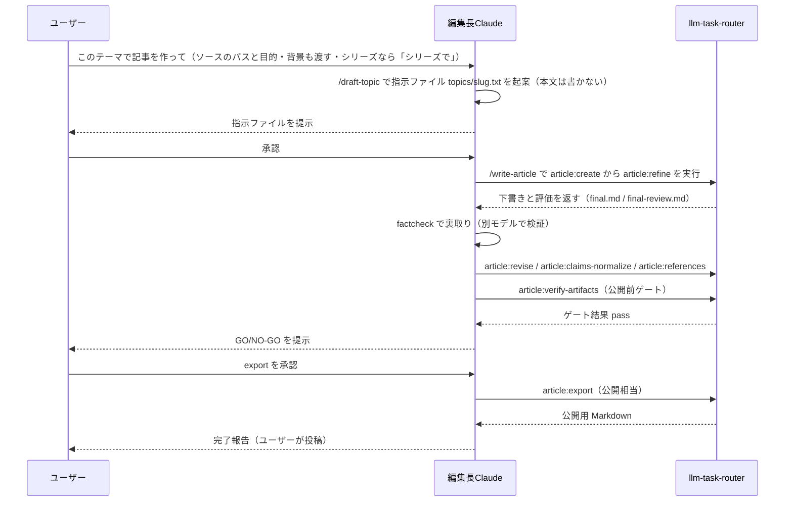
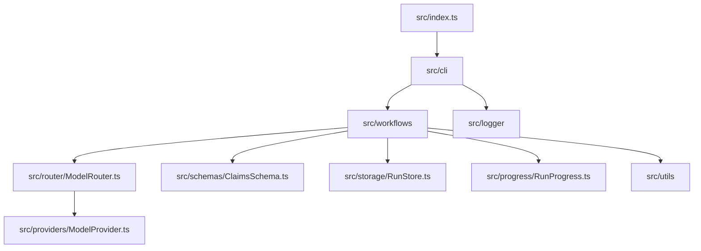
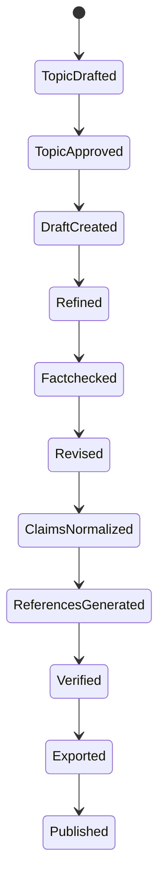

ソースコードの解説記事は、全文を貼って終わってしまったり、LLM にそれらしく書かせた結果として事実が崩れたりしがちです。

本稿は、**コード解説記事を作る方法論** を整理するものです。`@rex0220/llm-task-router` はその **題材兼ツール** であり、ここで挙げるコマンド名やファイル構成は実例として示します。読者は自分の解説対象に置き換えて使ってください。

本稿では `@rex0220/llm-task-router` を使い、次の4点を組み合わせて、壊れにくく裏取りしやすいコード解説記事を作る考え方を整理します。

- **HOW** を示す最小限のコード抜粋
- **WHY** を支えるコード外の根拠
- 全体像を示す地図と Mermaid 図
- factcheck・台帳・機械生成の工程

前提は、記事本文をその場で手書きするのではなく、CLI 工程に乗せて生成・修正するワークフローです。流れとしては、記事の骨格を作り、改善し、裏取りし、整形し、最後に公開用 Markdown へ出します。

記事生成の本体は、シェルで動く `llm-task-router article:...` の工程です。Claude Code 上のスラッシュコマンドは、その工程を編集長としての Claude が起動・進行する入口です。

本稿では、公開済みの実例シリーズ [「llm-task-router のソースを読む」第1回](https://qiita.com/rex0220/items/434341bda70a9b0ed1ea) で使った考え方を土台にしつつ、Qiita 向けの単発チュートリアルとして再利用しやすい作法に絞って説明します。

## この記事でわかること

- コード解説記事で、全文ではなく**抜粋**を使う理由（と HOW／WHY／推測の分け方）
- **スラッシュコマンド（入口）と CLI 工程（実体）の役割分担**
- ソース構成を**地図化**して単発／シリーズを判断する考え方
- **factcheck・claims・sources などの台帳を使って裏取りし、偽 URL を出さない流れ**

## 導入：何を作るチュートリアルか

このチュートリアルのゴールは、`llm-task-router` を使って、**壊れにくく・裏取りしやすいソースコード解説記事** を作ることです。

ポイントは、記事本文をその場で書き切ることではありません。むしろ逆で、次のような工程に分けて進めます。

- テーマを決める
- 指示ファイルを起案する
- 記事の骨格と本文を生成する
- 粗い説明を改善する
- 事実関係を裏取りする
- claims と sources を正規化する
- 参考章を機械生成する
- 公開用 Markdown に整える

つまり、記事を書くというより、**記事生成の工程を設計する** 発想です。

## 前提：最初に分けておくべき 2 つの実体

この記事で最も大事なのは、**スラッシュコマンド** と **シェル CLI** を混同しないことです。

### スラッシュコマンドは Claude Code 上の入口

次のコマンドは `.claude/commands/` に実在する、Claude Code 上のスラッシュコマンドです。

- `/draft-topic`
- `/write-article`
- `/review-editorial`
- `/update-article`

これらは **ユーザーがシェルに打つ実行コマンドではありません**。Claude Code 上で、編集長としての Claude を起動する入口です。

ユーザーはコマンドを打つ必要はありません。自然言語で Claude に指示すれば、編集長（Claude）がこれらのスラッシュコマンド／CLI を実行します（自分でシェルに `llm-task-router article:...` を打って手動運用することも可能で、その場合は人が工程管理を担います）。

たとえばユーザーの指示を受けて、編集長（Claude）が `/draft-topic <テーマ>` で `topics/<slug>.txt` の指示ファイルを起案します。この段階では、まだ本文は書きません。  
`/write-article` は、編集長が記事作成から仕上げまでの工程を駆動する入口です。

### `llm-task-router article:...` はシェルで動く実体

一方で、実際に記事生成を進める本体はシェル CLI です。

- `llm-task-router article:create`
- `llm-task-router article:refine`
- `llm-task-router article:revise`
- `llm-task-router article:claims-normalize`
- `llm-task-router article:references`
- `llm-task-router article:sources-check`
- `llm-task-router article:verify-artifacts`
- `llm-task-router article:export`

`/write-article` などのスラッシュコマンドは、編集長である Claude がこの CLI を内部で呼び、工程を順に回します。  
逆に言えば、これらの CLI は人がシェルから直接実行して手動運用することもできます。その場合の主体は Claude ではなく **人** です。

### 入口と実体の対応を表で確認する

左列が Claude Code 上の入口、右列が編集長の Claude が内部で回す実体です。これらは編集長（Claude）が実行します。ユーザーは指示と承認のみで、自分でコマンドを打つ必要はありません。

| 入口・承認操作 | 実体 |
|---|---|
| `/draft-topic <テーマ>` | `topics/<slug>.txt` の指示ファイルを起案（本文は書かない） |
| `/write-article` | `article:create` → `article:refine` →（factcheck/編集レビュー）→ `article:revise` → `article:claims-normalize` → `article:references` → `article:verify-artifacts` |
| `/review-editorial` | `article:review-editorial` |
| GO/export 承認（ユーザー操作） | `article:export`（公開相当・承認後に実行） |

この対応を最初に分けておくと、「何が入口で、何が実行本体か」を取り違えにくくなります。

### ユーザーの役割は「テーマを渡すこと」と「承認すること」

ここを短絡させて「ユーザーが `/write-article` と打つと記事が書ける」と理解すると、運用を誤ります。

正しくは次の分担です。

- **ユーザー**: テーマを渡す、工程の出口で承認する
- **編集長（Claude）**: スラッシュコマンドを受けて工程を進行する
- **CLI**: 実際の生成・整形・検査を実行する
- **factchecker**: 別担当として裏取りし、claims/sources の台帳を出す

記事本文は人がその場で手書きする前提ではなく、**LLM が CLI 工程で生成し、人が承認で制御する** 前提です。

## 作成フロー：だれが何を実行するかを実コマンドで整理する

ここからが実運用です。主体ごとに工程を分けると、流れは次のようになります。



図中の E（編集長 Claude）が編集者として工程を駆動し、U（ユーザー）は指示と承認だけを担います。slug は記事の識別子です。

工程を順に書くと、こうなります。

### 1. テーマ起案

- **ユーザー** は Claude に「このテーマで記事を作って」（シリーズにしたいなら「シリーズで」）と自然言語で伝える
- **編集長（Claude）** が `/draft-topic <テーマ>`（シリーズなら `--series <slug>`）で `topics/<slug>.txt` を起案する
- **ユーザー** が内容を承認する

ここでは本文ではなく、記事の指示ファイルを作ります。入口を軽く見ず、この段階で対象範囲と観点を固めるのが重要です。

依頼するときは、テーマだけでなく次の2つも一緒に渡すと精度が上がります。

- **解説対象のソースコードのパス**（リポジトリ・ディレクトリ・対象ファイル）。編集長（Claude）が実ソースを読んで忠実に書けるようになり、架空のパスや関数を捏造しにくくなります。
- **プログラムの目的・背景**（何のための実装か、設計の狙い、README/docs/関連リンク）。コードだけでは分からない WHY を正確に書けます。

ざっくり言えば、パスは「実ソース忠実」を、目的・背景は「WHY」を支える材料です。

### 2. 記事作成の起動

- **ユーザー** が起案内容を承認したら、**編集長（Claude）** が `/write-article` で作成工程を進める
- 編集長（Claude）が内部で CLI を回す
- 実体としては `llm-task-router article:create` → `llm-task-router article:refine`

`article:create` で初稿を作り、`article:refine` で説明の粗さや構成を底上げします。  
ユーザーがシェルに直接このコマンドを打ってもよいですが、その場合は人が工程管理を担います。

### 3. factcheck は必須工程

- **factchecker** が別担当として裏取りする
- claims/sources の生台帳を出す
- その結果を `llm-task-router article:revise` で本文へ反映する

ここを飛ばすと、「もっともらしいが違う」記事が残ります。コード記事では特に、パス名・関数名・挙動の説明が少しずれただけで全体の信用が落ちます。

### 4. claims の正規化

- `llm-task-router article:claims-normalize`

この工程で claims 台帳を正規化し、id 採番や blocking の解消を進めます。  
裏取り済みの主張を後続工程で機械的に扱いやすくするための整形です。

### 5. 参考章の機械生成

- `llm-task-router article:references`

ここで参考章を **sources.json から機械生成** します。  
ポイントは、**LLM に URL を自由記述させない** ことです。これにより偽 URL や本文との不整合を減らせます。

### 6. 公開前ゲート

- `llm-task-router article:verify-artifacts`

`verify-artifacts` は成果物どうしの整合ゲートです。  
「それっぽい記事」ではなく、「証跡と成果物が揃っている記事」に寄せるための工程です。

### 7. GO/export 承認と投稿

- **ユーザー** が GO/export を承認する
- `llm-task-router article:export`

front-matter 付きの公開用 Markdown を出し、**ユーザー** が投稿します。  
完全自動公開ではなく、最後は人が判断を持つのが実務的です。

## 要素1：ソースコードの提示 ― 全文でなく設計が分かる抜粋にする

コード解説記事でやりがちなのが、1ファイル全部を貼ることです。ですが読者が知りたいのは、全文そのものではなく、**設計の要点** です。

そこで、コードは次の方針で見せます。

- 1ファイル全部を貼らない
- その節で説明する関数・型・定数だけを抜粋する
- 省略は `// ...` で明示する
- 実コードを引用するなら実在パスを書く
- 実コードを固定参照するなら commit SHA の permalink を使う
- 実コードでない場合は、**説明用の模式コード** だと明記する

抜粋は、実行検証や網羅を目的にしません。**設計が分かる最小限** で十分です。

たとえば、ワークフロー層の説明では `src/workflows/createQiitaArticle.ts` のような実在ファイルを中心に、「どの工程をどう組み立てているか」が分かる断片だけを抜きます。  
このとき重要なのは、読者に「その抜粋から何が確実に言えるか」を限定して渡すことです。

- `article:create` を起点に下書きを作る
- その後に `article:refine` で底上げする
- 中間成果物を保存しながら後続工程へ渡す

この粒度なら、全文を貼らなくても設計の骨格が伝わります。

### 実コードと模式コードを混ぜない

架空のパスや関数名をそれらしく置くと、読者は簡単に誤認します。特にコード記事では、

- 存在しない `src/...` パス
- 実在しない関数名
- 実際の実装構造と違う型名

を「例」として出すだけでも、実在物のように見えてしまいます。

そのため、例示は次のどちらかに寄せるのが安全です。

1. **実在のファイル/関数だけを引用する**
2. **説明用の模式コード** と明示し、実在を匂わせる固有名を使わない

後者なら、たとえば次のように書けます。関数名はあえて実体と被らせていない模式コードです。

**説明用の模式コード**

```typescript
type WorkflowInput = {
  topicSlug: string;
  series?: { slug: string; order: number };
};

async function buildArtifact(input: WorkflowInput) {
  const draft = await buildDraft(input);
  const polished = await polishDraft(draft);
  return polished;
}
```

この例で伝えたいのは「入力を受けて create → refine の順で進む」という構造だけです。  
実在のパスや関数名に似せないことで、模式と実物の境界が明確になります。

### 抜粋だけで終わらせず、WHY を必ず補う

コードは **HOW** を示します。しかし、「なぜその形にしたのか」という **WHY** は、コードだけでは確定できないことが多いです。

たとえば `src/workflows/createQiitaArticle.ts` を見て工程の並びは読めても、

- なぜ create と refine を分けたのか
- なぜ claims 正規化を revise の後ろに置くのか
- なぜ参考章を LLM の自由記述ではなく機械生成に寄せるのか

までは、コード断片だけでは言い切れません。

そこで、WHY を補う根拠としてコード外の情報を当たります。

- `README`
- `docs`
- コード内コメント
- コミットメッセージ
- PR
- Issue
- コマンドの `--help`

コード解説記事で強いのは、**HOW** は抜粋、**WHY** は周辺資料で支える書き方です。これを逆にすると、雰囲気解説になります。

### HOW / WHY / 推測を分けて書く

読者が欲しいのは、事実と解釈の切り分けです。  
次のように段を分けると崩れにくくなります。

- **事実**: `src/workflows/createQiitaArticle.ts` は記事作成工程を組み立てる
- **事実**: `article:references` は sources から参考章を生成する
- **解釈**: URL を LLM に自由記述させない方針により、偽 URL を減らしやすい
- **保留**: 設計意図の明文化がない箇所は断定しない

つまり、コード解説記事の質は「どれだけ多く貼ったか」ではなく、**どの事実をどの根拠で言っているか** で決まります。

## 要素2：シリーズ化の判断 ― 単発で書くか、分割するか

解説対象が見えたら、次に考えるのは単発で書くか、シリーズに分けるかです。

判断軸は主に3つです。

| 判断軸 | 単発向き | シリーズ向き |
|---|---|---|
| 対象の大きさ | 1機能・1ワークフロー・1設計テーマ | システム全体・複数層 |
| 文字数 | 1記事に収まる | 長くなりすぎる |
| 前提知識 | 一度に説明できる | 段階的に積む必要がある |

`llm-task-router` のように、CLI 配線、ルーティング、プロバイダ抽象、スキーマ、進捗台帳、ワークフローが分かれている場合は、シリーズの方が向くことがあります。  
一方で、Qiita の単発記事なら「今回は `src/workflows` と記事生成工程だけを見る」のように、扱う層を絞ると読みやすくなります。

シリーズ運用をするなら、共有方針を最初に固定しておくとぶれにくいです。

- 文体
- 読者層
- 抜粋の粒度
- permalink の貼り方
- 推測の書き分け
- 章立ての型

ここは広げすぎず、「単発で収まるか、層が多いので分けるか」を先に決める、くらいで十分です。

## 要素3：ファイルと役割の一覧 ― 最初に地図を作る

解説を書く前にやるべきことの1つが、**対象ファイル/ディレクトリと責務の地図づくり** です。

この地図には次の価値があります。

- 今回どこまで扱うかの境界線になる
- シリーズでは各回の割り当て表になる
- 読者が現在地を見失いにくくなる
- 書き手が重複や抜けを防げる

これは `llm-task-router` の **実構成の一例** です。読者は自分の解説対象のディレクトリや責務に置き換えて、この形式の地図を作ると使いやすくなります。

| 層 | 役割 | 代表ファイル例 |
|---|---|---|
| `src/cli` | コマンド配線、引数から各処理を呼ぶ入口 | `src/cli/` |
| `src/router` | タスクに応じたモデル選択、フォールバック | `src/router/ModelRouter.ts` |
| `src/providers` | OpenAI / Anthropic などの抽象化 | `src/providers/ModelProvider.ts` |
| `src/schemas` | 構造化出力のスキーマ定義 | `src/schemas/ClaimsSchema.ts` |
| `src/storage` | run 台帳や成果物の保存 | `src/storage/RunStore.ts` |
| `src/progress` | 進捗台帳 `progress.events.jsonl` の管理 | `src/progress/RunProgress.ts` |
| `src/workflows` | 工程の組み立て、記事生成ワークフロー | `src/workflows/createQiitaArticle.ts` |
| `src/utils` | 共通ユーティリティ | `src/utils/` |
| `src/logger` | ロギング | `src/logger/` |
| `src/index.ts` | エントリポイント | `src/index.ts` |



この図が見せているのは、**層と依存の地図** です。`src/cli` が入口、`src/workflows` が工程の骨格で、その周辺に支援層が並ぶ構成だと読めます。

この地図を先に持っておくと、記事中で「今どの層を見ているのか」が明確になります。これもあくまで実例なので、自分の対象では同じ粒度で置き換えて使うのが基本です。

### 地図を作ると、抜粋する場所も決まる

地図がないまま書くと、読者にとって重要な層とそうでない層が混ざります。  
逆に地図があると、各節の役割が決めやすくなります。

- CLI の節: 何のコマンドが入口か
- workflows の節: 工程がどう組まれるか
- router/providers の節: どのモデルへどう流すか
- schemas の節: 何を構造化しているか
- storage/progress の節: どんな証跡が残るか

特に `src/workflows/createQiitaArticle.ts` のような工程組み立て層は、記事生成の全体像を説明する要です。  
一方で `src/router` や `src/providers` は、「どのモデルに寄せるか」「フォールバックをどう考えるか」という実運用の背景を補う層として効きます。

## 要素4：Mermaid 図の活用 ― コードの前に全体像を見せる

コード解説は、どうしても木を見せがちです。だからこそ、**図で森を先に見せる** のが有効です。

Qiita では ` ```mermaid ` のコードブロックで図を描けます。使い方は絞ってしまう方が実用的です。

| 図の種類 | 用途 |
|---|---|
| `flowchart` / `graph` | 構成・依存関係・工程の流れ |
| `stateDiagram` | 状態遷移を見せたいときだけ使う |

本稿のようなコード解説記事では、実際には `flowchart` が中心で十分です。  
コツは次の通りです。

- ノードを増やしすぎない
- 1図 1メッセージに絞る
- 図の直後に 1〜2 文の読み解きを添える
- 図だけで説明を済ませない

Mermaid は補助線であって、本文の代わりではありません。図があると、読者は抜粋コードを「何のために見るのか」を把握しやすくなります。

状態を持つ対象を説明するなら、たとえば次のような `stateDiagram` が有効です。



この図が見せているのは、**記事の成果物が工程上どの状態を通るか** です。起案から公開までの状態遷移を整理する用途に向いています。

## 品質の勘所：LLM に任せる所と機械で担保する所を分ける

`llm-task-router` を使っても、品質が自動で保証されるわけではありません。大事なのは、**LLM に任せる所** と **機械で担保する所** を分けることです。

まず避けたいアンチパターンは、全文コピペで誰も読まない記事にすることと、架空パスや実在しない関数名で信用を落とすことです。コード解説記事は情報量より、実在確認された要点の方が効きます。

また、公開前ゲートで `article:verify-artifacts` などの検査が落ちたときは、そのまま押し切らず、該当箇所を実ソースへ再アンカーし、必要なら factcheck と `article:revise` を回して潰すのが安全です。LLM の作文力より、差分を小さく戻して整合を回復する運用の方が壊れにくくなります。

:::note warn
`llm-task-router` は完全自動で正しい記事を保証する道具ではありません。工程・証跡・整合性を整え、人が最終判断しやすくする道具として使うのが現実的です。
:::

## まとめ：壊れにくいコード解説記事の作り方

壊れにくいコード解説記事の核は、次の4点です。

- **HOW** を示す抜粋
- **WHY** を支える根拠
- 全体の地図
- 裏取りされた事実

実務上の流れとしては、次が基本になります。

1. まず `src` 構成の地図を作る
2. 単発かシリーズかを決める
3. ユーザーがテーマを指示し、編集長の Claude が `/draft-topic` で指示ファイルを起案、ユーザーが承認する
4. ユーザーの承認を受けて、編集長の Claude が `/write-article` で工程を進める
5. 実体として `article:create` → `article:refine` → factcheck → `article:revise` を回す
6. `article:claims-normalize` と `article:references` で台帳と参考章を整える
7. `article:verify-artifacts` で公開前ゲートを通す
8. **ユーザー** が GO/export を承認する
9. `article:export`（公開相当）で公開用 Markdown を出し、ユーザーが投稿する

`llm-task-router` の価値は、記事本文を魔法のように正しく書くことではありません。  
**スラッシュコマンドという入口** と **`llm-task-router article:...` という実体** を分けたうえで、工程・証跡・機械生成を組み合わせ、品質を下支えすることにあります。

つまり、人・編集長の Claude・CLI・factchecker の分業を整理し、人が最終判断しやすい形を作る。それが、実務的で壊れにくいソースコード解説記事の作り方です。

## 参考

<!-- sources:begin -->
- [S007] llm-task-router package.json (@rex0220/llm-task-router)（primary, retrieved: 2026-06-30）
  https://github.com/rex0220/llm-task-router/blob/2b8656e94beab67014d986febb8a8dacda485163/package.json
- [S008] llm-task-router src/index.ts (CLI コマンド登録)（primary, retrieved: 2026-06-30）
  https://github.com/rex0220/llm-task-router/blob/2b8656e94beab67014d986febb8a8dacda485163/src/index.ts
- [S010] llm-task-router CLAUDE.md（運用規約）（primary, retrieved: 2026-06-30）
  https://github.com/rex0220/llm-task-router/blob/2b8656e94beab67014d986febb8a8dacda485163/CLAUDE.md
- [S011] src/workflows/createQiitaArticle.ts（primary, retrieved: 2026-06-30）
  https://github.com/rex0220/llm-task-router/blob/2b8656e94beab67014d986febb8a8dacda485163/src/workflows/createQiitaArticle.ts
- [S013] Claude Code スラッシュコマンド定義ディレクトリ（templates/.claude/commands/ → init で配置）（primary, retrieved: 2026-06-30）
  https://github.com/rex0220/llm-task-router/tree/2b8656e94beab67014d986febb8a8dacda485163/templates/.claude/commands
<!-- sources:end -->
