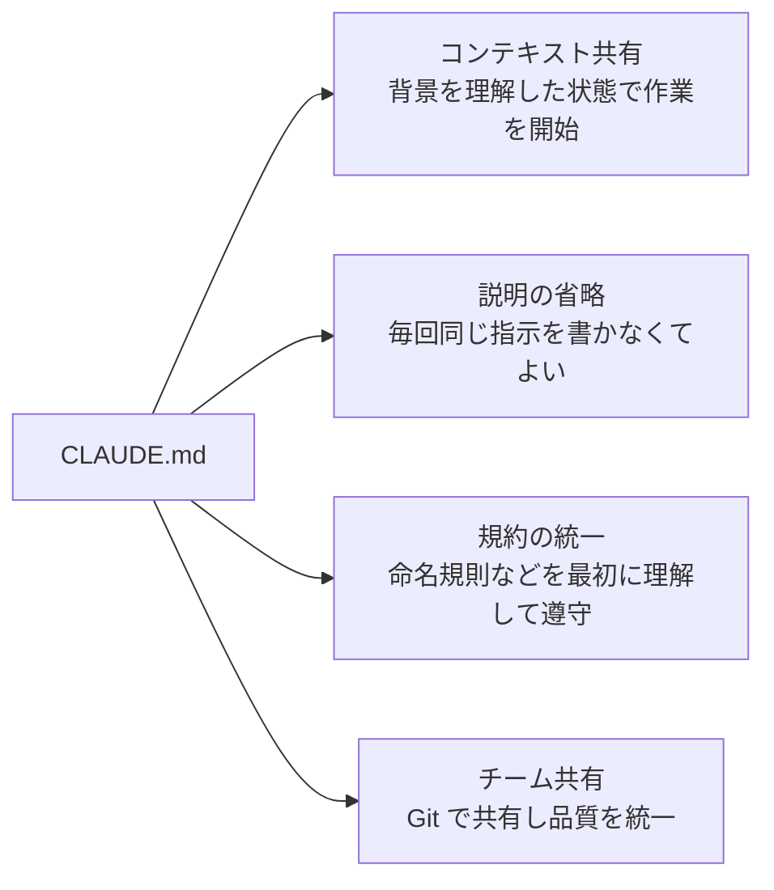
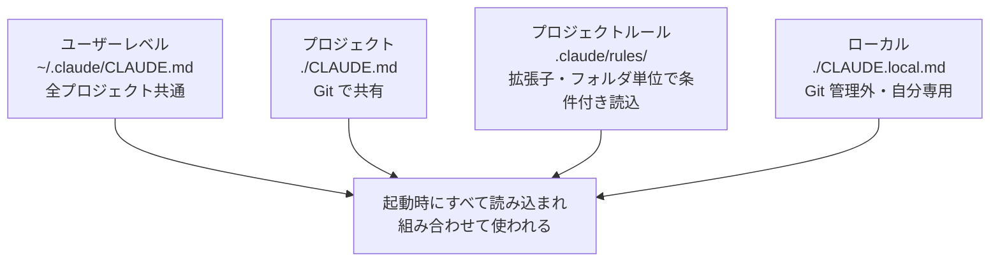
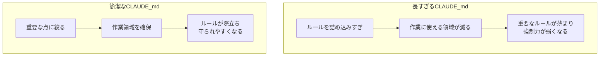
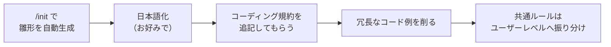

## はじめに

Claude Code を使い始めると、指示を出すたびに「コミットメッセージは日本語で」「インデントはスペース2つで」…と、**毎回同じ説明を書くストレス**に必ずぶつかります。

これを解決してくれるのが、すべての土台となる `CLAUDE.md` です。

この記事では、`CLAUDE.md` の **概念 → 配置場所 → 効果的な書き方 → 実践** までを1本にまとめました。基礎はもちろん、「書いたのに守ってくれない」を減らすための書き方のコツまで、通しで身につけられる構成になっています。

### この記事で分かること

- `CLAUDE.md` とは何か、4つのメリットと注意点
- どこに置くと何が起きるか（配置場所と役割）
- 「守ってもらえる」書き方のコツと推奨セクション構成
- `/init` から始める実践的な作り方

---

## 第1章：`CLAUDE.md` とは（基礎）

`CLAUDE.md` は、**プロジェクトのルールと知識を記述するファイル**です。

最大の特徴は、Claude Code が **起動時に自動で読み込む** こと。毎回説明したい内容を書いておけば、いちいちプロンプトに含める必要がなくなります。セッションごとに自動で読み込まれるので、覚えてほしい情報を **永続化（ずっと残す）** できるわけです。

配置はいろいろ可能ですが、基本は分かりやすく **プロジェクトルート（フォルダ直下）** に置くのがおすすめです。

:::note warn
**ファイル名は必ず大文字で `CLAUDE.md`**
小文字などだと Claude Code に正しく認識されません。ここは要注意ポイントです。
:::

### 4つのメリット



1. **コンテキストの共有**：プロジェクトの文脈（背景情報）を理解した状態で作業を始めてくれます。
2. **説明の省略**：毎回同じ説明が不要になり、開発がサクサク進みます。
3. **規約の統一**：`CLAUDE.md` の内容は必ず最初に理解されるので、命名規則やコーディング規約を守ってもらえます。
4. **チーム共有**：ただのファイルなので Git で共有でき、チーム全員が同じ基準で品質を担保できます。

### 注意点：100%は守られない

`CLAUDE.md` に書くのはあくまで「指示」であり、**必ずしもすべてに従うわけではありません**。書いたつもりでも Claude が忘れてしまうことは起こり得ます。特に、複雑すぎるルールや定義が曖昧な表現は意図通り解釈されません。

だからこそ「インデントはスペース2つ」のように、**具体的かつ簡潔に**書くことが大切です。人間にルールを教えるときと同じで、大量で曖昧なドキュメントは守られにくいのです。

---

## 第2章：配置場所と役割

`CLAUDE.md` 系のメモリは複数の場所に置けますが、**すべて読み込まれて組み合わせて使われる**のが大前提です。まずは以下の3つ（＋補助）を押さえれば十分です。



| 配置場所 | パス | 何を書くか | Git 共有 |
|----------|------|------------|:--------:|
| **プロジェクト** | `./CLAUDE.md` | 使用言語・フレームワーク・フォルダ構成・API仕様など、そのプロジェクト固有のルール | する |
| **ユーザーレベル** | `~/.claude/CLAUDE.md` | コミット規約・開発の流れ・品質基準など、プロジェクトに依存しない自分好みのルール | しない |
| **ローカル** | `./CLAUDE.local.md` | ローカルのサーバーURLや検証用アカウントなど、自分だけ・このPCだけの情報 | されない |

- **プロジェクト**：Git 管理前提。チーム全体で品質・ルールを統一したいときに使います。
- **ユーザーレベル**：そのPC内の全プロジェクト共通で読み込まれます。複数プロジェクトを開発する人ほど、共通の開発ルールをここに集約すると便利です。
- **ローカル**：自動で Git 管理対象から外れます。使用頻度は高くありませんが、チームに共有しない自分専用の情報を書けます。

:::note alert
**ローカルでもシークレットは書かない**
本番のDB・サーバー接続情報や、環境変数として扱う API キーなどの機密情報は、たとえローカルでもセキュリティの観点から書かないようにしましょう。
:::

### 重複を避けるのが最重要ポイント

プロジェクトとユーザーレベルは **どちらも読み込まれて組み合わされる** ため、**内容の重複をできるだけなくす**のが理想です。今回いちばん覚えてほしいのはこの一点です。

- プロジェクト側 … 固有の技術情報・フォルダ構成・API仕様
- ユーザー側 … コミットルール・開発方針・品質基準（※チーム共有したい品質基準はプロジェクト側へ）

### 補助テク：`@` で外部ドキュメントを読み込む

`CLAUDE.md` 本体をシンプルに保つコツとして、`@` 付きで他のドキュメントを参照させる方法があります。

```md
@docs/api-specification.md
@docs/coding-style.md
```

こうすると起動時に該当ドキュメントが常に読み込まれます。ただし読み込みすぎるとコンテキストを圧迫するので、量には注意しましょう。

### 読み込み状況の確認：`/memory` と `/context`

現在読み込まれているメモリファイルは `/memory`（分かりやすい）や `/context` で確認できます。`/context` では各ファイルが消費している **トークン量** も見えるので、メモリがセッションの使用量を圧迫しすぎていないかチェックする習慣をつけましょう。

---

## 第3章：効果的な書き方

`CLAUDE.md` は「何を書くか」だけでなく「**どう書くか**」が重要です。ここが甘いと「書いたのに動いてくれない」が起きます。

### 長く詳しく書けばいい、は誤解

`CLAUDE.md` は起動時に全文がコンテキスト（＝Claude の頭）に読み込まれます。長すぎると本来の作業領域を圧迫するうえ、**重要なルールが他の情報に埋もれて薄まり、強制力まで弱くなります**。



結論はシンプルで、**簡潔かつ具体的に**が正解です。

### 迷ったらこの推奨5セクション

何を書くか迷ったら、まずこの構成を土台にしましょう。

1. **概要** … プロジェクトの目的・主要機能
2. **技術スタック** … 言語・フレームワーク・ライブラリ（何に基づくかをメタ認知させる）
3. **ディレクトリ構造** … 主要フォルダの役割、どこに何を置くかのルール
4. **コーディング規約** … 命名規則・フォーマット
5. **開発ワークフロー** … コミット規約・テスト方針・エラーハンドリング

ソースコードを読めば Claude 自身もある程度把握できますが、AIは**渡された情報から絞り込んでいく**ため、先に全体像（概要・技術スタック）を示すと効率的に動いてくれます。

### 具体的・行動志向で書く

いちばんよくあるミスが「曖昧な指示」です。「きれいに書いて」「ちゃんとテストして」「適切にセキュリティ対応」は、人によって解釈が分かれてしまいます。

| 悪い例（曖昧） | 良い例（具体的・行動志向） |
|----------------|----------------------------|
| コードは綺麗に書く | 関数は1つの責務に限定する／変数はキャメルケース |
| テストはちゃんと書く | カバレッジ80%を維持し、エッジケースも考慮する |
| セキュリティはしっかり | 入力値は必ずバリデーションする |

「どうする」「何をすべき」という、**すぐ実践できる形**で書くのがコツです。ルールの言語化が難しければ、それ自体を Claude Code に任せてしまうのもおすすめです。

### 既知の用語を活用する

AIが既に学習している一般的な用語を使うと、短くても効果的に伝わります。

```md
- コミットは Conventional Commits に従う
- 設計は DDD（ドメイン駆動設計）を基本とする
- TDD（テスト駆動開発）で進める
```

### 禁止事項は「代替案」とセットで

禁止だけでなく「代わりに何をするか」を添えると、認識が強まり、禁止事項を避けやすくなります。

```md
- エラーを catch で握りつぶすのは禁止 → 必ずログを出力する
- any 型は禁止 → unknown + 型ガードで絞り込む
```

### 適切なサイズ感は「100〜200行」

油断するとすぐ肥大化します。最初は **100〜200行程度** を目安に、詳細な解説や実例は控えめにし、**簡潔な箇条書き**で収めましょう。「少し短いかな」くらいでちょうど良いです。足りなければ後から追記し、増えすぎたら別機能の「ルール（`.claude/rules`）」で分割する、という育て方がおすすめです。

---

## 第4章：実践 ― `/init` から作る

ここからは実際に `CLAUDE.md` を作る流れです。React + TypeScript の初期プロジェクトを例にします。



### 1. `/init` で雛形を生成

Claude Code 内で `/init` を実行すると、プロジェクトのコードを自動で読み取り、そこそこ整った `CLAUDE.md` を作ってくれます。手書きより圧倒的に楽なので、まずはこれを土台にしましょう（ファイル編集の許可を求められたら編集モードを有効化します）。

### 2. 日本語化するか英語のままか

生成物はたいてい英語です。日本語化するかは好みで決めてOKですが、**日本語は英語よりトークン消費が多い**という背景があります。トークンを節約したい人は英語のまま、構造を把握しやすくしたい人は日本語化、と使い分けましょう。日本語化したいときは「`CLAUDE.md` を日本語化してください」と伝えるだけです。

### 3. コーディング規約を追記してもらう

小さなプロジェクトなら `/init` の内容でも十分ですが、規約や開発ワークフローがあると指針が明確になります。ルールが未定なら Claude と相談して決めるのが楽です。

```text
このプロジェクトのコード品質を上げるためのコーディング規約を CLAUDE.md に追記してください。
```

プロジェクトを把握している Claude Code が、最適な規約を考えて統一的に書いてくれます。

### 4. 冗長なコード例は削る

追記時にコード例を大量に書かれることがありますが、これはコンテキストを圧迫します。第3章のとおり、**既存コードを読めば分かる内容は削る**のが正解です。

```text
コンテキスト節約の観点からコード例は削除してください。
```

こうすると「any を禁止して unknown + 型ガード」のように、開発者なら分かるレベルまで簡潔になります。

### 5. 共通ルールはユーザーレベルへ振り分ける

コミット規約やテスト方針は、どのプロジェクトでもほぼ共通です。プロジェクトの `CLAUDE.md` ではなく、**ユーザーレベルの `~/.claude/CLAUDE.md`** に書くと重複を避けられます（第2章の「重複を避ける」に直結します）。

---

## まとめ：`CLAUDE.md` チェックリスト

- [ ] ファイル名は大文字の **`CLAUDE.md`**、基本はプロジェクトルートに置く
- [ ] 起動時に全文が読み込まれる。だから**簡潔かつ具体的**に（目安100〜200行）
- [ ] 配置場所は「プロジェクト／ユーザー／ローカル」を使い分け、**内容の重複をなくす**
- [ ] 書き方は曖昧を避け、**行動志向**（どうする・何をすべき）で
- [ ] **禁止事項は代替案とセット**、既知の用語（Conventional Commits / DDD / TDD）を活用
- [ ] 迷ったら **概要・技術スタック・ディレクトリ構造・コーディング規約・開発ワークフロー** の5セクション
- [ ] まずは `/init` で雛形を作り、少しずつブラッシュアップ
- [ ] `/memory`・`/context` で読み込み状況とトークン消費を確認

`CLAUDE.md` は「プロジェクトの記憶」です。100%守られる魔法ではないからこそ、シンプルで明確なルールを心がけていきましょう。この記事が、既存ファイルを見直すきっかけになれば幸いです。

---
