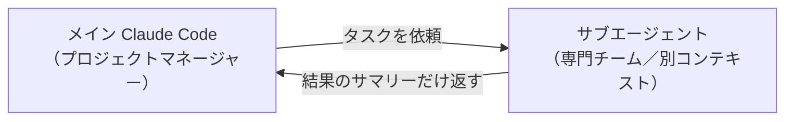
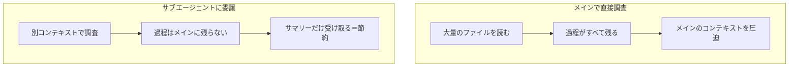
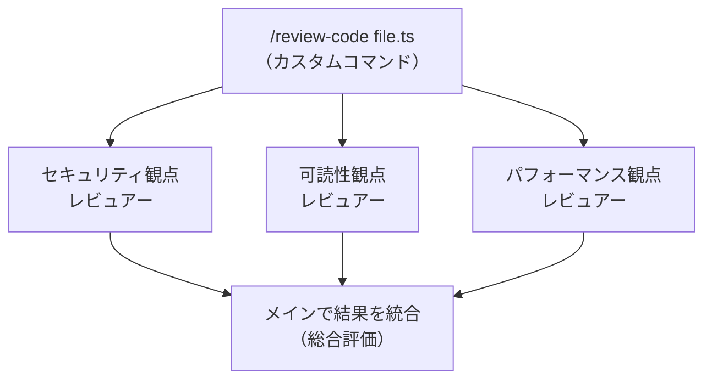
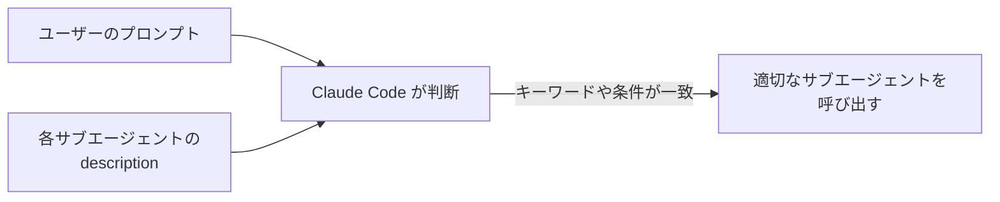

## はじめに

大規模なプロジェクトで Claude Code にファイル調査をさせると、片っ端からファイルを読み込み、気づけばコンテキストがパンパン。すぐにオートコンパクトが走って性能が落ちる…という経験はないでしょうか。

これを解決するのが**サブエージェント**です。一言でいえば、メインとは**別のコンテキストで動く Claude Code の分身**。仕事を任せると独立して作業し、最後に**結果のサマリーだけ**を返してくれます。

この記事では、サブエージェントの **概念 → 作り方 → 対話形式での作成 → 並列実行 → 発動しないときの対処** までを1本にまとめました。

> このシリーズでは `CLAUDE.md`・ルール・カスタムコマンドも解説しています。あわせて読むと Claude Code のカスタマイズ全体像がつかめます。

### この記事で分かること

- サブエージェントの概念と、なぜコンテキストを節約できるのか
- 定義ファイル（`.claude/agents/`）の書き方と主要フィールド
- `/agents` を使った対話形式での作成
- カスタムコマンドから複数サブエージェントを並列で呼び出す実践パターン
- サブエージェントが意図通り発動しないときの対処法

---

## 第1章：サブエージェントとは（概念）

### メインとは独立した「専門チーム」

普段直接話しかけている Claude Code を「メイン」とすると、サブエージェントは複製された独立した分身です。組織でいえば、メインが**プロジェクトマネージャー**、サブエージェントが**専門チーム**にあたります。



PM が「この調査をやっておいて」と専門チームに渡すと、チームは独立して作業します。その間 PM は監視する必要がなく、途中経過は**PM の頭の中から忘れられる**のがポイント。作業が終わると「ファイルはここにありました」「こういう内容でした」というサマリーだけが返ってきます（調査だけでなく、ファイルの編集・削除などの作業も可能です）。

### なぜコンテキストを節約できるのか

メインで直接調査すると、読み込んだファイル情報が**過程としてすべて残り**、調査後もコンテキストを圧迫し続けます。サブエージェントに任せれば、過程はメインに残らず、**サマリーだけ**が残ります。



### どんな場面で活躍するか

- **大規模なコードベースの調査**（大量のファイル読み込み）
- **複数ファイルへの並列編集**（例：テストカバレッジ向上。テストごとに独立していてコンフリクトしにくい）
- **たくさんのコードを読んでドキュメントを作る**作業

いずれも**大量の読み書きでコンテキストを圧迫しやすい**タスクで、独立コンテキストのサブエージェントが輝きます。

### 組み込みサブエージェント

自分で作るのが基本ですが、最初から用意されている組み込みサブエージェントもあります。よく登場するのは次の3つで、Claude がタスクに応じて**自動でルーティング**します（直接呼び出すことは稀）。

| サブエージェント | モデル | 役割 |
|------------------|--------|------|
| `general-purpose` | Sonnet | 汎用。複雑なタスクで自動的に呼ばれる |
| `Explore` | Haiku（軽量・高速）| 大量ファイルの調査。読み取り中心 |
| `Plan` | inherit（セッションのモデル）| プランモードで計画を立てる |

:::note info
組み込みの種類はバージョンによって増減します（`claude-code-guide` のように Claude Code 自体の使い方を調べてくれるものが用意されている時期もあります）。これらは意識せず自動で使われるので、頭の片隅に置いておく程度でOKです。
:::

### 注意点

1. **コンテキストは共有されない**：サブエージェントは、それまでのメインの会話を知りません。「初めて呼ばれた専門チーム」なので、依頼内容と背景を**明確に伝える**必要があります。
2. **書き込みの並列はコンフリクトに注意**：複数のサブエージェントが同じファイルを同時編集すると整合性が崩れます。慣れないうちは**読み取り専用**（読んで提案するだけ）から始めるのがおすすめです。
3. **トークンは別課金ではないが消費は増える**：サブエージェントは別課金ではなく、それぞれが独自のコンテキストを持つ分、**トークン消費は多くなりがち**です（重い使い方だと単一スレッドの数倍になることも）。コンテキストを節約する代わりにトークンを使う、というトレードオフを意識しましょう。

---

## 第2章：定義ファイルの作り方

### 配置場所

サブエージェントは Markdown ファイルで定義し、置き場所でスコープが決まります。

| 配置場所 | パス | スコープ |
|----------|------|----------|
| プロジェクト | `.claude/agents/<name>.md` | そのプロジェクトのみ（Git 共有可）|
| ユーザー | `~/.claude/agents/<name>.md` | 全プロジェクト共通 |

同名なら高優先度（プロジェクト）が勝ちます。`/agents` コマンドで一覧を確認できます。

### 構造：フロントマター + 本文（＝システムプロンプト）

カスタムコマンドと同じく、YAML フロントマターと本文で構成されます。**本文はサブエージェントのシステムプロンプト**になります。

```md
---
name: code-reviewer
description: コードの品質・セキュリティ・命名規則をレビューする専門エージェント。コードを変更した直後に使う。
tools: Read, Grep, Glob
model: sonnet
---

あなたはコードレビューの専門家です。対象ファイルを読み込み、命名規則・可読性・
セキュリティ・エラーハンドリングの観点でレビューしてください。
報告は「重要 / 警告 / 提案」の3段階でまとめてください。
```

### 主要フィールド

| フィールド | 役割 | 目安 |
|-----------|------|------|
| `name` | 識別子（英小文字とハイフン）。他と重複不可 | 必須 |
| `description` | いつ・何のために使うか。**自動呼び出しの判断に使われる最重要フィールド** | 必須 |
| `model` | `sonnet` / `haiku` / `opus` / `inherit` | 推奨 |
| `tools` | 使えるツールの**許可リスト**（省略時はメインのツールを継承）| 任意 |
| `disallowedTools` | 使わせないツールの**拒否リスト** | 任意 |
| `skills` | 起動時に読み込ませるスキル | 任意 |
| `hooks` | このサブエージェントに紐づくフック | 任意 |

### `description` が命

`description` はメインのコンテキストに常駐し、Claude が「このサブエージェントを呼ぶべきか」を判断する材料になります。曖昧だと呼ばれません。**いつ・何をするのか**を具体的に書きましょう。

- 弱い例：「コードを見るエージェント」（発動場面が不明確）
- 良い例：「PRの差分を読み、命名規則違反やセキュリティ問題を指摘する。コード変更後に使う」

### `model` の使い分け

- **調査中心** → `haiku`（高速・低コスト）
- **レビュー** → `sonnet`（バランス）。深く見たい・余裕があれば `opus`
- **普段から opus で動かしている** → `inherit`（呼び出し元のモデルを継承）

迷ったら「`haiku` かそれ以外か」くらいの粒度で始めれば十分です。

:::note info
`tools` を省略するとメインのツール（MCP 含む）を継承します。読み取り専用にしたいレビュー系では `tools: Read, Grep, Glob` のように**許可リストで絞る**と安全です。
:::

---

## 第3章：対話形式で作る（`/agents`）

YAML を直接書くほうがカスタマイズはしやすいですが、慣れないうちは対話形式が楽です。

1. `/agents` を実行し、「新規作成」を選ぶ
2. **プロジェクト**か**パーソナル**（ホーム）かを選ぶ
3. **Generate with Claude**（Claude に生成させる）か Manual（手動）を選ぶ → 対話生成がおすすめ
4. 「セキュリティの観点でレビューするサブエージェント」のように**ざっくり伝える**と、最適化された `description` と本文を Claude が生成
5. 使うツール（読み取り専用など）、モデル、表示カラーを選んで保存

この方法の利点は、**ベストプラクティスを知らなくても**、適切なタイミングで呼び出される `description`（発動条件や例つき）と、役割・出力フォーマットまで作り込まれた本文が自動で生成されることです。慣れてきたら、既存のサブエージェントを雛形にして Claude に別のものを作ってもらう、というやり方も効率的です。

---

## 第4章：応用 ― カスタムコマンドから並列呼び出し

サブエージェントは**複数を並列で同時実行**できます。実践でよく使うのが、カスタムコマンドから複数の観点のレビュアーを一斉に呼ぶパターンです。



カスタムコマンドの中に「以下3つの専門サブエージェントを**並列で起動**し、それぞれの観点でレビューを依頼する」と書いておくと、同時に走って結果がメインに集約されます。

:::note warn
**並列させるなら「独立・読み取り専用」で設計する**
各サブエージェントが独立した観点で、かつ**ファイルに書き込まない**なら同時実行しても安全です。しかし「レビューして修正まで行う」書き込み系を並列にすると、同じファイルを同時編集して整合性が崩れることがあります。実践では、**レビュー結果だけをメインに返し、修正はメインで行う2段階**がおすすめです。
:::

さらに応用として、統合役の「親サブエージェント」を作り、そこから子サブエージェントを入れ子で呼び出すこともできます（この規模ならカスタムコマンド内で十分まかなえますが、手法として知っておくと活用の幅が広がります）。

---

## 第5章：発動しないときの対処

自動で呼ぶかどうかは、ほぼ `description` に依存します。呼ばれないときは**`description` の改善**が基本です。4つの対策を押さえましょう。

| 対策 | 内容 | 例 |
|------|------|-----|
| 積極性を促すキーワード | `proactively` / `actively` / `MUST BE USED` を入れる | 「コード変更後に proactively 使用」 |
| 発動条件（いつ使うか） | どんな状況で使うかを明記 | 「テスト失敗時・コード変更時・PRレビュー時に使用」 |
| 具体的なキーワード | プロンプトに出そうな語を散りばめる | 「Jest」「React Testing Library」「ユニットテスト」「カバレッジ」 |
| 明示的に呼び出す | プロンプトに名前を含める（ほぼ確実）| 「code-reviewer サブエージェントでレビューして」 |



最後の「明示的に呼び出す」は、`description` に何が書いてあってもほぼ確実に発動する保険です。プロンプトに名前を含めるほか、`@agent-name` のメンションでも確実に委譲できます。**カスタムコマンドから並列でサブエージェントを呼ぶとき**など、確実に動かしたい場面でよく使います。

:::note info
すべてのサブエージェントに `proactively` を書くと、どれを優先すべきか分からなくなります。うまく発動しないものだけ、`description` を見直しつつキーワードを足すのがコツです。対話形式の生成（`/agents`）に任せて、良い `description` の書き方を学ぶのも有効です。
:::

---

## まとめ：サブエージェント チェックリスト

- [ ] サブエージェントは**別コンテキストで動く分身**。返ってくるのは**サマリーだけ**
- [ ] 大規模調査・並列編集・大量読み書きなど、**コンテキストを圧迫する作業**に向く
- [ ] 定義は `.claude/agents/`（プロジェクト）／`~/.claude/agents/`（ユーザー）に Markdown で
- [ ] フロントマターの**`description` が最重要**。`model` は用途で使い分け（調査=haiku など）
- [ ] 読み取り専用にするなら `tools` を許可リストで絞る（`disallowedTools` で拒否も可）
- [ ] 慣れないうちは `/agents` の対話生成が楽。書き込み並列はコンフリクトに注意
- [ ] 発動しないときは `description` を改善。確実に呼ぶなら名前指定／`@agent-name`
- [ ] 便利な一方、トークン消費は増えがち。節約とコストのトレードオフを意識

サブエージェントを使いこなすと、メインのコンテキストを汚さずに大規模な作業を任せられます。まずは読み取り専用のレビュー用エージェントから作ってみて、慣れてきたらカスタムコマンドとの並列実行に発展させてみてください。

---
