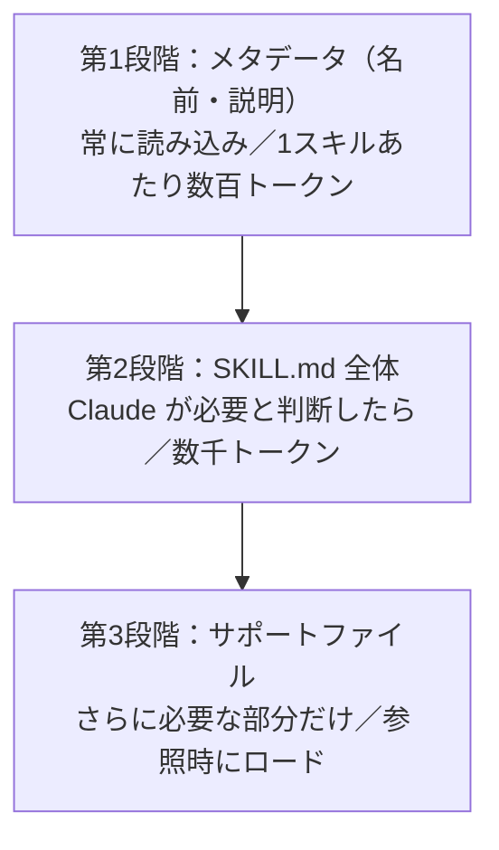
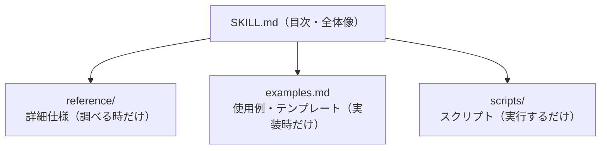
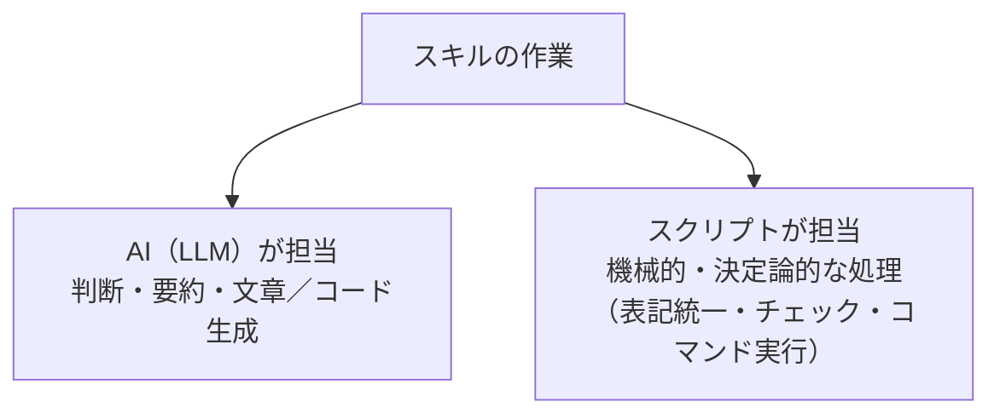
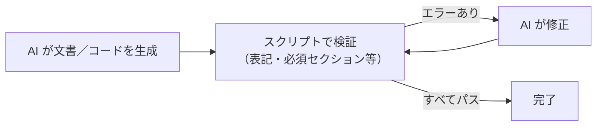

## はじめに

デザインルールを何度も説明する、似た開発で毎回同じプロンプトを与える…。こうした繰り返しの解決策として `CLAUDE.md` に知識を詰め込む手がありますが、書きすぎるとコンテキストがパンパンになります。ルール（`.claude/rules`）で動的に読み込んでも、条件に合えば必要のない場面でも読み込まれてしまいます。

そこで役立つのが**スキル**です。スキルは**Claude 自身が「この知識が必要だ」と判断したときにだけ読み込まれる**仕組みで、コンテキストを節約しながら必要な知識を必要な時にロードできます。

この記事では、スキルの **概念 → SKILL.md → 対話形式での作成 → サポートファイル → スクリプト連携** までを1本にまとめました。

> このシリーズでは `CLAUDE.md`・ルール・カスタムコマンド・サブエージェントも解説しています。あわせて読むと Claude Code のカスタマイズ全体像がつかめます。

### この記事で分かること

- スキルの概念と「段階的開示」の仕組み
- `SKILL.md` の基本構造と、発動を左右する `description` の書き方
- `skill-creator` を使った対話形式でのスキル作成
- サポートファイルで `SKILL.md` を軽量に保つ方法
- スクリプトを組み込んで AI と機械処理を役割分担する方法

---

## 第1章：スキルとは（概念）

### レシピ本のように「必要な時だけ開く」

スキルは料理のレシピ本のようなものです。普段は本棚に**背表紙（名前と説明）だけ**が見えていて、「今日はパスタを作ろう」と決めた瞬間に、そのレシピが書かれたページを開く。この「必要な時にだけ開く」がポイントです。

`CLAUDE.md` やルールが**指定した条件で必ず読み込む**のに対し、スキルは**Claude 自身が必要と判断したときに読み込む**という、判断のしかたが根本的に違います。だから極端な話、数百個のスキルを登録してもコンテキストの圧迫は控えめに済みます。

### 段階的開示（3段階）

スキルは**段階的開示**という方式で、必要な分だけ読み込まれます。



レシピ本でいえば、第1段階が背表紙、第2段階が「パスタの基本の茹で方」、第3段階が「カルボナーラ／アラビアータの作り方」といった個別ページです。

### CLAUDE.md・ルール・スキルの違い

| 手法 | 読み込みタイミング | トークン | 向いている内容 |
|------|--------------------|----------|----------------|
| **CLAUDE.md** | 常に読み込まれる | 常に消費 | 基本の開発ルール・コーディング規約 |
| **ルール（.claude/rules）** | 拡張子・フォルダ単位で条件付き（半自動）| 条件一致時のみ | 状況別のルール |
| **スキル** | Claude が必要と判断したときだけ | 必要時のみ（段階的）| 特定作業の専門知識（デザイン・分析など）|

使い分けとしては、`CLAUDE.md` には本当に基本的なルールだけを書き、特定の作業でだけ必要な専門知識はスキルにまとめる、という役割分担がきれいです。「フロントエンド用スキル」「バックエンド用スキル」と分けるだけでも効果があります。

### プラグインで他人のスキルを借りる

自作が基本ですが、**プラグイン**という仕組みで、他の人（や Anthropic 公式）が作ったスキルをインストールして借りられます。配布場所を**マーケットプレイス**と呼び、「マーケットプレイスを登録 → プラグインをインストール」という流れです。

有名なのが公式の **frontend-design** スキル。よくある“AIっぽい”デザイン（妙に紫がかる・過剰なグラデーション・絵文字多用）ではなく、デザイナーが作ったような整った見た目にしてくれると評判で、これを入れるだけでAIっぽさがかなり抜けます。

---

## 第2章：SKILL.md の基本構造

### 配置場所

スキルは1つにつき1フォルダを用意し、その直下に **`SKILL.md`（必須）** を置きます。

| 配置場所 | パス | スコープ |
|----------|------|----------|
| プロジェクト | `.claude/skills/<スキル名>/SKILL.md` | そのプロジェクトのみ（Git 共有可）|
| ユーザー | `~/.claude/skills/<スキル名>/SKILL.md` | 全プロジェクト共通（自分専用）|

### 必須フィールドは name と description

`SKILL.md` は YAML フロントマターと本文で構成されます。**本文には読み込まれた後に使ってほしい知識・指示**を書きます。

```md
---
name: material-design
description: Google マテリアルデザインに準拠した UI を作成するためのスキル。カラーシステム・コンポーネント・レイアウトを扱う。UI やコンポーネントをデザインするときに使う。
---

# マテリアルデザイン UI

## 基本ルール
- 角丸を基調とし、余白は8dpグリッドに沿わせる
...
```

- **`name`**：小文字・ハイフン・数字のみ。
- **`description`**：**いつ使うか・何ができるか**を書く。ここを基に Claude が読み込むかどうかを判断する、最重要フィールドです。

### `description` が発動の決め手

`description` が曖昧だと必要性を判断できず、適切な場面で発動しません。「作ったのに発動しない」の大半はここが原因です。

- 悪い例：「ファイルを処理する」（曖昧すぎる）
- 良い例：「Excel ファイルの分析とグラフ作成を行う。スプレッドシートやピボットテーブルを処理するときに使う」

**何をするか＋いつ使うか＋具体的なキーワード**を入れるほど発動しやすくなります（このあたりはサブエージェントの `description` と同じ考え方です）。

:::note info
`description` は常にコンテキストに載るため、長すぎても効率が悪くなります。要点（主なユースケース）を先頭に書くのがコツです。また、ファイルのパターンで自動発動させたい場合は `paths`（グロブパターン）フィールドも使えます。
:::

---

## 第3章：対話形式で作る（skill-creator）

最初から `description` を含めてうまく書くのは難しいものです。そこで便利なのが公式プラグインの **`skill-creator`**、いわば「スキルを作るためのスキル」です。これを使うと、書き方を知らなくても発動しやすいスキルを作れます。

導入は「マーケットプレイス登録 → プラグインインストール」です。

```text
/plugin marketplace add anthropics/claude-plugins-official
/plugin install skill-creator@claude-plugins-official
```

:::note warn
マーケットプレイス名・プラグイン名は**アップデートで変わることがあります**。うまくいかないときは、配布元 GitHub の README か `/plugin` メニュー、あるいは「skill-creator install Claude Code」で検索して最新のコマンドを確認してください。
:::

導入後は、スキル名（や含まれるプラグイン名）をプロンプトに含めて依頼します。

```text
skill-creator を使って、Google マテリアルデザインに準拠した UI を作成するための
スキルをこのプロジェクトの .claude/skills/ に作成してください。
```

対話の中で「カバーしたい機能（カラーシステム・コンポーネント・レイアウトなど）」を聞かれ、それに沿って `SKILL.md` とサポートファイルが生成されます。

### 確実に発動させる2つのコツ

デモでもそのまま作業が始まってスキルが発動しないことがあります。そんなときは次の2つが有効です。

1. **スキル名を明示的に含める**：「このスキル（〇〇）を使って作成してください」。ほぼ確実に発動します。
2. **`CLAUDE.md` に使えるスキルを書いておく**：スキルの存在を常に認識させ、積極的に使わせる方法。よく使う手です。

理想は `description` だけで自動発動することですが、確実に呼びたい場面ではこれらを併用しましょう。

---

## 第4章：サポートファイルで SKILL.md を軽量に保つ

`SKILL.md` が大きくなると、要らない知識まで常に読み込まれてしまいます。それを防ぐのが**サポートファイル**です。

### SKILL.md は「目次」、詳細は必要な時だけ

レシピ本で必要なページだけ開くように、`SKILL.md` で全体像（目次）を把握し、詳細は参照時だけ読み込みます。



フォルダ構成の例:

```text
.claude/skills/
└── material-design/
    ├── SKILL.md          # 必須：概要＋目次（背表紙の役割）
    ├── reference/        # 詳細仕様（必要な時だけ）
    │   ├── colors.md
    │   └── components.md
    ├── examples.md       # 使用例・テンプレート
    └── scripts/
        └── check.py      # スクリプト（実行される）
```

こうしておくと、ページ全体を設計するときはレイアウトの資料、コンポーネントだけ作るときはコンポーネントの資料、というように**必要な知識だけ**が段階的に読み込まれます。

### 分割のコツと注意点

- **必ず `SKILL.md` から参照させる**：Markdown リンク（`[colors](reference/colors.md)`）でも `@` 付きでも動きます。参照しないと、どこに何があるか分からず読み込まれません。
- **階層は基本1階層まで**：`reference/` の下でさらにフロント／バックと深く分けると複雑化します。
- **深く分かれるならスキル分割のサイン**：資料が大量・深くなったら、1つのスキルの責務が大きすぎる合図。内容ごとに別スキルへ分けたほうが管理もコンテキスト効率も良くなります。
- `SKILL.md` 自体は簡潔に（目安として数百行以内）保ちましょう。

`reference`（詳細仕様・オプション・設定・トラブル対処）と `examples`（サンプルコード・テンプレート）という分け方が定番ですが、名前は自由です（`SKILL.md` から参照させることだけが必須）。

---

## 第5章：スクリプト連携（AI × スクリプト）

スキルには**スクリプト**（Python やシェル）を組み込めます。ポイントは、**自然言語処理・判断は AI**、**機械的で決定論的な処理はスクリプト**、と役割分担することです。

### なぜ役割分担するのか

すべてを AI に任せると、(1) トークン消費が多い、(2) 手順漏れ・ミスが起きうる、(3) 再現性が高くない、という問題があります。一方スクリプトだけでは文脈に応じた判断ができません。両者の得意分野を組み合わせます。



たとえば**リリース作業**なら、変更履歴の執筆（GitログやPRを読んで要約）は AI、バージョン更新・タグ作成・push はスクリプト、という分担ができます。

### 検証 → 修正のフィードバックループ

スクリプトの真価は、**検証してエラーが出たら AI が修正する**ループを回せる点です。



たとえばドキュメントチェックなら、「JavaScript の表記ゆれを統一」「概要・使い方・注意事項のセクションがあるか確認」といったチェックを Python スクリプトで行い、足りなければ AI が直し、再チェック…と繰り返します。

### スクリプトの中身は読まれず「結果だけ」

スクリプトに切り出すと、**その中身は読み込まれず実行され、結果だけ**がコンテキストに入ります。これが効率化の肝で、大量のファイルを AI が直接読むより**高速かつトークン節約**しながら広くチェックできます。呼び出し順序（「まず変更履歴を更新 → 次にスクリプトでチェック」など）は `SKILL.md` に明示的に書いておきましょう。

なお、これらのスクリプトも `skill-creator` に作ってもらえるので、Python やシェルの知識がなくても大丈夫です。

---

## まとめ：スキル チェックリスト

- [ ] スキルは**Claude が必要と判断したときだけ**読み込む（レシピ本方式）
- [ ] **段階的開示**：メタデータ → SKILL.md → サポートファイル、と必要な分だけロード
- [ ] 置き場所は `.claude/skills/<名前>/SKILL.md`（プロジェクト）／`~/.claude/skills/`（ユーザー）
- [ ] `SKILL.md` の**`description` が発動の決め手**。いつ使うか＋具体キーワードを書く
- [ ] 迷ったら `skill-creator` プラグインで対話生成（名前・コマンドは最新を確認）
- [ ] 発動しないときは、スキル名を明示 or `CLAUDE.md` に書いておく
- [ ] 詳細は**サポートファイル**へ分けて `SKILL.md` を軽量に（参照は SKILL.md から。階層は1つまで）
- [ ] 機械的な処理は**スクリプト**へ。検証→修正のループでトークン節約＆確実性アップ

スキルを使いこなせるかどうかで、AI 駆動開発の効率と品質は大きく変わります。まずは効果が見えやすいデザイン系スキルから、`skill-creator` を使って作ってみてください。

---
