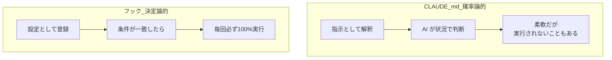
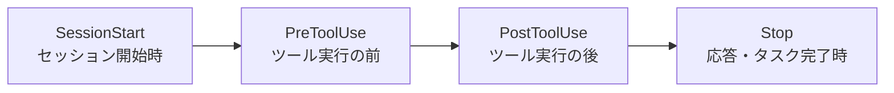

## はじめに

`CLAUDE.md` に「ファイル編集後はフォーマットを実行して」と書いたのに、実行される時とされない時がある ―― そんな経験はないでしょうか。

`CLAUDE.md` の内容はあくまで**指示（お願い）**で、AI が状況に応じて従うかどうかを判断するため、100%実行される保証はありません。これを解決するのが**フック**です。フックは Claude の判断に依存せず、設定した処理を**毎回必ず**指定のタイミングで実行します。

この記事では、フックの **概念（決定論的 vs 確率論的）→ 主要イベント → 設定方法 → 実践** までを1本にまとめました。

> このシリーズは `CLAUDE.md`・ルール・カスタムコマンド・サブエージェント・スキル・フックの全6本。本記事で完結です。あわせて読むと Claude Code のカスタマイズ全体像がつかめます。

### この記事で分かること

- フックの本質「決定論的」と、`CLAUDE.md`（確率論的）との違い
- まず覚えるべき主要4イベントと matcher
- `settings.json` での設定方法（`$CLAUDE_PROJECT_DIR` の使い方）
- 環境セットアップ・自動フォーマット・危険コマンドのブロックなど実践例

---

## 第1章：フックとは（決定論的 vs 確率論的）

`CLAUDE.md` に書いた内容は**確率論的**に実行されます。AI は学習内容から「次に最も確率が高い行動」を選ぶため、文脈次第で実行されないことがあります。一方フックは**決定論的**で、条件を満たせば毎回必ず実行されます。



イメージはコンビニの**入店センサー**です。ドアが開けば、店員が気づいていようがいまいが必ず鳴ります。「もう少し待って」と言っても鳴る。特定のタイミングに必ず反応して処理が走る、これがフックです。

### 使い分け

| 観点 | `CLAUDE.md`（指示）| フック |
|------|--------------------|--------|
| 実行タイミング | AI の判断で処理 | 条件が一致したら必ず毎回 |
| 確実性 | 確率論的（実行されないことも）| 決定論的（100%）|
| 柔軟性 | 高い（曖昧さは残る）| 低い（融通は利かない）|
| 向いている内容 | 判断が必要なルール・規約 | フォーマット・通知・ロギング・危険操作ブロック |

「毎回もれなく実行したい処理」はフック、「状況に応じて柔軟に判断してほしいこと」は `CLAUDE.md`、と覚えましょう。代表的な用途は、自動フォーマット、タスク完了通知、危険コマンドの検証・ブロック、実行履歴のロギング、カスタムの権限制御などです。

---

## 第2章：主要イベント

フックには多数のイベントがあります（バージョンで増えています）が、まずは次の**4つ**を押さえれば十分です。

| イベント | 発火タイミング | matcher | 主な用途 |
|----------|----------------|:-------:|----------|
| `SessionStart` | セッション開始時 | なし | 環境セットアップ（npm install / Docker 起動など）|
| `PreToolUse` | ツール実行の**前** | あり | 危険コマンドのブロック（`exit 2`）、操作制限 |
| `PostToolUse` | ツール実行の**後** | あり | 自動フォーマット・テスト・ロギング |
| `Stop` | 応答・タスク完了時 | なし | 完了通知（音・デスクトップ通知・Slack）・ログ記録 |



ここで言う「ツール」とは、Claude Code が使う `Bash`（コマンド実行）・`Read`・`Write`・`Edit`・`WebFetch` などの組み込み機能のことです。

### matcher（どのツールで発火するか）

`PreToolUse` / `PostToolUse` などツール系イベントでは、**matcher** で対象を絞れます。

- `""` / `*` / 省略 → すべてのツール
- `Bash` → コマンド実行時だけ
- `Edit|Write` → ファイルの編集・書き込み時だけ（`|` で OR 指定）

matcher は**大文字小文字を区別**します（`Bash` はOK、`bash` はNG）。なお、matcher を持てるのは主に `PreToolUse` / `PostToolUse` / `PermissionRequest` で、`SessionStart` や `Stop` では指定しません。

:::note info
**サブエージェントとの関係**
サブエージェントの完了自体を捉えたいときは `SubagentStop` イベントを使います。サブエージェント内のツール呼び出しに対する `PreToolUse` / `PostToolUse` の発火はバージョンによって挙動が変わる報告があるため、ブロックなど重要な用途では実際の環境で必ず動作確認してください。
:::

その他のイベントとして、`Notification`（通知時）、`UserPromptSubmit`（プロンプト送信時）、`PermissionRequest`（許可を求める時）、`PreCompact`（コンパクト前）、`SessionEnd`（終了時）などがあります。まずは主要4つに慣れてから広げるのがおすすめです。

---

## 第3章：設定方法（settings.json）

フックは `settings.json` に書きます。ユーザーレベル（`~/.claude/settings.json`）とプロジェクトレベル（`.claude/settings.json`）のどちらでも設定でき、プロジェクト側が優先されます。

基本構造は「**イベント → matcher → hooks 配列 → `type: command` + `command`**」です。

```json
{
  "hooks": {
    "PostToolUse": [
      {
        "matcher": "Write|Edit",
        "hooks": [
          {
            "type": "command",
            "command": "$CLAUDE_PROJECT_DIR/.claude/hooks/format.sh"
          }
        ]
      }
    ]
  }
}
```

### `$CLAUDE_PROJECT_DIR` で場所に依存しない

`$CLAUDE_PROJECT_DIR` は `settings.json` があるプロジェクトルートを指す環境変数です。ここを起点に相対パスでスクリプトを呼ぶと、どこから Claude Code を起動しても確実にスクリプトを見つけられます（ユーザーレベル設定でも同様に有効です）。

### スクリプトは別ファイルに

`command` に直接コマンドを書くこともできますが、`settings.json` 内はエスケープが大変です。シェルスクリプト（Windows は PowerShell）や Python スクリプトに**外出し**しておくと管理が楽です。macOS ではスクリプトに実行権限を付ける必要があります（`chmod +x`）。

```bash
chmod +x .claude/hooks/format.sh
```

:::note info
`/hooks` コマンドで対話的にフックを設定・確認することもできます。また、matcher の代わりに **`if` フィールド**（許可ルール構文：`"if": "Bash(git *)"` は git コマンド時だけ、`"if": "Edit(*.ts)"` は TypeScript 編集時だけ）が使えるバージョンもあり、より読みやすく書けます。`type` は `command` のほか、`prompt`（LLM 評価）・`http`・`mcp_tool`・`agent` などがあります。
:::

---

## 第4章：実践

フックへの入力は**標準入力に JSON**として渡されるので、`jq` などで必要な値を取り出します（`.tool_input.command`、`.tool_input.file_path` など）。以下は代表的な4例です。

### 1. SessionStart：環境を自動セットアップ

「毎回最初にやること」をフックにします。たとえば `package.json` があって `node_modules` が無ければ `npm install` を実行:

```bash
#!/bin/bash
# .claude/hooks/session-init.sh
if [ -f "$CLAUDE_PROJECT_DIR/package.json" ] && [ ! -d "$CLAUDE_PROJECT_DIR/node_modules" ]; then
  (cd "$CLAUDE_PROJECT_DIR" && npm install)
fi
exit 0
```

Docker 起動やローカルDBのマイグレーションなど、「開発に必要な状態を必ず整える」用途に便利です。

### 2. PreToolUse：危険なコマンドをブロック（`exit 2`）

`PreToolUse` で `exit 2` を返すと、そのツール実行を**中止**できます。パーミッション設定では難しい「特定ディレクトリだけ削除禁止」といった柔軟な制御が可能です。

```bash
#!/bin/bash
# .claude/hooks/guard.sh
CMD=$(cat | jq -r '.tool_input.command // empty')
if echo "$CMD" | grep -qE 'rm .*\.claude'; then
  echo "BLOCKED: .claude 配下の削除は禁止です" >&2
  exit 2   # ← 必ず 2。exit 1 ではブロックされない
fi
exit 0
```

:::note alert
**ブロックは必ず終了コード `2`**
`exit 2` だけがアクションをブロックし、stderr のメッセージが Claude に返されます。`exit 1`（やその他）は**非ブロックの警告にすぎず、危険なコマンドはそのまま実行されてしまいます**。セキュリティ用途では必ず `exit 2` を使ってください。設定後は、ブロック対象を実際に試して「本当に止まるか」を検証しましょう。
:::

### 3. PostToolUse：編集後に自動フォーマット

ファイル編集・作成の**後**に Prettier を自動実行します。`CLAUDE.md` に頼らず、毎回確実にフォーマットされます。

```bash
#!/bin/bash
# .claude/hooks/format.sh
FILE=$(cat | jq -r '.tool_input.file_path // empty')
[ -n "$FILE" ] && npx prettier --write "$FILE"
exit 0   # フォーマット失敗でも Claude を止めないよう 0 を返す
```

`PostToolUse` は処理の**後**に走るためツール自体は取り消せません（防止は `PreToolUse`、反応は `PostToolUse`）。テストを実行して失敗を検出する、といった用途にも使えます。

### 4. Stop：完了を通知・記録

タスク完了時にログを残したり、通知を飛ばしたりします。

```bash
#!/bin/bash
# .claude/hooks/stop-log.sh
echo "タスク完了: $(date)" >> "$CLAUDE_PROJECT_DIR/.claude/hooks.log"
exit 0
```

音を鳴らす・デスクトップ通知・Slack 通知などに応用でき、長時間タスクの完了を見逃さずに済みます（通知音は OS ごとに設定が異なるので、環境に合わせて調整してください）。

:::note warn
`Stop` フックでさらに作業を続けさせる（`exit 2` で継続させる）ような使い方をする場合は、無限ループに注意し、条件を満たしたら `exit 0` で必ず終わるようにしましょう。
:::

---

## まとめ：フック チェックリスト

- [ ] フックは**決定論的**。毎回必ず実行したい処理に使う（判断が必要なら `CLAUDE.md`）
- [ ] まず覚えるのは **`SessionStart` / `PreToolUse` / `PostToolUse` / `Stop`** の4つ
- [ ] `settings.json` に「イベント → matcher → `type: command` + `command`」で設定
- [ ] matcher は `Edit|Write` や `Bash` で対象を絞る（大文字小文字を区別）
- [ ] スクリプトは `$CLAUDE_PROJECT_DIR` 起点の相対パスで外出し（要 `chmod +x`）
- [ ] 入力は標準入力の JSON。`jq` で `.tool_input.command` / `.tool_input.file_path` を取得
- [ ] **ブロックは必ず `exit 2`**（`exit 1` は警告のみで止まらない）
- [ ] フォーマット等は失敗しても `exit 0` で Claude を止めない

フックは、人間がカバーしていた「毎回の準備・後始末・安全確認」を確実に自動化してくれます。まずは matcher の要らない `SessionStart` から試し、慣れたら `PostToolUse` の自動フォーマット、`PreToolUse` の安全ガードへと広げていきましょう。

これで Claude Code カスタマイズ全6回シリーズは完結です。`CLAUDE.md`・ルール・カスタムコマンド・サブエージェント・スキル・フックを組み合わせて、確実で効率的な AI 駆動開発を目指してください。

---
