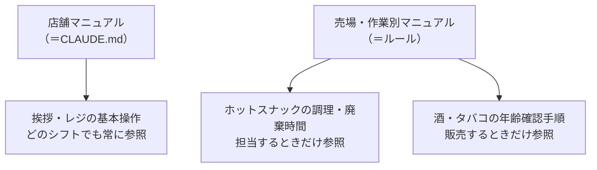
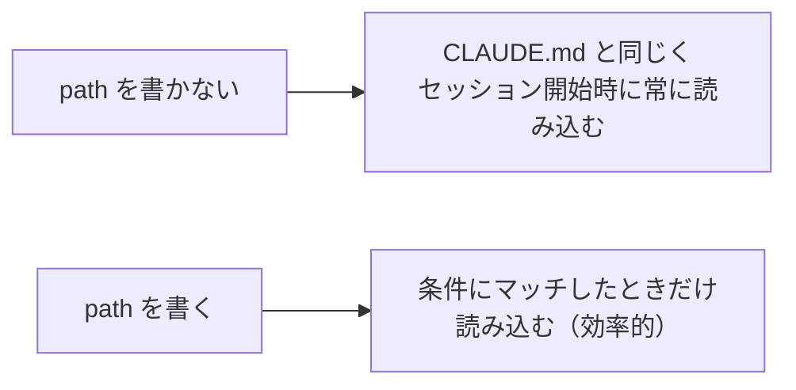
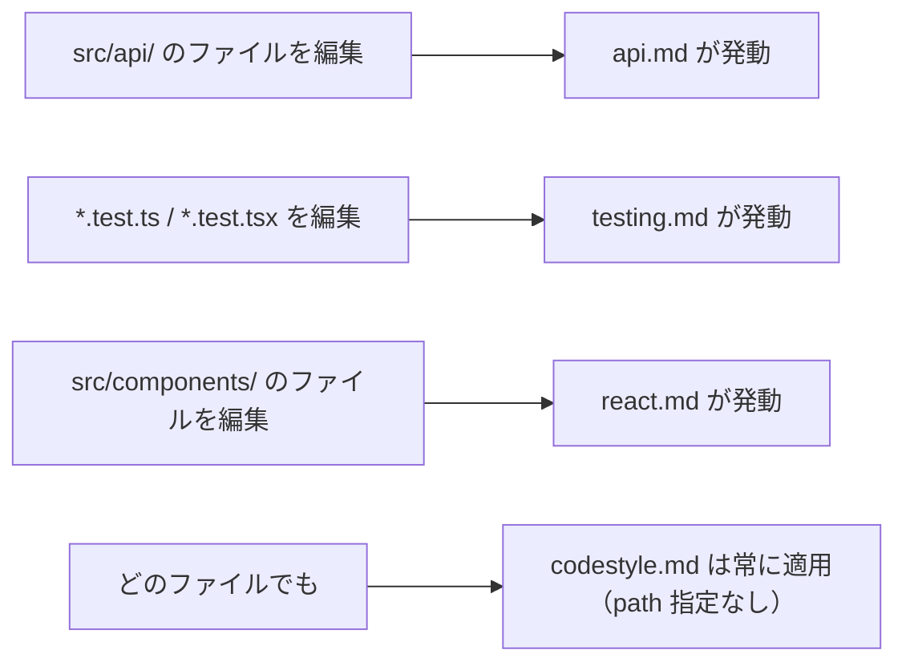

## はじめに

開発が進み、ルール化を重ねていくと、`CLAUDE.md` がどんどん長くなって管理が大変になってきた ―― そんな経験はないでしょうか。

フロントエンド／バックエンドそれぞれのルール、テストのルール、コミットメッセージのルール…。これらは**すべて起動時に常に読み込まれる**ため、トークンを消費し、コンテキストを圧迫して性能低下の原因になります。

これを解決するのが、`.claude/rules` に**作業別のルールを分けて配置する**方法です。この記事では、その **概念 → 設定方法 → 実践デモ** を1本にまとめました。

> この記事は [`CLAUDE.md` 完全ガイド] の続編にあたる内容です。`CLAUDE.md` の基本を先に押さえておくとより理解しやすくなります。

### この記事で分かること

- なぜ `CLAUDE.md` に全部書くと非効率なのか（肥大化問題）
- `CLAUDE.md`（常時）と ルール（条件付き）の違いと使い分け
- `path` フィールドとグロブパターンによる動的な読み込み設定
- 実際にどのファイルを触るとどのルールが発動するのか（デモ）

---

## 第1章：なぜ「ルール」が必要か（概念）

### `CLAUDE.md` 肥大化の3つの問題

`CLAUDE.md` にすべてのルールを書くと、次の問題が起こります。

1. **トークン消費の増加**：全ルールが毎回読み込まれる
2. **無駄なコンテキスト占有**：その作業に関係ないルールまで読み込まれる
3. **メンテナンス性の低下**：ファイルが長くなり見通しが悪くなる

特に大きいのが2つ目です。フロントエンドを書いているのに、関係ないバックエンドのルールまで読み込まれるのは、コンテキストの観点でかなり無駄が多いのです。

### コンビニで例えると

この状況はコンビニのマニュアルに例えると分かりやすいです。



挨拶やレジ操作は全員が常に参照すべきマニュアルですが、ホットスナックの調理手順や酒・タバコの年齢確認は、**その作業を担当するときだけ**参照すればよいものです。すべてを常に頭に入れておくのは、人間と同じでパフォーマンスが下がります。

### `CLAUDE.md` と ルール の違い

`.claude/rules` に置くルール（以下「ルール」）は、Claude Code 公式がサポートする仕組みで、**必要なときだけ必要なルールを読み込みます**。


| 観点 | `CLAUDE.md` | ルール（`.claude/rules`） |
|------|-------------|----------------------------|
| 読み込み | 常に読み込まれる | 条件付きで読み込まれる |
| トークン | 常に消費 | 必要なときだけ最小限 |
| 向いている内容 | 常に意識すべき共通ルール（コーディング規約・禁止事項） | 状況別のルール（API設計・テスト規約など） |

使い分けの基本は、**`CLAUDE.md` には常に参照すべき基本ルール、ルールには状況別のルール**。さらに「TypeScript を書くときだけのコーディング規約」のように、規約の中でも条件を絞れるものはルール側に置くと、より効率的になります。

---

## 第2章：設定方法

### ディレクトリ構造

ルールを使うには、`.claude` の中に `rules` フォルダを切る、という決まった構造にします。

```text
.claude/
└── rules/
    ├── codestyle.md        # path 指定なし → 常に適用
    ├── api.md              # src/api/ 配下だけ
    ├── testing.md          # *.test.ts(x) だけ
    └── frontend/           # 整理用サブフォルダ（挙動には影響しない）
        └── react.md        # src/components/ 配下だけ
```

`rules` 直下に Markdown を置いてもよいですし、`frontend/` `backend/` のように**サブフォルダで整理**することもできます。サブフォルダ自体は Claude Code の挙動に影響しませんが、人間にとって管理しやすくなります。

### ファイルの基本形式：フロントマター + 本文

各ルールファイルは、先頭に `---` で囲んだ **フロントマター** を書き、その下に本文で指示を書きます。

```md
---
path: src/components/**/*
---

# フロントエンド開発ルール
- コンポーネントは関数コンポーネントで書く
- props は型定義を必須とする
```

上の例では、`src/components/` 配下のファイルを編集・作成するときにこのファイルが読み込まれ、Claude Code は本文（フロントエンド開発ルール）を認識します。

### 鍵となる `path` フィールド

`path` を書くかどうかで挙動が変わります。



:::note info
`path` を指定しなければ `CLAUDE.md` に書くのと変わりません。無理にルールへ分ける必要はなく、**ルールを使うときは基本 `path` を指定する**と覚えておきましょう。ただし「常時読み込みたいが見通しのためにファイルを分けたい」という人間向けの整理目的で、あえて `path` なしにするのはアリです。
:::

### グロブパターン（`path` の書き方）

`path` の書き方は**グロブパターン**と呼ばれ、`.gitignore` と同じ記法です。よく使うものを押さえておきましょう。

| パターン | 意味 |
|----------|------|
| `**/*.ts` | 全ディレクトリの `.ts` ファイルに適用 |
| `*.md` | **プロジェクトルート直下**の `.md` のみ（再帰しない）|
| `src/**/*` | `src/` 配下すべてに再帰的に適用 |
| `src/components/**/*` | `src/components/` 配下すべてに適用 |
| `**/*.{ts,tsx}` | `.ts` または `.tsx` のどちらか（複数パターン）|

`.test.ts` とすればテスト関連だけ、というように拡張子での指定が最もよく使われます。`{ts,tsx}` のようにカンマと波括弧で複数パターンを指定するのも頻出です。書き方に迷ったら、`.gitignore` 由来の記法なので Claude Code 自身に聞くのも手です。

### 読み込みの挙動

ルールが読み込まれると、Claude Code のコンソール上に動的にロードされたことが表示されます。ポイントは、**同一セッション内で一度読み込まれたら、その後はずっと有効**なこと。同じフォルダや拡張子を触るたびに読み込み直す、といった重複はないので安心してください。

---

## 第3章：実践デモ

次のようなサンプル構成で、動的な読み込みを確認してみます。

```text
project/
├── .claude/rules/
│   ├── codestyle.md    # path なし（常時）
│   ├── api.md          # src/api/ 配下
│   ├── testing.md      # *.test.ts(x)
│   └── frontend/
│       └── react.md    # src/components/ 配下
├── src/
│   ├── api/users.ts
│   └── components/Button.tsx
└── test/
    └── Button.test.tsx
```

どのファイルを触ると、どのルールが発動するかの対応関係は次のとおりです。



実際に動かすと、次のように動作します。

- **`codestyle.md`（path なし）**：`/memory` コマンドで確認すると、常に読み込まれるルールとして表示される。「変数はキャメルケース」「定数は UPPER_SNAKE_CASE」「関数は動詞で始める」といった内容が最初から認識される。
- **`src/api/users.ts` を読み込む**：Read ツール実行後に `.claude/rules/api.md` が**動的にロード**され、「RESTful原則に従う」「エラーレスポンスは統一フォーマット」などが認識される。
- **`src/components/Button.tsx`・`test/Button.test.tsx`**：それぞれ `react.md`・`testing.md` が動的に読み込まれる。

:::note warn
**`/memory` に出てこなくても認識されている**
後から動的に読み込まれたルールは、`/memory` コマンドの表示には出てこない仕様のようです。表示に出なくても、セッション内ではきちんとルールとして認識され続けているので安心してください（常時ルールは表示されます）。
:::

---

## まとめ：ルール活用チェックリスト

- [ ] `CLAUDE.md` が肥大化してきたら、`.claude/rules/` に**作業別**でルールを分ける
- [ ] 常に意識すべきルールは `CLAUDE.md`、状況別のルールは ルール へ
- [ ] ルールを使うときは基本 **`path` を指定**する（未指定＝常時＝`CLAUDE.md` と同じ）
- [ ] `path` は `.gitignore` と同じ**グロブパターン**（`**/*.ts`、`src/**/*`、`{ts,tsx}` など）
- [ ] サブフォルダ（`frontend/` 等）は整理目的。挙動には影響しない
- [ ] 一度読み込まれたルールはセッション中ずっと有効
- [ ] 動的ロードされたルールは `/memory` に出ないが、認識はされている

書き方の設定自体は覚えることが少なく、意外とシンプルです。`CLAUDE.md` が大きくなってきたら、適用場面に応じてルールファイルへ分割し、トークンを節約しながら Claude Code を動かしていきましょう。

---
